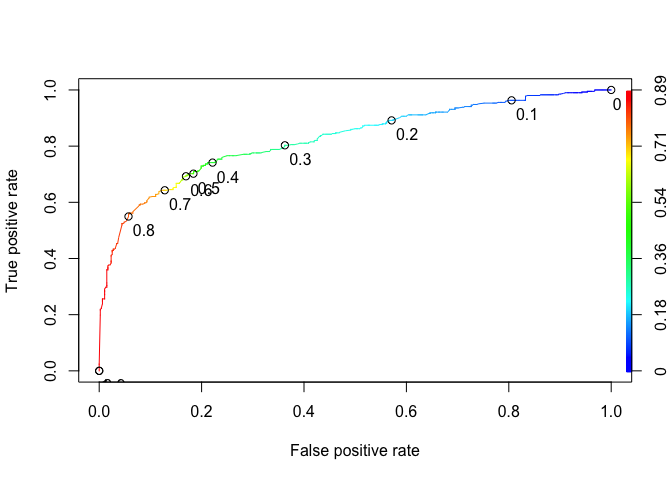
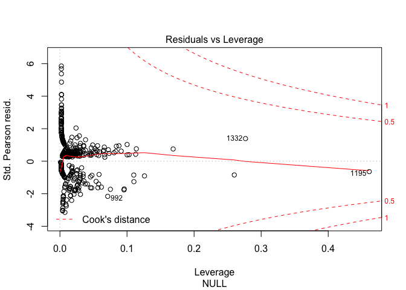
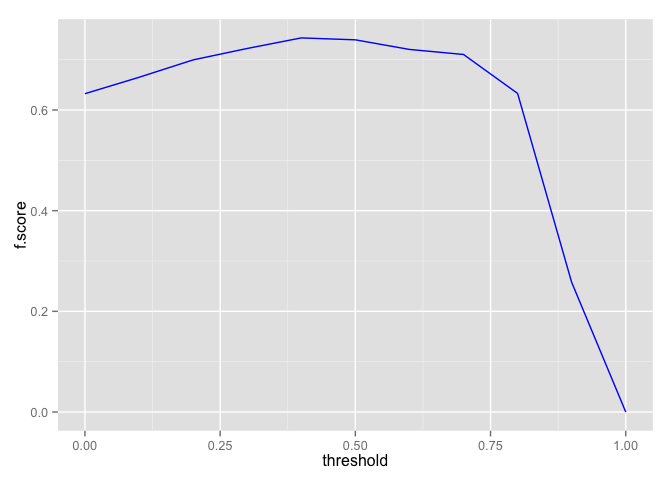
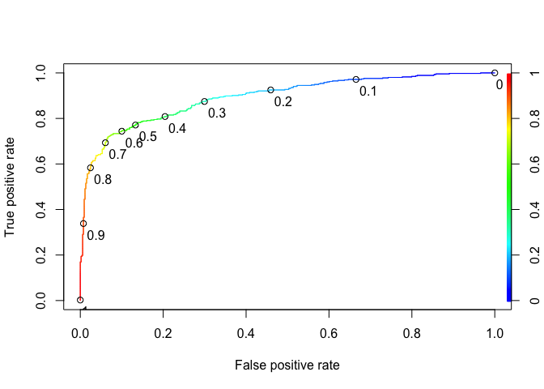
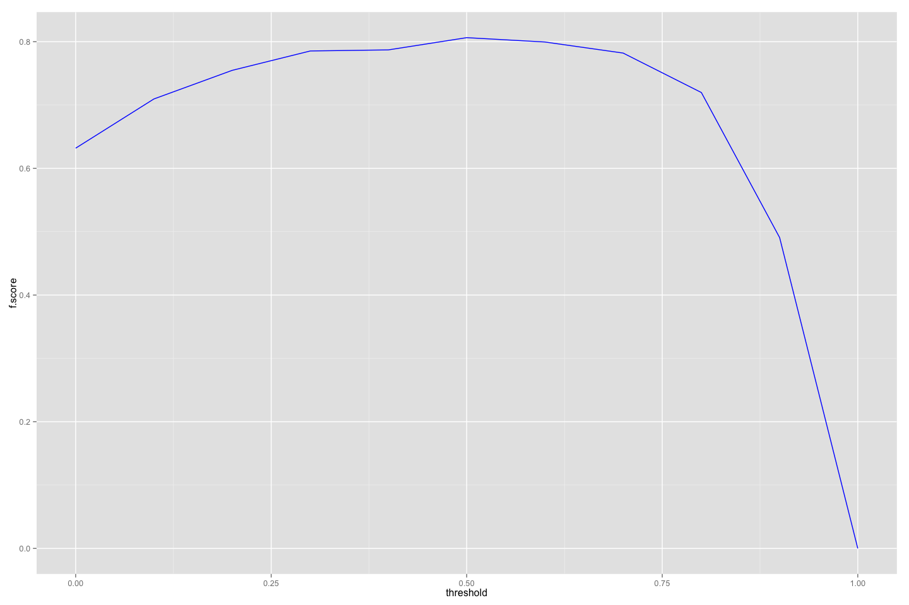
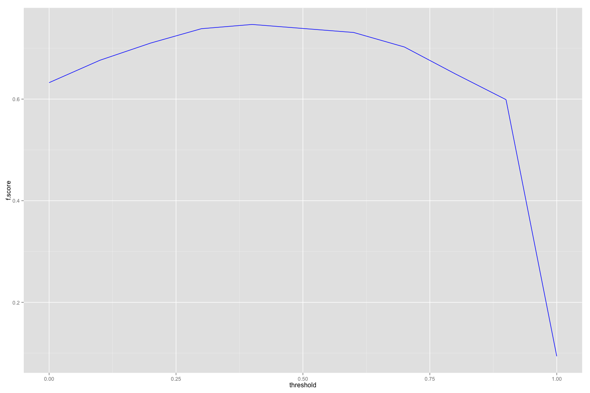
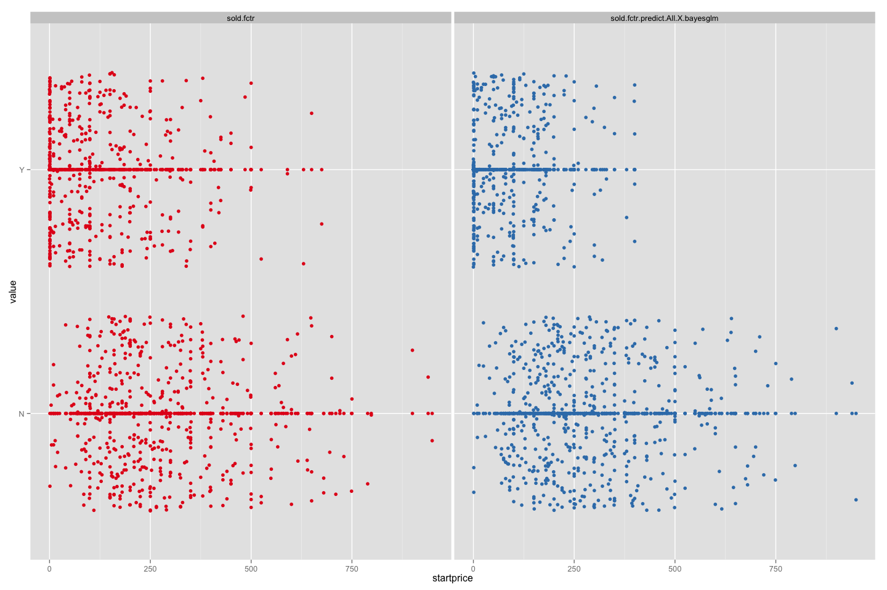
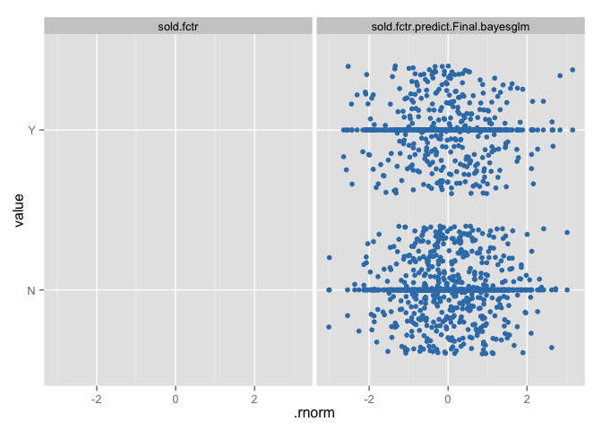

# eBay:iPads:: sold classification:: template
bdanalytics  

**  **    
**Date: (Thu) Jul 16, 2015**    

# Introduction:  

Data: 
Source: 
    Training:   https://inclass.kaggle.com/c/15-071x-the-analytics-edge-summer-2015/download/eBayiPadTrain.csv  
    New:        https://inclass.kaggle.com/c/15-071x-the-analytics-edge-summer-2015/download/eBayiPadTest.csv  
Time period: 


# Synopsis:

Based on analysis utilizing <> techniques, <conclusion heading>:  

Regression results:
First run:
    <glb_sel_mdl_id>: 
        OOB_RMSE=<0.4f>; new_RMSE=<0.4f>; <feat1>=<imp>; <feat2>=<imp>

Classification results:
template:
    Low.cor.X.glm: Leaderboard: 0.83458
        newobs_tbl=[N=471, Y=327]; submit_filename=template_Final_glm_submit.csv
        OOB_conf_mtrx=[YN=125, NY=76]=; max.Accuracy.OOB=0.7710; opt.prob.threshold.OOB=0.6
            startprice=100.00; biddable=95.42; productline=49.22; 
            D.T.like=29.75; D.T.use=26.32; D.T.box=21.53; 

### Prediction Accuracy Enhancement Options:
- import.data chunk:
    - which obs should be in fit vs. OOB (currently dirty.0 vs .1 is split 50%)
    
- inspect.data chunk:
    - For date variables
        - Appropriate factors ?
        - Different / More last* features ?
        
- scrub.data chunk:        
- transform.data chunk:
    - derive features from multiple features
    
- manage.missing.data chunk:
    - Not fill missing vars
    - Fill missing numerics with a different algorithm
    - Fill missing chars with data based on clusters 
    
- extract.features chunk:
    - Text variables: move to date extraction chunk ???
        - Mine acronyms
        - Mine places

- Review set_global_options chunk after features are finalized

### 

## Potential next steps include:
- Organization:
    - Categorize by chunk
    - Priority criteria:
        0. Ease of change
        1. Impacts report
        2. Cleans innards
        3. Bug report
        
- all chunks:
    - at chunk-end rm(!glb_<var>)
    
- manage.missing.data chunk:
    - cleaner way to manage re-splitting of training vs. new entity

- extract.features chunk:
    - Add n-grams for glb_txt_vars
        - "RTextTools", "tau", "RWeka", and "textcat" packages
    - Convert user-specified mutate code to config specs
    
- fit.models chunk:
    - Prediction accuracy scatter graph:
    -   Add tiles (raw vs. PCA)
    -   Use shiny for drop-down of "important" features
    -   Use plot.ly for interactive plots ?
    
    - Change .fit suffix of model metrics to .mdl if it's data independent (e.g. AIC, Adj.R.Squared - is it truly data independent ?, etc.)
    - move model_type parameter to myfit_mdl before indep_vars_vctr (keep all model_* together)
    - create a custom model for rpart that has minbucket as a tuning parameter
    - varImp for randomForest crashes in caret version:6.0.41 -> submit bug report

- Probability handling for multinomials vs. desired binomial outcome
-   ROCR currently supports only evaluation of binary classification tasks (version 1.0.7)
-   extensions toward multiclass classification are scheduled for the next release

- Skip trControl.method="cv" for dummy classifier ?
- Add custom model to caret for a dummy (baseline) classifier (binomial & multinomial) that generates proba/outcomes which mimics the freq distribution of glb_rsp_var values; Right now glb_dmy_glm_mdl always generates most frequent outcome in training data
- glm_dmy_mdl should use the same method as glm_sel_mdl until custom dummy classifer is implemented

- fit.all.training chunk:
    - myplot_prediction_classification: displays 'x' instead of '+' when there are no prediction errors 
- Compare glb_sel_mdl vs. glb_fin_mdl:
    - varImp
    - Prediction differences (shd be minimal ?)

- Move glb_analytics_diag_plots to mydsutils.R: (+) Easier to debug (-) Too many glb vars used
- Add print(ggplot.petrinet(glb_analytics_pn) + coord_flip()) at the end of every major chunk
- Parameterize glb_analytics_pn
- Move glb_impute_missing_data to mydsutils.R: (-) Too many glb vars used; glb_<>_df reassigned
- Replicate myfit_mdl_classification features in myfit_mdl_regression
- Do non-glm methods handle interaction terms ?
- f-score computation for classifiers should be summation across outcomes (not just the desired one ?)
- Add accuracy computation to glb_dmy_mdl in predict.data.new chunk
- Why does splitting fit.data.training.all chunk into separate chunks add an overhead of ~30 secs ? It's not rbind b/c other chunks have lower elapsed time. Is it the number of plots ?
- Incorporate code chunks in print_sessionInfo
- Test against 
    - projects in github.com/bdanalytics
    - lectures in jhu-datascience track

# Analysis: 

```r
rm(list=ls())
set.seed(12345)
options(stringsAsFactors=FALSE)
source("~/Dropbox/datascience/R/myscript.R")
source("~/Dropbox/datascience/R/mydsutils.R")
```

```
## Loading required package: caret
## Loading required package: lattice
## Loading required package: ggplot2
```

```r
source("~/Dropbox/datascience/R/myplot.R")
source("~/Dropbox/datascience/R/mypetrinet.R")
source("~/Dropbox/datascience/R/myplclust.R")
# Gather all package requirements here
suppressPackageStartupMessages(require(doMC))
registerDoMC(4) # max(length(glb_txt_vars), glb_n_cv_folds) + 1
#packageVersion("tm")
#require(sos); findFn("cosine", maxPages=2, sortby="MaxScore")

# Analysis control global variables
glb_trnng_url <- "https://inclass.kaggle.com/c/15-071x-the-analytics-edge-summer-2015/download/eBayiPadTrain.csv"
glb_newdt_url <- "https://inclass.kaggle.com/c/15-071x-the-analytics-edge-summer-2015/download/eBayiPadTest.csv"
glb_out_pfx <- "template_"
glb_save_envir <- FALSE # or TRUE

glb_is_separate_newobs_dataset <- TRUE    # or TRUE
    glb_split_entity_newobs_datasets <- TRUE   # or FALSE
    glb_split_newdata_method <- "sample"          # "condition" or "sample" or "copy"
    glb_split_newdata_condition <- NULL # or "is.na(<var>)"; "<var> <condition_operator> <value>"
    glb_split_newdata_size_ratio <- 0.3               # > 0 & < 1
    glb_split_sample.seed <- 123               # or any integer

glb_max_fitobs <- NULL # or any integer                         
glb_is_regression <- FALSE; glb_is_classification <- !glb_is_regression; 
    glb_is_binomial <- TRUE #or FALSE

glb_rsp_var_raw <- "sold"

# for classification, the response variable has to be a factor
glb_rsp_var <- "sold.fctr"

# if the response factor is based on numbers/logicals e.g (0/1 OR TRUE/FALSE vs. "A"/"B"), 
#   or contains spaces (e.g. "Not in Labor Force")
#   caret predict(..., type="prob") crashes
glb_map_rsp_raw_to_var <- function(raw) {
#     return(log(raw))
    ret_vals <- rep_len(NA, length(raw)); ret_vals[!is.na(raw)] <- ifelse(raw[!is.na(raw)] == 1, "Y", "N"); return(relevel(as.factor(ret_vals), ref="N"))
#     #as.factor(paste0("B", raw))
#     #as.factor(gsub(" ", "\\.", raw))    
}
glb_map_rsp_raw_to_var(c(1, 1, 0, 0, NA))
```

```
## [1] Y    Y    N    N    <NA>
## Levels: N Y
```

```r
glb_map_rsp_var_to_raw <- function(var) {
#     return(exp(var))
    as.numeric(var) - 1
#     #as.numeric(var)
#     #gsub("\\.", " ", levels(var)[as.numeric(var)])
#     c("<=50K", " >50K")[as.numeric(var)]
#     #c(FALSE, TRUE)[as.numeric(var)]
}
glb_map_rsp_var_to_raw(glb_map_rsp_raw_to_var(c(1, 1, 0, 0, NA)))
```

```
## [1]  1  1  0  0 NA
```

```r
if ((glb_rsp_var != glb_rsp_var_raw) & is.null(glb_map_rsp_raw_to_var))
    stop("glb_map_rsp_raw_to_var function expected")
glb_rsp_var_out <- paste0(glb_rsp_var, ".predict.") # model_id is appended later

# List info gathered for various columns
# <col_name>:   <description>; <notes>
# description = The text description of the product provided by the seller.
# biddable = Whether this is an auction (biddable=1) or a sale with a fixed price (biddable=0).
# startprice = The start price (in US Dollars) for the auction (if biddable=1) or the sale price (if biddable=0).
# condition = The condition of the product (new, used, etc.)
# cellular = Whether the iPad has cellular connectivity (cellular=1) or not (cellular=0).
# carrier = The cellular carrier for which the iPad is equipped (if cellular=1); listed as "None" if cellular=0.
# color = The color of the iPad.
# storage = The iPad's storage capacity (in gigabytes).
# productline = The name of the product being sold.

# If multiple vars are parts of id, consider concatenating them to create one id var
# If glb_id_var == NULL, ".rownames <- row.names()" is the default
glb_id_var <- c("UniqueID")
glb_category_vars <- NULL # or c("<var1>", "<var2>")
glb_drop_vars <- c(NULL) # or c("<col_name>")

glb_map_vars <- NULL # or c("<var1>", "<var2>")
glb_map_urls <- list();
# glb_map_urls[["<var1>"]] <- "<var1.url>"

glb_assign_pairs_lst <- NULL; 
# glb_assign_pairs_lst[["<var1>"]] <- list(from=c(NA),
#                                            to=c("NA.my"))
glb_assign_vars <- names(glb_assign_pairs_lst)

# Derived features
glb_derive_lst <- NULL;

# Add logs of numerics that are not distributed normally ->  do automatically ???

# glb_derive_lst[["<feat.sfx>"]] <- list(
#     mapfn=function(Rasmussen) { return(ifelse(sign(Rasmussen) >= 0, 1, 0)) }
#     mapfn=function(PropR) { return(as.factor(ifelse(PropR >= 0.5, "Y", "N"))) }
#     mapfn=function(purpose) { return(relevel(as.factor(purpose), ref="all_other")) }
#     mapfn=function(Week) { return(substr(Week, 1, 10)) }
#     mapfn=function(raw) { tfr_raw <- as.character(cut(raw, 5)); 
#                           tfr_raw[is.na(tfr_raw)] <- "NA.my";
#                           return(as.factor(tfr_raw)) }
#     , args=c("raw"))
#     mapfn=function(PTS, oppPTS) { return(PTS - oppPTS) }
#     , args=c("PTS", "oppPTS"))

# # If glb_allobs_df is not sorted in the desired manner
#     mapfn=function(Week) { return(coredata(lag(zoo(orderBy(~Week, glb_allobs_df)$ILI), -2, na.pad=TRUE))) }
#     mapfn=function(ILI) { return(coredata(lag(zoo(ILI), -2, na.pad=TRUE))) }
#     mapfn=function(ILI.2.lag) { return(log(ILI.2.lag)) }

# glb_derive_lst[["<txt_var>.niso8859.log"]] <- list(
#     mapfn=function(<txt_var>) { match_lst <- gregexpr("&#[[:digit:]]{3};", <txt_var>)
#                         match_num_vctr <- unlist(lapply(match_lst, 
#                                                         function(elem) length(elem)))
#                         return(log(1 + match_num_vctr)) }
#     , args=c("<txt_var>"))

#     mapfn=function(raw) { mod_raw <- raw;
#         mod_raw <- gsub("&#[[:digit:]]{3};", " ", mod_raw);
#         # Modifications for this exercise only
#         mod_raw <- gsub("\\bgoodIn ", "good In", mod_raw);
#                           return(mod_raw)

#         # Create user-specified pattern vectors 
# #sum(mycount_pattern_occ("Metropolitan Diary:", glb_allobs_df$Abstract) > 0)
#         if (txt_var %in% c("Snippet", "Abstract")) {
#             txt_X_df[, paste0(txt_var_pfx, ".P.metropolitan.diary.colon")] <-
#                 as.integer(0 + mycount_pattern_occ("Metropolitan Diary:", 
#                                                    glb_allobs_df[, txt_var]))
#summary(glb_allobs_df[ ,grep("P.on.this.day", names(glb_allobs_df), value=TRUE)])

# glb_derive_lst[["<var1>"]] <- glb_derive_lst[["<var2>"]]

glb_derive_vars <- names(glb_derive_lst)
# tst <- "PropR.fctr"; args_lst <- NULL; for (arg in glb_derive_lst[[tst]]$args) args_lst[[arg]] <- glb_allobs_df[, arg]; print(head(args_lst[[arg]])); print(head(drv_vals <- do.call(glb_derive_lst[[tst]]$mapfn, args_lst))); 
# print(which_ix <- which(args_lst[[arg]] == 0.75)); print(drv_vals[which_ix]); 

glb_date_vars <- NULL # or c("<date_var>")
glb_date_fmts <- list(); #glb_date_fmts[["<date_var>"]] <- "%m/%e/%y"
glb_date_tzs <- list();  #glb_date_tzs[["<date_var>"]] <- "America/New_York"
#grep("America/New", OlsonNames(), value=TRUE)

glb_txt_vars <- c("description")   
#Sys.setlocale("LC_ALL", "C") # For english
glb_txt_munge_filenames_pfx <- "mytxt_"

glb_append_stop_words <- list()
# Remember to use unstemmed words
#orderBy(~ -cor.y.abs, subset(glb_feats_df, grepl("[HSA]\\.T\\.", id) & !is.na(cor.high.X)))
#dsp_obs(Headline.contains="polit")
#subset(glb_allobs_df, H.T.compani > 0)[, c("UniqueID", "Headline", "H.T.compani")]
# glb_append_stop_words[["<txt_var1>"]] <- c(NULL
# #                             ,"<word1>" # <reason1>
#                             )
#subset(glb_allobs_df, S.T.newyorktim > 0)[, c("UniqueID", "Snippet", "S.T.newyorktim")]
#glb_txt_lst[["Snippet"]][which(glb_allobs_df$UniqueID %in% c(8394, 8317, 8339, 8350, 8307))]

glb_important_terms <- list()
# Remember to use stemmed terms 

glb_sprs_thresholds <- c(0.950) # Generates ??? terms
# Properties:
#   numrows(glb_feats_df) << numrows(glb_fitobs_df)
#   Select terms that appear in at least 0.2 * O(FP/FN(glb_OOBobs_df))
#       numrows(glb_OOBobs_df) = 1.1 * numrows(glb_newobs_df)
names(glb_sprs_thresholds) <- glb_txt_vars

# User-specified exclusions  
glb_exclude_vars_as_features <- NULL # or c("<var_name>") 
if (glb_rsp_var_raw != glb_rsp_var)
    glb_exclude_vars_as_features <- union(glb_exclude_vars_as_features, 
                                            glb_rsp_var_raw)

# List feats that shd be excluded due to known causation by prediction variable
glb_exclude_vars_as_features <- union(glb_exclude_vars_as_features, 
                                      c(NULL)) # or c("<col_name>")

glb_impute_na_data <- FALSE # or TRUE
glb_mice_complete.seed <- 144 # or any integer

glb_cluster <- FALSE # or TRUE

glb_interaction_only_features <- NULL # or ???

glb_models_lst <- list(); glb_models_df <- data.frame()
# Regression
if (glb_is_regression)
    glb_models_method_vctr <- c("lm", "glm", "bayesglm", "rpart", "rf") else
# Classification
    if (glb_is_binomial)
        glb_models_method_vctr <- c("glm", "bayesglm", "rpart", "rf") else  
        glb_models_method_vctr <- c("rpart", "rf")

# Baseline prediction model feature(s)
glb_Baseline_mdl_var <- NULL # or c("<col_name>")

glb_model_metric_terms <- NULL # or matrix(c(
#                               0,1,2,3,4,
#                               2,0,1,2,3,
#                               4,2,0,1,2,
#                               6,4,2,0,1,
#                               8,6,4,2,0
#                           ), byrow=TRUE, nrow=5)
glb_model_metric <- NULL # or "<metric_name>"
glb_model_metric_maximize <- NULL # or FALSE (TRUE is not the default for both classification & regression) 
glb_model_metric_smmry <- NULL # or function(data, lev=NULL, model=NULL) {
#     confusion_mtrx <- t(as.matrix(confusionMatrix(data$pred, data$obs)))
#     #print(confusion_mtrx)
#     #print(confusion_mtrx * glb_model_metric_terms)
#     metric <- sum(confusion_mtrx * glb_model_metric_terms) / nrow(data)
#     names(metric) <- glb_model_metric
#     return(metric)
# }

glb_tune_models_df <- 
   rbind(
    #data.frame(parameter="cp", min=0.00005, max=0.00005, by=0.000005),
                            #seq(from=0.01,  to=0.01, by=0.01)
    #data.frame(parameter="mtry",  min=080, max=100, by=10),
    #data.frame(parameter="mtry",  min=08, max=10, by=1),    
    data.frame(parameter="dummy", min=2, max=4, by=1)
        ) 
# or NULL
glb_n_cv_folds <- 3 # or NULL

glb_clf_proba_threshold <- NULL # 0.5

# Model selection criteria
if (glb_is_regression)
    glb_model_evl_criteria <- c("min.RMSE.OOB", "max.R.sq.OOB", "max.Adj.R.sq.fit")
if (glb_is_classification) {
    if (glb_is_binomial)
        glb_model_evl_criteria <- 
            c("max.Accuracy.OOB", "max.auc.OOB", "max.Kappa.OOB", "min.aic.fit") else
        glb_model_evl_criteria <- c("max.Accuracy.OOB", "max.Kappa.OOB")
}

glb_sel_mdl_id <- NULL # or "<model_id_prefix>.<model_method>"
glb_fin_mdl_id <- glb_sel_mdl_id # or "Final"

# Depict process
glb_analytics_pn <- petrinet(name="glb_analytics_pn",
                        trans_df=data.frame(id=1:6,
    name=c("data.training.all","data.new",
           "model.selected","model.final",
           "data.training.all.prediction","data.new.prediction"),
    x=c(   -5,-5,-15,-25,-25,-35),
    y=c(   -5, 5,  0,  0, -5,  5)
                        ),
                        places_df=data.frame(id=1:4,
    name=c("bgn","fit.data.training.all","predict.data.new","end"),
    x=c(   -0,   -20,                    -30,               -40),
    y=c(    0,     0,                      0,                 0),
    M0=c(   3,     0,                      0,                 0)
                        ),
                        arcs_df=data.frame(
    begin=c("bgn","bgn","bgn",        
            "data.training.all","model.selected","fit.data.training.all",
            "fit.data.training.all","model.final",    
            "data.new","predict.data.new",
            "data.training.all.prediction","data.new.prediction"),
    end  =c("data.training.all","data.new","model.selected",
            "fit.data.training.all","fit.data.training.all","model.final",
            "data.training.all.prediction","predict.data.new",
            "predict.data.new","data.new.prediction",
            "end","end")
                        ))
#print(ggplot.petrinet(glb_analytics_pn))
print(ggplot.petrinet(glb_analytics_pn) + coord_flip())
```

```
## Loading required package: grid
```

 

```r
glb_analytics_avl_objs <- NULL

glb_chunks_df <- myadd_chunk(NULL, "import.data")
```

```
##         label step_major step_minor   bgn end elapsed
## 1 import.data          1          0 7.793  NA      NA
```

## Step `1.0: import data`
#### chunk option: eval=<r condition>

```r
#glb_chunks_df <- myadd_chunk(NULL, "import.data")

glb_trnobs_df <- myimport_data(url=glb_trnng_url, comment="glb_trnobs_df", 
                                force_header=TRUE)
```

```
## [1] "Reading file ./data/eBayiPadTrain.csv..."
## [1] "dimensions of data in ./data/eBayiPadTrain.csv: 1,861 rows x 11 cols"
##                                                                                            description
## 1                                                        iPad is in 8.5+ out of 10 cosmetic condition!
## 2 Previously used, please read description. May show signs of use such as scratches to the screen and 
## 3                                                                                                     
## 4                                                                                                     
## 5 Please feel free to buy. All products have been thoroughly inspected, cleaned and tested to be 100% 
## 6                                                                                                     
##   biddable startprice               condition cellular carrier      color
## 1        0     159.99                    Used        0    None      Black
## 2        1       0.99                    Used        1 Verizon    Unknown
## 3        0     199.99                    Used        0    None      White
## 4        0     235.00 New other (see details)        0    None    Unknown
## 5        0     199.99      Seller refurbished  Unknown Unknown    Unknown
## 6        1     175.00                    Used        1    AT&T Space Gray
##   storage productline sold UniqueID
## 1      16      iPad 2    0    10001
## 2      16      iPad 2    1    10002
## 3      16      iPad 4    1    10003
## 4      16 iPad mini 2    0    10004
## 5 Unknown     Unknown    0    10005
## 6      32 iPad mini 2    1    10006
##                                                                                                        description
## 65                                                                                                                
## 283                                                              Pristine condition, comes with a case and stylus.
## 948  \x89\xdb\xcfUsed Apple Ipad 16 gig 1st generation in Great working condition and 100% functional.Very little 
## 1354                                                                                                              
## 1366         Item still in complete working order, minor scratches, normal wear and tear but no damage. screen is 
## 1840                                                                                                              
##      biddable startprice          condition cellular carrier      color
## 65          0     195.00               Used        0    None    Unknown
## 283         1      20.00               Used        0    None    Unknown
## 948         0     110.00 Seller refurbished        0    None      Black
## 1354        0     300.00               Used        0    None      White
## 1366        1     125.00               Used  Unknown Unknown    Unknown
## 1840        0     249.99               Used        1  Sprint Space Gray
##      storage productline sold UniqueID
## 65        16   iPad mini    0    10065
## 283       64      iPad 1    0    10283
## 948       32      iPad 1    0    10948
## 1354      16    iPad Air    1    11354
## 1366 Unknown      iPad 1    1    11366
## 1840      16    iPad Air    1    11840
##                                                                                            description
## 1856  Overall item is in good condition and is fully operational and ready to use. Comes with box and 
## 1857 Used. Tested. Guaranteed to work. Physical condition grade B+ does have some light scratches and 
## 1858     This item is brand new and was never used; however, the box and/or packaging has been opened.
## 1859                                                                                                  
## 1860     This unit has minor scratches on case and several small scratches on the display. \nIt is in 
## 1861  30 Day Warranty.  Fully functional engraved iPad 1st Generation with signs of normal wear which 
##      biddable startprice               condition cellular carrier
## 1856        0      89.50                    Used        1    AT&T
## 1857        0     239.95                    Used        0    None
## 1858        0     329.99 New other (see details)        0    None
## 1859        0     400.00                     New        0    None
## 1860        0      89.00      Seller refurbished        0    None
## 1861        0     119.99                    Used        1    AT&T
##           color storage productline sold UniqueID
## 1856    Unknown      16      iPad 1    0    11856
## 1857      Black      32      iPad 4    1    11857
## 1858 Space Gray      16    iPad Air    0    11858
## 1859       Gold      16 iPad mini 3    0    11859
## 1860      Black      64      iPad 1    1    11860
## 1861      Black      64      iPad 1    0    11861
## 'data.frame':	1861 obs. of  11 variables:
##  $ description: chr  "iPad is in 8.5+ out of 10 cosmetic condition!" "Previously used, please read description. May show signs of use such as scratches to the screen and " "" "" ...
##  $ biddable   : int  0 1 0 0 0 1 1 0 1 1 ...
##  $ startprice : num  159.99 0.99 199.99 235 199.99 ...
##  $ condition  : chr  "Used" "Used" "Used" "New other (see details)" ...
##  $ cellular   : chr  "0" "1" "0" "0" ...
##  $ carrier    : chr  "None" "Verizon" "None" "None" ...
##  $ color      : chr  "Black" "Unknown" "White" "Unknown" ...
##  $ storage    : chr  "16" "16" "16" "16" ...
##  $ productline: chr  "iPad 2" "iPad 2" "iPad 4" "iPad mini 2" ...
##  $ sold       : int  0 1 1 0 0 1 1 0 1 1 ...
##  $ UniqueID   : int  10001 10002 10003 10004 10005 10006 10007 10008 10009 10010 ...
##  - attr(*, "comment")= chr "glb_trnobs_df"
## NULL
```

```r
# glb_trnobs_df <- read.delim("data/hygiene.txt", header=TRUE, fill=TRUE, sep="\t",
#                             fileEncoding='iso-8859-1')
# glb_trnobs_df <- read.table("data/hygiene.dat.labels", col.names=c("dirty"),
#                             na.strings="[none]")
# glb_trnobs_df$review <- readLines("data/hygiene.dat", n =-1)
# comment(glb_trnobs_df) <- "glb_trnobs_df"                                

# glb_trnobs_df <- data.frame()
# for (symbol in c("Boeing", "CocaCola", "GE", "IBM", "ProcterGamble")) {
#     sym_trnobs_df <- 
#         myimport_data(url=gsub("IBM", symbol, glb_trnng_url), comment="glb_trnobs_df", 
#                                     force_header=TRUE)
#     sym_trnobs_df$Symbol <- symbol
#     glb_trnobs_df <- myrbind_df(glb_trnobs_df, sym_trnobs_df)
# }
                                
# glb_trnobs_df <- 
#     glb_trnobs_df %>% dplyr::filter(Year >= 1999)
                                
if (glb_is_separate_newobs_dataset) {
    glb_newobs_df <- myimport_data(url=glb_newdt_url, comment="glb_newobs_df", 
                                   force_header=TRUE)
    
    # To make plots / stats / checks easier in chunk:inspectORexplore.data
    glb_allobs_df <- myrbind_df(glb_trnobs_df, glb_newobs_df); 
    comment(glb_allobs_df) <- "glb_allobs_df"
} else {
    glb_allobs_df <- glb_trnobs_df; comment(glb_allobs_df) <- "glb_allobs_df"
    if (!glb_split_entity_newobs_datasets) {
        stop("Not implemented yet") 
        glb_newobs_df <- glb_trnobs_df[sample(1:nrow(glb_trnobs_df),
                                          max(2, nrow(glb_trnobs_df) / 1000)),]                    
    } else      if (glb_split_newdata_method == "condition") {
            glb_newobs_df <- do.call("subset", 
                list(glb_trnobs_df, parse(text=glb_split_newdata_condition)))
            glb_trnobs_df <- do.call("subset", 
                list(glb_trnobs_df, parse(text=paste0("!(", 
                                                      glb_split_newdata_condition,
                                                      ")"))))
        } else if (glb_split_newdata_method == "sample") {
                require(caTools)
                
                set.seed(glb_split_sample.seed)
                split <- sample.split(glb_trnobs_df[, glb_rsp_var_raw], 
                                      SplitRatio=(1-glb_split_newdata_size_ratio))
                glb_newobs_df <- glb_trnobs_df[!split, ] 
                glb_trnobs_df <- glb_trnobs_df[split ,]
        } else if (glb_split_newdata_method == "copy") {  
            glb_trnobs_df <- glb_allobs_df
            comment(glb_trnobs_df) <- "glb_trnobs_df"
            glb_newobs_df <- glb_allobs_df
            comment(glb_newobs_df) <- "glb_newobs_df"
        } else stop("glb_split_newdata_method should be %in% c('condition', 'sample', 'copy')")   

    comment(glb_newobs_df) <- "glb_newobs_df"
    myprint_df(glb_newobs_df)
    str(glb_newobs_df)

    if (glb_split_entity_newobs_datasets) {
        myprint_df(glb_trnobs_df)
        str(glb_trnobs_df)        
    }
}         
```

```
## [1] "Reading file ./data/eBayiPadTest.csv..."
## [1] "dimensions of data in ./data/eBayiPadTest.csv: 798 rows x 10 cols"
##                                                                                                  description
## 1                                                                                                   like new
## 2 Item is in great shape. I upgraded to the iPad Air 2 and don&#039;t need the mini any longer, even though 
## 3        This iPad is working and is tested 100%. It runs great. It is in good condition. Cracked digitizer.
## 4                                                                                                           
## 5        Grade A condition means that the Ipad is 100% working condition. Cosmetically 8/9 out of 10 - Will 
## 6                   Brand new factory sealed iPad in an OPEN BOX...THE BOX ITSELF IS HEAVILY DISTRESSED(see 
##   biddable startprice                condition cellular carrier   color
## 1        0     105.00                     Used        1    AT&T Unknown
## 2        0     195.00                     Used        0    None Unknown
## 3        0     219.99                     Used        0    None Unknown
## 4        1     100.00                     Used        0    None Unknown
## 5        0     210.99 Manufacturer refurbished        0    None   Black
## 6        0     514.95  New other (see details)        0    None    Gold
##   storage productline UniqueID
## 1      32      iPad 1    11862
## 2      16 iPad mini 2    11863
## 3      64      iPad 3    11864
## 4      16   iPad mini    11865
## 5      32      iPad 3    11866
## 6      64  iPad Air 2    11867
##                                                                                               description
## 1                                                                                                like new
## 142                                             iPad mini 1st gen wi-fi 16gb is in perfect working order.
## 309     In excellent condition. Minor scratches on the back. Screen in mint condition. Comes in original 
## 312 iPad is in Great condition, the screen is in great condition showing only a few minor scratches, the 
## 320                                                                   Good condition and fully functional
## 369                                                                                                      
##     biddable startprice condition cellular carrier   color storage
## 1          0     105.00      Used        1    AT&T Unknown      32
## 142        1       0.99      Used        0    None Unknown      16
## 309        0     200.00      Used        1    AT&T   Black      32
## 312        1       0.99      Used        0    None Unknown      16
## 320        1      60.00      Used        0    None   White      16
## 369        1     197.97      Used        0    None Unknown      64
##     productline UniqueID
## 1        iPad 1    11862
## 142   iPad mini    12003
## 309      iPad 3    12170
## 312 iPad mini 2    12173
## 320      iPad 1    12181
## 369 iPad mini 3    12230
##                                                                                              description
## 793  Crack on digitizer near top. Top line of digitizer does not respond to touch. Other than that, all 
## 794                                                                                                     
## 795                                                                                                     
## 796                                                                                                     
## 797                                                                                                     
## 798 Slightly Used. Includes everything you need plus a nice leather case!\nThere is a slice mark on the 
##     biddable startprice                condition cellular carrier   color
## 793        0     104.00 For parts or not working        1 Unknown   Black
## 794        0      95.00                     Used        1    AT&T Unknown
## 795        1     199.99 Manufacturer refurbished        0    None   White
## 796        0     149.99                     Used        0    None Unknown
## 797        0       7.99                      New  Unknown Unknown Unknown
## 798        0     139.00                     Used        1 Unknown   Black
##     storage productline UniqueID
## 793      16      iPad 2    12654
## 794      64      iPad 1    12655
## 795      16      iPad 4    12656
## 796      16      iPad 2    12657
## 797 Unknown      iPad 3    12658
## 798      32     Unknown    12659
## 'data.frame':	798 obs. of  10 variables:
##  $ description: chr  "like new" "Item is in great shape. I upgraded to the iPad Air 2 and don&#039;t need the mini any longer, even though " "This iPad is working and is tested 100%. It runs great. It is in good condition. Cracked digitizer." "" ...
##  $ biddable   : int  0 0 0 1 0 0 0 0 0 1 ...
##  $ startprice : num  105 195 220 100 211 ...
##  $ condition  : chr  "Used" "Used" "Used" "Used" ...
##  $ cellular   : chr  "1" "0" "0" "0" ...
##  $ carrier    : chr  "AT&T" "None" "None" "None" ...
##  $ color      : chr  "Unknown" "Unknown" "Unknown" "Unknown" ...
##  $ storage    : chr  "32" "16" "64" "16" ...
##  $ productline: chr  "iPad 1" "iPad mini 2" "iPad 3" "iPad mini" ...
##  $ UniqueID   : int  11862 11863 11864 11865 11866 11867 11868 11869 11870 11871 ...
##  - attr(*, "comment")= chr "glb_newobs_df"
## NULL
```

```r
if ((num_nas <- sum(is.na(glb_trnobs_df[, glb_rsp_var_raw]))) > 0)
    stop("glb_trnobs_df$", glb_rsp_var_raw, " contains NAs for ", num_nas, " obs")

if (nrow(glb_trnobs_df) == nrow(glb_allobs_df))
    warning("glb_trnobs_df same as glb_allobs_df")
if (nrow(glb_newobs_df) == nrow(glb_allobs_df))
    warning("glb_newobs_df same as glb_allobs_df")

if (length(glb_drop_vars) > 0) {
    warning("dropping vars: ", paste0(glb_drop_vars, collapse=", "))
    glb_allobs_df <- glb_allobs_df[, setdiff(names(glb_allobs_df), glb_drop_vars)]
    glb_trnobs_df <- glb_trnobs_df[, setdiff(names(glb_trnobs_df), glb_drop_vars)]    
    glb_newobs_df <- glb_newobs_df[, setdiff(names(glb_newobs_df), glb_drop_vars)]    
}

#stop(here"); sav_allobs_df <- glb_allobs_df # glb_allobs_df <- sav_allobs_df
# Combine trnent & newobs into glb_allobs_df for easier manipulation
glb_trnobs_df$.src <- "Train"; glb_newobs_df$.src <- "Test"; 
glb_exclude_vars_as_features <- union(glb_exclude_vars_as_features, ".src")
glb_allobs_df <- myrbind_df(glb_trnobs_df, glb_newobs_df)
comment(glb_allobs_df) <- "glb_allobs_df"

# Check for duplicates in glb_id_var
if (length(glb_id_var) == 0) {
    warning("using .rownames as identifiers for observations")
    glb_allobs_df$.rownames <- rownames(glb_allobs_df)
    glb_trnobs_df$.rownames <- rownames(subset(glb_allobs_df, .src == "Train"))
    glb_newobs_df$.rownames <- rownames(subset(glb_allobs_df, .src == "Test"))    
    glb_id_var <- ".rownames"
}
if (sum(duplicated(glb_allobs_df[, glb_id_var, FALSE])) > 0)
    stop(glb_id_var, " duplicated in glb_allobs_df")
glb_exclude_vars_as_features <- union(glb_exclude_vars_as_features, glb_id_var)

glb_allobs_df <- orderBy(reformulate(glb_id_var), glb_allobs_df)
glb_trnobs_df <- glb_newobs_df <- NULL

glb_chunks_df <- myadd_chunk(glb_chunks_df, "inspect.data", major.inc=TRUE)
```

```
##          label step_major step_minor   bgn  end elapsed
## 1  import.data          1          0 7.793 8.13   0.337
## 2 inspect.data          2          0 8.131   NA      NA
```

## Step `2.0: inspect data`

```r
#print(str(glb_allobs_df))
#View(glb_allobs_df)

dsp_class_dstrb <- function(var) {
    xtab_df <- mycreate_xtab_df(glb_allobs_df, c(".src", var))
    rownames(xtab_df) <- xtab_df$.src
    xtab_df <- subset(xtab_df, select=-.src)
    print(xtab_df)
    print(xtab_df / rowSums(xtab_df, na.rm=TRUE))    
}    

# Performed repeatedly in other chunks
glb_chk_data <- function() {
    # Histogram of predictor in glb_trnobs_df & glb_newobs_df
    print(myplot_histogram(glb_allobs_df, glb_rsp_var_raw) + facet_wrap(~ .src))
    
    if (glb_is_classification) 
        dsp_class_dstrb(var=ifelse(glb_rsp_var %in% names(glb_allobs_df), 
                                   glb_rsp_var, glb_rsp_var_raw))
    mycheck_problem_data(glb_allobs_df)
}
glb_chk_data()
```

```
## stat_bin: binwidth defaulted to range/30. Use 'binwidth = x' to adjust this.
## stat_bin: binwidth defaulted to range/30. Use 'binwidth = x' to adjust this.
## Loading required package: reshape2
```

 

```
##       sold.0 sold.1 sold.NA
## Test      NA     NA     798
## Train   1001    860      NA
##          sold.0    sold.1 sold.NA
## Test         NA        NA       1
## Train 0.5378829 0.4621171      NA
## [1] "numeric data missing in glb_allobs_df: "
## sold 
##  798 
## [1] "numeric data w/ 0s in glb_allobs_df: "
## biddable     sold 
##     1446     1001 
## [1] "numeric data w/ Infs in glb_allobs_df: "
## named integer(0)
## [1] "numeric data w/ NaNs in glb_allobs_df: "
## named integer(0)
## [1] "string data missing in glb_allobs_df: "
## description   condition    cellular     carrier       color     storage 
##        1521           0           0           0           0           0 
## productline 
##           0
```

```r
# Create new features that help diagnostics
if (!is.null(glb_map_rsp_raw_to_var)) {
    glb_allobs_df[, glb_rsp_var] <- 
        glb_map_rsp_raw_to_var(glb_allobs_df[, glb_rsp_var_raw])
    mycheck_map_results(mapd_df=glb_allobs_df, 
                        from_col_name=glb_rsp_var_raw, to_col_name=glb_rsp_var)
        
    if (glb_is_classification) dsp_class_dstrb(glb_rsp_var)
}
```

```
## Loading required package: sqldf
## Loading required package: gsubfn
## Loading required package: proto
## Loading required package: RSQLite
## Loading required package: DBI
## Loading required package: tcltk
```

```
##   sold sold.fctr   .n
## 1    0         N 1001
## 2    1         Y  860
## 3   NA      <NA>  798
```

```
## Warning: Removed 1 rows containing missing values (position_stack).
```

 

```
##       sold.fctr.N sold.fctr.Y sold.fctr.NA
## Test           NA          NA          798
## Train        1001         860           NA
##       sold.fctr.N sold.fctr.Y sold.fctr.NA
## Test           NA          NA            1
## Train   0.5378829   0.4621171           NA
```

```r
# check distribution of all numeric data
dsp_numeric_feats_dstrb <- function(feats_vctr) {
    for (feat in feats_vctr) {
        print(sprintf("feat: %s", feat))
        if (glb_is_regression)
            gp <- myplot_scatter(df=glb_allobs_df, ycol_name=glb_rsp_var, xcol_name=feat,
                                 smooth=TRUE)
        if (glb_is_classification)
            gp <- myplot_box(df=glb_allobs_df, ycol_names=feat, xcol_name=glb_rsp_var)
        if (inherits(glb_allobs_df[, feat], "factor"))
            gp <- gp + facet_wrap(reformulate(feat))
        print(gp)
    }
}
# dsp_numeric_vars_dstrb(setdiff(names(glb_allobs_df), 
#                                 union(myfind_chr_cols_df(glb_allobs_df), 
#                                       c(glb_rsp_var_raw, glb_rsp_var))))                                      

add_new_diag_feats <- function(obs_df, ref_df=glb_allobs_df) {
    require(plyr)
    
    obs_df <- mutate(obs_df,
#         <col_name>.NA=is.na(<col_name>),

#         <col_name>.fctr=factor(<col_name>, 
#                     as.factor(union(obs_df$<col_name>, obs_twin_df$<col_name>))), 
#         <col_name>.fctr=relevel(factor(<col_name>, 
#                     as.factor(union(obs_df$<col_name>, obs_twin_df$<col_name>))),
#                                   "<ref_val>"), 
#         <col2_name>.fctr=relevel(factor(ifelse(<col1_name> == <val>, "<oth_val>", "<ref_val>")), 
#                               as.factor(c("R", "<ref_val>")),
#                               ref="<ref_val>"),

          # This doesn't work - use sapply instead
#         <col_name>.fctr_num=grep(<col_name>, levels(<col_name>.fctr)), 
#         
#         Date.my=as.Date(strptime(Date, "%m/%d/%y %H:%M")),
#         Year=year(Date.my),
#         Month=months(Date.my),
#         Weekday=weekdays(Date.my)

#         <col_name>=<table>[as.character(<col2_name>)],
#         <col_name>=as.numeric(<col2_name>),

#         <col_name> = trunc(<col2_name> / 100),

        .rnorm = rnorm(n=nrow(obs_df))
                        )

    # If levels of a factor are different across obs_df & glb_newobs_df; predict.glm fails  
    # Transformations not handled by mutate
#     obs_df$<col_name>.fctr.num <- sapply(1:nrow(obs_df), 
#         function(row_ix) grep(obs_df[row_ix, "<col_name>"],
#                               levels(obs_df[row_ix, "<col_name>.fctr"])))
    
    #print(summary(obs_df))
    #print(sapply(names(obs_df), function(col) sum(is.na(obs_df[, col]))))
    return(obs_df)
}
glb_allobs_df <- add_new_diag_feats(glb_allobs_df)
```

```
## Loading required package: plyr
```

```r
require(dplyr)
```

```
## Loading required package: dplyr
## 
## Attaching package: 'dplyr'
## 
## The following objects are masked from 'package:plyr':
## 
##     arrange, count, desc, failwith, id, mutate, rename, summarise,
##     summarize
## 
## The following objects are masked from 'package:stats':
## 
##     filter, lag
## 
## The following objects are masked from 'package:base':
## 
##     intersect, setdiff, setequal, union
```

```r
#stop(here"); sav_allobs_df <- glb_allobs_df # glb_allobs_df <- sav_allobs_df
# Merge some <descriptor>
# glb_allobs_df$<descriptor>.my <- glb_allobs_df$<descriptor>
# glb_allobs_df[grepl("\\bAIRPORT\\b", glb_allobs_df$<descriptor>.my),
#               "<descriptor>.my"] <- "AIRPORT"
# glb_allobs_df$<descriptor>.my <-
#     plyr::revalue(glb_allobs_df$<descriptor>.my, c(
#         "ABANDONED BUILDING" = "OTHER",
#         "##"                      = "##"
#     ))
# print(<descriptor>_freq_df <- mycreate_sqlxtab_df(glb_allobs_df, c("<descriptor>.my")))
# # print(dplyr::filter(<descriptor>_freq_df, grepl("(MEDICAL|DENTAL|OFFICE)", <descriptor>.my)))
# # print(dplyr::filter(dplyr::select(glb_allobs_df, -<var.zoo>), 
# #                     grepl("STORE", <descriptor>.my)))
# glb_exclude_vars_as_features <- c(glb_exclude_vars_as_features, "<descriptor>")

# Check distributions of newly transformed / extracted vars
#   Enhancement: remove vars that were displayed ealier
dsp_numeric_feats_dstrb(feats_vctr=setdiff(names(glb_allobs_df), 
        c(myfind_chr_cols_df(glb_allobs_df), glb_rsp_var_raw, glb_rsp_var, 
          glb_exclude_vars_as_features)))
```

```
## [1] "feat: biddable"
```

 

```
## [1] "feat: startprice"
```

 

```
## [1] "feat: .rnorm"
```

 

```r
#   Convert factors to dummy variables
#   Build splines   require(splines); bsBasis <- bs(training$age, df=3)

#pairs(subset(glb_trnobs_df, select=-c(col_symbol)))
# Check for glb_newobs_df & glb_trnobs_df features range mismatches

# Other diagnostics:
# print(subset(glb_trnobs_df, <col1_name> == max(glb_trnobs_df$<col1_name>, na.rm=TRUE) & 
#                         <col2_name> <= mean(glb_trnobs_df$<col1_name>, na.rm=TRUE)))

# print(glb_trnobs_df[which.max(glb_trnobs_df$<col_name>),])

# print(<col_name>_freq_glb_trnobs_df <- mycreate_tbl_df(glb_trnobs_df, "<col_name>"))
# print(which.min(table(glb_trnobs_df$<col_name>)))
# print(which.max(table(glb_trnobs_df$<col_name>)))
# print(which.max(table(glb_trnobs_df$<col1_name>, glb_trnobs_df$<col2_name>)[, 2]))
# print(table(glb_trnobs_df$<col1_name>, glb_trnobs_df$<col2_name>))
# print(table(is.na(glb_trnobs_df$<col1_name>), glb_trnobs_df$<col2_name>))
# print(table(sign(glb_trnobs_df$<col1_name>), glb_trnobs_df$<col2_name>))
# print(mycreate_xtab_df(glb_trnobs_df, <col1_name>))
# print(mycreate_xtab_df(glb_trnobs_df, c(<col1_name>, <col2_name>)))
# print(<col1_name>_<col2_name>_xtab_glb_trnobs_df <- 
#   mycreate_xtab_df(glb_trnobs_df, c("<col1_name>", "<col2_name>")))
# <col1_name>_<col2_name>_xtab_glb_trnobs_df[is.na(<col1_name>_<col2_name>_xtab_glb_trnobs_df)] <- 0
# print(<col1_name>_<col2_name>_xtab_glb_trnobs_df <- 
#   mutate(<col1_name>_<col2_name>_xtab_glb_trnobs_df, 
#             <col3_name>=(<col1_name> * 1.0) / (<col1_name> + <col2_name>))) 
# print(mycreate_sqlxtab_df(glb_allobs_df, c("<col1_name>", "<col2_name>")))

# print(<col2_name>_min_entity_arr <- 
#    sort(tapply(glb_trnobs_df$<col1_name>, glb_trnobs_df$<col2_name>, min, na.rm=TRUE)))
# print(<col1_name>_na_by_<col2_name>_arr <- 
#    sort(tapply(glb_trnobs_df$<col1_name>.NA, glb_trnobs_df$<col2_name>, mean, na.rm=TRUE)))

# Other plots:
# print(myplot_box(df=glb_trnobs_df, ycol_names="<col1_name>"))
# print(myplot_box(df=glb_trnobs_df, ycol_names="<col1_name>", xcol_name="<col2_name>"))
# print(myplot_line(subset(glb_trnobs_df, Symbol %in% c("CocaCola", "ProcterGamble")), 
#                   "Date.POSIX", "StockPrice", facet_row_colnames="Symbol") + 
#     geom_vline(xintercept=as.numeric(as.POSIXlt("2003-03-01"))) +
#     geom_vline(xintercept=as.numeric(as.POSIXlt("1983-01-01")))        
#         )
# print(myplot_line(subset(glb_trnobs_df, Date.POSIX > as.POSIXct("2004-01-01")), 
#                   "Date.POSIX", "StockPrice") +
#     geom_line(aes(color=Symbol)) + 
#     coord_cartesian(xlim=c(as.POSIXct("1990-01-01"),
#                            as.POSIXct("2000-01-01"))) +     
#     coord_cartesian(ylim=c(0, 250)) +     
#     geom_vline(xintercept=as.numeric(as.POSIXlt("1997-09-01"))) +
#     geom_vline(xintercept=as.numeric(as.POSIXlt("1997-11-01")))        
#         )
# print(myplot_scatter(glb_allobs_df, "<col1_name>", "<col2_name>", smooth=TRUE))
# print(myplot_scatter(glb_allobs_df, "<col1_name>", "<col2_name>", colorcol_name="<Pred.fctr>") + 
#         geom_point(data=subset(glb_allobs_df, <condition>), 
#                     mapping=aes(x=<x_var>, y=<y_var>), color="red", shape=4, size=5) +
#         geom_vline(xintercept=84))

glb_chunks_df <- myadd_chunk(glb_chunks_df, "scrub.data", major.inc=FALSE)
```

```
##          label step_major step_minor    bgn    end elapsed
## 2 inspect.data          2          0  8.131 14.007   5.876
## 3   scrub.data          2          1 14.008     NA      NA
```

### Step `2.1: scrub data`

```r
mycheck_problem_data(glb_allobs_df)
```

```
## [1] "numeric data missing in glb_allobs_df: "
##      sold sold.fctr 
##       798       798 
## [1] "numeric data w/ 0s in glb_allobs_df: "
## biddable     sold 
##     1446     1001 
## [1] "numeric data w/ Infs in glb_allobs_df: "
## named integer(0)
## [1] "numeric data w/ NaNs in glb_allobs_df: "
## named integer(0)
## [1] "string data missing in glb_allobs_df: "
## description   condition    cellular     carrier       color     storage 
##        1521           0           0           0           0           0 
## productline 
##           0
```

```r
dsp_catgs <- function() {
    print("NewsDesk:")
    print(table(glb_allobs_df$NewsDesk))
    print("SectionName:")    
    print(table(glb_allobs_df$SectionName))
    print("SubsectionName:")        
    print(table(glb_allobs_df$SubsectionName))
}

# sel_obs <- function(Popular=NULL, 
#                     NewsDesk=NULL, SectionName=NULL, SubsectionName=NULL,
#         Headline.contains=NULL, Snippet.contains=NULL, Abstract.contains=NULL,
#         Headline.pfx=NULL, NewsDesk.nb=NULL, .clusterid=NULL, myCategory=NULL,
#         perl=FALSE) {
sel_obs <- function(vars_lst) {
    tmp_df <- glb_allobs_df
    # Does not work for Popular == NAs ???
    if (!is.null(Popular)) {
        if (is.na(Popular))
            tmp_df <- tmp_df[is.na(tmp_df$Popular), ] else   
            tmp_df <- tmp_df[tmp_df$Popular == Popular, ]    
    }    
    if (!is.null(NewsDesk)) 
        tmp_df <- tmp_df[tmp_df$NewsDesk == NewsDesk, ]
    if (!is.null(SectionName)) 
        tmp_df <- tmp_df[tmp_df$SectionName == SectionName, ]
    if (!is.null(SubsectionName)) 
        tmp_df <- tmp_df[tmp_df$SubsectionName == SubsectionName, ]
    if (!is.null(Headline.contains))
        tmp_df <- 
            tmp_df[grep(Headline.contains, tmp_df$Headline, perl=perl), ]
    if (!is.null(Snippet.contains))
        tmp_df <- 
            tmp_df[grep(Snippet.contains, tmp_df$Snippet, perl=perl), ]
    if (!is.null(Abstract.contains))
        tmp_df <- 
            tmp_df[grep(Abstract.contains, tmp_df$Abstract, perl=perl), ]
    if (!is.null(Headline.pfx)) {
        if (length(grep("Headline.pfx", names(tmp_df), fixed=TRUE, value=TRUE))
            > 0) tmp_df <- 
                tmp_df[tmp_df$Headline.pfx == Headline.pfx, ] else
        warning("glb_allobs_df does not contain Headline.pfx; ignoring that filter")                    
    }    
    if (!is.null(NewsDesk.nb)) {
        if (any(grepl("NewsDesk.nb", names(tmp_df), fixed=TRUE)) > 0) 
            tmp_df <- 
                tmp_df[tmp_df$NewsDesk.nb == NewsDesk.nb, ] else
        warning("glb_allobs_df does not contain NewsDesk.nb; ignoring that filter")                    
    }    
    if (!is.null(.clusterid)) {
        if (any(grepl(".clusterid", names(tmp_df), fixed=TRUE)) > 0) 
            tmp_df <- 
                tmp_df[tmp_df$clusterid == clusterid, ] else
        warning("glb_allobs_df does not contain clusterid; ignoring that filter")                       }
    if (!is.null(myCategory)) {    
        if (!(myCategory %in% names(glb_allobs_df)))
            tmp_df <-
                tmp_df[tmp_df$myCategory == myCategory, ] else
        warning("glb_allobs_df does not contain myCategory; ignoring that filter")                    
    }    
    
    return(glb_allobs_df$UniqueID %in% tmp_df$UniqueID)
}

dsp_obs <- function(..., cols=c(NULL), all=FALSE) {
    tmp_df <- glb_allobs_df[sel_obs(...), 
                            union(c("UniqueID", "Popular", "myCategory", "Headline"), cols), FALSE]
    if(all) { print(tmp_df) } else { myprint_df(tmp_df) }
}
#dsp_obs(Popular=1, NewsDesk="", SectionName="", Headline.contains="Boehner")
# dsp_obs(Popular=1, NewsDesk="", SectionName="")
# dsp_obs(Popular=NA, NewsDesk="", SectionName="")

dsp_tbl <- function(...) {
    tmp_entity_df <- glb_allobs_df[sel_obs(...), ]
    tmp_tbl <- table(tmp_entity_df$NewsDesk, 
                     tmp_entity_df$SectionName,
                     tmp_entity_df$SubsectionName, 
                     tmp_entity_df$Popular, useNA="ifany")
    #print(names(tmp_tbl))
    #print(dimnames(tmp_tbl))
    print(tmp_tbl)
}

dsp_hdlxtab <- function(str) 
    print(mycreate_sqlxtab_df(glb_allobs_df[sel_obs(Headline.contains=str), ],
                           c("Headline.pfx", "Headline", glb_rsp_var)))
#dsp_hdlxtab("(1914)|(1939)")

dsp_catxtab <- function(str) 
    print(mycreate_sqlxtab_df(glb_allobs_df[sel_obs(Headline.contains=str), ],
        c("Headline.pfx", "NewsDesk", "SectionName", "SubsectionName", glb_rsp_var)))
# dsp_catxtab("1914)|(1939)")
# dsp_catxtab("19(14|39|64):")
# dsp_catxtab("19..:")

# Create myCategory <- NewsDesk#SectionName#SubsectionName
#   Fix some data before merging categories
# glb_allobs_df[sel_obs(Headline.contains="Your Turn:", NewsDesk=""),
#               "NewsDesk"] <- "Styles"
# glb_allobs_df[sel_obs(Headline.contains="School", NewsDesk="", SectionName="U.S.",
#                       SubsectionName=""),
#               "SubsectionName"] <- "Education"
# glb_allobs_df[sel_obs(Headline.contains="Today in Small Business:", NewsDesk="Business"),
#               "SectionName"] <- "Business Day"
# glb_allobs_df[sel_obs(Headline.contains="Today in Small Business:", NewsDesk="Business"),
#               "SubsectionName"] <- "Small Business"
# glb_allobs_df[sel_obs(Headline.contains="Readers Respond:"),
#               "SectionName"] <- "Opinion"
# glb_allobs_df[sel_obs(Headline.contains="Readers Respond:"),
#               "SubsectionName"] <- "Room For Debate"

# glb_allobs_df[sel_obs(NewsDesk="Business", SectionName="", SubsectionName="", Popular=NA),
#               "SubsectionName"] <- "Small Business"
# print(glb_allobs_df[glb_allobs_df$UniqueID %in% c(7973), 
#     c("UniqueID", "Headline", "myCategory", "NewsDesk", "SectionName", "SubsectionName")])
# 
# glb_allobs_df[sel_obs(NewsDesk="Business", SectionName="", SubsectionName=""),
#               "SectionName"] <- "Technology"
# print(glb_allobs_df[glb_allobs_df$UniqueID %in% c(5076, 5736, 5924, 5911, 6532), 
#     c("UniqueID", "Headline", "myCategory", "NewsDesk", "SectionName", "SubsectionName")])
# 
# glb_allobs_df[sel_obs(SectionName="Health"),
#               "NewsDesk"] <- "Science"
# glb_allobs_df[sel_obs(SectionName="Travel"),
#               "NewsDesk"] <- "Travel"
# 
# glb_allobs_df[sel_obs(SubsectionName="Fashion & Style"),
#               "SectionName"] <- ""
# glb_allobs_df[sel_obs(SubsectionName="Fashion & Style"),
#               "SubsectionName"] <- ""
# glb_allobs_df[sel_obs(NewsDesk="Styles", SectionName="", SubsectionName="", Popular=1),
#               "SectionName"] <- "U.S."
# print(glb_allobs_df[glb_allobs_df$UniqueID %in% c(5486), 
#     c("UniqueID", "Headline", "myCategory", "NewsDesk", "SectionName", "SubsectionName")])
# 
# glb_allobs_df$myCategory <- paste(glb_allobs_df$NewsDesk, 
#                                   glb_allobs_df$SectionName,
#                                   glb_allobs_df$SubsectionName,
#                                   sep="#")

# dsp_obs( Headline.contains="Music:"
#         #,NewsDesk=""
#         #,SectionName=""  
#         #,SubsectionName="Fashion & Style"
#         #,Popular=1 #NA
#         ,cols= c("UniqueID", "Headline", "Popular", "myCategory", 
#                 "NewsDesk", "SectionName", "SubsectionName"),
#         all=TRUE)
# dsp_obs( Headline.contains="."
#         ,NewsDesk=""
#         ,SectionName="Opinion"  
#         ,SubsectionName=""
#         #,Popular=1 #NA
#         ,cols= c("UniqueID", "Headline", "Popular", "myCategory", 
#                 "NewsDesk", "SectionName", "SubsectionName"),
#         all=TRUE)
                                        
# Merge some categories
# glb_allobs_df$myCategory <-
#     plyr::revalue(glb_allobs_df$myCategory, c(      
#         "#Business Day#Dealbook"            = "Business#Business Day#Dealbook",
#         "#Business Day#Small Business"      = "Business#Business Day#Small Business",
#         "#Crosswords/Games#"                = "Business#Crosswords/Games#",
#         "Business##"                        = "Business#Technology#",
#         "#Open#"                            = "Business#Technology#",
#         "#Technology#"                      = "Business#Technology#",
#         
#         "#Arts#"                            = "Culture#Arts#",        
#         "Culture##"                         = "Culture#Arts#",        
#         
#         "#World#Asia Pacific"               = "Foreign#World#Asia Pacific",        
#         "Foreign##"                         = "Foreign#World#",    
#         
#         "#N.Y. / Region#"                   = "Metro#N.Y. / Region#",  
#         
#         "#Opinion#"                         = "OpEd#Opinion#",                
#         "OpEd##"                            = "OpEd#Opinion#",        
# 
#         "#Health#"                          = "Science#Health#",
#         "Science##"                         = "Science#Health#",        
#         
#         "Styles##"                          = "Styles##Fashion",                        
#         "Styles#Health#"                    = "Science#Health#",                
#         "Styles#Style#Fashion & Style"      = "Styles##Fashion",        
# 
#         "#Travel#"                          = "Travel#Travel#",                
#         
#         "Magazine#Magazine#"                = "myOther",
#         "National##"                        = "myOther",
#         "National#U.S.#Politics"            = "myOther",        
#         "Sports##"                          = "myOther",
#         "Sports#Sports#"                    = "myOther",
#         "#U.S.#"                            = "myOther",        
#         
# 
# #         "Business##Small Business"        = "Business#Business Day#Small Business",        
# #         
# #         "#Opinion#"                       = "#Opinion#Room For Debate",        
#         "##"                                = "##"
# #         "Business##" = "Business#Business Day#Dealbook",
# #         "Foreign#World#" = "Foreign##",
# #         "#Open#" = "Other",
# #         "#Opinion#The Public Editor" = "OpEd#Opinion#",
# #         "Styles#Health#" = "Styles##",
# #         "Styles#Style#Fashion & Style" = "Styles##",
# #         "#U.S.#" = "#U.S.#Education",
#     ))

# ctgry_xtab_df <- orderBy(reformulate(c("-", ".n")),
#                           mycreate_sqlxtab_df(glb_allobs_df,
#     c("myCategory", "NewsDesk", "SectionName", "SubsectionName", glb_rsp_var)))
# myprint_df(ctgry_xtab_df)
# write.table(ctgry_xtab_df, paste0(glb_out_pfx, "ctgry_xtab.csv"), 
#             row.names=FALSE)

# ctgry_cast_df <- orderBy(~ -Y -NA, dcast(ctgry_xtab_df, 
#                        myCategory + NewsDesk + SectionName + SubsectionName ~ 
#                            Popular.fctr, sum, value.var=".n"))
# myprint_df(ctgry_cast_df)
# write.table(ctgry_cast_df, paste0(glb_out_pfx, "ctgry_cast.csv"), 
#             row.names=FALSE)

# print(ctgry_sum_tbl <- table(glb_allobs_df$myCategory, glb_allobs_df[, glb_rsp_var], 
#                              useNA="ifany"))

dsp_chisq.test <- function(...) {
    sel_df <- glb_allobs_df[sel_obs(...) & 
                            !is.na(glb_allobs_df$Popular), ]
    sel_df$.marker <- 1
    ref_df <- glb_allobs_df[!is.na(glb_allobs_df$Popular), ]
    mrg_df <- merge(ref_df[, c(glb_id_var, "Popular")],
                    sel_df[, c(glb_id_var, ".marker")], all.x=TRUE)
    mrg_df[is.na(mrg_df)] <- 0
    print(mrg_tbl <- table(mrg_df$.marker, mrg_df$Popular))
    print("Rows:Selected; Cols:Popular")
    #print(mrg_tbl)
    print(chisq.test(mrg_tbl))
}
# dsp_chisq.test(Headline.contains="[Ee]bola")
# dsp_chisq.test(Snippet.contains="[Ee]bola")
# dsp_chisq.test(Abstract.contains="[Ee]bola")

# print(mycreate_sqlxtab_df(glb_allobs_df[sel_obs(Headline.contains="[Ee]bola"), ], 
#                           c(glb_rsp_var, "NewsDesk", "SectionName", "SubsectionName")))

# print(table(glb_allobs_df$NewsDesk, glb_allobs_df$SectionName))
# print(table(glb_allobs_df$SectionName, glb_allobs_df$SubsectionName))
# print(table(glb_allobs_df$NewsDesk, glb_allobs_df$SectionName, glb_allobs_df$SubsectionName))

# glb_allobs_df$myCategory.fctr <- as.factor(glb_allobs_df$myCategory)
# glb_exclude_vars_as_features <- union(glb_exclude_vars_as_features, 
#                                       c("myCategory", "NewsDesk", "SectionName", "SubsectionName"))

# Copy Headline into Snipper & Abstract if they are empty
# print(glb_allobs_df[nchar(glb_allobs_df[, "Snippet"]) == 0, c("Headline", "Snippet")])
# print(glb_allobs_df[glb_allobs_df$Headline == glb_allobs_df$Snippet, 
#                     c("UniqueID", "Headline", "Snippet")])
# glb_allobs_df[nchar(glb_allobs_df[, "Snippet"]) == 0, "Snippet"] <- 
#     glb_allobs_df[nchar(glb_allobs_df[, "Snippet"]) == 0, "Headline"]
# 
# print(glb_allobs_df[nchar(glb_allobs_df[, "Abstract"]) == 0, c("Headline", "Abstract")])
# print(glb_allobs_df[glb_allobs_df$Headline == glb_allobs_df$Abstract, 
#                     c("UniqueID", "Headline", "Abstract")])
# glb_allobs_df[nchar(glb_allobs_df[, "Abstract"]) == 0, "Abstract"] <- 
#     glb_allobs_df[nchar(glb_allobs_df[, "Abstract"]) == 0, "Headline"]

# WordCount_0_df <- subset(glb_allobs_df, WordCount == 0)
# table(WordCount_0_df$Popular, WordCount_0_df$WordCount, useNA="ifany")
# myprint_df(WordCount_0_df[, 
#                 c("UniqueID", "Popular", "WordCount", "Headline")])
```

### Step `2.1: scrub data`

```r
glb_chunks_df <- myadd_chunk(glb_chunks_df, "transform.data", major.inc=FALSE)
```

```
##            label step_major step_minor    bgn    end elapsed
## 3     scrub.data          2          1 14.008 14.994   0.986
## 4 transform.data          2          2 14.994     NA      NA
```

```r
### Mapping dictionary
#sav_allobs_df <- glb_allobs_df; glb_allobs_df <- sav_allobs_df
if (!is.null(glb_map_vars)) {
    for (feat in glb_map_vars) {
        map_df <- myimport_data(url=glb_map_urls[[feat]], 
                                            comment="map_df", 
                                           print_diagn=TRUE)
        glb_allobs_df <- mymap_codes(glb_allobs_df, feat, names(map_df)[2], 
                                     map_df, map_join_col_name=names(map_df)[1], 
                                     map_tgt_col_name=names(map_df)[2])
    }
    glb_exclude_vars_as_features <- union(glb_exclude_vars_as_features, glb_map_vars)
}

### Forced Assignments
#stop(here"); sav_allobs_df <- glb_allobs_df; glb_allobs_df <- sav_allobs_df
for (feat in glb_assign_vars) {
    new_feat <- paste0(feat, ".my")
    print(sprintf("Forced Assignments for: %s -> %s...", feat, new_feat))
    glb_allobs_df[, new_feat] <- glb_allobs_df[, feat]
    
    pairs <- glb_assign_pairs_lst[[feat]]
    for (pair_ix in 1:length(pairs$from)) {
        if (is.na(pairs$from[pair_ix]))
            nobs <- nrow(filter(glb_allobs_df, 
                                is.na(eval(parse(text=feat),
                                            envir=glb_allobs_df)))) else
            nobs <- sum(glb_allobs_df[, feat] == pairs$from[pair_ix])
        #nobs <- nrow(filter(glb_allobs_df, is.na(Married.fctr)))    ; print(nobs)
        
        if ((is.na(pairs$from[pair_ix])) && (is.na(pairs$to[pair_ix])))
            stop("what are you trying to do ???")
        if (is.na(pairs$from[pair_ix]))
            glb_allobs_df[is.na(glb_allobs_df[, feat]), new_feat] <- 
                pairs$to[pair_ix] else
            glb_allobs_df[glb_allobs_df[, feat] == pairs$from[pair_ix], new_feat] <- 
                pairs$to[pair_ix]
                    
        print(sprintf("    %s -> %s for %s obs", 
                      pairs$from[pair_ix], pairs$to[pair_ix], format(nobs, big.mark=",")))
    }

    glb_exclude_vars_as_features <- union(glb_exclude_vars_as_features, glb_assign_vars)
}

### Derivations using mapping functions
#stop(here"); sav_allobs_df <- glb_allobs_df; glb_allobs_df <- sav_allobs_df
for (new_feat in glb_derive_vars) {
    print(sprintf("Creating new feature: %s...", new_feat))
    args_lst <- NULL 
    for (arg in glb_derive_lst[[new_feat]]$args) 
        args_lst[[arg]] <- glb_allobs_df[, arg]
    glb_allobs_df[, new_feat] <- do.call(glb_derive_lst[[new_feat]]$mapfn, args_lst)
}
```

## Step `2.2: transform data`

```r
#```{r extract_features, cache=FALSE, eval=!is.null(glb_txt_vars)}
glb_chunks_df <- myadd_chunk(glb_chunks_df, "extract.features", major.inc=TRUE)
```

```
##              label step_major step_minor    bgn    end elapsed
## 4   transform.data          2          2 14.994 15.057   0.063
## 5 extract.features          3          0 15.058     NA      NA
```

```r
extract.features_chunk_df <- myadd_chunk(NULL, "extract.features_bgn")
```

```
##                  label step_major step_minor    bgn end elapsed
## 1 extract.features_bgn          1          0 15.064  NA      NA
```

```r
# Options:
#   Select Tf, log(1 + Tf), Tf-IDF or BM25Tf-IDf

# Create new features that help prediction
# <col_name>.lag.2 <- lag(zoo(glb_trnobs_df$<col_name>), -2, na.pad=TRUE)
# glb_trnobs_df[, "<col_name>.lag.2"] <- coredata(<col_name>.lag.2)
# <col_name>.lag.2 <- lag(zoo(glb_newobs_df$<col_name>), -2, na.pad=TRUE)
# glb_newobs_df[, "<col_name>.lag.2"] <- coredata(<col_name>.lag.2)
# 
# glb_newobs_df[1, "<col_name>.lag.2"] <- glb_trnobs_df[nrow(glb_trnobs_df) - 1, 
#                                                    "<col_name>"]
# glb_newobs_df[2, "<col_name>.lag.2"] <- glb_trnobs_df[nrow(glb_trnobs_df), 
#                                                    "<col_name>"]
                                                   
# glb_allobs_df <- mutate(glb_allobs_df,
#     A.P.http=ifelse(grepl("http",Added,fixed=TRUE), 1, 0)
#                     )
# 
# glb_trnobs_df <- mutate(glb_trnobs_df,
#                     )
# 
# glb_newobs_df <- mutate(glb_newobs_df,
#                     )

#   Convert dates to numbers 
#       typically, dates come in as chars; 
#           so this must be done before converting chars to factors

#stop(here"); sav_allobs_df <- glb_allobs_df #; glb_allobs_df <- sav_allobs_df
if (!is.null(glb_date_vars)) {
    glb_allobs_df <- cbind(glb_allobs_df, 
        myextract_dates_df(df=glb_allobs_df, vars=glb_date_vars, 
                           id_vars=glb_id_var, rsp_var=glb_rsp_var))
    for (sfx in c("", ".POSIX"))
        glb_exclude_vars_as_features <- 
            union(glb_exclude_vars_as_features, 
                    paste(glb_date_vars, sfx, sep=""))

    for (feat in glb_date_vars) {
        glb_allobs_df <- orderBy(reformulate(paste0(feat, ".POSIX")), glb_allobs_df)
#         print(myplot_scatter(glb_allobs_df, xcol_name=paste0(feat, ".POSIX"),
#                              ycol_name=glb_rsp_var, colorcol_name=glb_rsp_var))
        print(myplot_scatter(glb_allobs_df[glb_allobs_df[, paste0(feat, ".POSIX")] >=
                                               strptime("2012-12-01", "%Y-%m-%d"), ], 
                             xcol_name=paste0(feat, ".POSIX"),
                             ycol_name=glb_rsp_var, colorcol_name=paste0(feat, ".wkend")))

        # Create features that measure the gap between previous timestamp in the data
        require(zoo)
        z <- zoo(as.numeric(as.POSIXlt(glb_allobs_df[, paste0(feat, ".POSIX")])))
        glb_allobs_df[, paste0(feat, ".zoo")] <- z
        print(head(glb_allobs_df[, c(glb_id_var, feat, paste0(feat, ".zoo"))]))
        print(myplot_scatter(glb_allobs_df[glb_allobs_df[,  paste0(feat, ".POSIX")] >
                                            strptime("2012-10-01", "%Y-%m-%d"), ], 
                            xcol_name=paste0(feat, ".zoo"), ycol_name=glb_rsp_var,
                            colorcol_name=glb_rsp_var))
        b <- zoo(, seq(nrow(glb_allobs_df)))
        
        last1 <- as.numeric(merge(z-lag(z, -1), b, all=TRUE)); last1[is.na(last1)] <- 0
        glb_allobs_df[, paste0(feat, ".last1.log")] <- log(1 + last1)
        print(gp <- myplot_box(df=glb_allobs_df[glb_allobs_df[, 
                                                    paste0(feat, ".last1.log")] > 0, ], 
                               ycol_names=paste0(feat, ".last1.log"), 
                               xcol_name=glb_rsp_var))
        
        last2 <- as.numeric(merge(z-lag(z, -2), b, all=TRUE)); last2[is.na(last2)] <- 0
        glb_allobs_df[, paste0(feat, ".last2.log")] <- log(1 + last2)
        print(gp <- myplot_box(df=glb_allobs_df[glb_allobs_df[, 
                                                    paste0(feat, ".last2.log")] > 0, ], 
                               ycol_names=paste0(feat, ".last2.log"), 
                               xcol_name=glb_rsp_var))
        
        last10 <- as.numeric(merge(z-lag(z, -10), b, all=TRUE)); last10[is.na(last10)] <- 0
        glb_allobs_df[, paste0(feat, ".last10.log")] <- log(1 + last10)
        print(gp <- myplot_box(df=glb_allobs_df[glb_allobs_df[, 
                                                    paste0(feat, ".last10.log")] > 0, ], 
                               ycol_names=paste0(feat, ".last10.log"), 
                               xcol_name=glb_rsp_var))
        
        last100 <- as.numeric(merge(z-lag(z, -100), b, all=TRUE)); last100[is.na(last100)] <- 0
        glb_allobs_df[, paste0(feat, ".last100.log")] <- log(1 + last100)
        print(gp <- myplot_box(df=glb_allobs_df[glb_allobs_df[, 
                                                    paste0(feat, ".last100.log")] > 0, ], 
                               ycol_names=paste0(feat, ".last100.log"), 
                               xcol_name=glb_rsp_var))
        
        glb_allobs_df <- orderBy(reformulate(glb_id_var), glb_allobs_df)
        glb_exclude_vars_as_features <- union(glb_exclude_vars_as_features, 
                                                c(paste0(feat, ".zoo")))
        # all2$last3 = as.numeric(merge(z-lag(z, -3), b, all = TRUE))
        # all2$last5 = as.numeric(merge(z-lag(z, -5), b, all = TRUE))
        # all2$last10 = as.numeric(merge(z-lag(z, -10), b, all = TRUE))
        # all2$last20 = as.numeric(merge(z-lag(z, -20), b, all = TRUE))
        # all2$last50 = as.numeric(merge(z-lag(z, -50), b, all = TRUE))
        # 
        # 
        # # order table
        # all2 = all2[order(all2$id),]
        # 
        # ## fill in NAs
        # # count averages
        # na.avg = all2 %>% group_by(weekend, hour) %>% dplyr::summarise(
        #     last1=mean(last1, na.rm=TRUE),
        #     last3=mean(last3, na.rm=TRUE),
        #     last5=mean(last5, na.rm=TRUE),
        #     last10=mean(last10, na.rm=TRUE),
        #     last20=mean(last20, na.rm=TRUE),
        #     last50=mean(last50, na.rm=TRUE)
        # )
        # 
        # # fill in averages
        # na.merge = merge(all2, na.avg, by=c("weekend","hour"))
        # na.merge = na.merge[order(na.merge$id),]
        # for(i in c("last1", "last3", "last5", "last10", "last20", "last50")) {
        #     y = paste0(i, ".y")
        #     idx = is.na(all2[[i]])
        #     all2[idx,][[i]] <- na.merge[idx,][[y]]
        # }
        # rm(na.avg, na.merge, b, i, idx, n, pd, sec, sh, y, z)
    }
}
rm(last1, last10, last100)
```

```
## Warning in rm(last1, last10, last100): object 'last1' not found
```

```
## Warning in rm(last1, last10, last100): object 'last10' not found
```

```
## Warning in rm(last1, last10, last100): object 'last100' not found
```

```r
#   Create factors of string variables
extract.features_chunk_df <- myadd_chunk(extract.features_chunk_df, 
            paste0("extract.features_", "factorize.str.vars"), major.inc=TRUE)
```

```
##                                 label step_major step_minor    bgn    end
## 1                extract.features_bgn          1          0 15.064 15.079
## 2 extract.features_factorize.str.vars          2          0 15.079     NA
##   elapsed
## 1   0.015
## 2      NA
```

```r
#stop(here"); sav_allobs_df <- glb_allobs_df; #glb_allobs_df <- sav_allobs_df
print(str_vars <- myfind_chr_cols_df(glb_allobs_df))
```

```
##   description     condition      cellular       carrier         color 
## "description"   "condition"    "cellular"     "carrier"       "color" 
##       storage   productline          .src 
##     "storage" "productline"        ".src"
```

```r
if (length(str_vars <- setdiff(str_vars, 
                               c(glb_exclude_vars_as_features, glb_txt_vars))) > 0) {
    for (var in str_vars) {
        warning("Creating factors of string variable: ", var, 
                ": # of unique values: ", length(unique(glb_allobs_df[, var])))
        glb_allobs_df[, paste0(var, ".fctr")] <- 
            relevel(factor(glb_allobs_df[, var]),
                    names(which.max(table(glb_allobs_df[, var], useNA = "ifany"))))
    }
    glb_exclude_vars_as_features <- union(glb_exclude_vars_as_features, str_vars)
}
```

```
## Warning: Creating factors of string variable: condition: # of unique
## values: 6
```

```
## Warning: Creating factors of string variable: cellular: # of unique values:
## 3
```

```
## Warning: Creating factors of string variable: carrier: # of unique values:
## 7
```

```
## Warning: Creating factors of string variable: color: # of unique values: 5
```

```
## Warning: Creating factors of string variable: storage: # of unique values:
## 5
```

```
## Warning: Creating factors of string variable: productline: # of unique
## values: 12
```

```r
if (!is.null(glb_txt_vars)) {
    require(foreach)
    require(gsubfn)
    require(stringr)
    require(tm)
    
    extract.features_chunk_df <- myadd_chunk(extract.features_chunk_df, 
            paste0("extract.features_", "process.text"), major.inc=TRUE)
    
    chk_pattern_freq <- function(rex_str, ignore.case=TRUE) {
        match_mtrx <- str_extract_all(txt_vctr, regex(rex_str, ignore_case=ignore.case), 
                                      simplify=TRUE)
        match_df <- as.data.frame(match_mtrx[match_mtrx != ""])
        names(match_df) <- "pattern"
        return(mycreate_sqlxtab_df(match_df, "pattern"))        
    }

#     match_lst <- gregexpr("\\bok(?!ay)", txt_vctr[746], ignore.case = FALSE, perl=TRUE); print(match_lst)
    dsp_pattern <- function(rex_str, ignore.case=TRUE, print.all=TRUE) {
        match_lst <- gregexpr(rex_str, txt_vctr, ignore.case = ignore.case, perl=TRUE)
        match_lst <- regmatches(txt_vctr, match_lst)
        match_df <- data.frame(matches=sapply(match_lst, 
                                              function (elems) paste(elems, collapse="#")))
        match_df <- subset(match_df, matches != "")
        if (print.all)
            print(match_df)
        return(match_df)
    }
    
    dsp_matches <- function(rex_str, ix) {
        print(match_pos <- gregexpr(rex_str, txt_vctr[ix], perl=TRUE))
        print(str_sub(txt_vctr[ix], (match_pos[[1]] / 100) *  99 +   0, 
                                    (match_pos[[1]] / 100) * 100 + 100))        
    }

    myapply_gsub <- function(...) {
        if ((length_lst <- length(names(gsub_map_lst))) == 0)
            return(txt_vctr)
        for (ptn_ix in 1:length_lst) {
            if ((ptn_ix %% 10) == 0)
                print(sprintf("running gsub for %02d (of %02d): #%s#...", ptn_ix, 
                                length(names(gsub_map_lst)), names(gsub_map_lst)[ptn_ix]))
            txt_vctr <- gsub(names(gsub_map_lst)[ptn_ix], gsub_map_lst[[ptn_ix]], 
                               txt_vctr, ...)
        }
        return(txt_vctr)
    }    

    myapply_txtmap <- function(txt_vctr, ...) {
        nrows <- nrow(glb_txt_map_df)
        for (ptn_ix in 1:nrows) {
            if ((ptn_ix %% 10) == 0)
                print(sprintf("running gsub for %02d (of %02d): #%s#...", ptn_ix, 
                                nrows, glb_txt_map_df[ptn_ix, "rex_str"]))
            txt_vctr <- gsub(glb_txt_map_df[ptn_ix, "rex_str"], 
                             glb_txt_map_df[ptn_ix, "rpl_str"], 
                               txt_vctr, ...)
        }
        return(txt_vctr)
    }    

    chk.equal <- function(bgn, end) {
        print(all.equal(sav_txt_lst[["Headline"]][bgn:end], 
                        glb_txt_lst[["Headline"]][bgn:end]))
    }    
    dsp.equal <- function(bgn, end) {
        print(sav_txt_lst[["Headline"]][bgn:end])
        print(glb_txt_lst[["Headline"]][bgn:end])
    }    
#sav_txt_lst <- glb_txt_lst; all.equal(sav_txt_lst, glb_txt_lst)
#all.equal(sav_txt_lst[["Headline"]][1:4200], glb_txt_lst[["Headline"]][1:4200])
#chk.equal( 1, 100)
#dsp.equal(86, 90)
    
    txt_map_filename <- paste0(glb_txt_munge_filenames_pfx, "map.csv")
    if (!file.exists(txt_map_filename))
        stop(txt_map_filename, " not found!")
    glb_txt_map_df <- read.csv(txt_map_filename, comment.char="#", strip.white=TRUE)
    glb_txt_lst <- list(); 
    print(sprintf("Building glb_txt_lst..."))
    glb_txt_lst <- foreach(txt_var=glb_txt_vars) %dopar% {   
#     for (txt_var in glb_txt_vars) {
        txt_vctr <- glb_allobs_df[, txt_var]
        
        # myapply_txtmap shd be created as a tm_map::content_transformer ?
        #print(glb_txt_map_df)
        #txt_var=glb_txt_vars[3]; txt_vctr <- glb_txt_lst[[txt_var]]
        #print(rex_str <- glb_txt_map_df[163, "rex_str"])
        #print(rex_str <- glb_txt_map_df[glb_txt_map_df$rex_str == "\\bWall St\\.", "rex_str"])
        #print(rex_str <- glb_txt_map_df[grepl("du Pont", glb_txt_map_df$rex_str), "rex_str"])        
        #print(rex_str <- glb_txt_map_df[glb_txt_map_df$rpl_str == "versus", "rex_str"])             
        #print(tmp_vctr <- grep(rex_str, txt_vctr, value=TRUE, ignore.case=FALSE))
        #ret_lst <- regexec(rex_str, txt_vctr, ignore.case=FALSE); ret_lst <- regmatches(txt_vctr, ret_lst); ret_vctr <- sapply(1:length(ret_lst), function(pos_ix) ifelse(length(ret_lst[[pos_ix]]) > 0, ret_lst[[pos_ix]], "")); print(ret_vctr <- ret_vctr[ret_vctr != ""])
        #gsub(rex_str, glb_txt_map_df[glb_txt_map_df$rex_str == rex_str, "rpl_str"], tmp_vctr, ignore.case=FALSE)
        #grep("Hong Hong", txt_vctr, value=TRUE)
    
        txt_vctr <- myapply_txtmap(txt_vctr, ignore.case=FALSE)    
    }
    names(glb_txt_lst) <- glb_txt_vars

    for (txt_var in glb_txt_vars) {
        print(sprintf("Remaining OK in %s:", txt_var))
        txt_vctr <- glb_txt_lst[[txt_var]]
        
        print(chk_pattern_freq(rex_str <- "(?<!(BO|HO|LO))OK(?!(E\\!|ED|IE|IN|S ))",
                               ignore.case=FALSE))
        match_df <- dsp_pattern(rex_str, ignore.case=FALSE, print.all=FALSE)
        for (row in row.names(match_df))
            dsp_matches(rex_str, ix=as.numeric(row))

        print(chk_pattern_freq(rex_str <- "Ok(?!(a\\.|ay|in|ra|um))", ignore.case=FALSE))
        match_df <- dsp_pattern(rex_str, ignore.case=FALSE, print.all=FALSE)
        for (row in row.names(match_df))
            dsp_matches(rex_str, ix=as.numeric(row))

        print(chk_pattern_freq(rex_str <- "(?<!( b| B| c| C| g| G| j| M| p| P| w| W| r| Z|\\(b|ar|bo|Bo|co|Co|Ew|gk|go|ho|ig|jo|kb|ke|Ke|ki|lo|Lo|mo|mt|no|No|po|ra|ro|sm|Sm|Sp|to|To))ok(?!(ay|bo|e |e\\)|e,|e\\.|eb|ed|el|en|er|es|ey|i |ie|in|it|ka|ke|ki|ly|on|oy|ra|st|u |uc|uy|yl|yo))",
                               ignore.case=FALSE))
        match_df <- dsp_pattern(rex_str, ignore.case=FALSE, print.all=FALSE)
        for (row in row.names(match_df))
            dsp_matches(rex_str, ix=as.numeric(row))
    }    
    # txt_vctr <- glb_txt_lst[[glb_txt_vars[1]]]
    # print(chk_pattern_freq(rex_str <- "(?<!( b| c| C| p|\\(b|bo|co|lo|Lo|Sp|to|To))ok(?!(ay|e |e\\)|e,|e\\.|ed|el|en|es|ey|ie|in|on|ra))", ignore.case=FALSE))
    # print(chk_pattern_freq(rex_str <- "ok(?!(ay|el|on|ra))", ignore.case=FALSE))
    # dsp_pattern(rex_str, ignore.case=FALSE, print.all=FALSE)
    # dsp_matches(rex_str, ix=8)
    # substr(txt_vctr[86], 5613, 5620)
    # substr(glb_allobs_df[301, "review"], 550, 650)

#stop(here"); sav_txt_lst <- glb_txt_lst    
    for (txt_var in glb_txt_vars) {
        print(sprintf("Remaining Acronyms in %s:", txt_var))
        txt_vctr <- glb_txt_lst[[txt_var]]
        
        print(chk_pattern_freq(rex_str <- "([[:upper:]]\\.( *)){2,}", ignore.case=FALSE))
        
        # Check for names
        print(subset(chk_pattern_freq(rex_str <- "(([[:upper:]]+)\\.( *)){1}",
                                      ignore.case=FALSE),
                     .n > 1))
        # dsp_pattern(rex_str="(OK\\.( *)){1}", ignore.case=FALSE)
        # dsp_matches(rex_str="(OK\\.( *)){1}", ix=557)
        #dsp_matches(rex_str="\\bR\\.I\\.P(\\.*)(\\B)", ix=461)
        #dsp_matches(rex_str="\\bR\\.I\\.P(\\.*)", ix=461)        
        #print(str_sub(txt_vctr[676], 10100, 10200))
        #print(str_sub(txt_vctr[74], 1, -1))        
    }

    for (txt_var in glb_txt_vars) {
        re_str <- "\\b(Fort|Ft\\.|Hong|Las|Los|New|Puerto|Saint|San|St\\.)( |-)(\\w)+"
        print(sprintf("Remaining #%s# terms in %s: ", re_str, txt_var))
        txt_vctr <- glb_txt_lst[[txt_var]]        
        print(orderBy(~ -.n +pattern, subset(chk_pattern_freq(re_str, ignore.case=FALSE), 
                                             grepl("( |-)[[:upper:]]", pattern))))
        print("    consider cleaning if relevant to problem domain; geography name; .n > 1")
        #grep("New G", txt_vctr, value=TRUE, ignore.case=FALSE)
        #grep("St\\. Wins", txt_vctr, value=TRUE, ignore.case=FALSE)
    }        
        
#stop(here"); sav_txt_lst <- glb_txt_lst    
    for (txt_var in glb_txt_vars) {
        re_str <- "\\b(N|S|E|W|C)( |\\.)(\\w)+"
        print(sprintf("Remaining #%s# terms in %s: ", re_str, txt_var))        
        txt_vctr <- glb_txt_lst[[txt_var]]                
        print(orderBy(~ -.n +pattern, subset(chk_pattern_freq(re_str, ignore.case=FALSE), 
                                             grepl(".", pattern))))
        #grep("N Weaver", txt_vctr, value=TRUE, ignore.case=FALSE)        
    }    

    for (txt_var in glb_txt_vars) {
        re_str <- "\\b(North|South|East|West|Central)( |\\.)(\\w)+"
        print(sprintf("Remaining #%s# terms in %s: ", re_str, txt_var))        
        txt_vctr <- glb_txt_lst[[txt_var]]
        if (nrow(filtered_df <- subset(chk_pattern_freq(re_str, ignore.case=FALSE), 
                                             grepl(".", pattern))) > 0)
            print(orderBy(~ -.n +pattern, filtered_df))
        #grep("Central (African|Bankers|Cast|Italy|Role|Spring)", txt_vctr, value=TRUE, ignore.case=FALSE)
        #grep("East (Africa|Berlin|London|Poland|Rivals|Spring)", txt_vctr, value=TRUE, ignore.case=FALSE)
        #grep("North (American|Korean|West)", txt_vctr, value=TRUE, ignore.case=FALSE)        
        #grep("South (Pacific|Street)", txt_vctr, value=TRUE, ignore.case=FALSE)
        #grep("St\\. Martins", txt_vctr, value=TRUE, ignore.case=FALSE)
    }    

    find_cmpnd_wrds <- function(txt_vctr) {
        txt_corpus <- Corpus(VectorSource(txt_vctr))
        txt_corpus <- tm_map(txt_corpus, content_transformer(tolower), lazy=TRUE)
        txt_corpus <- tm_map(txt_corpus, PlainTextDocument, lazy=TRUE)
        txt_corpus <- tm_map(txt_corpus, removePunctuation, lazy=TRUE, 
                             preserve_intra_word_dashes=TRUE, lazy=TRUE)
        full_Tf_DTM <- DocumentTermMatrix(txt_corpus, 
                                          control=list(weighting=weightTf))
        print("   Full TermMatrix:"); print(full_Tf_DTM)
        full_Tf_mtrx <- as.matrix(full_Tf_DTM)
        rownames(full_Tf_mtrx) <- rownames(glb_allobs_df) # print undreadable otherwise
        full_Tf_vctr <- colSums(full_Tf_mtrx)
        names(full_Tf_vctr) <- dimnames(full_Tf_DTM)[[2]]
        #grep("year", names(full_Tf_vctr), value=TRUE)
        #which.max(full_Tf_mtrx[, "yearlong"])
        full_Tf_df <- as.data.frame(full_Tf_vctr)
        names(full_Tf_df) <- "Tf.full"
        full_Tf_df$term <- rownames(full_Tf_df)
        #full_Tf_df$freq.full <- colSums(full_Tf_mtrx != 0)
        full_Tf_df <- orderBy(~ -Tf.full, full_Tf_df)
        cmpnd_Tf_df <- full_Tf_df[grep("-", full_Tf_df$term, value=TRUE) ,]
        
        txt_compound_filename <- paste0(glb_txt_munge_filenames_pfx, "compound.csv")
        if (!file.exists(txt_compound_filename))
            stop(txt_compound_filename, " not found!")
        filter_df <- read.csv(txt_compound_filename, comment.char="#", strip.white=TRUE)
        cmpnd_Tf_df$filter <- FALSE
        for (row_ix in 1:nrow(filter_df))
            cmpnd_Tf_df[!cmpnd_Tf_df$filter, "filter"] <- 
            grepl(filter_df[row_ix, "rex_str"], 
                  cmpnd_Tf_df[!cmpnd_Tf_df$filter, "term"], ignore.case=TRUE)
        cmpnd_Tf_df <- subset(cmpnd_Tf_df, !filter)
        # Bug in tm_map(txt_corpus, removePunctuation, preserve_intra_word_dashes=TRUE) ???
        #   "net-a-porter" gets converted to "net-aporter"
        #grep("net-a-porter", txt_vctr, ignore.case=TRUE, value=TRUE)
        #grep("maser-laser", txt_vctr, ignore.case=TRUE, value=TRUE)
        #txt_corpus[[which(grepl("net-a-porter", txt_vctr, ignore.case=TRUE))]]
        #grep("\\b(across|longer)-(\\w)", cmpnd_Tf_df$term, ignore.case=TRUE, value=TRUE)
        #grep("(\\w)-(affected|term)\\b", cmpnd_Tf_df$term, ignore.case=TRUE, value=TRUE)
        
        print(sprintf("nrow(cmpnd_Tf_df): %d", nrow(cmpnd_Tf_df)))
        myprint_df(cmpnd_Tf_df)
    }

    extract.features_chunk_df <- myadd_chunk(extract.features_chunk_df, 
            paste0("extract.features_", "process.text_reporting_compound_terms"), major.inc=FALSE)
    
    for (txt_var in glb_txt_vars) {
        print(sprintf("Remaining compound terms in %s: ", txt_var))        
        txt_vctr <- glb_txt_lst[[txt_var]]                        
#         find_cmpnd_wrds(txt_vctr)
        #grep("thirty-five", txt_vctr, ignore.case=TRUE, value=TRUE)
        #rex_str <- glb_txt_map_df[grepl("hirty", glb_txt_map_df$rex_str), "rex_str"]
    }

    extract.features_chunk_df <- myadd_chunk(extract.features_chunk_df, 
            paste0("extract.features_", "build.corpus"), major.inc=TRUE)
    
    glb_corpus_lst <- list()
    print(sprintf("Building glb_corpus_lst..."))
    glb_corpus_lst <- foreach(txt_var=glb_txt_vars) %dopar% {   
#     for (txt_var in glb_txt_vars) {
        txt_corpus <- Corpus(VectorSource(glb_txt_lst[[txt_var]]))
        txt_corpus <- tm_map(txt_corpus, content_transformer(tolower), lazy=TRUE) #nuppr
        txt_corpus <- tm_map(txt_corpus, PlainTextDocument, lazy=TRUE)
        txt_corpus <- tm_map(txt_corpus, removePunctuation, lazy=TRUE) #npnct<chr_ix>
#         txt-corpus <- tm_map(txt_corpus, content_transformer(function(x, pattern) gsub(pattern, "", x))   

        # Not to be run in production
        inspect_terms <- function() {
            full_Tf_DTM <- DocumentTermMatrix(txt_corpus, 
                                              control=list(weighting=weightTf))
            print("   Full TermMatrix:"); print(full_Tf_DTM)
            full_Tf_mtrx <- as.matrix(full_Tf_DTM)
            rownames(full_Tf_mtrx) <- rownames(glb_allobs_df) # print undreadable otherwise
            full_Tf_vctr <- colSums(full_Tf_mtrx)
            names(full_Tf_vctr) <- dimnames(full_Tf_DTM)[[2]]
            #grep("year", names(full_Tf_vctr), value=TRUE)
            #which.max(full_Tf_mtrx[, "yearlong"])
            full_Tf_df <- as.data.frame(full_Tf_vctr)
            names(full_Tf_df) <- "Tf.full"
            full_Tf_df$term <- rownames(full_Tf_df)
            #full_Tf_df$freq.full <- colSums(full_Tf_mtrx != 0)
            full_Tf_df <- orderBy(~ -Tf.full +term, full_Tf_df)
            print(myplot_histogram(full_Tf_df, "Tf.full"))
            myprint_df(full_Tf_df)
            #txt_corpus[[which(grepl("zun", txt_vctr, ignore.case=TRUE))]]
            digit_terms_df <- subset(full_Tf_df, grepl("[[:digit:]]", term))
            myprint_df(digit_terms_df)
            return(full_Tf_df)
        }    
        #print("RemovePunct:"); remove_punct_Tf_df <- inspect_terms()

        txt_corpus <- tm_map(txt_corpus, removeWords, 
                             c(glb_append_stop_words[[txt_var]], 
                               stopwords("english")), lazy=TRUE) #nstopwrds
        #print("StoppedWords:"); stopped_words_Tf_df <- inspect_terms()
        txt_corpus <- tm_map(txt_corpus, stemDocument, lazy=TRUE) #Features for lost information: Difference/ratio in density of full_TfIdf_DTM ???
        #txt_corpus <- tm_map(txt_corpus, content_transformer(stemDocument))        
        #print("StemmedWords:"); stemmed_words_Tf_df <- inspect_terms()
        #stemmed_stopped_Tf_df <- merge(stemmed_words_Tf_df, stopped_words_Tf_df, by="term", all=TRUE, suffixes=c(".stem", ".stop"))
        #myprint_df(stemmed_stopped_Tf_df)
        #print(subset(stemmed_stopped_Tf_df, grepl("compan", term)))
        #glb_corpus_lst[[txt_var]] <- txt_corpus
    }
    names(glb_corpus_lst) <- glb_txt_vars
        
    extract.features_chunk_df <- myadd_chunk(extract.features_chunk_df, 
            paste0("extract.features_", "extract.DTM"), major.inc=TRUE)

    glb_full_DTM_lst <- list(); glb_sprs_DTM_lst <- list();
    for (txt_var in glb_txt_vars) {
        print(sprintf("Extracting TfIDf terms for %s...", txt_var))        
        txt_corpus <- glb_corpus_lst[[txt_var]]
        
#         full_Tf_DTM <- DocumentTermMatrix(txt_corpus, 
#                                           control=list(weighting=weightTf))
        full_TfIdf_DTM <- DocumentTermMatrix(txt_corpus, 
                                          control=list(weighting=weightTfIdf))
        sprs_TfIdf_DTM <- removeSparseTerms(full_TfIdf_DTM, 
                                            glb_sprs_thresholds[txt_var])
        
#         glb_full_DTM_lst[[txt_var]] <- full_Tf_DTM
#         glb_sprs_DTM_lst[[txt_var]] <- sprs_Tf_DTM
        glb_full_DTM_lst[[txt_var]] <- full_TfIdf_DTM
        glb_sprs_DTM_lst[[txt_var]] <- sprs_TfIdf_DTM
    }

    extract.features_chunk_df <- myadd_chunk(extract.features_chunk_df, 
            paste0("extract.features_", "report.DTM"), major.inc=TRUE)
    
    for (txt_var in glb_txt_vars) {
        print(sprintf("Reporting TfIDf terms for %s...", txt_var))        
        full_TfIdf_DTM <- glb_full_DTM_lst[[txt_var]]
        sprs_TfIdf_DTM <- glb_sprs_DTM_lst[[txt_var]]        

        print("   Full TermMatrix:"); print(full_TfIdf_DTM)
        full_TfIdf_mtrx <- as.matrix(full_TfIdf_DTM)
        rownames(full_TfIdf_mtrx) <- rownames(glb_allobs_df) # print undreadable otherwise
        full_TfIdf_vctr <- colSums(full_TfIdf_mtrx)
        names(full_TfIdf_vctr) <- dimnames(full_TfIdf_DTM)[[2]]
        #grep("scene", names(full_TfIdf_vctr), value=TRUE)
        #which.max(full_TfIdf_mtrx[, "yearlong"])
        full_TfIdf_df <- as.data.frame(full_TfIdf_vctr)
        names(full_TfIdf_df) <- "TfIdf.full"
        full_TfIdf_df$term <- rownames(full_TfIdf_df)
        full_TfIdf_df$freq.full <- colSums(full_TfIdf_mtrx != 0)
        full_TfIdf_df <- orderBy(~ -TfIdf.full, full_TfIdf_df)

        print("   Sparse TermMatrix:"); print(sprs_TfIdf_DTM)
        sprs_TfIdf_vctr <- colSums(as.matrix(sprs_TfIdf_DTM))
        names(sprs_TfIdf_vctr) <- dimnames(sprs_TfIdf_DTM)[[2]]
        sprs_TfIdf_df <- as.data.frame(sprs_TfIdf_vctr)
        names(sprs_TfIdf_df) <- "TfIdf.sprs"
        sprs_TfIdf_df$term <- rownames(sprs_TfIdf_df)
        sprs_TfIdf_df$freq.sprs <- colSums(as.matrix(sprs_TfIdf_DTM) != 0)        
        sprs_TfIdf_df <- orderBy(~ -TfIdf.sprs, sprs_TfIdf_df)
        
        terms_TfIdf_df <- merge(full_TfIdf_df, sprs_TfIdf_df, all.x=TRUE)
        terms_TfIdf_df$in.sprs <- !is.na(terms_TfIdf_df$freq.sprs)
        plt_TfIdf_df <- subset(terms_TfIdf_df, 
                               TfIdf.full >= min(terms_TfIdf_df$TfIdf.sprs, na.rm=TRUE))
        plt_TfIdf_df$label <- ""
        plt_TfIdf_df[is.na(plt_TfIdf_df$TfIdf.sprs), "label"] <- 
            plt_TfIdf_df[is.na(plt_TfIdf_df$TfIdf.sprs), "term"]
        glb_important_terms[[txt_var]] <- union(glb_important_terms[[txt_var]],
            plt_TfIdf_df[is.na(plt_TfIdf_df$TfIdf.sprs), "term"])
        print(myplot_scatter(plt_TfIdf_df, "freq.full", "TfIdf.full", 
                             colorcol_name="in.sprs") + 
                  geom_text(aes(label=label), color="Black", size=3.5))
        
        melt_TfIdf_df <- orderBy(~ -value, melt(terms_TfIdf_df, id.var="term"))
        print(ggplot(melt_TfIdf_df, aes(value, color=variable)) + stat_ecdf() + 
                  geom_hline(yintercept=glb_sprs_thresholds[txt_var], 
                             linetype = "dotted"))
        
        melt_TfIdf_df <- orderBy(~ -value, 
                        melt(subset(terms_TfIdf_df, !is.na(TfIdf.sprs)), id.var="term"))
        print(myplot_hbar(melt_TfIdf_df, "term", "value", 
                          colorcol_name="variable"))
        
        melt_TfIdf_df <- orderBy(~ -value, 
                        melt(subset(terms_TfIdf_df, is.na(TfIdf.sprs)), id.var="term"))
        print(myplot_hbar(head(melt_TfIdf_df, 10), "term", "value", 
                          colorcol_name="variable"))
    }

#     sav_full_DTM_lst <- glb_full_DTM_lst
#     sav_sprs_DTM_lst <- glb_sprs_DTM_lst
#     print(identical(sav_glb_corpus_lst, glb_corpus_lst))
#     print(all.equal(length(sav_glb_corpus_lst), length(glb_corpus_lst)))
#     print(all.equal(names(sav_glb_corpus_lst), names(glb_corpus_lst)))
#     print(all.equal(sav_glb_corpus_lst[["Headline"]], glb_corpus_lst[["Headline"]]))

#     print(identical(sav_full_DTM_lst, glb_full_DTM_lst))
#     print(identical(sav_sprs_DTM_lst, glb_sprs_DTM_lst))
        
    rm(full_TfIdf_mtrx, full_TfIdf_df, melt_TfIdf_df, terms_TfIdf_df)

    # Create txt features
    if ((length(glb_txt_vars) > 1) &&
        (length(unique(pfxs <- sapply(glb_txt_vars, 
                    function(txt) toupper(substr(txt, 1, 1))))) < length(glb_txt_vars)))
            stop("Prefixes for corpus freq terms not unique: ", pfxs)
    
    extract.features_chunk_df <- myadd_chunk(extract.features_chunk_df, 
                            paste0("extract.features_", "bind.DTM"), 
                                         major.inc=TRUE)
    for (txt_var in glb_txt_vars) {
        print(sprintf("Binding DTM for %s...", txt_var))
        txt_var_pfx <- toupper(substr(txt_var, 1, 1))
        txt_X_df <- as.data.frame(as.matrix(glb_sprs_DTM_lst[[txt_var]]))
        colnames(txt_X_df) <- paste(txt_var_pfx, ".T.",
                                    make.names(colnames(txt_X_df)), sep="")
        rownames(txt_X_df) <- rownames(glb_allobs_df) # warning otherwise
#         plt_X_df <- cbind(txt_X_df, glb_allobs_df[, c(glb_id_var, glb_rsp_var)])
#         print(myplot_box(df=plt_X_df, ycol_names="H.T.today", xcol_name=glb_rsp_var))

#         log_X_df <- log(1 + txt_X_df)
#         colnames(log_X_df) <- paste(colnames(txt_X_df), ".log", sep="")
#         plt_X_df <- cbind(log_X_df, glb_allobs_df[, c(glb_id_var, glb_rsp_var)])
#         print(myplot_box(df=plt_X_df, ycol_names="H.T.today.log", xcol_name=glb_rsp_var))
        glb_allobs_df <- cbind(glb_allobs_df, txt_X_df) # TfIdf is normalized
        #glb_allobs_df <- cbind(glb_allobs_df, log_X_df) # if using non-normalized metrics 
    }
    #identical(chk_entity_df, glb_allobs_df)
    #chk_entity_df <- glb_allobs_df

    extract.features_chunk_df <- myadd_chunk(extract.features_chunk_df, 
                            paste0("extract.features_", "bind.DXM"), 
                                         major.inc=TRUE)

#sav_allobs_df <- glb_allobs_df
    glb_punct_vctr <- c("!", "\"", "#", "\\$", "%", "&", "'", 
                        "\\(|\\)",# "\\(", "\\)", 
                        "\\*", "\\+", ",", "-", "\\.", "/", ":", ";", 
                        "<|>", # "<", 
                        "=", 
                        # ">", 
                        "\\?", "@", "\\[", "\\\\", "\\]", "^", "_", "`", 
                        "\\{", "\\|", "\\}", "~")
    txt_X_df <- glb_allobs_df[, c(glb_id_var, ".rnorm"), FALSE]
    txt_X_df <- foreach(txt_var=glb_txt_vars, .combine=cbind) %dopar% {   
    #for (txt_var in glb_txt_vars) {
        print(sprintf("Binding DXM for %s...", txt_var))
        txt_var_pfx <- toupper(substr(txt_var, 1, 1))        
        #txt_X_df <- glb_allobs_df[, c(glb_id_var, ".rnorm"), FALSE]
        
        txt_full_DTM_mtrx <- as.matrix(glb_full_DTM_lst[[txt_var]])
        rownames(txt_full_DTM_mtrx) <- rownames(glb_allobs_df) # print undreadable otherwise
        #print(txt_full_DTM_mtrx[txt_full_DTM_mtrx[, "ebola"] != 0, "ebola"])
        
        # Create <txt_var>.T.<term> for glb_important_terms
        for (term in glb_important_terms[[txt_var]])
            txt_X_df[, paste0(txt_var_pfx, ".T.", make.names(term))] <- 
                txt_full_DTM_mtrx[, term]
                
        # Create <txt_var>.nwrds.log & .nwrds.unq.log
        txt_X_df[, paste0(txt_var_pfx, ".nwrds.log")] <- 
            log(1 + mycount_pattern_occ("\\w+", glb_txt_lst[[txt_var]]))
        txt_X_df[, paste0(txt_var_pfx, ".nwrds.unq.log")] <- 
            log(1 + rowSums(txt_full_DTM_mtrx != 0))
        txt_X_df[, paste0(txt_var_pfx, ".sum.TfIdf")] <- 
            rowSums(txt_full_DTM_mtrx) 
        txt_X_df[, paste0(txt_var_pfx, ".ratio.sum.TfIdf.nwrds")] <- 
            txt_X_df[, paste0(txt_var_pfx, ".sum.TfIdf")] / 
            (exp(txt_X_df[, paste0(txt_var_pfx, ".nwrds.log")]) - 1)
        txt_X_df[is.nan(txt_X_df[, paste0(txt_var_pfx, ".ratio.sum.TfIdf.nwrds")]),
                 paste0(txt_var_pfx, ".ratio.sum.TfIdf.nwrds")] <- 0

        # Create <txt_var>.nchrs.log
        txt_X_df[, paste0(txt_var_pfx, ".nchrs.log")] <- 
            log(1 + mycount_pattern_occ(".", glb_allobs_df[, txt_var]))
        txt_X_df[, paste0(txt_var_pfx, ".nuppr.log")] <- 
            log(1 + mycount_pattern_occ("[[:upper:]]", glb_allobs_df[, txt_var]))
        txt_X_df[, paste0(txt_var_pfx, ".ndgts.log")] <- 
            log(1 + mycount_pattern_occ("[[:digit:]]", glb_allobs_df[, txt_var]))

        # Create <txt_var>.npnct?.log
        # would this be faster if it's iterated over each row instead of 
        #   each created column ???
        for (punct_ix in 1:length(glb_punct_vctr)) { 
#             smp0 <- " "
#             smp1 <- "! \" # $ % & ' ( ) * + , - . / : ; < = > ? @ [ \ ] ^ _ ` { | } ~"
#             smp2 <- paste(smp1, smp1, sep=" ")
#             print(sprintf("Testing %s pattern:", glb_punct_vctr[punct_ix])) 
#             results <- mycount_pattern_occ(glb_punct_vctr[punct_ix], c(smp0, smp1, smp2))
#             names(results) <- NULL; print(results)
            txt_X_df[, 
                paste0(txt_var_pfx, ".npnct", sprintf("%02d", punct_ix), ".log")] <-
                log(1 + mycount_pattern_occ(glb_punct_vctr[punct_ix], 
                                            glb_allobs_df[, txt_var]))
        }
#         print(head(glb_allobs_df[glb_allobs_df[, "A.npnct23.log"] > 0, 
#                                     c("UniqueID", "Popular", "Abstract", "A.npnct23.log")]))    
        
        # Create <txt_var>.nstopwrds.log & <txt_var>ratio.nstopwrds.nwrds
        stop_words_rex_str <- paste0("\\b(", paste0(c(glb_append_stop_words[[txt_var]], 
                                       stopwords("english")), collapse="|"),
                                     ")\\b")
        txt_X_df[, paste0(txt_var_pfx, ".nstopwrds", ".log")] <-
            log(1 + mycount_pattern_occ(stop_words_rex_str, glb_txt_lst[[txt_var]]))
        txt_X_df[, paste0(txt_var_pfx, ".ratio.nstopwrds.nwrds")] <-
            exp(txt_X_df[, paste0(txt_var_pfx, ".nstopwrds", ".log")] - 
                txt_X_df[, paste0(txt_var_pfx, ".nwrds", ".log")])

        # Create <txt_var>.P.http
        txt_X_df[, paste(txt_var_pfx, ".P.http", sep="")] <- 
            as.integer(0 + mycount_pattern_occ("http", glb_allobs_df[, txt_var]))    
    
        txt_X_df <- subset(txt_X_df, select=-.rnorm)
        txt_X_df <- txt_X_df[, -grep(glb_id_var, names(txt_X_df), fixed=TRUE), FALSE]
        #glb_allobs_df <- cbind(glb_allobs_df, txt_X_df)
    }
    glb_allobs_df <- cbind(glb_allobs_df, txt_X_df)
    #myplot_box(glb_allobs_df, "A.sum.TfIdf", glb_rsp_var)

    # Generate summaries
#     print(summary(glb_allobs_df))
#     print(sapply(names(glb_allobs_df), function(col) sum(is.na(glb_allobs_df[, col]))))
#     print(summary(glb_trnobs_df))
#     print(sapply(names(glb_trnobs_df), function(col) sum(is.na(glb_trnobs_df[, col]))))
#     print(summary(glb_newobs_df))
#     print(sapply(names(glb_newobs_df), function(col) sum(is.na(glb_newobs_df[, col]))))

    glb_exclude_vars_as_features <- union(glb_exclude_vars_as_features, 
                                          glb_txt_vars)
    rm(log_X_df, txt_X_df)
}
```

```
## Loading required package: stringr
## Loading required package: tm
## Loading required package: NLP
## 
## Attaching package: 'NLP'
## 
## The following object is masked from 'package:ggplot2':
## 
##     annotate
```

```
##                                 label step_major step_minor    bgn    end
## 2 extract.features_factorize.str.vars          2          0 15.079 15.589
## 3       extract.features_process.text          3          0 15.589     NA
##   elapsed
## 2    0.51
## 3      NA
## [1] "Building glb_txt_lst..."
## [1] "running gsub for 10 (of 171): #\\bA\\.D\\.P\\.#..."
## [1] "running gsub for 20 (of 171): #\\bA\\.P\\.#..."
## [1] "running gsub for 30 (of 171): #\\bC\\.I\\.C\\.C\\.#..."
## [1] "running gsub for 40 (of 171): #\\bE\\.J\\. Manuel#..."
## [1] "running gsub for 50 (of 171): #\\bF\\.T\\.C\\.#..."
## [1] "running gsub for 60 (of 171): #\\bI\\.M\\.F\\.#..."
## [1] "running gsub for 70 (of 171): #\\bJ\\.F\\.K\\.#..."
## [1] "running gsub for 80 (of 171): #\\bM\\.&A\\.#..."
## [1] "running gsub for 90 (of 171): #\\bN\\.R\\.A\\.#..."
## [1] "running gsub for 100 (of 171): #\\bP\\.R\\.#..."
## [1] "running gsub for 110 (of 171): #\\bS\\.E\\.O\\.#..."
## [1] "running gsub for 120 (of 171): #\\bU\\.S\\.(A\\.)*#..."
## [1] "running gsub for 130 (of 171): #\\bW\\.M\\.D\\.#..."
## [1] "running gsub for 140 (of 171): #\\bLos( |-)((Angeles|Angeless)\\b)+#..."
## [1] "running gsub for 150 (of 171): #(\\w)-(Shanghai|USA)\\b#..."
## [1] "running gsub for 160 (of 171): #(one|two|three|four|five|six|seven|eight|nine)-#..."
## [1] "running gsub for 170 (of 171): #\\b[Ss]eventy-[Oo]ne\\b#..."
## [1] "Remaining OK in description:"
##   pattern .n
## 1      OK  7
## [[1]]
## [1] 3
## attr(,"match.length")
## [1] 2
## attr(,"useBytes")
## [1] TRUE
## attr(,"capture.start")
##         
## [1,] 0 0
## attr(,"capture.length")
##         
## [1,] 0 0
## attr(,"capture.names")
## [1] "" ""
## 
## [1] "ROKEN: Device has at least one or more problems: \nFor Parts or Repair"
## [[1]]
## [1] 3
## attr(,"match.length")
## [1] 2
## attr(,"useBytes")
## [1] TRUE
## attr(,"capture.start")
##         
## [1,] 0 0
## attr(,"capture.length")
##         
## [1,] 0 0
## attr(,"capture.names")
## [1] "" ""
## 
## [1] "ROKEN DEVICE: Problem with Apple ID"
## [[1]]
## [1] 3
## attr(,"match.length")
## [1] 2
## attr(,"useBytes")
## [1] TRUE
## attr(,"capture.start")
##         
## [1,] 0 0
## attr(,"capture.length")
##         
## [1,] 0 0
## attr(,"capture.names")
## [1] "" ""
## 
## [1] "ROKEN: Device has at least one or more problems: \nFor Parts or Repair"
## [[1]]
## [1] 3
## attr(,"match.length")
## [1] 2
## attr(,"useBytes")
## [1] TRUE
## attr(,"capture.start")
##         
## [1,] 0 0
## attr(,"capture.length")
##         
## [1,] 0 0
## attr(,"capture.names")
## [1] "" ""
## 
## [1] "ROKEN: Device has at least one or more problems: \nFor Parts or Repair"
## [[1]]
## [1] 3
## attr(,"match.length")
## [1] 2
## attr(,"useBytes")
## [1] TRUE
## attr(,"capture.start")
##         
## [1,] 0 0
## attr(,"capture.length")
##         
## [1,] 0 0
## attr(,"capture.names")
## [1] "" ""
## 
## [1] "ROKEN: Device has at least one or more problems: \nFor Parts or Repair"
## [[1]]
## [1] 3
## attr(,"match.length")
## [1] 2
## attr(,"useBytes")
## [1] TRUE
## attr(,"capture.start")
##         
## [1,] 0 0
## attr(,"capture.length")
##         
## [1,] 0 0
## attr(,"capture.names")
## [1] "" ""
## 
## [1] "ROKEN: Device has at least one or more problems: \nFor Parts or Repair"
## [[1]]
## [1] 3
## attr(,"match.length")
## [1] 2
## attr(,"useBytes")
## [1] TRUE
## attr(,"capture.start")
##         
## [1,] 0 0
## attr(,"capture.length")
##         
## [1,] 0 0
## attr(,"capture.names")
## [1] "" ""
## 
## [1] "ROKEN SCREEN"
## [1] pattern .n     
## <0 rows> (or 0-length row.names)
## [1] pattern .n     
## <0 rows> (or 0-length row.names)
## [1] "Remaining Acronyms in description:"
## [1] pattern .n     
## <0 rows> (or 0-length row.names)
##        pattern .n
## 1        ONLY.  7
## 2  CONDITION.   6
## 3         GB.   4
## 4       BOX.    2
## 5   CONDITION.  2
## 6     CORNER.   2
## 7         ESN.  2
## 8       GOOD.   2
## 9      ICLOUD.  2
## 10       IMEI.  2
## 11      IPADS.  2
## 12    LOCKED.   2
## 13      LOCKS.  2
## 14         ON.  2
## 15 SCRATCHES.   2
## 16    TEARS.    2
## 17       USE.   2
## [1] "Remaining #\\b(Fort|Ft\\.|Hong|Las|Los|New|Puerto|Saint|San|St\\.)( |-)(\\w)+# terms in description: "
##          pattern .n
## 2       New Open  3
## 4  New Condition  2
## 7  New Digitizer  1
## 8     New Opened  1
## 9    New Scratch  1
## 10    New Screen  1
## 14     New-Other  1
## [1] "    consider cleaning if relevant to problem domain; geography name; .n > 1"
## [1] "Remaining #\\b(N|S|E|W|C)( |\\.)(\\w)+# terms in description: "
##   pattern .n
## 1 C Stock  3
## 2  W blue  1
## [1] "Remaining #\\b(North|South|East|West|Central)( |\\.)(\\w)+# terms in description: "
##                                                    label step_major
## 3                          extract.features_process.text          3
## 4 extract.features_process.text_reporting_compound_terms          3
##   step_minor    bgn    end elapsed
## 3          0 15.589 17.962   2.373
## 4          1 17.962     NA      NA
## [1] "Remaining compound terms in description: "
##                                                    label step_major
## 4 extract.features_process.text_reporting_compound_terms          3
## 5                          extract.features_build.corpus          4
##   step_minor    bgn    end elapsed
## 4          1 17.962 17.967   0.005
## 5          0 17.967     NA      NA
## [1] "Building glb_corpus_lst..."
##                           label step_major step_minor    bgn    end
## 5 extract.features_build.corpus          4          0 17.967 18.588
## 6  extract.features_extract.DTM          5          0 18.589     NA
##   elapsed
## 5   0.621
## 6      NA
## [1] "Extracting TfIDf terms for description..."
```

```
## Warning in weighting(x): empty document(s): character(0) character(0)
## character(0) character(0) character(0) character(0) character(0)
## character(0) character(0) character(0) character(0) character(0)
## character(0) character(0) character(0) character(0) character(0)
## character(0) character(0) character(0) character(0) character(0)
## character(0) character(0) character(0) character(0) character(0)
## character(0) character(0) character(0) character(0) character(0)
## character(0) character(0) character(0) character(0) character(0)
## character(0) character(0) character(0) character(0) character(0)
## character(0) character(0) character(0) character(0) character(0)
## character(0) character(0) character(0) character(0) character(0)
## character(0) character(0) character(0) character(0) character(0)
## character(0) character(0) character(0) character(0) character(0)
## character(0) character(0) character(0) character(0) character(0)
## character(0) character(0) character(0) character(0) character(0)
## character(0) character(0) character(0) character(0) character(0)
## character(0) character(0) character(0) character(0) character(0)
## character(0) character(0) character(0) character(0) character(0)
## character(0) character(0) character(0) character(0) character(0)
## character(0) character(0) character(0) character(0) character(0)
## character(0) character(0) character(0) character(0) character(0)
## character(0) character(0) character(0) character(0) character(0)
## character(0) character(0) character(0) character(0) character(0)
## character(0) character(0) character(0) character(0) character(0)
## character(0) character(0) character(0) character(0) character(0)
## character(0) character(0) character(0) character(0) character(0)
## character(0) character(0) character(0) character(0) character(0)
## character(0) character(0) character(0) character(0) character(0)
## character(0) character(0) character(0) character(0) character(0)
## character(0) character(0) character(0) character(0) character(0)
## character(0) character(0) character(0) character(0) character(0)
## character(0) character(0) character(0) character(0) character(0)
## character(0) character(0) character(0) character(0) character(0)
## character(0) character(0) character(0) character(0) character(0)
## character(0) character(0) character(0) character(0) character(0)
## character(0) character(0) character(0) character(0) character(0)
## character(0) character(0) character(0) character(0) character(0)
## character(0) character(0) character(0) character(0) character(0)
## character(0) character(0) character(0) character(0) character(0)
## character(0) character(0) character(0) character(0) character(0)
## character(0) character(0) character(0) character(0) character(0)
## character(0) character(0) character(0) character(0) character(0)
## character(0) character(0) character(0) character(0) character(0)
## character(0) character(0) character(0) character(0) character(0)
## character(0) character(0) character(0) character(0) character(0)
## character(0) character(0) character(0) character(0) character(0)
## character(0) character(0) character(0) character(0) character(0)
## character(0) character(0) character(0) character(0) character(0)
## character(0) character(0) character(0) character(0) character(0)
## character(0) character(0) character(0) character(0) character(0)
## character(0) character(0) character(0) character(0) character(0)
## character(0) character(0) character(0) character(0) character(0)
## character(0) character(0) character(0) character(0) character(0)
## character(0) character(0) character(0) character(0) character(0)
## character(0) character(0) character(0) character(0) character(0)
## character(0) character(0) character(0) character(0) character(0)
## character(0) character(0) character(0) character(0) character(0)
## character(0) character(0) character(0) character(0) character(0)
## character(0) character(0) character(0) character(0) character(0)
## character(0) character(0) character(0) character(0) character(0)
## character(0) character(0) character(0) character(0) character(0)
## character(0) character(0) character(0) character(0) character(0)
## character(0) character(0) character(0) character(0) character(0)
## character(0) character(0) character(0) character(0) character(0)
## character(0) character(0) character(0) character(0) character(0)
## character(0) character(0) character(0) character(0) character(0)
## character(0) character(0) character(0) character(0) character(0)
## character(0) character(0) character(0) character(0) character(0)
## character(0) character(0) character(0) character(0) character(0)
## character(0) character(0) character(0) character(0) character(0)
## character(0) character(0) character(0) character(0) character(0)
## character(0) character(0) character(0) character(0) character(0)
## character(0) character(0) character(0) character(0) character(0)
## character(0) character(0) character(0) character(0) character(0)
## character(0) character(0) character(0) character(0) character(0)
## character(0) character(0) character(0) character(0) character(0)
## character(0) character(0) character(0) character(0) character(0)
## character(0) character(0) character(0) character(0) character(0)
## character(0) character(0) character(0) character(0) character(0)
## character(0) character(0) character(0) character(0) character(0)
## character(0) character(0) character(0) character(0) character(0)
## character(0) character(0) character(0) character(0) character(0)
## character(0) character(0) character(0) character(0) character(0)
## character(0) character(0) character(0) character(0) character(0)
## character(0) character(0) character(0) character(0) character(0)
## character(0) character(0) character(0) character(0) character(0)
## character(0) character(0) character(0) character(0) character(0)
## character(0) character(0) character(0) character(0) character(0)
## character(0) character(0) character(0) character(0) character(0)
## character(0) character(0) character(0) character(0) character(0)
## character(0) character(0) character(0) character(0) character(0)
## character(0) character(0) character(0) character(0) character(0)
## character(0) character(0) character(0) character(0) character(0)
## character(0) character(0) character(0) character(0) character(0)
## character(0) character(0) character(0) character(0) character(0)
## character(0) character(0) character(0) character(0) character(0)
## character(0) character(0) character(0) character(0) character(0)
## character(0) character(0) character(0) character(0) character(0)
## character(0) character(0) character(0) character(0) character(0)
## character(0) character(0) character(0) character(0) character(0)
## character(0) character(0) character(0) character(0) character(0)
## character(0) character(0) character(0) character(0) character(0)
## character(0) character(0) character(0) character(0) character(0)
## character(0) character(0) character(0) character(0) character(0)
## character(0) character(0) character(0) character(0) character(0)
## character(0) character(0) character(0) character(0) character(0)
## character(0) character(0) character(0) character(0) character(0)
## character(0) character(0) character(0) character(0) character(0)
## character(0) character(0) character(0) character(0) character(0)
## character(0) character(0) character(0) character(0) character(0)
## character(0) character(0) character(0) character(0) character(0)
## character(0) character(0) character(0) character(0) character(0)
## character(0) character(0) character(0) character(0) character(0)
## character(0) character(0) character(0) character(0) character(0)
## character(0) character(0) character(0) character(0) character(0)
## character(0) character(0) character(0) character(0) character(0)
## character(0) character(0) character(0) character(0) character(0)
## character(0) character(0) character(0) character(0) character(0)
## character(0) character(0) character(0) character(0) character(0)
## character(0) character(0) character(0) character(0) character(0)
## character(0) character(0) character(0) character(0) character(0)
## character(0) character(0) character(0) character(0) character(0)
## character(0) character(0) character(0) character(0) character(0)
## character(0) character(0) character(0) character(0) character(0)
## character(0) character(0) character(0) character(0) character(0)
## character(0) character(0) character(0) character(0) character(0)
## character(0) charact
```

```
##                          label step_major step_minor    bgn   end elapsed
## 6 extract.features_extract.DTM          5          0 18.589 21.95   3.362
## 7  extract.features_report.DTM          6          0 21.951    NA      NA
## [1] "Reporting TfIDf terms for description..."
## [1] "   Full TermMatrix:"
## <<DocumentTermMatrix (documents: 2659, terms: 1123)>>
## Non-/sparse entries: 9175/2976882
## Sparsity           : 100%
## Maximal term length: 27
## Weighting          : term frequency - inverse document frequency (normalized) (tf-idf)
## [1] "   Sparse TermMatrix:"
## <<DocumentTermMatrix (documents: 2659, terms: 10)>>
## Non-/sparse entries: 1989/24601
## Sparsity           : 93%
## Maximal term length: 9
## Weighting          : term frequency - inverse document frequency (normalized) (tf-idf)
```

```
## Warning in myplot_scatter(plt_TfIdf_df, "freq.full", "TfIdf.full",
## colorcol_name = "in.sprs"): converting in.sprs to class:factor
```

 

```
## Warning: Removed 6 rows containing missing values (geom_path).
```

```
## Warning: Removed 6 rows containing missing values (geom_path).
```

  

```
##                         label step_major step_minor    bgn    end elapsed
## 7 extract.features_report.DTM          6          0 21.951 24.492   2.541
## 8   extract.features_bind.DTM          7          0 24.493     NA      NA
## [1] "Binding DTM for description..."
##                       label step_major step_minor    bgn    end elapsed
## 8 extract.features_bind.DTM          7          0 24.493 24.502   0.009
## 9 extract.features_bind.DXM          8          0 24.503     NA      NA
## [1] "Binding DXM for description..."
```

```
## Warning in rm(log_X_df, txt_X_df): object 'log_X_df' not found
```

 

```r
# print(sapply(names(glb_trnobs_df), function(col) sum(is.na(glb_trnobs_df[, col]))))
# print(sapply(names(glb_newobs_df), function(col) sum(is.na(glb_newobs_df[, col]))))

# print(myplot_scatter(glb_trnobs_df, "<col1_name>", "<col2_name>", smooth=TRUE))

rm(corpus_lst, full_TfIdf_DTM, full_TfIdf_vctr, 
   glb_full_DTM_lst, glb_sprs_DTM_lst, txt_corpus, txt_vctr)
```

```
## Warning in rm(corpus_lst, full_TfIdf_DTM, full_TfIdf_vctr,
## glb_full_DTM_lst, : object 'corpus_lst' not found
```

```r
extract.features_chunk_df <- myadd_chunk(extract.features_chunk_df, "extract.features_end", 
                                     major.inc=TRUE)
```

```
##                        label step_major step_minor    bgn    end elapsed
## 9  extract.features_bind.DXM          8          0 24.503 31.211   6.708
## 10      extract.features_end          9          0 31.211     NA      NA
```

```r
myplt_chunk(extract.features_chunk_df)
```

```
##                                                    label step_major
## 9                              extract.features_bind.DXM          8
## 6                           extract.features_extract.DTM          5
## 7                            extract.features_report.DTM          6
## 3                          extract.features_process.text          3
## 5                          extract.features_build.corpus          4
## 2                    extract.features_factorize.str.vars          2
## 1                                   extract.features_bgn          1
## 8                              extract.features_bind.DTM          7
## 4 extract.features_process.text_reporting_compound_terms          3
##   step_minor    bgn    end elapsed duration
## 9          0 24.503 31.211   6.708    6.708
## 6          0 18.589 21.950   3.362    3.361
## 7          0 21.951 24.492   2.541    2.541
## 3          0 15.589 17.962   2.373    2.373
## 5          0 17.967 18.588   0.621    0.621
## 2          0 15.079 15.589   0.510    0.510
## 1          0 15.064 15.079   0.015    0.015
## 8          0 24.493 24.502   0.009    0.009
## 4          1 17.962 17.967   0.005    0.005
## [1] "Total Elapsed Time: 31.211 secs"
```

 

```r
# if (glb_save_envir)
#     save(glb_feats_df, 
#          glb_allobs_df, #glb_trnobs_df, glb_fitobs_df, glb_OOBobs_df, glb_newobs_df,
#          file=paste0(glb_out_pfx, "extract_features_dsk.RData"))
# load(paste0(glb_out_pfx, "extract_features_dsk.RData"))

replay.petrisim(pn=glb_analytics_pn, 
    replay.trans=(glb_analytics_avl_objs <- c(glb_analytics_avl_objs, 
        "data.training.all","data.new")), flip_coord=TRUE)
```

```
## time	trans	 "bgn " "fit.data.training.all " "predict.data.new " "end " 
## 0.0000 	multiple enabled transitions:  data.training.all data.new model.selected 	firing:  data.training.all 
## 1.0000 	 1 	 2 1 0 0 
## 1.0000 	multiple enabled transitions:  data.training.all data.new model.selected model.final data.training.all.prediction 	firing:  data.new 
## 2.0000 	 2 	 1 1 1 0
```

 

```r
glb_chunks_df <- myadd_chunk(glb_chunks_df, "cluster.data", major.inc=TRUE)
```

```
##              label step_major step_minor    bgn    end elapsed
## 5 extract.features          3          0 15.058 32.681  17.624
## 6     cluster.data          4          0 32.682     NA      NA
```

### Step `4.0: cluster data`

```r
glb_chunks_df <- myadd_chunk(glb_chunks_df, "manage.missing.data", major.inc=FALSE)
```

```
##                 label step_major step_minor    bgn    end elapsed
## 6        cluster.data          4          0 32.682 33.602    0.92
## 7 manage.missing.data          4          1 33.602     NA      NA
```

```r
# If mice crashes with error: Error in get(as.character(FUN), mode = "function", envir = envir) : object 'State' of mode 'function' was not found
#   consider excluding 'State' as a feature

# print(sapply(names(glb_trnobs_df), function(col) sum(is.na(glb_trnobs_df[, col]))))
# print(sapply(names(glb_newobs_df), function(col) sum(is.na(glb_newobs_df[, col]))))
# glb_trnobs_df <- na.omit(glb_trnobs_df)
# glb_newobs_df <- na.omit(glb_newobs_df)
# df[is.na(df)] <- 0

mycheck_problem_data(glb_allobs_df)
```

```
## [1] "numeric data missing in : "
##      sold sold.fctr 
##       798       798 
## [1] "numeric data w/ 0s in : "
##                biddable                    sold           cellular.fctr 
##                    1446                    1001                    1595 
##              D.T.condit           D.T.condition                D.T.good 
##                    2455                    2385                    2463 
##                D.T.ipad                 D.T.new             D.T.scratch 
##                    2432                    2520                    2431 
##              D.T.screen                D.T.this                 D.T.use 
##                    2453                    2503                    2474 
##                D.T.work                 D.T.box           D.T.excellent 
##                    2485                    2553                    2602 
##               D.T.great                D.T.like                D.T.used 
##                    2539                    2591                    2540 
##                D.T.veri             D.nwrds.log         D.nwrds.unq.log 
##                    2567                    1521                    1529 
##             D.sum.TfIdf D.ratio.sum.TfIdf.nwrds             D.nchrs.log 
##                    1529                    1529                    1521 
##             D.nuppr.log             D.ndgts.log           D.npnct01.log 
##                    1583                    2428                    2581 
##           D.npnct02.log           D.npnct03.log           D.npnct04.log 
##                    2659                    2616                    2659 
##           D.npnct05.log           D.npnct06.log           D.npnct07.log 
##                    2594                    2556                    2659 
##           D.npnct08.log           D.npnct09.log           D.npnct10.log 
##                    2583                    2643                    2650 
##           D.npnct11.log           D.npnct12.log           D.npnct13.log 
##                    2303                    2539                    1934 
##           D.npnct14.log           D.npnct15.log           D.npnct16.log 
##                    2584                    2638                    2548 
##           D.npnct17.log           D.npnct18.log           D.npnct19.log 
##                    2659                    2658                    2659 
##           D.npnct20.log           D.npnct21.log           D.npnct22.log 
##                    2659                    2659                    2659 
##           D.npnct23.log           D.npnct24.log           D.npnct25.log 
##                    2659                    1521                    2659 
##           D.npnct26.log           D.npnct27.log           D.npnct28.log 
##                    2659                    2659                    2651 
##           D.npnct29.log           D.npnct30.log         D.nstopwrds.log 
##                    2659                    2659                    1761 
##                D.P.http 
##                    2659 
## [1] "numeric data w/ Infs in : "
## named integer(0)
## [1] "numeric data w/ NaNs in : "
## named integer(0)
## [1] "string data missing in : "
## description   condition    cellular     carrier       color     storage 
##        1521           0           0           0           0           0 
## productline 
##           0
```

```r
# glb_allobs_df <- na.omit(glb_allobs_df)

# Not refactored into mydsutils.R since glb_*_df might be reassigned
glb_impute_missing_data <- function() {
    
    require(mice)
    set.seed(glb_mice_complete.seed)
    inp_impent_df <- glb_allobs_df[, setdiff(names(glb_allobs_df), 
                                union(glb_exclude_vars_as_features, glb_rsp_var))]
    print("Summary before imputation: ")
    print(summary(inp_impent_df))
    out_impent_df <- complete(mice(inp_impent_df))
    print(summary(out_impent_df))
    
    ret_vars <- sapply(names(out_impent_df), 
                       function(col) ifelse(!identical(out_impent_df[, col],
                                                       inp_impent_df[, col]), 
                                            col, ""))
    ret_vars <- ret_vars[ret_vars != ""]
    
    # complete(mice()) changes attributes of factors even though values don't change
    for (col in ret_vars) {
        if (inherits(out_impent_df[, col], "factor")) {
            if (identical(as.numeric(out_impent_df[, col]), 
                          as.numeric(inp_impent_df[, col])))
                ret_vars <- setdiff(ret_vars, col)
        }
    }
    return(out_impent_df[, ret_vars])
}

if (glb_impute_na_data && 
    (length(myfind_numerics_missing(glb_allobs_df)) > 0) &&
    (ncol(nonna_df <- glb_impute_missing_data()) > 0)) {
    for (col in names(nonna_df)) {
        glb_allobs_df[, paste0(col, ".nonNA")] <- nonna_df[, col]
        glb_exclude_vars_as_features <- c(glb_exclude_vars_as_features, col)        
    }
}    
    
mycheck_problem_data(glb_allobs_df, terminate = TRUE)
```

```
## [1] "numeric data missing in : "
##      sold sold.fctr 
##       798       798 
## [1] "numeric data w/ 0s in : "
##                biddable                    sold           cellular.fctr 
##                    1446                    1001                    1595 
##              D.T.condit           D.T.condition                D.T.good 
##                    2455                    2385                    2463 
##                D.T.ipad                 D.T.new             D.T.scratch 
##                    2432                    2520                    2431 
##              D.T.screen                D.T.this                 D.T.use 
##                    2453                    2503                    2474 
##                D.T.work                 D.T.box           D.T.excellent 
##                    2485                    2553                    2602 
##               D.T.great                D.T.like                D.T.used 
##                    2539                    2591                    2540 
##                D.T.veri             D.nwrds.log         D.nwrds.unq.log 
##                    2567                    1521                    1529 
##             D.sum.TfIdf D.ratio.sum.TfIdf.nwrds             D.nchrs.log 
##                    1529                    1529                    1521 
##             D.nuppr.log             D.ndgts.log           D.npnct01.log 
##                    1583                    2428                    2581 
##           D.npnct02.log           D.npnct03.log           D.npnct04.log 
##                    2659                    2616                    2659 
##           D.npnct05.log           D.npnct06.log           D.npnct07.log 
##                    2594                    2556                    2659 
##           D.npnct08.log           D.npnct09.log           D.npnct10.log 
##                    2583                    2643                    2650 
##           D.npnct11.log           D.npnct12.log           D.npnct13.log 
##                    2303                    2539                    1934 
##           D.npnct14.log           D.npnct15.log           D.npnct16.log 
##                    2584                    2638                    2548 
##           D.npnct17.log           D.npnct18.log           D.npnct19.log 
##                    2659                    2658                    2659 
##           D.npnct20.log           D.npnct21.log           D.npnct22.log 
##                    2659                    2659                    2659 
##           D.npnct23.log           D.npnct24.log           D.npnct25.log 
##                    2659                    1521                    2659 
##           D.npnct26.log           D.npnct27.log           D.npnct28.log 
##                    2659                    2659                    2651 
##           D.npnct29.log           D.npnct30.log         D.nstopwrds.log 
##                    2659                    2659                    1761 
##                D.P.http 
##                    2659 
## [1] "numeric data w/ Infs in : "
## named integer(0)
## [1] "numeric data w/ NaNs in : "
## named integer(0)
## [1] "string data missing in : "
## description   condition    cellular     carrier       color     storage 
##        1521           0           0           0           0           0 
## productline 
##           0
```

## Step `4.1: manage missing data`

```r
if (glb_cluster) {
    require(proxy)
    #require(hash)
    require(dynamicTreeCut)

#     glb_hash <- hash(key=unique(glb_allobs_df$myCategory), 
#                      values=1:length(unique(glb_allobs_df$myCategory)))
#     glb_hash_lst <- hash(key=unique(glb_allobs_df$myCategory), 
#                      values=1:length(unique(glb_allobs_df$myCategory)))
#stophere; sav_allobs_df <- glb_allobs_df; 
    print("Clustering features: ")
    print(cluster_vars <- grep("[HSA]\\.[PT]\\.", names(glb_allobs_df), value=TRUE))
    #print(cluster_vars <- grep("[HSA]\\.", names(glb_allobs_df), value=TRUE))
    glb_allobs_df$.clusterid <- 1    
    #print(max(table(glb_allobs_df$myCategory.fctr) / 20))
    for (myCategory in c("##", "Business#Business Day#Dealbook", "OpEd#Opinion#", 
                         "Styles#U.S.#", "Business#Technology#", "Science#Health#",
                         "Culture#Arts#")) {
        ctgry_allobs_df <- glb_allobs_df[glb_allobs_df$myCategory == myCategory, ]
        
        dstns_dist <- dist(ctgry_allobs_df[, cluster_vars], method = "cosine")
        dstns_mtrx <- as.matrix(dstns_dist)
        print(sprintf("max distance(%0.4f) pair:", max(dstns_mtrx)))
        row_ix <- ceiling(which.max(dstns_mtrx) / ncol(dstns_mtrx))
        col_ix <- which.max(dstns_mtrx[row_ix, ])
        print(ctgry_allobs_df[c(row_ix, col_ix), 
            c("UniqueID", "Popular", "myCategory", "Headline", cluster_vars)])
    
        min_dstns_mtrx <- dstns_mtrx
        diag(min_dstns_mtrx) <- 1
        print(sprintf("min distance(%0.4f) pair:", min(min_dstns_mtrx)))
        row_ix <- ceiling(which.min(min_dstns_mtrx) / ncol(min_dstns_mtrx))
        col_ix <- which.min(min_dstns_mtrx[row_ix, ])
        print(ctgry_allobs_df[c(row_ix, col_ix), 
            c("UniqueID", "Popular", "myCategory", "Headline", cluster_vars)])                          
    
        clusters <- hclust(dstns_dist, method = "ward.D2")
        #plot(clusters, labels=NULL, hang=-1)
        myplclust(clusters, lab.col=unclass(ctgry_allobs_df[, glb_rsp_var]))
        
        #clusterGroups = cutree(clusters, k=7)
        clusterGroups <- cutreeDynamic(clusters, minClusterSize=20, method="tree", deepSplit=0)
        # Unassigned groups are labeled 0; the largest group has label 1
        table(clusterGroups, ctgry_allobs_df[, glb_rsp_var], useNA="ifany")   
        #print(ctgry_allobs_df[which(clusterGroups == 1), c("UniqueID", "Popular", "Headline")])
        #print(ctgry_allobs_df[(clusterGroups == 1) & !is.na(ctgry_allobs_df$Popular) & (ctgry_allobs_df$Popular==1), c("UniqueID", "Popular", "Headline")])
        clusterGroups[clusterGroups == 0] <- 1
        table(clusterGroups, ctgry_allobs_df[, glb_rsp_var], useNA="ifany")        
        #summary(factor(clusterGroups))
#         clusterGroups <- clusterGroups + 
#                 100 * # has to be > max(table(glb_allobs_df$myCategory.fctr) / minClusterSize=20)
#                             which(levels(glb_allobs_df$myCategory.fctr) == myCategory)
#         table(clusterGroups, ctgry_allobs_df[, glb_rsp_var], useNA="ifany")        
    
        # add to glb_allobs_df - then split the data again
        glb_allobs_df[glb_allobs_df$myCategory==myCategory,]$.clusterid <- clusterGroups
        #print(unique(glb_allobs_df$.clusterid))
        #print(glb_feats_df[glb_feats_df$id == ".clusterid.fctr", ])
    }
    
    ctgry_xtab_df <- orderBy(reformulate(c("-", ".n")),
                              mycreate_sqlxtab_df(glb_allobs_df,
        c("myCategory", ".clusterid", glb_rsp_var)))
    ctgry_cast_df <- orderBy(~ -Y -NA, dcast(ctgry_xtab_df, 
                           myCategory + .clusterid ~ 
                               Popular.fctr, sum, value.var=".n"))
    print(ctgry_cast_df)
    #print(orderBy(~ myCategory -Y -NA, ctgry_cast_df))
    # write.table(ctgry_cast_df, paste0(glb_out_pfx, "ctgry_clst.csv"), 
    #             row.names=FALSE)
    
    print(ctgry_sum_tbl <- table(glb_allobs_df$myCategory, glb_allobs_df$.clusterid, 
                                 glb_allobs_df[, glb_rsp_var], 
                                 useNA="ifany"))
#     dsp_obs(.clusterid=1, myCategory="OpEd#Opinion#", 
#             cols=c("UniqueID", "Popular", "myCategory", ".clusterid", "Headline"),
#             all=TRUE)
    
    glb_allobs_df$.clusterid.fctr <- as.factor(glb_allobs_df$.clusterid)
    glb_exclude_vars_as_features <- c(glb_exclude_vars_as_features, 
                                      ".clusterid")
    glb_interaction_only_features["myCategory.fctr"] <- c(".clusterid.fctr")
    glb_exclude_vars_as_features <- c(glb_exclude_vars_as_features, 
                                      cluster_vars)
}

# Last call for data modifications 
#stop(here") # sav_allobs_df <- glb_allobs_df
# glb_allobs_df[(glb_allobs_df$PropR == 0.75) & (glb_allobs_df$State == "Hawaii"), "PropR.fctr"] <- "N"

# Re-partition
glb_trnobs_df <- subset(glb_allobs_df, .src == "Train")
glb_newobs_df <- subset(glb_allobs_df, .src == "Test")

glb_chunks_df <- myadd_chunk(glb_chunks_df, "select.features", major.inc=TRUE)
```

```
##                 label step_major step_minor    bgn    end elapsed
## 7 manage.missing.data          4          1 33.602 33.745   0.143
## 8     select.features          5          0 33.746     NA      NA
```

## Step `5.0: select features`

```r
print(glb_feats_df <- myselect_features(entity_df=glb_trnobs_df, 
                       exclude_vars_as_features=glb_exclude_vars_as_features, 
                       rsp_var=glb_rsp_var))
```

```
## Warning in cor(data.matrix(entity_df[, sel_feats]), y =
## as.numeric(entity_df[, : the standard deviation is zero
```

```
##                                              id         cor.y
## sold                                       sold  1.0000000000
## biddable                               biddable  0.5485860292
## startprice                           startprice -0.4556701005
## UniqueID                               UniqueID -0.1904241613
## condition.fctr                   condition.fctr -0.1531007887
## D.npnct05.log                     D.npnct05.log -0.1178427734
## productline.fctr               productline.fctr -0.0895301600
## D.npnct14.log                     D.npnct14.log -0.0784119354
## cellular.fctr                     cellular.fctr -0.0770423554
## D.nuppr.log                         D.nuppr.log -0.0702062921
## carrier.fctr                       carrier.fctr -0.0677807650
## D.ndgts.log                         D.ndgts.log -0.0633901377
## D.nwrds.unq.log                 D.nwrds.unq.log -0.0619524203
## D.npnct09.log                     D.npnct09.log -0.0617301891
## D.ratio.nstopwrds.nwrds D.ratio.nstopwrds.nwrds  0.0596974338
## D.nwrds.log                         D.nwrds.log -0.0587159086
## D.nchrs.log                         D.nchrs.log -0.0565815056
## D.npnct12.log                     D.npnct12.log -0.0549329137
## D.T.like                               D.T.like -0.0533938586
## D.npnct28.log                     D.npnct28.log -0.0523776347
## D.T.box                                 D.T.box -0.0515596986
## D.npnct06.log                     D.npnct06.log -0.0497583609
## D.T.this                               D.T.this -0.0477867670
## D.npnct24.log                     D.npnct24.log -0.0459503420
## D.npnct16.log                     D.npnct16.log -0.0447153098
## storage.fctr                       storage.fctr -0.0444449992
## color.fctr                           color.fctr -0.0426291775
## D.T.condit                           D.T.condit -0.0415362400
## D.npnct15.log                     D.npnct15.log  0.0400921803
## D.npnct08.log                     D.npnct08.log -0.0394718187
## D.npnct13.log                     D.npnct13.log -0.0349433657
## D.T.screen                           D.T.screen  0.0312904991
## D.T.new                                 D.T.new -0.0302966020
## D.sum.TfIdf                         D.sum.TfIdf -0.0300344031
## D.nstopwrds.log                 D.nstopwrds.log -0.0278756193
## D.npnct03.log                     D.npnct03.log  0.0258721719
## D.T.used                               D.T.used  0.0251046087
## D.npnct10.log                     D.npnct10.log -0.0240301079
## D.T.ipad                               D.T.ipad -0.0234288421
## .rnorm                                   .rnorm -0.0228561937
## D.npnct18.log                     D.npnct18.log -0.0214919447
## D.T.excellent                     D.T.excellent  0.0203632794
## D.npnct11.log                     D.npnct11.log -0.0188179512
## D.T.great                             D.T.great  0.0171206415
## D.ratio.sum.TfIdf.nwrds D.ratio.sum.TfIdf.nwrds  0.0119528209
## D.T.condition                     D.T.condition -0.0118174892
## D.T.use                                 D.T.use -0.0097129508
## D.T.scratch                         D.T.scratch -0.0091382072
## D.T.good                               D.T.good  0.0063426895
## D.npnct01.log                     D.npnct01.log  0.0042941114
## D.T.work                               D.T.work -0.0035586740
## D.T.veri                               D.T.veri -0.0001659508
## D.npnct02.log                     D.npnct02.log            NA
## D.npnct04.log                     D.npnct04.log            NA
## D.npnct07.log                     D.npnct07.log            NA
## D.npnct17.log                     D.npnct17.log            NA
## D.npnct19.log                     D.npnct19.log            NA
## D.npnct20.log                     D.npnct20.log            NA
## D.npnct21.log                     D.npnct21.log            NA
## D.npnct22.log                     D.npnct22.log            NA
## D.npnct23.log                     D.npnct23.log            NA
## D.npnct25.log                     D.npnct25.log            NA
## D.npnct26.log                     D.npnct26.log            NA
## D.npnct27.log                     D.npnct27.log            NA
## D.npnct29.log                     D.npnct29.log            NA
## D.npnct30.log                     D.npnct30.log            NA
## D.P.http                               D.P.http            NA
##                         exclude.as.feat    cor.y.abs
## sold                                  1 1.0000000000
## biddable                              0 0.5485860292
## startprice                            0 0.4556701005
## UniqueID                              1 0.1904241613
## condition.fctr                        0 0.1531007887
## D.npnct05.log                         0 0.1178427734
## productline.fctr                      0 0.0895301600
## D.npnct14.log                         0 0.0784119354
## cellular.fctr                         0 0.0770423554
## D.nuppr.log                           0 0.0702062921
## carrier.fctr                          0 0.0677807650
## D.ndgts.log                           0 0.0633901377
## D.nwrds.unq.log                       0 0.0619524203
## D.npnct09.log                         0 0.0617301891
## D.ratio.nstopwrds.nwrds               0 0.0596974338
## D.nwrds.log                           0 0.0587159086
## D.nchrs.log                           0 0.0565815056
## D.npnct12.log                         0 0.0549329137
## D.T.like                              0 0.0533938586
## D.npnct28.log                         0 0.0523776347
## D.T.box                               0 0.0515596986
## D.npnct06.log                         0 0.0497583609
## D.T.this                              0 0.0477867670
## D.npnct24.log                         0 0.0459503420
## D.npnct16.log                         0 0.0447153098
## storage.fctr                          0 0.0444449992
## color.fctr                            0 0.0426291775
## D.T.condit                            0 0.0415362400
## D.npnct15.log                         0 0.0400921803
## D.npnct08.log                         0 0.0394718187
## D.npnct13.log                         0 0.0349433657
## D.T.screen                            0 0.0312904991
## D.T.new                               0 0.0302966020
## D.sum.TfIdf                           0 0.0300344031
## D.nstopwrds.log                       0 0.0278756193
## D.npnct03.log                         0 0.0258721719
## D.T.used                              0 0.0251046087
## D.npnct10.log                         0 0.0240301079
## D.T.ipad                              0 0.0234288421
## .rnorm                                0 0.0228561937
## D.npnct18.log                         0 0.0214919447
## D.T.excellent                         0 0.0203632794
## D.npnct11.log                         0 0.0188179512
## D.T.great                             0 0.0171206415
## D.ratio.sum.TfIdf.nwrds               0 0.0119528209
## D.T.condition                         0 0.0118174892
## D.T.use                               0 0.0097129508
## D.T.scratch                           0 0.0091382072
## D.T.good                              0 0.0063426895
## D.npnct01.log                         0 0.0042941114
## D.T.work                              0 0.0035586740
## D.T.veri                              0 0.0001659508
## D.npnct02.log                         0           NA
## D.npnct04.log                         0           NA
## D.npnct07.log                         0           NA
## D.npnct17.log                         0           NA
## D.npnct19.log                         0           NA
## D.npnct20.log                         0           NA
## D.npnct21.log                         0           NA
## D.npnct22.log                         0           NA
## D.npnct23.log                         0           NA
## D.npnct25.log                         0           NA
## D.npnct26.log                         0           NA
## D.npnct27.log                         0           NA
## D.npnct29.log                         0           NA
## D.npnct30.log                         0           NA
## D.P.http                              0           NA
```

```r
# sav_feats_df <- glb_feats_df; glb_feats_df <- sav_feats_df
print(glb_feats_df <- orderBy(~-cor.y, 
          myfind_cor_features(feats_df=glb_feats_df, obs_df=glb_trnobs_df, 
                              rsp_var=glb_rsp_var)))
```

```
## [1] "cor(D.nchrs.log, D.nwrds.log)=0.9931"
## [1] "cor(sold.fctr, D.nchrs.log)=-0.0566"
## [1] "cor(sold.fctr, D.nwrds.log)=-0.0587"
```

```
## Warning in myfind_cor_features(feats_df = glb_feats_df, obs_df =
## glb_trnobs_df, : Identified D.nchrs.log as highly correlated with
## D.nwrds.log
```

```
## [1] "cor(D.nwrds.log, D.nwrds.unq.log)=0.9892"
## [1] "cor(sold.fctr, D.nwrds.log)=-0.0587"
## [1] "cor(sold.fctr, D.nwrds.unq.log)=-0.0620"
```

```
## Warning in myfind_cor_features(feats_df = glb_feats_df, obs_df =
## glb_trnobs_df, : Identified D.nwrds.log as highly correlated with
## D.nwrds.unq.log
```

```
## [1] "cor(D.npnct24.log, D.ratio.nstopwrds.nwrds)=-0.9691"
## [1] "cor(sold.fctr, D.npnct24.log)=-0.0460"
## [1] "cor(sold.fctr, D.ratio.nstopwrds.nwrds)=0.0597"
```

```
## Warning in myfind_cor_features(feats_df = glb_feats_df, obs_df =
## glb_trnobs_df, : Identified D.npnct24.log as highly correlated with
## D.ratio.nstopwrds.nwrds
```

```
## [1] "cor(D.npnct06.log, D.npnct16.log)=0.9556"
## [1] "cor(sold.fctr, D.npnct06.log)=-0.0498"
## [1] "cor(sold.fctr, D.npnct16.log)=-0.0447"
```

```
## Warning in myfind_cor_features(feats_df = glb_feats_df, obs_df =
## glb_trnobs_df, : Identified D.npnct16.log as highly correlated with
## D.npnct06.log
```

```
## [1] "cor(D.nwrds.unq.log, D.sum.TfIdf)=0.9437"
## [1] "cor(sold.fctr, D.nwrds.unq.log)=-0.0620"
## [1] "cor(sold.fctr, D.sum.TfIdf)=-0.0300"
```

```
## Warning in myfind_cor_features(feats_df = glb_feats_df, obs_df =
## glb_trnobs_df, : Identified D.sum.TfIdf as highly correlated with
## D.nwrds.unq.log
```

```
## [1] "cor(D.nwrds.unq.log, D.ratio.nstopwrds.nwrds)=-0.9340"
## [1] "cor(sold.fctr, D.nwrds.unq.log)=-0.0620"
## [1] "cor(sold.fctr, D.ratio.nstopwrds.nwrds)=0.0597"
```

```
## Warning in myfind_cor_features(feats_df = glb_feats_df, obs_df =
## glb_trnobs_df, : Identified D.ratio.nstopwrds.nwrds as highly correlated
## with D.nwrds.unq.log
```

```
## [1] "cor(D.nstopwrds.log, D.nwrds.unq.log)=0.8370"
## [1] "cor(sold.fctr, D.nstopwrds.log)=-0.0279"
## [1] "cor(sold.fctr, D.nwrds.unq.log)=-0.0620"
```

```
## Warning in myfind_cor_features(feats_df = glb_feats_df, obs_df =
## glb_trnobs_df, : Identified D.nstopwrds.log as highly correlated with
## D.nwrds.unq.log
```

```
## [1] "cor(carrier.fctr, cellular.fctr)=0.8345"
## [1] "cor(sold.fctr, carrier.fctr)=-0.0678"
## [1] "cor(sold.fctr, cellular.fctr)=-0.0770"
```

```
## Warning in myfind_cor_features(feats_df = glb_feats_df, obs_df =
## glb_trnobs_df, : Identified carrier.fctr as highly correlated with
## cellular.fctr
```

```
## [1] "cor(D.nuppr.log, D.nwrds.unq.log)=0.8199"
## [1] "cor(sold.fctr, D.nuppr.log)=-0.0702"
## [1] "cor(sold.fctr, D.nwrds.unq.log)=-0.0620"
```

```
## Warning in myfind_cor_features(feats_df = glb_feats_df, obs_df =
## glb_trnobs_df, : Identified D.nwrds.unq.log as highly correlated with
## D.nuppr.log
```

```
## [1] "cor(D.T.like, D.T.new)=0.7047"
## [1] "cor(sold.fctr, D.T.like)=-0.0534"
## [1] "cor(sold.fctr, D.T.new)=-0.0303"
```

```
## Warning in myfind_cor_features(feats_df = glb_feats_df, obs_df =
## glb_trnobs_df, : Identified D.T.new as highly correlated with D.T.like
```

```
##                         id         cor.y exclude.as.feat    cor.y.abs
## 64                    sold  1.0000000000               1 1.0000000000
## 2                 biddable  0.5485860292               0 0.5485860292
## 44 D.ratio.nstopwrds.nwrds  0.0596974338               0 0.0596974338
## 23           D.npnct15.log  0.0400921803               0 0.0400921803
## 57              D.T.screen  0.0312904991               0 0.0312904991
## 11           D.npnct03.log  0.0258721719               0 0.0258721719
## 60                D.T.used  0.0251046087               0 0.0251046087
## 50           D.T.excellent  0.0203632794               0 0.0203632794
## 52               D.T.great  0.0171206415               0 0.0171206415
## 45 D.ratio.sum.TfIdf.nwrds  0.0119528209               0 0.0119528209
## 51                D.T.good  0.0063426895               0 0.0063426895
## 9            D.npnct01.log  0.0042941114               0 0.0042941114
## 61                D.T.veri -0.0001659508               0 0.0001659508
## 62                D.T.work -0.0035586740               0 0.0035586740
## 56             D.T.scratch -0.0091382072               0 0.0091382072
## 59                 D.T.use -0.0097129508               0 0.0097129508
## 49           D.T.condition -0.0118174892               0 0.0118174892
## 19           D.npnct11.log -0.0188179512               0 0.0188179512
## 26           D.npnct18.log -0.0214919447               0 0.0214919447
## 1                   .rnorm -0.0228561937               0 0.0228561937
## 53                D.T.ipad -0.0234288421               0 0.0234288421
## 18           D.npnct10.log -0.0240301079               0 0.0240301079
## 39         D.nstopwrds.log -0.0278756193               0 0.0278756193
## 46             D.sum.TfIdf -0.0300344031               0 0.0300344031
## 55                 D.T.new -0.0302966020               0 0.0302966020
## 21           D.npnct13.log -0.0349433657               0 0.0349433657
## 16           D.npnct08.log -0.0394718187               0 0.0394718187
## 48              D.T.condit -0.0415362400               0 0.0415362400
## 5               color.fctr -0.0426291775               0 0.0426291775
## 66            storage.fctr -0.0444449992               0 0.0444449992
## 24           D.npnct16.log -0.0447153098               0 0.0447153098
## 32           D.npnct24.log -0.0459503420               0 0.0459503420
## 58                D.T.this -0.0477867670               0 0.0477867670
## 14           D.npnct06.log -0.0497583609               0 0.0497583609
## 47                 D.T.box -0.0515596986               0 0.0515596986
## 36           D.npnct28.log -0.0523776347               0 0.0523776347
## 54                D.T.like -0.0533938586               0 0.0533938586
## 20           D.npnct12.log -0.0549329137               0 0.0549329137
## 7              D.nchrs.log -0.0565815056               0 0.0565815056
## 41             D.nwrds.log -0.0587159086               0 0.0587159086
## 17           D.npnct09.log -0.0617301891               0 0.0617301891
## 42         D.nwrds.unq.log -0.0619524203               0 0.0619524203
## 8              D.ndgts.log -0.0633901377               0 0.0633901377
## 3             carrier.fctr -0.0677807650               0 0.0677807650
## 40             D.nuppr.log -0.0702062921               0 0.0702062921
## 4            cellular.fctr -0.0770423554               0 0.0770423554
## 22           D.npnct14.log -0.0784119354               0 0.0784119354
## 63        productline.fctr -0.0895301600               0 0.0895301600
## 13           D.npnct05.log -0.1178427734               0 0.1178427734
## 6           condition.fctr -0.1531007887               0 0.1531007887
## 67                UniqueID -0.1904241613               1 0.1904241613
## 65              startprice -0.4556701005               0 0.4556701005
## 10           D.npnct02.log            NA               0           NA
## 12           D.npnct04.log            NA               0           NA
## 15           D.npnct07.log            NA               0           NA
## 25           D.npnct17.log            NA               0           NA
## 27           D.npnct19.log            NA               0           NA
## 28           D.npnct20.log            NA               0           NA
## 29           D.npnct21.log            NA               0           NA
## 30           D.npnct22.log            NA               0           NA
## 31           D.npnct23.log            NA               0           NA
## 33           D.npnct25.log            NA               0           NA
## 34           D.npnct26.log            NA               0           NA
## 35           D.npnct27.log            NA               0           NA
## 37           D.npnct29.log            NA               0           NA
## 38           D.npnct30.log            NA               0           NA
## 43                D.P.http            NA               0           NA
##                 cor.high.X   freqRatio percentUnique zeroVar   nzv
## 64                    <NA>    1.163953    0.10746910   FALSE FALSE
## 2                     <NA>    1.223417    0.10746910   FALSE FALSE
## 44         D.nwrds.unq.log   14.280000    4.83610962   FALSE FALSE
## 23                    <NA>  153.500000    0.16120365   FALSE  TRUE
## 57                    <NA>   45.105263    0.80601827   FALSE  TRUE
## 11                    <NA>   83.318182    0.16120365   FALSE  TRUE
## 60                    <NA>  161.818182    0.85975282   FALSE  TRUE
## 50                    <NA>  227.875000    0.80601827   FALSE  TRUE
## 52                    <NA>  127.214286    0.75228372   FALSE  TRUE
## 45                    <NA>   63.294118   35.14239656   FALSE FALSE
## 51                    <NA>   39.181818    1.02095648   FALSE  TRUE
## 9                     <NA>   53.029412    0.32240731   FALSE  TRUE
## 61                    <NA>  163.090909    0.85975282   FALSE  TRUE
## 62                    <NA>   82.761905    0.91348737   FALSE  TRUE
## 56                    <NA>   35.416667    0.80601827   FALSE  TRUE
## 59                    <NA>   57.533333    0.96722192   FALSE  TRUE
## 49                    <NA>   52.375000    0.80601827   FALSE  TRUE
## 19                    <NA>    9.385965    0.37614186   FALSE FALSE
## 26                    <NA> 1860.000000    0.10746910   FALSE  TRUE
## 1                     <NA>    1.000000  100.00000000   FALSE FALSE
## 53                    <NA>   51.484848    0.91348737   FALSE  TRUE
## 18                    <NA>  309.000000    0.16120365   FALSE  TRUE
## 39         D.nwrds.unq.log   14.726190    0.75228372   FALSE FALSE
## 46         D.nwrds.unq.log   63.294118   34.87372380   FALSE FALSE
## 55                D.T.like  147.166667    0.91348737   FALSE  TRUE
## 21                    <NA>    5.210728    0.48361096   FALSE FALSE
## 16                    <NA>   69.653846    0.21493821   FALSE  TRUE
## 48                    <NA>   52.000000    0.85975282   FALSE  TRUE
## 5                     <NA>    1.576837    0.26867276   FALSE FALSE
## 66                    <NA>    2.747059    0.26867276   FALSE FALSE
## 24           D.npnct06.log   31.280702    0.16120365   FALSE  TRUE
## 32 D.ratio.nstopwrds.nwrds    1.355696    0.10746910   FALSE FALSE
## 58                    <NA>   40.744186    0.69854917   FALSE  TRUE
## 14                    <NA>   33.773585    0.16120365   FALSE  TRUE
## 47                    <NA>  111.875000    0.85975282   FALSE  TRUE
## 36                    <NA>  463.750000    0.16120365   FALSE  TRUE
## 54                    <NA>  259.142857    0.85975282   FALSE  TRUE
## 20                    <NA>   27.261538    0.21493821   FALSE  TRUE
## 7              D.nwrds.log   14.875000    5.64212789   FALSE FALSE
## 41         D.nwrds.unq.log   12.310345    1.39709833   FALSE FALSE
## 17                    <NA>  308.666667    0.21493821   FALSE  TRUE
## 42             D.nuppr.log    7.685714    0.91348737   FALSE FALSE
## 8                     <NA>   27.063492    0.69854917   FALSE  TRUE
## 3            cellular.fctr    3.192529    0.37614186   FALSE FALSE
## 40                    <NA>    6.541176    2.52552391   FALSE FALSE
## 4                     <NA>    2.128846    0.16120365   FALSE FALSE
## 22                    <NA>   35.372549    0.26867276   FALSE  TRUE
## 63                    <NA>    1.032491    0.64481462   FALSE FALSE
## 13                    <NA>   40.355556    0.10746910   FALSE  TRUE
## 6                     <NA>    4.006920    0.32240731   FALSE FALSE
## 67                    <NA>    1.000000  100.00000000   FALSE FALSE
## 65                    <NA>    2.807692   30.14508329   FALSE FALSE
## 10                    <NA>    0.000000    0.05373455    TRUE  TRUE
## 12                    <NA>    0.000000    0.05373455    TRUE  TRUE
## 15                    <NA>    0.000000    0.05373455    TRUE  TRUE
## 25                    <NA>    0.000000    0.05373455    TRUE  TRUE
## 27                    <NA>    0.000000    0.05373455    TRUE  TRUE
## 28                    <NA>    0.000000    0.05373455    TRUE  TRUE
## 29                    <NA>    0.000000    0.05373455    TRUE  TRUE
## 30                    <NA>    0.000000    0.05373455    TRUE  TRUE
## 31                    <NA>    0.000000    0.05373455    TRUE  TRUE
## 33                    <NA>    0.000000    0.05373455    TRUE  TRUE
## 34                    <NA>    0.000000    0.05373455    TRUE  TRUE
## 35                    <NA>    0.000000    0.05373455    TRUE  TRUE
## 37                    <NA>    0.000000    0.05373455    TRUE  TRUE
## 38                    <NA>    0.000000    0.05373455    TRUE  TRUE
## 43                    <NA>    0.000000    0.05373455    TRUE  TRUE
##    myNearZV is.cor.y.abs.low
## 64    FALSE            FALSE
## 2     FALSE            FALSE
## 44    FALSE            FALSE
## 23    FALSE            FALSE
## 57    FALSE            FALSE
## 11    FALSE            FALSE
## 60    FALSE            FALSE
## 50    FALSE             TRUE
## 52    FALSE             TRUE
## 45    FALSE             TRUE
## 51    FALSE             TRUE
## 9     FALSE             TRUE
## 61    FALSE             TRUE
## 62    FALSE             TRUE
## 56    FALSE             TRUE
## 59    FALSE             TRUE
## 49    FALSE             TRUE
## 19    FALSE             TRUE
## 26     TRUE             TRUE
## 1     FALSE            FALSE
## 53    FALSE            FALSE
## 18    FALSE            FALSE
## 39    FALSE            FALSE
## 46    FALSE            FALSE
## 55    FALSE            FALSE
## 21    FALSE            FALSE
## 16    FALSE            FALSE
## 48    FALSE            FALSE
## 5     FALSE            FALSE
## 66    FALSE            FALSE
## 24    FALSE            FALSE
## 32    FALSE            FALSE
## 58    FALSE            FALSE
## 14    FALSE            FALSE
## 47    FALSE            FALSE
## 36    FALSE            FALSE
## 54    FALSE            FALSE
## 20    FALSE            FALSE
## 7     FALSE            FALSE
## 41    FALSE            FALSE
## 17    FALSE            FALSE
## 42    FALSE            FALSE
## 8     FALSE            FALSE
## 3     FALSE            FALSE
## 40    FALSE            FALSE
## 4     FALSE            FALSE
## 22    FALSE            FALSE
## 63    FALSE            FALSE
## 13    FALSE            FALSE
## 6     FALSE            FALSE
## 67    FALSE            FALSE
## 65    FALSE            FALSE
## 10     TRUE               NA
## 12     TRUE               NA
## 15     TRUE               NA
## 25     TRUE               NA
## 27     TRUE               NA
## 28     TRUE               NA
## 29     TRUE               NA
## 30     TRUE               NA
## 31     TRUE               NA
## 33     TRUE               NA
## 34     TRUE               NA
## 35     TRUE               NA
## 37     TRUE               NA
## 38     TRUE               NA
## 43     TRUE               NA
```

```r
#subset(glb_feats_df, id %in% c("A.nuppr.log", "S.nuppr.log"))
print(myplot_scatter(glb_feats_df, "percentUnique", "freqRatio", 
                     colorcol_name="myNearZV", jitter=TRUE) + 
          geom_point(aes(shape=nzv)) + xlim(-5, 25))
```

```
## Warning in myplot_scatter(glb_feats_df, "percentUnique", "freqRatio",
## colorcol_name = "myNearZV", : converting myNearZV to class:factor
```

```
## Warning: Removed 5 rows containing missing values (geom_point).
```

```
## Warning: Removed 5 rows containing missing values (geom_point).
```

```
## Warning: Removed 5 rows containing missing values (geom_point).
```

 

```r
print(subset(glb_feats_df, myNearZV))
```

```
##               id       cor.y exclude.as.feat  cor.y.abs cor.high.X
## 26 D.npnct18.log -0.02149194               0 0.02149194       <NA>
## 10 D.npnct02.log          NA               0         NA       <NA>
## 12 D.npnct04.log          NA               0         NA       <NA>
## 15 D.npnct07.log          NA               0         NA       <NA>
## 25 D.npnct17.log          NA               0         NA       <NA>
## 27 D.npnct19.log          NA               0         NA       <NA>
## 28 D.npnct20.log          NA               0         NA       <NA>
## 29 D.npnct21.log          NA               0         NA       <NA>
## 30 D.npnct22.log          NA               0         NA       <NA>
## 31 D.npnct23.log          NA               0         NA       <NA>
## 33 D.npnct25.log          NA               0         NA       <NA>
## 34 D.npnct26.log          NA               0         NA       <NA>
## 35 D.npnct27.log          NA               0         NA       <NA>
## 37 D.npnct29.log          NA               0         NA       <NA>
## 38 D.npnct30.log          NA               0         NA       <NA>
## 43      D.P.http          NA               0         NA       <NA>
##    freqRatio percentUnique zeroVar  nzv myNearZV is.cor.y.abs.low
## 26      1860    0.10746910   FALSE TRUE     TRUE             TRUE
## 10         0    0.05373455    TRUE TRUE     TRUE               NA
## 12         0    0.05373455    TRUE TRUE     TRUE               NA
## 15         0    0.05373455    TRUE TRUE     TRUE               NA
## 25         0    0.05373455    TRUE TRUE     TRUE               NA
## 27         0    0.05373455    TRUE TRUE     TRUE               NA
## 28         0    0.05373455    TRUE TRUE     TRUE               NA
## 29         0    0.05373455    TRUE TRUE     TRUE               NA
## 30         0    0.05373455    TRUE TRUE     TRUE               NA
## 31         0    0.05373455    TRUE TRUE     TRUE               NA
## 33         0    0.05373455    TRUE TRUE     TRUE               NA
## 34         0    0.05373455    TRUE TRUE     TRUE               NA
## 35         0    0.05373455    TRUE TRUE     TRUE               NA
## 37         0    0.05373455    TRUE TRUE     TRUE               NA
## 38         0    0.05373455    TRUE TRUE     TRUE               NA
## 43         0    0.05373455    TRUE TRUE     TRUE               NA
```

```r
glb_allobs_df <- glb_allobs_df[, setdiff(names(glb_allobs_df), 
                                         subset(glb_feats_df, myNearZV)$id)]

if (!is.null(glb_interaction_only_features))
    glb_feats_df[glb_feats_df$id %in% glb_interaction_only_features, "interaction.feat"] <-
        names(glb_interaction_only_features) else
    glb_feats_df$interaction.feat <- NA        

mycheck_problem_data(glb_allobs_df, terminate = TRUE)
```

```
## [1] "numeric data missing in : "
##      sold sold.fctr 
##       798       798 
## [1] "numeric data w/ 0s in : "
##                biddable                    sold           cellular.fctr 
##                    1446                    1001                    1595 
##              D.T.condit           D.T.condition                D.T.good 
##                    2455                    2385                    2463 
##                D.T.ipad                 D.T.new             D.T.scratch 
##                    2432                    2520                    2431 
##              D.T.screen                D.T.this                 D.T.use 
##                    2453                    2503                    2474 
##                D.T.work                 D.T.box           D.T.excellent 
##                    2485                    2553                    2602 
##               D.T.great                D.T.like                D.T.used 
##                    2539                    2591                    2540 
##                D.T.veri             D.nwrds.log         D.nwrds.unq.log 
##                    2567                    1521                    1529 
##             D.sum.TfIdf D.ratio.sum.TfIdf.nwrds             D.nchrs.log 
##                    1529                    1529                    1521 
##             D.nuppr.log             D.ndgts.log           D.npnct01.log 
##                    1583                    2428                    2581 
##           D.npnct03.log           D.npnct05.log           D.npnct06.log 
##                    2616                    2594                    2556 
##           D.npnct08.log           D.npnct09.log           D.npnct10.log 
##                    2583                    2643                    2650 
##           D.npnct11.log           D.npnct12.log           D.npnct13.log 
##                    2303                    2539                    1934 
##           D.npnct14.log           D.npnct15.log           D.npnct16.log 
##                    2584                    2638                    2548 
##           D.npnct24.log           D.npnct28.log         D.nstopwrds.log 
##                    1521                    2651                    1761 
## [1] "numeric data w/ Infs in : "
## named integer(0)
## [1] "numeric data w/ NaNs in : "
## named integer(0)
## [1] "string data missing in : "
## description   condition    cellular     carrier       color     storage 
##        1521           0           0           0           0           0 
## productline 
##           0
```

```r
# glb_allobs_df %>% filter(is.na(Married.fctr)) %>% tbl_df()
# glb_allobs_df %>% count(Married.fctr)
# levels(glb_allobs_df$Married.fctr)

glb_chunks_df <- myadd_chunk(glb_chunks_df, "partition.data.training", major.inc=TRUE)
```

```
##                     label step_major step_minor    bgn    end elapsed
## 8         select.features          5          0 33.746 35.189   1.443
## 9 partition.data.training          6          0 35.189     NA      NA
```

## Step `6.0: partition data training`

```r
if (all(is.na(glb_newobs_df[, glb_rsp_var]))) {
    require(caTools)
    
    set.seed(glb_split_sample.seed)
    split <- sample.split(glb_trnobs_df[, glb_rsp_var_raw], 
        SplitRatio=1 - (nrow(glb_newobs_df) * 1.1 / nrow(glb_trnobs_df)))
    glb_fitobs_df <- glb_trnobs_df[split, ] 
    glb_OOBobs_df <- glb_trnobs_df[!split ,]    
} else {
    print(sprintf("Newdata contains non-NA data for %s; setting OOB to Newdata", 
                  glb_rsp_var))
    glb_fitobs_df <- glb_trnobs_df; glb_OOBobs_df <- glb_newobs_df
}
```

```
## Loading required package: caTools
```

```r
if (!is.null(glb_max_fitobs) && (nrow(glb_fitobs_df) > glb_max_fitobs)) {
    warning("glb_fitobs_df restricted to glb_max_fitobs: ", 
            format(glb_max_fitobs, big.mark=","))
    org_fitobs_df <- glb_fitobs_df
    glb_fitobs_df <- 
        org_fitobs_df[split <- sample.split(org_fitobs_df[, glb_rsp_var_raw], 
                                            SplitRatio=glb_max_fitobs), ]
    org_fitobs_df <- NULL
}

glb_allobs_df$.lcn <- ""
glb_allobs_df[glb_allobs_df[, glb_id_var] %in% 
              glb_fitobs_df[, glb_id_var], ".lcn"] <- "Fit"
glb_allobs_df[glb_allobs_df[, glb_id_var] %in% 
              glb_OOBobs_df[, glb_id_var], ".lcn"] <- "OOB"

dsp_class_dstrb <- function(obs_df, location_var, partition_var) {
    xtab_df <- mycreate_xtab_df(obs_df, c(location_var, partition_var))
    rownames(xtab_df) <- xtab_df[, location_var]
    xtab_df <- xtab_df[, -grepl(location_var, names(xtab_df))]
    print(xtab_df)
    print(xtab_df / rowSums(xtab_df, na.rm=TRUE))    
}    

# Ensure proper splits by glb_rsp_var_raw & user-specified feature for OOB vs. new
if (!is.null(glb_category_vars)) {
    if (glb_is_classification)
        dsp_class_dstrb(glb_allobs_df, ".lcn", glb_rsp_var_raw)
    newobs_ctgry_df <- mycreate_sqlxtab_df(subset(glb_allobs_df, .src == "Test"), 
                                           glb_category_vars)
    OOBobs_ctgry_df <- mycreate_sqlxtab_df(subset(glb_allobs_df, .lcn == "OOB"), 
                                           glb_category_vars)
    glb_ctgry_df <- merge(newobs_ctgry_df, OOBobs_ctgry_df, by=glb_category_vars
                          , all=TRUE, suffixes=c(".Tst", ".OOB"))
    glb_ctgry_df$.freqRatio.Tst <- glb_ctgry_df$.n.Tst / sum(glb_ctgry_df$.n.Tst, na.rm=TRUE)
    glb_ctgry_df$.freqRatio.OOB <- glb_ctgry_df$.n.OOB / sum(glb_ctgry_df$.n.OOB, na.rm=TRUE)
    print(orderBy(~-.freqRatio.Tst-.freqRatio.OOB, glb_ctgry_df))
}

# Run this line by line
print("glb_feats_df:");   print(dim(glb_feats_df))
```

```
## [1] "glb_feats_df:"
```

```
## [1] 67 12
```

```r
sav_feats_df <- glb_feats_df
glb_feats_df <- sav_feats_df

glb_feats_df[, "rsp_var_raw"] <- FALSE
glb_feats_df[glb_feats_df$id == glb_rsp_var_raw, "rsp_var_raw"] <- TRUE 
glb_feats_df$exclude.as.feat <- (glb_feats_df$exclude.as.feat == 1)
if (!is.null(glb_id_var) && glb_id_var != ".rownames")
    glb_feats_df[glb_feats_df$id %in% glb_id_var, "id_var"] <- TRUE 
add_feats_df <- data.frame(id=glb_rsp_var, exclude.as.feat=TRUE, rsp_var=TRUE)
row.names(add_feats_df) <- add_feats_df$id; print(add_feats_df)
```

```
##                  id exclude.as.feat rsp_var
## sold.fctr sold.fctr            TRUE    TRUE
```

```r
glb_feats_df <- myrbind_df(glb_feats_df, add_feats_df)
if (glb_id_var != ".rownames")
    print(subset(glb_feats_df, rsp_var_raw | rsp_var | id_var)) else
    print(subset(glb_feats_df, rsp_var_raw | rsp_var))    
```

```
##                  id      cor.y exclude.as.feat cor.y.abs cor.high.X
## 64             sold  1.0000000            TRUE 1.0000000       <NA>
## 67         UniqueID -0.1904242            TRUE 0.1904242       <NA>
## sold.fctr sold.fctr         NA            TRUE        NA       <NA>
##           freqRatio percentUnique zeroVar   nzv myNearZV is.cor.y.abs.low
## 64         1.163953     0.1074691   FALSE FALSE    FALSE            FALSE
## 67         1.000000   100.0000000   FALSE FALSE    FALSE            FALSE
## sold.fctr        NA            NA      NA    NA       NA               NA
##           interaction.feat rsp_var_raw id_var rsp_var
## 64                      NA        TRUE     NA      NA
## 67                      NA       FALSE   TRUE      NA
## sold.fctr               NA          NA     NA    TRUE
```

```r
print("glb_feats_df vs. glb_allobs_df: "); 
```

```
## [1] "glb_feats_df vs. glb_allobs_df: "
```

```r
print(setdiff(glb_feats_df$id, names(glb_allobs_df)))
```

```
##  [1] "D.npnct18.log" "D.npnct02.log" "D.npnct04.log" "D.npnct07.log"
##  [5] "D.npnct17.log" "D.npnct19.log" "D.npnct20.log" "D.npnct21.log"
##  [9] "D.npnct22.log" "D.npnct23.log" "D.npnct25.log" "D.npnct26.log"
## [13] "D.npnct27.log" "D.npnct29.log" "D.npnct30.log" "D.P.http"
```

```r
print("glb_allobs_df vs. glb_feats_df: "); 
```

```
## [1] "glb_allobs_df vs. glb_feats_df: "
```

```r
# Ensure these are only chr vars
print(setdiff(setdiff(names(glb_allobs_df), glb_feats_df$id), 
                myfind_chr_cols_df(glb_allobs_df)))
```

```
## character(0)
```

```r
#print(setdiff(setdiff(names(glb_allobs_df), glb_exclude_vars_as_features), 
#                glb_feats_df$id))

print("glb_allobs_df: "); print(dim(glb_allobs_df))
```

```
## [1] "glb_allobs_df: "
```

```
## [1] 2659   61
```

```r
print("glb_trnobs_df: "); print(dim(glb_trnobs_df))
```

```
## [1] "glb_trnobs_df: "
```

```
## [1] 1861   76
```

```r
print("glb_fitobs_df: "); print(dim(glb_fitobs_df))
```

```
## [1] "glb_fitobs_df: "
```

```
## [1] 983  76
```

```r
print("glb_OOBobs_df: "); print(dim(glb_OOBobs_df))
```

```
## [1] "glb_OOBobs_df: "
```

```
## [1] 878  76
```

```r
print("glb_newobs_df: "); print(dim(glb_newobs_df))
```

```
## [1] "glb_newobs_df: "
```

```
## [1] 798  76
```

```r
# # Does not handle NULL or length(glb_id_var) > 1
# glb_allobs_df$.src.trn <- 0
# glb_allobs_df[glb_allobs_df[, glb_id_var] %in% glb_trnobs_df[, glb_id_var], 
#                 ".src.trn"] <- 1 
# glb_allobs_df$.src.fit <- 0
# glb_allobs_df[glb_allobs_df[, glb_id_var] %in% glb_fitobs_df[, glb_id_var], 
#                 ".src.fit"] <- 1 
# glb_allobs_df$.src.OOB <- 0
# glb_allobs_df[glb_allobs_df[, glb_id_var] %in% glb_OOBobs_df[, glb_id_var], 
#                 ".src.OOB"] <- 1 
# glb_allobs_df$.src.new <- 0
# glb_allobs_df[glb_allobs_df[, glb_id_var] %in% glb_newobs_df[, glb_id_var], 
#                 ".src.new"] <- 1 
# #print(unique(glb_allobs_df[, ".src.trn"]))
# write_cols <- c(glb_feats_df$id, 
#                 ".src.trn", ".src.fit", ".src.OOB", ".src.new")
# glb_allobs_df <- glb_allobs_df[, write_cols]
# 
# tmp_feats_df <- glb_feats_df
# tmp_entity_df <- glb_allobs_df

if (glb_save_envir)
    save(glb_feats_df, 
         glb_allobs_df, #glb_trnobs_df, glb_fitobs_df, glb_OOBobs_df, glb_newobs_df,
         file=paste0(glb_out_pfx, "blddfs_dsk.RData"))
# load(paste0(glb_out_pfx, "blddfs_dsk.RData"))

# if (!all.equal(tmp_feats_df, glb_feats_df))
#     stop("glb_feats_df r/w not working")
# if (!all.equal(tmp_entity_df, glb_allobs_df))
#     stop("glb_allobs_df r/w not working")

rm(split)

glb_chunks_df <- myadd_chunk(glb_chunks_df, "fit.models", major.inc=TRUE)
```

```
##                      label step_major step_minor    bgn    end elapsed
## 9  partition.data.training          6          0 35.189 35.675   0.486
## 10              fit.models          7          0 35.675     NA      NA
```

## Step `7.0: fit models`

```r
# load(paste0(glb_out_pfx, "dsk.RData"))
# keep_cols <- setdiff(names(glb_allobs_df), 
#                      grep("^.src", names(glb_allobs_df), value=TRUE))
# glb_trnobs_df <- glb_allobs_df[glb_allobs_df$.src.trn == 1, keep_cols]
# glb_fitobs_df <- glb_allobs_df[glb_allobs_df$.src.fit == 1, keep_cols]
# glb_OOBobs_df <- glb_allobs_df[glb_allobs_df$.src.OOB == 1, keep_cols]
# glb_newobs_df <- glb_allobs_df[glb_allobs_df$.src.new == 1, keep_cols]
# 
# glb_models_lst <- list(); glb_models_df <- data.frame()
# 
if (glb_is_classification && glb_is_binomial && 
        (length(unique(glb_fitobs_df[, glb_rsp_var])) < 2))
    stop("glb_fitobs_df$", glb_rsp_var, ": contains less than 2 unique values: ",
         paste0(unique(glb_fitobs_df[, glb_rsp_var]), collapse=", "))

max_cor_y_x_vars <- orderBy(~ -cor.y.abs, 
        subset(glb_feats_df, (exclude.as.feat == 0) & !is.cor.y.abs.low & 
                                is.na(cor.high.X)))[1:2, "id"]
# while(length(max_cor_y_x_vars) < 2) {
#     max_cor_y_x_vars <- c(max_cor_y_x_vars, orderBy(~ -cor.y.abs, 
#             subset(glb_feats_df, (exclude.as.feat == 0) & !is.cor.y.abs.low))[3, "id"])    
# }
if (!is.null(glb_Baseline_mdl_var)) {
    if ((max_cor_y_x_vars[1] != glb_Baseline_mdl_var) & 
        (glb_feats_df[glb_feats_df$id == max_cor_y_x_vars[1], "cor.y.abs"] > 
         glb_feats_df[glb_feats_df$id == glb_Baseline_mdl_var, "cor.y.abs"]))
        stop(max_cor_y_x_vars[1], " has a higher correlation with ", glb_rsp_var, 
             " than the Baseline var: ", glb_Baseline_mdl_var)
}

glb_model_type <- ifelse(glb_is_regression, "regression", "classification")
    
# Baseline
if (!is.null(glb_Baseline_mdl_var)) 
    ret_lst <- myfit_mdl(model_id="Baseline", 
                         model_method="mybaseln_classfr",
                        indep_vars_vctr=glb_Baseline_mdl_var,
                        rsp_var=glb_rsp_var, rsp_var_out=glb_rsp_var_out,
                        fit_df=glb_fitobs_df, OOB_df=glb_OOBobs_df)

# Most Frequent Outcome "MFO" model: mean(y) for regression
#   Not using caret's nullModel since model stats not avl
#   Cannot use rpart for multinomial classification since it predicts non-MFO
ret_lst <- myfit_mdl(model_id="MFO", 
                     model_method=ifelse(glb_is_regression, "lm", "myMFO_classfr"), 
                     model_type=glb_model_type,
                        indep_vars_vctr=".rnorm",
                        rsp_var=glb_rsp_var, rsp_var_out=glb_rsp_var_out,
                        fit_df=glb_fitobs_df, OOB_df=glb_OOBobs_df)
```

```
## [1] "fitting model: MFO.myMFO_classfr"
## [1] "    indep_vars: .rnorm"
## Fitting parameter = none on full training set
## [1] "in MFO.Classifier$fit"
## [1] "unique.vals:"
## [1] N Y
## Levels: N Y
## [1] "unique.prob:"
## y
##         N         Y 
## 0.5381485 0.4618515 
## [1] "MFO.val:"
## [1] "N"
##             Length Class      Mode     
## unique.vals 2      factor     numeric  
## unique.prob 2      -none-     numeric  
## MFO.val     1      -none-     character
## x.names     1      -none-     character
## xNames      1      -none-     character
## problemType 1      -none-     character
## tuneValue   1      data.frame list     
## obsLevels   2      -none-     character
## [1] "    calling mypredict_mdl for fit:"
```

```
## Loading required package: ROCR
## Loading required package: gplots
## 
## Attaching package: 'gplots'
## 
## The following object is masked from 'package:stats':
## 
##     lowess
```

```
## [1] "in MFO.Classifier$prob"
##           N         Y
## 1 0.5381485 0.4618515
## 2 0.5381485 0.4618515
## 3 0.5381485 0.4618515
## 4 0.5381485 0.4618515
## 5 0.5381485 0.4618515
## 6 0.5381485 0.4618515
## [1] "Classifier Probability Threshold: 0.5000 to maximize f.score.fit"
##   sold.fctr sold.fctr.predict.MFO.myMFO_classfr.N
## 1         N                                   529
## 2         Y                                   454
##          Prediction
## Reference   N   Y
##         N 529   0
##         Y 454   0
##       Accuracy          Kappa  AccuracyLower  AccuracyUpper   AccuracyNull 
##   5.381485e-01   0.000000e+00   5.063996e-01   5.696684e-01   5.381485e-01 
## AccuracyPValue  McnemarPValue 
##   5.130824e-01  2.644740e-100 
## [1] "    calling mypredict_mdl for OOB:"
## [1] "in MFO.Classifier$prob"
##           N         Y
## 1 0.5381485 0.4618515
## 2 0.5381485 0.4618515
## 3 0.5381485 0.4618515
## 4 0.5381485 0.4618515
## 5 0.5381485 0.4618515
## 6 0.5381485 0.4618515
## [1] "Classifier Probability Threshold: 0.5000 to maximize f.score.OOB"
##   sold.fctr sold.fctr.predict.MFO.myMFO_classfr.N
## 1         N                                   472
## 2         Y                                   406
##          Prediction
## Reference   N   Y
##         N 472   0
##         Y 406   0
##       Accuracy          Kappa  AccuracyLower  AccuracyUpper   AccuracyNull 
##   5.375854e-01   0.000000e+00   5.039574e-01   5.709605e-01   5.375854e-01 
## AccuracyPValue  McnemarPValue 
##   5.138359e-01   7.407292e-90 
##            model_id  model_method  feats max.nTuningRuns
## 1 MFO.myMFO_classfr myMFO_classfr .rnorm               0
##   min.elapsedtime.everything min.elapsedtime.final max.auc.fit
## 1                      0.374                 0.004         0.5
##   opt.prob.threshold.fit max.f.score.fit max.Accuracy.fit
## 1                    0.5               0        0.5381485
##   max.AccuracyLower.fit max.AccuracyUpper.fit max.Kappa.fit max.auc.OOB
## 1             0.5063996             0.5696684             0         0.5
##   opt.prob.threshold.OOB max.f.score.OOB max.Accuracy.OOB
## 1                    0.5               0        0.5375854
##   max.AccuracyLower.OOB max.AccuracyUpper.OOB max.Kappa.OOB
## 1             0.5039574             0.5709605             0
```

```r
if (glb_is_classification)
    # "random" model - only for classification; 
    #   none needed for regression since it is same as MFO
    ret_lst <- myfit_mdl(model_id="Random", model_method="myrandom_classfr",
                            model_type=glb_model_type,                         
                            indep_vars_vctr=".rnorm",
                            rsp_var=glb_rsp_var, rsp_var_out=glb_rsp_var_out,
                            fit_df=glb_fitobs_df, OOB_df=glb_OOBobs_df)
```

```
## [1] "fitting model: Random.myrandom_classfr"
## [1] "    indep_vars: .rnorm"
## Fitting parameter = none on full training set
##             Length Class      Mode     
## unique.vals 2      factor     numeric  
## unique.prob 2      table      numeric  
## xNames      1      -none-     character
## problemType 1      -none-     character
## tuneValue   1      data.frame list     
## obsLevels   2      -none-     character
## [1] "    calling mypredict_mdl for fit:"
## [1] "in Random.Classifier$prob"
```

 

```
##    threshold   f.score
## 1        0.0 0.6318720
## 2        0.1 0.6318720
## 3        0.2 0.6318720
## 4        0.3 0.6318720
## 5        0.4 0.6318720
## 6        0.5 0.4678999
## 7        0.6 0.0000000
## 8        0.7 0.0000000
## 9        0.8 0.0000000
## 10       0.9 0.0000000
## 11       1.0 0.0000000
```

 

```
## [1] "Classifier Probability Threshold: 0.4000 to maximize f.score.fit"
##   sold.fctr sold.fctr.predict.Random.myrandom_classfr.Y
## 1         N                                         529
## 2         Y                                         454
##          Prediction
## Reference   N   Y
##         N   0 529
##         Y   0 454
##       Accuracy          Kappa  AccuracyLower  AccuracyUpper   AccuracyNull 
##   4.618515e-01   0.000000e+00   4.303316e-01   4.936004e-01   5.381485e-01 
## AccuracyPValue  McnemarPValue 
##   9.999993e-01  1.268257e-116 
## [1] "    calling mypredict_mdl for OOB:"
## [1] "in Random.Classifier$prob"
```

 

```
##    threshold   f.score
## 1        0.0 0.6323988
## 2        0.1 0.6323988
## 3        0.2 0.6323988
## 4        0.3 0.6323988
## 5        0.4 0.6323988
## 6        0.5 0.4419753
## 7        0.6 0.0000000
## 8        0.7 0.0000000
## 9        0.8 0.0000000
## 10       0.9 0.0000000
## 11       1.0 0.0000000
```

 

```
## [1] "Classifier Probability Threshold: 0.4000 to maximize f.score.OOB"
##   sold.fctr sold.fctr.predict.Random.myrandom_classfr.Y
## 1         N                                         472
## 2         Y                                         406
##          Prediction
## Reference   N   Y
##         N   0 472
##         Y   0 406
##       Accuracy          Kappa  AccuracyLower  AccuracyUpper   AccuracyNull 
##   4.624146e-01   0.000000e+00   4.290395e-01   4.960426e-01   5.375854e-01 
## AccuracyPValue  McnemarPValue 
##   9.999965e-01  3.201162e-104 
##                  model_id     model_method  feats max.nTuningRuns
## 1 Random.myrandom_classfr myrandom_classfr .rnorm               0
##   min.elapsedtime.everything min.elapsedtime.final max.auc.fit
## 1                      0.244                 0.002   0.5004892
##   opt.prob.threshold.fit max.f.score.fit max.Accuracy.fit
## 1                    0.4        0.631872        0.4618515
##   max.AccuracyLower.fit max.AccuracyUpper.fit max.Kappa.fit max.auc.OOB
## 1             0.4303316             0.4936004             0   0.4820959
##   opt.prob.threshold.OOB max.f.score.OOB max.Accuracy.OOB
## 1                    0.4       0.6323988        0.4624146
##   max.AccuracyLower.OOB max.AccuracyUpper.OOB max.Kappa.OOB
## 1             0.4290395             0.4960426             0
```

```r
# Any models that have tuning parameters has "better" results with cross-validation
#   (except rf) & "different" results for different outcome metrics

# Max.cor.Y
#   Check impact of cv
#       rpart is not a good candidate since caret does not optimize cp (only tuning parameter of rpart) well
ret_lst <- myfit_mdl(model_id="Max.cor.Y.cv.0", 
                        model_method="rpart",
                     model_type=glb_model_type,
                        indep_vars_vctr=max_cor_y_x_vars,
                        rsp_var=glb_rsp_var, rsp_var_out=glb_rsp_var_out,
                        fit_df=glb_fitobs_df, OOB_df=glb_OOBobs_df)
```

```
## [1] "fitting model: Max.cor.Y.cv.0.rpart"
## [1] "    indep_vars: biddable, startprice"
```

```
## Loading required package: rpart
```

```
## Fitting cp = 0.533 on full training set
```

```
## Loading required package: rpart.plot
```

 

```
## Call:
## rpart(formula = .outcome ~ ., control = list(minsplit = 20, minbucket = 7, 
##     cp = 0, maxcompete = 4, maxsurrogate = 5, usesurrogate = 2, 
##     surrogatestyle = 0, maxdepth = 30, xval = 0))
##   n= 983 
## 
##          CP nsplit rel error
## 1 0.5330396      0         1
## 
## Node number 1: 983 observations
##   predicted class=N  expected loss=0.4618515  P(node) =1
##     class counts:   529   454
##    probabilities: 0.538 0.462 
## 
## n= 983 
## 
## node), split, n, loss, yval, (yprob)
##       * denotes terminal node
## 
## 1) root 983 454 N (0.5381485 0.4618515) *
## [1] "    calling mypredict_mdl for fit:"
## [1] "Classifier Probability Threshold: 0.5000 to maximize f.score.fit"
##   sold.fctr sold.fctr.predict.Max.cor.Y.cv.0.rpart.N
## 1         N                                      529
## 2         Y                                      454
##          Prediction
## Reference   N   Y
##         N 529   0
##         Y 454   0
##       Accuracy          Kappa  AccuracyLower  AccuracyUpper   AccuracyNull 
##   5.381485e-01   0.000000e+00   5.063996e-01   5.696684e-01   5.381485e-01 
## AccuracyPValue  McnemarPValue 
##   5.130824e-01  2.644740e-100 
## [1] "    calling mypredict_mdl for OOB:"
## [1] "Classifier Probability Threshold: 0.5000 to maximize f.score.OOB"
##   sold.fctr sold.fctr.predict.Max.cor.Y.cv.0.rpart.N
## 1         N                                      472
## 2         Y                                      406
##          Prediction
## Reference   N   Y
##         N 472   0
##         Y 406   0
##       Accuracy          Kappa  AccuracyLower  AccuracyUpper   AccuracyNull 
##   5.375854e-01   0.000000e+00   5.039574e-01   5.709605e-01   5.375854e-01 
## AccuracyPValue  McnemarPValue 
##   5.138359e-01   7.407292e-90 
##               model_id model_method                feats max.nTuningRuns
## 1 Max.cor.Y.cv.0.rpart        rpart biddable, startprice               0
##   min.elapsedtime.everything min.elapsedtime.final max.auc.fit
## 1                      1.104                 0.011         0.5
##   opt.prob.threshold.fit max.f.score.fit max.Accuracy.fit
## 1                    0.5               0        0.5381485
##   max.AccuracyLower.fit max.AccuracyUpper.fit max.Kappa.fit max.auc.OOB
## 1             0.5063996             0.5696684             0         0.5
##   opt.prob.threshold.OOB max.f.score.OOB max.Accuracy.OOB
## 1                    0.5               0        0.5375854
##   max.AccuracyLower.OOB max.AccuracyUpper.OOB max.Kappa.OOB
## 1             0.5039574             0.5709605             0
```

```r
ret_lst <- myfit_mdl(model_id="Max.cor.Y.cv.0.cp.0", 
                        model_method="rpart",
                     model_type=glb_model_type,
                        indep_vars_vctr=max_cor_y_x_vars,
                        rsp_var=glb_rsp_var, rsp_var_out=glb_rsp_var_out,
                        fit_df=glb_fitobs_df, OOB_df=glb_OOBobs_df,
                        n_cv_folds=0, 
            tune_models_df=data.frame(parameter="cp", min=0.0, max=0.0, by=0.1))
```

```
## [1] "fitting model: Max.cor.Y.cv.0.cp.0.rpart"
## [1] "    indep_vars: biddable, startprice"
## Fitting cp = 0 on full training set
```

 

```
## Call:
## rpart(formula = .outcome ~ ., control = list(minsplit = 20, minbucket = 7, 
##     cp = 0, maxcompete = 4, maxsurrogate = 5, usesurrogate = 2, 
##     surrogatestyle = 0, maxdepth = 30, xval = 0))
##   n= 983 
## 
##            CP nsplit rel error
## 1 0.533039648      0 1.0000000
## 2 0.022026432      1 0.4669604
## 3 0.005506608      3 0.4229075
## 4 0.002202643      5 0.4118943
## 5 0.001468429     12 0.3942731
## 6 0.001101322     18 0.3854626
## 7 0.000000000     20 0.3832599
## 
## Variable importance
##   biddable startprice 
##         53         47 
## 
## Node number 1: 983 observations,    complexity param=0.5330396
##   predicted class=N  expected loss=0.4618515  P(node) =1
##     class counts:   529   454
##    probabilities: 0.538 0.462 
##   left son=2 (535 obs) right son=3 (448 obs)
##   Primary splits:
##       biddable   < 0.5     to the left,  improve=156.4154, (0 missing)
##       startprice < 104.845 to the right, improve=123.8078, (0 missing)
##   Surrogate splits:
##       startprice < 102.35  to the right, agree=0.751, adj=0.453, (0 split)
## 
## Node number 2: 535 observations,    complexity param=0.002202643
##   predicted class=N  expected loss=0.2037383  P(node) =0.5442523
##     class counts:   426   109
##    probabilities: 0.796 0.204 
##   left son=4 (322 obs) right son=5 (213 obs)
##   Primary splits:
##       startprice < 209.425 to the right, improve=5.39944, (0 missing)
## 
## Node number 3: 448 observations,    complexity param=0.02202643
##   predicted class=Y  expected loss=0.2299107  P(node) =0.4557477
##     class counts:   103   345
##    probabilities: 0.230 0.770 
##   left son=6 (163 obs) right son=7 (285 obs)
##   Primary splits:
##       startprice < 129.5   to the right, improve=36.53795, (0 missing)
## 
## Node number 4: 322 observations
##   predicted class=N  expected loss=0.1459627  P(node) =0.3275687
##     class counts:   275    47
##    probabilities: 0.854 0.146 
## 
## Node number 5: 213 observations,    complexity param=0.002202643
##   predicted class=N  expected loss=0.2910798  P(node) =0.2166836
##     class counts:   151    62
##    probabilities: 0.709 0.291 
##   left son=10 (183 obs) right son=11 (30 obs)
##   Primary splits:
##       startprice < 75.5    to the right, improve=1.413207, (0 missing)
## 
## Node number 6: 163 observations,    complexity param=0.02202643
##   predicted class=Y  expected loss=0.4969325  P(node) =0.1658189
##     class counts:    81    82
##    probabilities: 0.497 0.503 
##   left son=12 (34 obs) right son=13 (129 obs)
##   Primary splits:
##       startprice < 385     to the right, improve=7.588588, (0 missing)
## 
## Node number 7: 285 observations,    complexity param=0.001101322
##   predicted class=Y  expected loss=0.07719298  P(node) =0.2899288
##     class counts:    22   263
##    probabilities: 0.077 0.923 
##   left son=14 (79 obs) right son=15 (206 obs)
##   Primary splits:
##       startprice < 79.97   to the right, improve=2.186893, (0 missing)
## 
## Node number 10: 183 observations,    complexity param=0.001468429
##   predicted class=N  expected loss=0.2677596  P(node) =0.1861648
##     class counts:   134    49
##    probabilities: 0.732 0.268 
##   left son=20 (63 obs) right son=21 (120 obs)
##   Primary splits:
##       startprice < 129.995 to the left,  improve=1.147658, (0 missing)
## 
## Node number 11: 30 observations,    complexity param=0.002202643
##   predicted class=N  expected loss=0.4333333  P(node) =0.03051882
##     class counts:    17    13
##    probabilities: 0.567 0.433 
##   left son=22 (9 obs) right son=23 (21 obs)
##   Primary splits:
##       startprice < 29.35   to the left,  improve=2.669841, (0 missing)
## 
## Node number 12: 34 observations
##   predicted class=N  expected loss=0.2058824  P(node) =0.034588
##     class counts:    27     7
##    probabilities: 0.794 0.206 
## 
## Node number 13: 129 observations,    complexity param=0.005506608
##   predicted class=Y  expected loss=0.4186047  P(node) =0.1312309
##     class counts:    54    75
##    probabilities: 0.419 0.581 
##   left son=26 (64 obs) right son=27 (65 obs)
##   Primary splits:
##       startprice < 205.995 to the right, improve=1.098871, (0 missing)
## 
## Node number 14: 79 observations,    complexity param=0.001101322
##   predicted class=Y  expected loss=0.1772152  P(node) =0.08036623
##     class counts:    14    65
##    probabilities: 0.177 0.823 
##   left son=28 (7 obs) right son=29 (72 obs)
##   Primary splits:
##       startprice < 84.5    to the left,  improve=2.387181, (0 missing)
## 
## Node number 15: 206 observations
##   predicted class=Y  expected loss=0.03883495  P(node) =0.2095626
##     class counts:     8   198
##    probabilities: 0.039 0.961 
## 
## Node number 20: 63 observations
##   predicted class=N  expected loss=0.1904762  P(node) =0.06408952
##     class counts:    51    12
##    probabilities: 0.810 0.190 
## 
## Node number 21: 120 observations,    complexity param=0.001468429
##   predicted class=N  expected loss=0.3083333  P(node) =0.1220753
##     class counts:    83    37
##    probabilities: 0.692 0.308 
##   left son=42 (88 obs) right son=43 (32 obs)
##   Primary splits:
##       startprice < 152.5   to the right, improve=2.245833, (0 missing)
## 
## Node number 22: 9 observations
##   predicted class=N  expected loss=0.1111111  P(node) =0.009155646
##     class counts:     8     1
##    probabilities: 0.889 0.111 
## 
## Node number 23: 21 observations,    complexity param=0.002202643
##   predicted class=Y  expected loss=0.4285714  P(node) =0.02136317
##     class counts:     9    12
##    probabilities: 0.429 0.571 
##   left son=46 (12 obs) right son=47 (9 obs)
##   Primary splits:
##       startprice < 57.825  to the right, improve=1.34127, (0 missing)
## 
## Node number 26: 64 observations,    complexity param=0.005506608
##   predicted class=Y  expected loss=0.484375  P(node) =0.06510682
##     class counts:    31    33
##    probabilities: 0.484 0.516 
##   left son=52 (35 obs) right son=53 (29 obs)
##   Primary splits:
##       startprice < 287     to the left,  improve=1.17072, (0 missing)
## 
## Node number 27: 65 observations,    complexity param=0.002202643
##   predicted class=Y  expected loss=0.3538462  P(node) =0.06612411
##     class counts:    23    42
##    probabilities: 0.354 0.646 
##   left son=54 (7 obs) right son=55 (58 obs)
##   Primary splits:
##       startprice < 147     to the left,  improve=0.7427814, (0 missing)
## 
## Node number 28: 7 observations
##   predicted class=N  expected loss=0.4285714  P(node) =0.007121058
##     class counts:     4     3
##    probabilities: 0.571 0.429 
## 
## Node number 29: 72 observations
##   predicted class=Y  expected loss=0.1388889  P(node) =0.07324517
##     class counts:    10    62
##    probabilities: 0.139 0.861 
## 
## Node number 42: 88 observations
##   predicted class=N  expected loss=0.25  P(node) =0.08952187
##     class counts:    66    22
##    probabilities: 0.750 0.250 
## 
## Node number 43: 32 observations,    complexity param=0.001468429
##   predicted class=N  expected loss=0.46875  P(node) =0.03255341
##     class counts:    17    15
##    probabilities: 0.531 0.469 
##   left son=86 (14 obs) right son=87 (18 obs)
##   Primary splits:
##       startprice < 149.295 to the left,  improve=0.6200397, (0 missing)
## 
## Node number 46: 12 observations
##   predicted class=N  expected loss=0.4166667  P(node) =0.01220753
##     class counts:     7     5
##    probabilities: 0.583 0.417 
## 
## Node number 47: 9 observations
##   predicted class=Y  expected loss=0.2222222  P(node) =0.009155646
##     class counts:     2     7
##    probabilities: 0.222 0.778 
## 
## Node number 52: 35 observations,    complexity param=0.002202643
##   predicted class=N  expected loss=0.4285714  P(node) =0.03560529
##     class counts:    20    15
##    probabilities: 0.571 0.429 
##   left son=104 (10 obs) right son=105 (25 obs)
##   Primary splits:
##       startprice < 234.485 to the left,  improve=0.4628571, (0 missing)
## 
## Node number 53: 29 observations
##   predicted class=Y  expected loss=0.3793103  P(node) =0.02950153
##     class counts:    11    18
##    probabilities: 0.379 0.621 
## 
## Node number 54: 7 observations
##   predicted class=N  expected loss=0.4285714  P(node) =0.007121058
##     class counts:     4     3
##    probabilities: 0.571 0.429 
## 
## Node number 55: 58 observations,    complexity param=0.001468429
##   predicted class=Y  expected loss=0.3275862  P(node) =0.05900305
##     class counts:    19    39
##    probabilities: 0.328 0.672 
##   left son=110 (47 obs) right son=111 (11 obs)
##   Primary splits:
##       startprice < 149.995 to the right, improve=0.5768692, (0 missing)
## 
## Node number 86: 14 observations
##   predicted class=N  expected loss=0.3571429  P(node) =0.01424212
##     class counts:     9     5
##    probabilities: 0.643 0.357 
## 
## Node number 87: 18 observations
##   predicted class=Y  expected loss=0.4444444  P(node) =0.01831129
##     class counts:     8    10
##    probabilities: 0.444 0.556 
## 
## Node number 104: 10 observations
##   predicted class=N  expected loss=0.3  P(node) =0.01017294
##     class counts:     7     3
##    probabilities: 0.700 0.300 
## 
## Node number 105: 25 observations,    complexity param=0.002202643
##   predicted class=N  expected loss=0.48  P(node) =0.02543235
##     class counts:    13    12
##    probabilities: 0.520 0.480 
##   left son=210 (9 obs) right son=211 (16 obs)
##   Primary splits:
##       startprice < 257.495 to the right, improve=0.605, (0 missing)
## 
## Node number 110: 47 observations,    complexity param=0.001468429
##   predicted class=Y  expected loss=0.3617021  P(node) =0.04781282
##     class counts:    17    30
##    probabilities: 0.362 0.638 
##   left son=220 (24 obs) right son=221 (23 obs)
##   Primary splits:
##       startprice < 182.5   to the left,  improve=0.9158958, (0 missing)
## 
## Node number 111: 11 observations
##   predicted class=Y  expected loss=0.1818182  P(node) =0.01119023
##     class counts:     2     9
##    probabilities: 0.182 0.818 
## 
## Node number 210: 9 observations
##   predicted class=N  expected loss=0.3333333  P(node) =0.009155646
##     class counts:     6     3
##    probabilities: 0.667 0.333 
## 
## Node number 211: 16 observations
##   predicted class=Y  expected loss=0.4375  P(node) =0.0162767
##     class counts:     7     9
##    probabilities: 0.438 0.562 
## 
## Node number 220: 24 observations,    complexity param=0.001468429
##   predicted class=Y  expected loss=0.4583333  P(node) =0.02441506
##     class counts:    11    13
##    probabilities: 0.458 0.542 
##   left son=440 (8 obs) right son=441 (16 obs)
##   Primary splits:
##       startprice < 164.995 to the right, improve=0.6666667, (0 missing)
## 
## Node number 221: 23 observations
##   predicted class=Y  expected loss=0.2608696  P(node) =0.02339776
##     class counts:     6    17
##    probabilities: 0.261 0.739 
## 
## Node number 440: 8 observations
##   predicted class=N  expected loss=0.375  P(node) =0.008138352
##     class counts:     5     3
##    probabilities: 0.625 0.375 
## 
## Node number 441: 16 observations
##   predicted class=Y  expected loss=0.375  P(node) =0.0162767
##     class counts:     6    10
##    probabilities: 0.375 0.625 
## 
## n= 983 
## 
## node), split, n, loss, yval, (yprob)
##       * denotes terminal node
## 
##   1) root 983 454 N (0.53814852 0.46185148)  
##     2) biddable< 0.5 535 109 N (0.79626168 0.20373832)  
##       4) startprice>=209.425 322  47 N (0.85403727 0.14596273) *
##       5) startprice< 209.425 213  62 N (0.70892019 0.29107981)  
##        10) startprice>=75.5 183  49 N (0.73224044 0.26775956)  
##          20) startprice< 129.995 63  12 N (0.80952381 0.19047619) *
##          21) startprice>=129.995 120  37 N (0.69166667 0.30833333)  
##            42) startprice>=152.5 88  22 N (0.75000000 0.25000000) *
##            43) startprice< 152.5 32  15 N (0.53125000 0.46875000)  
##              86) startprice< 149.295 14   5 N (0.64285714 0.35714286) *
##              87) startprice>=149.295 18   8 Y (0.44444444 0.55555556) *
##        11) startprice< 75.5 30  13 N (0.56666667 0.43333333)  
##          22) startprice< 29.35 9   1 N (0.88888889 0.11111111) *
##          23) startprice>=29.35 21   9 Y (0.42857143 0.57142857)  
##            46) startprice>=57.825 12   5 N (0.58333333 0.41666667) *
##            47) startprice< 57.825 9   2 Y (0.22222222 0.77777778) *
##     3) biddable>=0.5 448 103 Y (0.22991071 0.77008929)  
##       6) startprice>=129.5 163  81 Y (0.49693252 0.50306748)  
##        12) startprice>=385 34   7 N (0.79411765 0.20588235) *
##        13) startprice< 385 129  54 Y (0.41860465 0.58139535)  
##          26) startprice>=205.995 64  31 Y (0.48437500 0.51562500)  
##            52) startprice< 287 35  15 N (0.57142857 0.42857143)  
##             104) startprice< 234.485 10   3 N (0.70000000 0.30000000) *
##             105) startprice>=234.485 25  12 N (0.52000000 0.48000000)  
##               210) startprice>=257.495 9   3 N (0.66666667 0.33333333) *
##               211) startprice< 257.495 16   7 Y (0.43750000 0.56250000) *
##            53) startprice>=287 29  11 Y (0.37931034 0.62068966) *
##          27) startprice< 205.995 65  23 Y (0.35384615 0.64615385)  
##            54) startprice< 147 7   3 N (0.57142857 0.42857143) *
##            55) startprice>=147 58  19 Y (0.32758621 0.67241379)  
##             110) startprice>=149.995 47  17 Y (0.36170213 0.63829787)  
##               220) startprice< 182.5 24  11 Y (0.45833333 0.54166667)  
##                 440) startprice>=164.995 8   3 N (0.62500000 0.37500000) *
##                 441) startprice< 164.995 16   6 Y (0.37500000 0.62500000) *
##               221) startprice>=182.5 23   6 Y (0.26086957 0.73913043) *
##             111) startprice< 149.995 11   2 Y (0.18181818 0.81818182) *
##       7) startprice< 129.5 285  22 Y (0.07719298 0.92280702)  
##        14) startprice>=79.97 79  14 Y (0.17721519 0.82278481)  
##          28) startprice< 84.5 7   3 N (0.57142857 0.42857143) *
##          29) startprice>=84.5 72  10 Y (0.13888889 0.86111111) *
##        15) startprice< 79.97 206   8 Y (0.03883495 0.96116505) *
## [1] "    calling mypredict_mdl for fit:"
```

 

```
##    threshold   f.score
## 1        0.0 0.6318720
## 2        0.1 0.6318720
## 3        0.2 0.7555129
## 4        0.3 0.7926167
## 5        0.4 0.7977273
## 6        0.5 0.7962529
## 7        0.6 0.7829268
## 8        0.7 0.7561290
## 9        0.8 0.7240915
## 10       0.9 0.6000000
## 11       1.0 0.0000000
```

 

```
## [1] "Classifier Probability Threshold: 0.4000 to maximize f.score.fit"
##   sold.fctr sold.fctr.predict.Max.cor.Y.cv.0.cp.0.rpart.N
## 1         N                                           454
## 2         Y                                           103
##   sold.fctr.predict.Max.cor.Y.cv.0.cp.0.rpart.Y
## 1                                            75
## 2                                           351
##          Prediction
## Reference   N   Y
##         N 454  75
##         Y 103 351
##       Accuracy          Kappa  AccuracyLower  AccuracyUpper   AccuracyNull 
##   8.189217e-01   6.341232e-01   7.933969e-01   8.425192e-01   5.381485e-01 
## AccuracyPValue  McnemarPValue 
##   1.758040e-76   4.299737e-02 
## [1] "    calling mypredict_mdl for OOB:"
```

 

```
##    threshold   f.score
## 1        0.0 0.6323988
## 2        0.1 0.6323988
## 3        0.2 0.7243243
## 4        0.3 0.7374847
## 5        0.4 0.7380645
## 6        0.5 0.7243675
## 7        0.6 0.7117241
## 8        0.7 0.6883309
## 9        0.8 0.6697248
## 10       0.9 0.5694683
## 11       1.0 0.0000000
```

 

```
## [1] "Classifier Probability Threshold: 0.4000 to maximize f.score.OOB"
##   sold.fctr sold.fctr.predict.Max.cor.Y.cv.0.cp.0.rpart.N
## 1         N                                           389
## 2         Y                                           120
##   sold.fctr.predict.Max.cor.Y.cv.0.cp.0.rpart.Y
## 1                                            83
## 2                                           286
##          Prediction
## Reference   N   Y
##         N 389  83
##         Y 120 286
##       Accuracy          Kappa  AccuracyLower  AccuracyUpper   AccuracyNull 
##   7.687927e-01   5.319756e-01   7.394596e-01   7.963092e-01   5.375854e-01 
## AccuracyPValue  McnemarPValue 
##   8.504786e-46   1.151383e-02 
##                    model_id model_method                feats
## 1 Max.cor.Y.cv.0.cp.0.rpart        rpart biddable, startprice
##   max.nTuningRuns min.elapsedtime.everything min.elapsedtime.final
## 1               0                      0.461                 0.008
##   max.auc.fit opt.prob.threshold.fit max.f.score.fit max.Accuracy.fit
## 1   0.8677477                    0.4       0.7977273        0.8189217
##   max.AccuracyLower.fit max.AccuracyUpper.fit max.Kappa.fit max.auc.OOB
## 1             0.7933969             0.8425192     0.6341232    0.815811
##   opt.prob.threshold.OOB max.f.score.OOB max.Accuracy.OOB
## 1                    0.4       0.7380645        0.7687927
##   max.AccuracyLower.OOB max.AccuracyUpper.OOB max.Kappa.OOB
## 1             0.7394596             0.7963092     0.5319756
```

```r
if (glb_is_regression || glb_is_binomial) # For multinomials this model will be run next by default
ret_lst <- myfit_mdl(model_id="Max.cor.Y", 
                        model_method="rpart",
                     model_type=glb_model_type,
                        indep_vars_vctr=max_cor_y_x_vars,
                        rsp_var=glb_rsp_var, rsp_var_out=glb_rsp_var_out,
                        fit_df=glb_fitobs_df, OOB_df=glb_OOBobs_df,
                        n_cv_folds=glb_n_cv_folds, tune_models_df=NULL)
```

```
## [1] "fitting model: Max.cor.Y.rpart"
## [1] "    indep_vars: biddable, startprice"
## Aggregating results
## Selecting tuning parameters
## Fitting cp = 0.00551 on full training set
```

```
## Warning in myfit_mdl(model_id = "Max.cor.Y", model_method = "rpart",
## model_type = glb_model_type, : model's bestTune found at an extreme of
## tuneGrid for parameter: cp
```

  

```
## Call:
## rpart(formula = .outcome ~ ., control = list(minsplit = 20, minbucket = 7, 
##     cp = 0, maxcompete = 4, maxsurrogate = 5, usesurrogate = 2, 
##     surrogatestyle = 0, maxdepth = 30, xval = 0))
##   n= 983 
## 
##            CP nsplit rel error
## 1 0.533039648      0 1.0000000
## 2 0.022026432      1 0.4669604
## 3 0.005506608      3 0.4229075
## 
## Variable importance
##   biddable startprice 
##         58         42 
## 
## Node number 1: 983 observations,    complexity param=0.5330396
##   predicted class=N  expected loss=0.4618515  P(node) =1
##     class counts:   529   454
##    probabilities: 0.538 0.462 
##   left son=2 (535 obs) right son=3 (448 obs)
##   Primary splits:
##       biddable   < 0.5     to the left,  improve=156.4154, (0 missing)
##       startprice < 104.845 to the right, improve=123.8078, (0 missing)
##   Surrogate splits:
##       startprice < 102.35  to the right, agree=0.751, adj=0.453, (0 split)
## 
## Node number 2: 535 observations
##   predicted class=N  expected loss=0.2037383  P(node) =0.5442523
##     class counts:   426   109
##    probabilities: 0.796 0.204 
## 
## Node number 3: 448 observations,    complexity param=0.02202643
##   predicted class=Y  expected loss=0.2299107  P(node) =0.4557477
##     class counts:   103   345
##    probabilities: 0.230 0.770 
##   left son=6 (163 obs) right son=7 (285 obs)
##   Primary splits:
##       startprice < 129.5   to the right, improve=36.53795, (0 missing)
## 
## Node number 6: 163 observations,    complexity param=0.02202643
##   predicted class=Y  expected loss=0.4969325  P(node) =0.1658189
##     class counts:    81    82
##    probabilities: 0.497 0.503 
##   left son=12 (34 obs) right son=13 (129 obs)
##   Primary splits:
##       startprice < 385     to the right, improve=7.588588, (0 missing)
## 
## Node number 7: 285 observations
##   predicted class=Y  expected loss=0.07719298  P(node) =0.2899288
##     class counts:    22   263
##    probabilities: 0.077 0.923 
## 
## Node number 12: 34 observations
##   predicted class=N  expected loss=0.2058824  P(node) =0.034588
##     class counts:    27     7
##    probabilities: 0.794 0.206 
## 
## Node number 13: 129 observations
##   predicted class=Y  expected loss=0.4186047  P(node) =0.1312309
##     class counts:    54    75
##    probabilities: 0.419 0.581 
## 
## n= 983 
## 
## node), split, n, loss, yval, (yprob)
##       * denotes terminal node
## 
##  1) root 983 454 N (0.53814852 0.46185148)  
##    2) biddable< 0.5 535 109 N (0.79626168 0.20373832) *
##    3) biddable>=0.5 448 103 Y (0.22991071 0.77008929)  
##      6) startprice>=129.5 163  81 Y (0.49693252 0.50306748)  
##       12) startprice>=385 34   7 N (0.79411765 0.20588235) *
##       13) startprice< 385 129  54 Y (0.41860465 0.58139535) *
##      7) startprice< 129.5 285  22 Y (0.07719298 0.92280702) *
## [1] "    calling mypredict_mdl for fit:"
```

 

```
##    threshold   f.score
## 1        0.0 0.6318720
## 2        0.1 0.6318720
## 3        0.2 0.6318720
## 4        0.3 0.7788018
## 5        0.4 0.7788018
## 6        0.5 0.7788018
## 7        0.6 0.7117727
## 8        0.7 0.7117727
## 9        0.8 0.7117727
## 10       0.9 0.7117727
## 11       1.0 0.0000000
```

 

```
## [1] "Classifier Probability Threshold: 0.5000 to maximize f.score.fit"
##   sold.fctr sold.fctr.predict.Max.cor.Y.rpart.N
## 1         N                                 453
## 2         Y                                 116
##   sold.fctr.predict.Max.cor.Y.rpart.Y
## 1                                  76
## 2                                 338
##          Prediction
## Reference   N   Y
##         N 453  76
##         Y 116 338
##       Accuracy          Kappa  AccuracyLower  AccuracyUpper   AccuracyNull 
##   8.046796e-01   6.046022e-01   7.784902e-01   8.290291e-01   5.381485e-01 
## AccuracyPValue  McnemarPValue 
##   1.609558e-68   4.884063e-03 
## [1] "    calling mypredict_mdl for OOB:"
```

 

```
##    threshold   f.score
## 1        0.0 0.6323988
## 2        0.1 0.6323988
## 3        0.2 0.6323988
## 4        0.3 0.7352185
## 5        0.4 0.7352185
## 6        0.5 0.7352185
## 7        0.6 0.6798780
## 8        0.7 0.6798780
## 9        0.8 0.6798780
## 10       0.9 0.6798780
## 11       1.0 0.0000000
```

 

```
## [1] "Classifier Probability Threshold: 0.5000 to maximize f.score.OOB"
##   sold.fctr sold.fctr.predict.Max.cor.Y.rpart.N
## 1         N                                 386
## 2         Y                                 120
##   sold.fctr.predict.Max.cor.Y.rpart.Y
## 1                                  86
## 2                                 286
##          Prediction
## Reference   N   Y
##         N 386  86
##         Y 120 286
##       Accuracy          Kappa  AccuracyLower  AccuracyUpper   AccuracyNull 
##   7.653759e-01   5.253058e-01   7.359120e-01   7.930464e-01   5.375854e-01 
## AccuracyPValue  McnemarPValue 
##   1.943674e-44   2.149251e-02 
##          model_id model_method                feats max.nTuningRuns
## 1 Max.cor.Y.rpart        rpart biddable, startprice               3
##   min.elapsedtime.everything min.elapsedtime.final max.auc.fit
## 1                       1.04                 0.013   0.8266262
##   opt.prob.threshold.fit max.f.score.fit max.Accuracy.fit
## 1                    0.5       0.7788018         0.787423
##   max.AccuracyLower.fit max.AccuracyUpper.fit max.Kappa.fit max.auc.OOB
## 1             0.7784902             0.8290291     0.5681744   0.7975651
##   opt.prob.threshold.OOB max.f.score.OOB max.Accuracy.OOB
## 1                    0.5       0.7352185        0.7653759
##   max.AccuracyLower.OOB max.AccuracyUpper.OOB max.Kappa.OOB
## 1              0.735912             0.7930464     0.5253058
##   max.AccuracySD.fit max.KappaSD.fit
## 1         0.01660369      0.03521871
```

```r
# Used to compare vs. Interactions.High.cor.Y and/or Max.cor.Y.TmSrs
ret_lst <- myfit_mdl(model_id="Max.cor.Y", 
                        model_method=ifelse(glb_is_regression, "lm", 
                                        ifelse(glb_is_binomial, "glm", "rpart")),
                     model_type=glb_model_type,
                        indep_vars_vctr=max_cor_y_x_vars,
                        rsp_var=glb_rsp_var, rsp_var_out=glb_rsp_var_out,
                        fit_df=glb_fitobs_df, OOB_df=glb_OOBobs_df,
                        n_cv_folds=glb_n_cv_folds, tune_models_df=NULL)
```

```
## [1] "fitting model: Max.cor.Y.glm"
## [1] "    indep_vars: biddable, startprice"
## Aggregating results
## Fitting final model on full training set
```

    

```
## 
## Call:
## NULL
## 
## Deviance Residuals: 
##     Min       1Q   Median       3Q      Max  
## -2.0974  -0.7404  -0.3093   0.6197   2.6536  
## 
## Coefficients:
##               Estimate Std. Error z value Pr(>|z|)    
## (Intercept) -0.0009386  0.1710860  -0.005    0.996    
## biddable     2.0884307  0.1673591  12.479   <2e-16 ***
## startprice  -0.0055838  0.0006065  -9.207   <2e-16 ***
## ---
## Signif. codes:  0 '***' 0.001 '**' 0.01 '*' 0.05 '.' 0.1 ' ' 1
## 
## (Dispersion parameter for binomial family taken to be 1)
## 
##     Null deviance: 1357.00  on 982  degrees of freedom
## Residual deviance:  920.02  on 980  degrees of freedom
## AIC: 926.02
## 
## Number of Fisher Scoring iterations: 4
## 
## [1] "    calling mypredict_mdl for fit:"
```

 

```
##    threshold   f.score
## 1        0.0 0.6318720
## 2        0.1 0.6676783
## 3        0.2 0.7169150
## 4        0.3 0.7541955
## 5        0.4 0.7774086
## 6        0.5 0.7768786
## 7        0.6 0.7713951
## 8        0.7 0.7580247
## 9        0.8 0.7100271
## 10       0.9 0.0000000
## 11       1.0 0.0000000
```

 

```
## [1] "Classifier Probability Threshold: 0.4000 to maximize f.score.fit"
##   sold.fctr sold.fctr.predict.Max.cor.Y.glm.N
## 1         N                               431
## 2         Y                               103
##   sold.fctr.predict.Max.cor.Y.glm.Y
## 1                                98
## 2                               351
##          Prediction
## Reference   N   Y
##         N 431  98
##         Y 103 351
##       Accuracy          Kappa  AccuracyLower  AccuracyUpper   AccuracyNull 
##   7.955239e-01   5.883319e-01   7.689343e-01   8.203298e-01   5.381485e-01 
## AccuracyPValue  McnemarPValue 
##   1.079274e-63   7.778375e-01 
## [1] "    calling mypredict_mdl for OOB:"
```

 

```
##    threshold   f.score
## 1        0.0 0.6323988
## 2        0.1 0.6644010
## 3        0.2 0.6988417
## 4        0.3 0.7220377
## 5        0.4 0.7422935
## 6        0.5 0.7335907
## 7        0.6 0.7327249
## 8        0.7 0.7180193
## 9        0.8 0.6798780
## 10       0.9 0.0000000
## 11       1.0 0.0000000
```

 

```
## [1] "Classifier Probability Threshold: 0.4000 to maximize f.score.OOB"
##   sold.fctr sold.fctr.predict.Max.cor.Y.glm.N
## 1         N                               368
## 2         Y                               105
##   sold.fctr.predict.Max.cor.Y.glm.Y
## 1                               104
## 2                               301
##          Prediction
## Reference   N   Y
##         N 368 104
##         Y 105 301
##       Accuracy          Kappa  AccuracyLower  AccuracyUpper   AccuracyNull 
##   7.619590e-01   5.211301e-01   7.323670e-01   7.897810e-01   5.375854e-01 
## AccuracyPValue  McnemarPValue 
##   4.196905e-43   1.000000e+00 
##        model_id model_method                feats max.nTuningRuns
## 1 Max.cor.Y.glm          glm biddable, startprice               1
##   min.elapsedtime.everything min.elapsedtime.final max.auc.fit
## 1                      0.931                 0.013   0.8564097
##   opt.prob.threshold.fit max.f.score.fit max.Accuracy.fit
## 1                    0.4       0.7774086        0.8057097
##   max.AccuracyLower.fit max.AccuracyUpper.fit max.Kappa.fit max.auc.OOB
## 1             0.7689343             0.8203298      0.606776   0.8257233
##   opt.prob.threshold.OOB max.f.score.OOB max.Accuracy.OOB
## 1                    0.4       0.7422935         0.761959
##   max.AccuracyLower.OOB max.AccuracyUpper.OOB max.Kappa.OOB min.aic.fit
## 1              0.732367              0.789781     0.5211301    926.0247
##   max.AccuracySD.fit max.KappaSD.fit
## 1        0.007139753      0.01292218
```

```r
if (!is.null(glb_date_vars) && 
    (sum(grepl(paste(glb_date_vars, "\\.day\\.minutes\\.poly\\.", sep=""),
               names(glb_allobs_df))) > 0)) {
# ret_lst <- myfit_mdl(model_id="Max.cor.Y.TmSrs.poly1", 
#                         model_method=ifelse(glb_is_regression, "lm", 
#                                         ifelse(glb_is_binomial, "glm", "rpart")),
#                      model_type=glb_model_type,
#                         indep_vars_vctr=c(max_cor_y_x_vars, paste0(glb_date_vars, ".day.minutes")),
#                         rsp_var=glb_rsp_var, rsp_var_out=glb_rsp_var_out,
#                         fit_df=glb_fitobs_df, OOB_df=glb_OOBobs_df,
#                         n_cv_folds=glb_n_cv_folds, tune_models_df=NULL)
# 
ret_lst <- myfit_mdl(model_id="Max.cor.Y.TmSrs.poly", 
                        model_method=ifelse(glb_is_regression, "lm", 
                                        ifelse(glb_is_binomial, "glm", "rpart")),
                     model_type=glb_model_type,
                        indep_vars_vctr=c(max_cor_y_x_vars, 
            grep(paste(glb_date_vars, "\\.day\\.minutes\\.poly\\.", sep=""),
                        names(glb_allobs_df), value=TRUE)),
                        rsp_var=glb_rsp_var, rsp_var_out=glb_rsp_var_out,
                        fit_df=glb_fitobs_df, OOB_df=glb_OOBobs_df,
                        n_cv_folds=glb_n_cv_folds, tune_models_df=NULL)
}

# Interactions.High.cor.Y
if (length(int_feats <- setdiff(unique(glb_feats_df$cor.high.X), NA)) > 0) {
    # lm & glm handle interaction terms; rpart & rf do not
    if (glb_is_regression || glb_is_binomial) {
        indep_vars_vctr <- 
            c(max_cor_y_x_vars, paste(max_cor_y_x_vars[1], int_feats, sep=":"))            
    } else { indep_vars_vctr <- union(max_cor_y_x_vars, int_feats) }
    
    ret_lst <- myfit_mdl(model_id="Interact.High.cor.Y", 
                            model_method=ifelse(glb_is_regression, "lm", 
                                        ifelse(glb_is_binomial, "glm", "rpart")),
                         model_type=glb_model_type,
                            indep_vars_vctr,
                            glb_rsp_var, glb_rsp_var_out,
                            fit_df=glb_fitobs_df, OOB_df=glb_OOBobs_df,
                            n_cv_folds=glb_n_cv_folds, tune_models_df=NULL)             
}    
```

```
## [1] "fitting model: Interact.High.cor.Y.glm"
## [1] "    indep_vars: biddable, startprice, biddable:D.nwrds.unq.log, biddable:D.T.like, biddable:D.npnct06.log, biddable:D.ratio.nstopwrds.nwrds, biddable:D.nwrds.log, biddable:D.nuppr.log, biddable:cellular.fctr"
## Aggregating results
## Fitting final model on full training set
```

    

```
## 
## Call:
## NULL
## 
## Deviance Residuals: 
##     Min       1Q   Median       3Q      Max  
## -2.1823  -0.7353  -0.3044   0.5772   2.6684  
## 
## Coefficients:
##                                      Estimate Std. Error z value Pr(>|z|)
## (Intercept)                         0.0200526  0.1723122   0.116  0.90736
## biddable                            3.8214400  1.4207524   2.690  0.00715
## startprice                         -0.0056825  0.0006159  -9.226  < 2e-16
## `biddable:D.nwrds.unq.log`         -1.0521896  1.7039816  -0.617  0.53691
## `biddable:D.T.like`                -0.8878216  0.6508207  -1.364  0.17252
## `biddable:D.npnct06.log`            0.1070232  0.9263581   0.116  0.90802
## `biddable:D.ratio.nstopwrds.nwrds` -1.4703987  1.4247392  -1.032  0.30205
## `biddable:D.nwrds.log`              0.4447794  1.2233568   0.364  0.71618
## `biddable:D.nuppr.log`             -0.0722067  0.2645704  -0.273  0.78491
## `biddable:cellular.fctr1`          -0.0812865  0.2994028  -0.271  0.78601
## `biddable:cellular.fctrUnknown`    -1.0995856  0.3673900  -2.993  0.00276
##                                       
## (Intercept)                           
## biddable                           ** 
## startprice                         ***
## `biddable:D.nwrds.unq.log`            
## `biddable:D.T.like`                   
## `biddable:D.npnct06.log`              
## `biddable:D.ratio.nstopwrds.nwrds`    
## `biddable:D.nwrds.log`                
## `biddable:D.nuppr.log`                
## `biddable:cellular.fctr1`             
## `biddable:cellular.fctrUnknown`    ** 
## ---
## Signif. codes:  0 '***' 0.001 '**' 0.01 '*' 0.05 '.' 0.1 ' ' 1
## 
## (Dispersion parameter for binomial family taken to be 1)
## 
##     Null deviance: 1357.00  on 982  degrees of freedom
## Residual deviance:  906.12  on 972  degrees of freedom
## AIC: 928.12
## 
## Number of Fisher Scoring iterations: 5
## 
## [1] "    calling mypredict_mdl for fit:"
```

 

```
##    threshold   f.score
## 1        0.0 0.6318720
## 2        0.1 0.6681853
## 3        0.2 0.7188049
## 4        0.3 0.7554241
## 5        0.4 0.7786429
## 6        0.5 0.7795824
## 7        0.6 0.7697842
## 8        0.7 0.7537313
## 9        0.8 0.6905089
## 10       0.9 0.3042672
## 11       1.0 0.0000000
```

 

```
## [1] "Classifier Probability Threshold: 0.5000 to maximize f.score.fit"
##   sold.fctr sold.fctr.predict.Interact.High.cor.Y.glm.N
## 1         N                                         457
## 2         Y                                         118
##   sold.fctr.predict.Interact.High.cor.Y.glm.Y
## 1                                          72
## 2                                         336
##          Prediction
## Reference   N   Y
##         N 457  72
##         Y 118 336
##       Accuracy          Kappa  AccuracyLower  AccuracyUpper   AccuracyNull 
##   8.067141e-01   6.083518e-01   7.806165e-01   8.309595e-01   5.381485e-01 
## AccuracyPValue  McnemarPValue 
##   1.269559e-69   1.096021e-03 
## [1] "    calling mypredict_mdl for OOB:"
```

 

```
##    threshold   f.score
## 1        0.0 0.6323988
## 2        0.1 0.6649660
## 3        0.2 0.6995169
## 4        0.3 0.7222222
## 5        0.4 0.7432099
## 6        0.5 0.7394095
## 7        0.6 0.7203166
## 8        0.7 0.7103064
## 9        0.8 0.6329114
## 10       0.9 0.2575107
## 11       1.0 0.0000000
```

 

```
## [1] "Classifier Probability Threshold: 0.4000 to maximize f.score.OOB"
##   sold.fctr sold.fctr.predict.Interact.High.cor.Y.glm.N
## 1         N                                         369
## 2         Y                                         105
##   sold.fctr.predict.Interact.High.cor.Y.glm.Y
## 1                                         103
## 2                                         301
##          Prediction
## Reference   N   Y
##         N 369 103
##         Y 105 301
##       Accuracy          Kappa  AccuracyLower  AccuracyUpper   AccuracyNull 
##   7.630979e-01   5.233392e-01   7.335484e-01   7.908698e-01   5.375854e-01 
## AccuracyPValue  McnemarPValue 
##   1.516647e-43   9.447210e-01 
##                  model_id model_method
## 1 Interact.High.cor.Y.glm          glm
##                                                                                                                                                                                             feats
## 1 biddable, startprice, biddable:D.nwrds.unq.log, biddable:D.T.like, biddable:D.npnct06.log, biddable:D.ratio.nstopwrds.nwrds, biddable:D.nwrds.log, biddable:D.nuppr.log, biddable:cellular.fctr
##   max.nTuningRuns min.elapsedtime.everything min.elapsedtime.final
## 1               1                      0.943                 0.016
##   max.auc.fit opt.prob.threshold.fit max.f.score.fit max.Accuracy.fit
## 1   0.8574444                    0.5       0.7795824         0.802664
##   max.AccuracyLower.fit max.AccuracyUpper.fit max.Kappa.fit max.auc.OOB
## 1             0.7806165             0.8309595     0.6002968   0.8211155
##   opt.prob.threshold.OOB max.f.score.OOB max.Accuracy.OOB
## 1                    0.4       0.7432099        0.7630979
##   max.AccuracyLower.OOB max.AccuracyUpper.OOB max.Kappa.OOB min.aic.fit
## 1             0.7335484             0.7908698     0.5233392    928.1232
##   max.AccuracySD.fit max.KappaSD.fit
## 1        0.008656314       0.0161612
```

```r
# Low.cor.X
# if (glb_is_classification && glb_is_binomial)
#     indep_vars_vctr <- subset(glb_feats_df, is.na(cor.high.X) & 
#                                             is.ConditionalX.y & 
#                                             (exclude.as.feat != 1))[, "id"] else
indep_vars_vctr <- subset(glb_feats_df, is.na(cor.high.X) & !myNearZV & 
                              (exclude.as.feat != 1))[, "id"]  
myadjust_interaction_feats <- function(vars_vctr) {
    for (feat in subset(glb_feats_df, !is.na(interaction.feat))$id)
        if (feat %in% vars_vctr)
            vars_vctr <- union(setdiff(vars_vctr, feat), 
                paste0(glb_feats_df[glb_feats_df$id == feat, "interaction.feat"], ":", feat))
    return(vars_vctr)
}
indep_vars_vctr <- myadjust_interaction_feats(indep_vars_vctr)
ret_lst <- myfit_mdl(model_id="Low.cor.X", 
                        model_method=ifelse(glb_is_regression, "lm", 
                                        ifelse(glb_is_binomial, "glm", "rpart")),
                        indep_vars_vctr=indep_vars_vctr,
                        model_type=glb_model_type,                     
                        glb_rsp_var, glb_rsp_var_out,
                        fit_df=glb_fitobs_df, OOB_df=glb_OOBobs_df,
                        n_cv_folds=glb_n_cv_folds, tune_models_df=NULL)
```

```
## [1] "fitting model: Low.cor.X.glm"
## [1] "    indep_vars: biddable, D.npnct15.log, D.T.screen, D.npnct03.log, D.T.used, D.T.excellent, D.T.great, D.ratio.sum.TfIdf.nwrds, D.T.good, D.npnct01.log, D.T.veri, D.T.work, D.T.scratch, D.T.use, D.T.condition, D.npnct11.log, .rnorm, D.T.ipad, D.npnct10.log, D.npnct13.log, D.npnct08.log, D.T.condit, color.fctr, storage.fctr, D.T.this, D.npnct06.log, D.T.box, D.npnct28.log, D.T.like, D.npnct12.log, D.npnct09.log, D.ndgts.log, D.nuppr.log, cellular.fctr, D.npnct14.log, productline.fctr, D.npnct05.log, condition.fctr, startprice"
## Aggregating results
## Fitting final model on full training set
```

   

```
## Warning in sqrt(crit * p * (1 - hh)/hh): NaNs produced
```

```
## Warning in sqrt(crit * p * (1 - hh)/hh): NaNs produced
```

 

```
## 
## Call:
## NULL
## 
## Deviance Residuals: 
##     Min       1Q   Median       3Q      Max  
## -2.4255  -0.6594  -0.1486   0.5486   3.5226  
## 
## Coefficients:
##                                            Estimate Std. Error z value
## (Intercept)                               1.134e+00  3.737e-01   3.034
## biddable                                  1.701e+00  2.057e-01   8.270
## D.npnct15.log                             1.120e+00  8.548e-01   1.310
## D.T.screen                                9.447e-02  6.634e-01   0.142
## D.npnct03.log                             3.521e+00  1.990e+00   1.770
## D.T.used                                 -8.930e-01  4.831e-01  -1.848
## D.T.excellent                            -2.742e-01  3.859e-01  -0.711
## D.T.great                                -6.345e-01  5.546e-01  -1.144
## D.ratio.sum.TfIdf.nwrds                   6.557e-01  2.941e-01   2.229
## D.T.good                                 -5.524e-01  6.682e-01  -0.827
## D.npnct01.log                             3.820e-01  6.930e-01   0.551
## D.T.veri                                 -8.662e-01  6.094e-01  -1.421
## D.T.work                                 -1.078e-01  6.824e-01  -0.158
## D.T.scratch                              -2.516e-01  7.576e-01  -0.332
## D.T.use                                   1.813e+00  7.940e-01   2.283
## D.T.condition                             3.486e-01  7.148e-01   0.488
## D.npnct11.log                             3.354e-01  3.456e-01   0.970
## .rnorm                                   -8.793e-02  9.569e-02  -0.919
## D.T.ipad                                 -1.350e+00  8.883e-01  -1.520
## D.npnct10.log                             1.362e+00  1.701e+00   0.801
## D.npnct13.log                            -7.527e-02  3.021e-01  -0.249
## D.npnct08.log                            -8.044e-02  6.994e-01  -0.115
## D.T.condit                               -1.943e-01  5.155e-01  -0.377
## color.fctrBlack                           1.108e-01  2.502e-01   0.443
## color.fctrGold                            5.258e-02  5.690e-01   0.092
## `color.fctrSpace Gray`                    2.408e-01  3.599e-01   0.669
## color.fctrWhite                          -1.772e-01  2.536e-01  -0.699
## storage.fctr128                           1.418e+00  5.758e-01   2.464
## storage.fctr32                           -1.190e-02  2.659e-01  -0.045
## storage.fctr64                            1.482e-01  2.870e-01   0.516
## storage.fctrUnknown                       1.058e+00  5.121e-01   2.067
## D.T.this                                  9.665e-01  9.833e-01   0.983
## D.npnct06.log                            -3.165e+00  1.642e+00  -1.928
## D.T.box                                  -1.602e+00  8.457e-01  -1.895
## D.npnct28.log                            -3.671e+00  8.248e+02  -0.004
## D.T.like                                 -1.891e+00  7.275e-01  -2.599
## D.npnct12.log                             3.884e-01  7.025e-01   0.553
## D.npnct09.log                            -7.185e+00  5.742e+02  -0.013
## D.ndgts.log                              -2.682e-03  4.245e-01  -0.006
## D.nuppr.log                              -2.309e-01  1.821e-01  -1.268
## cellular.fctr1                           -2.198e-01  2.283e-01  -0.962
## cellular.fctrUnknown                     -9.853e-01  4.658e-01  -2.115
## D.npnct14.log                            -1.270e+00  9.196e-01  -1.381
## `productline.fctriPad 1`                 -3.632e-01  3.437e-01  -1.057
## `productline.fctriPad 3`                  7.807e-01  3.953e-01   1.975
## `productline.fctriPad 4`                  6.152e-01  4.229e-01   1.455
## `productline.fctriPad 5`                  1.558e+01  1.455e+03   0.011
## `productline.fctriPad Air`                1.037e+00  4.546e-01   2.281
## `productline.fctriPad Air 2`              2.460e+00  5.773e-01   4.261
## `productline.fctriPad mini`              -6.236e-02  3.431e-01  -0.182
## `productline.fctriPad mini 2`             1.505e+00  4.901e-01   3.070
## `productline.fctriPad mini 3`             1.719e+00  5.812e-01   2.957
## `productline.fctriPad mini Retina`        9.038e-01  1.570e+00   0.576
## productline.fctrUnknown                  -5.391e-01  4.496e-01  -1.199
## D.npnct05.log                            -2.273e+00  1.496e+00  -1.519
## `condition.fctrFor parts or not working` -8.678e-01  3.474e-01  -2.498
## `condition.fctrManufacturer refurbished`  5.346e-01  7.991e-01   0.669
## condition.fctrNew                         1.271e-01  3.396e-01   0.374
## `condition.fctrNew other (see details)`   6.418e-01  4.602e-01   1.395
## `condition.fctrSeller refurbished`       -9.658e-01  4.337e-01  -2.227
## startprice                               -1.167e-02  1.343e-03  -8.688
##                                          Pr(>|z|)    
## (Intercept)                               0.00241 ** 
## biddable                                  < 2e-16 ***
## D.npnct15.log                             0.19017    
## D.T.screen                                0.88675    
## D.npnct03.log                             0.07675 .  
## D.T.used                                  0.06457 .  
## D.T.excellent                             0.47736    
## D.T.great                                 0.25253    
## D.ratio.sum.TfIdf.nwrds                   0.02580 *  
## D.T.good                                  0.40839    
## D.npnct01.log                             0.58151    
## D.T.veri                                  0.15519    
## D.T.work                                  0.87445    
## D.T.scratch                               0.73987    
## D.T.use                                   0.02244 *  
## D.T.condition                             0.62581    
## D.npnct11.log                             0.33183    
## .rnorm                                    0.35819    
## D.T.ipad                                  0.12859    
## D.npnct10.log                             0.42317    
## D.npnct13.log                             0.80324    
## D.npnct08.log                             0.90843    
## D.T.condit                                0.70618    
## color.fctrBlack                           0.65783    
## color.fctrGold                            0.92637    
## `color.fctrSpace Gray`                    0.50345    
## color.fctrWhite                           0.48454    
## storage.fctr128                           0.01375 *  
## storage.fctr32                            0.96432    
## storage.fctr64                            0.60573    
## storage.fctrUnknown                       0.03877 *  
## D.T.this                                  0.32565    
## D.npnct06.log                             0.05388 .  
## D.T.box                                   0.05813 .  
## D.npnct28.log                             0.99645    
## D.T.like                                  0.00934 ** 
## D.npnct12.log                             0.58037    
## D.npnct09.log                             0.99002    
## D.ndgts.log                               0.99496    
## D.nuppr.log                               0.20472    
## cellular.fctr1                            0.33586    
## cellular.fctrUnknown                      0.03439 *  
## D.npnct14.log                             0.16722    
## `productline.fctriPad 1`                  0.29062    
## `productline.fctriPad 3`                  0.04824 *  
## `productline.fctriPad 4`                  0.14573    
## `productline.fctriPad 5`                  0.99146    
## `productline.fctriPad Air`                0.02256 *  
## `productline.fctriPad Air 2`             2.03e-05 ***
## `productline.fctriPad mini`               0.85580    
## `productline.fctriPad mini 2`             0.00214 ** 
## `productline.fctriPad mini 3`             0.00311 ** 
## `productline.fctriPad mini Retina`        0.56476    
## productline.fctrUnknown                   0.23045    
## D.npnct05.log                             0.12883    
## `condition.fctrFor parts or not working`  0.01250 *  
## `condition.fctrManufacturer refurbished`  0.50352    
## condition.fctrNew                         0.70817    
## `condition.fctrNew other (see details)`   0.16312    
## `condition.fctrSeller refurbished`        0.02595 *  
## startprice                                < 2e-16 ***
## ---
## Signif. codes:  0 '***' 0.001 '**' 0.01 '*' 0.05 '.' 0.1 ' ' 1
## 
## (Dispersion parameter for binomial family taken to be 1)
## 
##     Null deviance: 1357.00  on 982  degrees of freedom
## Residual deviance:  799.58  on 922  degrees of freedom
## AIC: 921.58
## 
## Number of Fisher Scoring iterations: 14
## 
## [1] "    calling mypredict_mdl for fit:"
```

 

```
##    threshold   f.score
## 1        0.0 0.6318720
## 2        0.1 0.7078652
## 3        0.2 0.7520143
## 4        0.3 0.7869177
## 5        0.4 0.7900969
## 6        0.5 0.8009153
## 7        0.6 0.7985782
## 8        0.7 0.7850000
## 9        0.8 0.7222982
## 10       0.9 0.5008183
## 11       1.0 0.0000000
```

 

```
## [1] "Classifier Probability Threshold: 0.5000 to maximize f.score.fit"
##   sold.fctr sold.fctr.predict.Low.cor.X.glm.N
## 1         N                               459
## 2         Y                               104
##   sold.fctr.predict.Low.cor.X.glm.Y
## 1                                70
## 2                               350
##          Prediction
## Reference   N   Y
##         N 459  70
##         Y 104 350
##       Accuracy          Kappa  AccuracyLower  AccuracyUpper   AccuracyNull 
##   8.229908e-01   6.420083e-01   7.976659e-01   8.463635e-01   5.381485e-01 
## AccuracyPValue  McnemarPValue 
##   7.327138e-79   1.235904e-02 
## [1] "    calling mypredict_mdl for OOB:"
```

 

```
##    threshold   f.score
## 1        0.0 0.6323988
## 2        0.1 0.6943192
## 3        0.2 0.7048193
## 4        0.3 0.7139738
## 5        0.4 0.7306792
## 6        0.5 0.7252196
## 7        0.6 0.7358739
## 8        0.7 0.7252125
## 9        0.8 0.6542056
## 10       0.9 0.4269663
## 11       1.0 0.0000000
```

 

```
## [1] "Classifier Probability Threshold: 0.6000 to maximize f.score.OOB"
##   sold.fctr sold.fctr.predict.Low.cor.X.glm.N
## 1         N                               397
## 2         Y                               126
##   sold.fctr.predict.Low.cor.X.glm.Y
## 1                                75
## 2                               280
##          Prediction
## Reference   N   Y
##         N 397  75
##         Y 126 280
##       Accuracy          Kappa  AccuracyLower  AccuracyUpper   AccuracyNull 
##   7.710706e-01   5.354595e-01   7.418260e-01   7.984830e-01   5.375854e-01 
## AccuracyPValue  McnemarPValue 
##   1.022980e-46   4.207286e-04 
##        model_id model_method
## 1 Low.cor.X.glm          glm
##                                                                                                                                                                                                                                                                                                                                                                                                                                                                                                                                 feats
## 1 biddable, D.npnct15.log, D.T.screen, D.npnct03.log, D.T.used, D.T.excellent, D.T.great, D.ratio.sum.TfIdf.nwrds, D.T.good, D.npnct01.log, D.T.veri, D.T.work, D.T.scratch, D.T.use, D.T.condition, D.npnct11.log, .rnorm, D.T.ipad, D.npnct10.log, D.npnct13.log, D.npnct08.log, D.T.condit, color.fctr, storage.fctr, D.T.this, D.npnct06.log, D.T.box, D.npnct28.log, D.T.like, D.npnct12.log, D.npnct09.log, D.ndgts.log, D.nuppr.log, cellular.fctr, D.npnct14.log, productline.fctr, D.npnct05.log, condition.fctr, startprice
##   max.nTuningRuns min.elapsedtime.everything min.elapsedtime.final
## 1               1                      1.345                  0.13
##   max.auc.fit opt.prob.threshold.fit max.f.score.fit max.Accuracy.fit
## 1   0.8936277                    0.5       0.8009153         0.787423
##   max.AccuracyLower.fit max.AccuracyUpper.fit max.Kappa.fit max.auc.OOB
## 1             0.7976659             0.8463635     0.5705824   0.8216216
##   opt.prob.threshold.OOB max.f.score.OOB max.Accuracy.OOB
## 1                    0.6       0.7358739        0.7710706
##   max.AccuracyLower.OOB max.AccuracyUpper.OOB max.Kappa.OOB min.aic.fit
## 1              0.741826              0.798483     0.5354595    921.5765
##   max.AccuracySD.fit max.KappaSD.fit
## 1         0.01660369      0.03260792
```

```r
rm(ret_lst)

glb_chunks_df <- myadd_chunk(glb_chunks_df, "fit.models", major.inc=FALSE)
```

```
##         label step_major step_minor    bgn    end elapsed
## 10 fit.models          7          0 35.675 60.743  25.069
## 11 fit.models          7          1 60.744     NA      NA
```


```r
fit.models_1_chunk_df <- myadd_chunk(NULL, "fit.models_1_bgn")
```

```
##              label step_major step_minor    bgn end elapsed
## 1 fit.models_1_bgn          1          0 64.534  NA      NA
```

```r
# Options:
#   1. rpart & rf manual tuning
#   2. rf without pca (default: with pca)

#stop(here"); sav_models_lst <- glb_models_lst; sav_models_df <- glb_models_df
#glb_models_lst <- sav_models_lst; glb_models_df <- sav_models_df

# All X that is not user excluded
# if (glb_is_classification && glb_is_binomial) {
#     model_id_pfx <- "Conditional.X"
# # indep_vars_vctr <- setdiff(names(glb_fitobs_df), union(glb_rsp_var, glb_exclude_vars_as_features))
#     indep_vars_vctr <- subset(glb_feats_df, is.ConditionalX.y & 
#                                             (exclude.as.feat != 1))[, "id"]
# } else {
    model_id_pfx <- "All.X"
    indep_vars_vctr <- subset(glb_feats_df, !myNearZV &
                                            (exclude.as.feat != 1))[, "id"]
# }

indep_vars_vctr <- myadjust_interaction_feats(indep_vars_vctr)

for (method in glb_models_method_vctr) {
    fit.models_1_chunk_df <- myadd_chunk(fit.models_1_chunk_df, 
                                paste0("fit.models_1_", method), major.inc=TRUE)
    if (method %in% c("rpart", "rf")) {
        # rpart:    fubar's the tree
        # rf:       skip the scenario w/ .rnorm for speed
        indep_vars_vctr <- setdiff(indep_vars_vctr, c(".rnorm"))
        model_id <- paste0(model_id_pfx, ".no.rnorm")
    } else model_id <- model_id_pfx
    
    ret_lst <- myfit_mdl(model_id=model_id, model_method=method,
                            indep_vars_vctr=indep_vars_vctr,
                            model_type=glb_model_type,
                            rsp_var=glb_rsp_var, rsp_var_out=glb_rsp_var_out,
                            fit_df=glb_fitobs_df, OOB_df=glb_OOBobs_df,
                n_cv_folds=glb_n_cv_folds, tune_models_df=glb_tune_models_df)
    
    # If All.X.glm is less accurate than Low.Cor.X.glm
    #   check NA coefficients & filter appropriate terms in indep_vars_vctr
#     if (method == "glm") {
#         orig_glm <- glb_models_lst[[paste0(model_id, ".", model_method)]]$finalModel
#         orig_glm <- glb_models_lst[["All.X.glm"]]$finalModel; print(summary(orig_glm))
#           vif_orig_glm <- vif(orig_glm); print(vif_orig_glm)
#           print(vif_orig_glm[!is.na(vif_orig_glm) & (vif_orig_glm == Inf)])
#           print(which.max(vif_orig_glm))
#           print(sort(vif_orig_glm[vif_orig_glm >= 1.0e+03], decreasing=TRUE))
#           glb_fitobs_df[c(1143, 3637, 3953, 4105), c("UniqueID", "Popular", "H.P.quandary", "Headline")]
#           glb_feats_df[glb_feats_df$id %in% grep("[HSA]\\.nchrs.log", glb_feats_df$id, value=TRUE) | glb_feats_df$cor.high.X %in%    grep("[HSA]\\.nchrs.log", glb_feats_df$id, value=TRUE), ]
#           glb_feats_df[glb_feats_df$id %in% grep("[HSA]\\.npnct14.log", glb_feats_df$id, value=TRUE) | glb_feats_df$cor.high.X %in%    grep("[HSA]\\.npnct14.log", glb_feats_df$id, value=TRUE), ]
#           glb_feats_df[glb_feats_df$id %in% grep("[HSA]\\.T.scen", glb_feats_df$id, value=TRUE) | glb_feats_df$cor.high.X %in%         grep("[HSA]\\.T.scen", glb_feats_df$id, value=TRUE), ]
#           glb_feats_df[glb_feats_df$id %in% grep("[HSA]\\.P.first", glb_feats_df$id, value=TRUE) | glb_feats_df$cor.high.X %in%         grep("[HSA]\\.P.first", glb_feats_df$id, value=TRUE), ]
#           all.equal(glb_allobs_df$S.nuppr.log, glb_allobs_df$A.nuppr.log)
#           all.equal(glb_allobs_df$S.npnct19.log, glb_allobs_df$A.npnct19.log)
#           all.equal(glb_allobs_df$S.P.year.colon, glb_allobs_df$A.P.year.colon)
#           all.equal(glb_allobs_df$S.T.share, glb_allobs_df$A.T.share)
#           all.equal(glb_allobs_df$H.T.clip, glb_allobs_df$H.P.daily.clip.report)
#           cor(glb_allobs_df$S.T.herald, glb_allobs_df$S.T.tribun)
#           dsp_obs(Abstract.contains="[Dd]iar", cols=("Abstract"), all=TRUE)
#           dsp_obs(Abstract.contains="[Ss]hare", cols=("Abstract"), all=TRUE)
#           subset(glb_feats_df, cor.y.abs <= glb_feats_df[glb_feats_df$id == ".rnorm", "cor.y.abs"])
#         corxx_mtrx <- cor(data.matrix(glb_allobs_df[, setdiff(names(glb_allobs_df), myfind_chr_cols_df(glb_allobs_df))]), use="pairwise.complete.obs"); abs_corxx_mtrx <- abs(corxx_mtrx); diag(abs_corxx_mtrx) <- 0
#           which.max(abs_corxx_mtrx["S.T.tribun", ])
#           abs_corxx_mtrx["A.npnct08.log", "S.npnct08.log"]
#         step_glm <- step(orig_glm)
#     }
    # Since caret does not optimize rpart well
#     if (method == "rpart")
#         ret_lst <- myfit_mdl(model_id=paste0(model_id_pfx, ".cp.0"), model_method=method,
#                                 indep_vars_vctr=indep_vars_vctr,
#                                 model_type=glb_model_type,
#                                 rsp_var=glb_rsp_var, rsp_var_out=glb_rsp_var_out,
#                                 fit_df=glb_fitobs_df, OOB_df=glb_OOBobs_df,        
#             n_cv_folds=0, tune_models_df=data.frame(parameter="cp", min=0.0, max=0.0, by=0.1))
}
```

```
##              label step_major step_minor    bgn    end elapsed
## 1 fit.models_1_bgn          1          0 64.534 64.548   0.015
## 2 fit.models_1_glm          2          0 64.549     NA      NA
## [1] "fitting model: All.X.glm"
## [1] "    indep_vars: biddable, D.ratio.nstopwrds.nwrds, D.npnct15.log, D.T.screen, D.npnct03.log, D.T.used, D.T.excellent, D.T.great, D.ratio.sum.TfIdf.nwrds, D.T.good, D.npnct01.log, D.T.veri, D.T.work, D.T.scratch, D.T.use, D.T.condition, D.npnct11.log, .rnorm, D.T.ipad, D.npnct10.log, D.nstopwrds.log, D.sum.TfIdf, D.T.new, D.npnct13.log, D.npnct08.log, D.T.condit, color.fctr, storage.fctr, D.npnct16.log, D.npnct24.log, D.T.this, D.npnct06.log, D.T.box, D.npnct28.log, D.T.like, D.npnct12.log, D.nchrs.log, D.nwrds.log, D.npnct09.log, D.nwrds.unq.log, D.ndgts.log, carrier.fctr, D.nuppr.log, cellular.fctr, D.npnct14.log, productline.fctr, D.npnct05.log, condition.fctr, startprice"
## Aggregating results
## Fitting final model on full training set
```

```
## Warning: not plotting observations with leverage one:
##   581
```

  

```
## Warning: not plotting observations with leverage one:
##   581
```

 

```
## Warning in sqrt(crit * p * (1 - hh)/hh): NaNs produced
```

```
## Warning in sqrt(crit * p * (1 - hh)/hh): NaNs produced
```

 

```
## 
## Call:
## NULL
## 
## Deviance Residuals: 
##     Min       1Q   Median       3Q      Max  
## -2.4432  -0.6443  -0.1340   0.5521   3.5484  
## 
## Coefficients:
##                                            Estimate Std. Error z value
## (Intercept)                               3.820e+00  4.840e+00   0.789
## biddable                                  1.700e+00  2.104e-01   8.080
## D.ratio.nstopwrds.nwrds                  -2.737e+00  4.831e+00  -0.567
## D.npnct15.log                             1.393e+00  1.090e+00   1.278
## D.T.screen                                2.995e-01  7.398e-01   0.405
## D.npnct03.log                             2.093e+00  2.136e+00   0.980
## D.T.used                                 -1.015e+00  5.694e-01  -1.782
## D.T.excellent                             3.108e-01  5.137e-01   0.605
## D.T.great                                -4.089e-01  5.989e-01  -0.683
## D.ratio.sum.TfIdf.nwrds                  -3.648e-01  8.711e-01  -0.419
## D.T.good                                 -3.312e-01  7.248e-01  -0.457
## D.npnct01.log                             1.232e-01  6.977e-01   0.177
## D.T.veri                                 -8.868e-01  6.298e-01  -1.408
## D.T.work                                  1.293e-01  7.457e-01   0.173
## D.T.scratch                              -2.346e-01  8.837e-01  -0.265
## D.T.use                                   1.700e+00  9.209e-01   1.846
## D.T.condition                             9.454e-01  8.542e-01   1.107
## D.npnct11.log                             3.383e-01  4.001e-01   0.845
## .rnorm                                   -8.992e-02  9.745e-02  -0.923
## D.T.ipad                                 -1.897e+00  9.819e-01  -1.932
## D.npnct10.log                             1.543e+00  1.798e+00   0.858
## D.nstopwrds.log                           8.913e-01  1.179e+00   0.756
## D.sum.TfIdf                               3.993e-01  2.069e-01   1.930
## D.T.new                                   1.953e-01  1.101e+00   0.177
## D.npnct13.log                            -2.189e-01  3.948e-01  -0.555
## D.npnct08.log                            -1.059e-01  7.526e-01  -0.141
## D.T.condit                                1.147e-01  6.343e-01   0.181
## color.fctrBlack                           2.116e-01  2.575e-01   0.822
## color.fctrGold                            7.473e-02  5.801e-01   0.129
## `color.fctrSpace Gray`                    2.538e-01  3.690e-01   0.688
## color.fctrWhite                          -1.907e-01  2.572e-01  -0.741
## storage.fctr128                           1.535e+00  6.046e-01   2.540
## storage.fctr32                            3.055e-02  2.726e-01   0.112
## storage.fctr64                            1.884e-01  2.944e-01   0.640
## storage.fctrUnknown                       1.160e+00  5.208e-01   2.227
## D.npnct16.log                             1.568e+00  2.416e+00   0.649
## D.npnct24.log                             5.388e+00  7.589e+00   0.710
## D.T.this                                  7.910e-01  1.052e+00   0.752
## D.npnct06.log                            -3.938e+00  2.909e+00  -1.354
## D.T.box                                  -1.861e+00  9.200e-01  -2.023
## D.npnct28.log                            -2.876e+00  1.377e+03  -0.002
## D.T.like                                 -2.207e+00  1.122e+00  -1.968
## D.npnct12.log                             1.823e-01  7.157e-01   0.255
## D.nchrs.log                              -2.694e+00  2.063e+00  -1.306
## D.nwrds.log                               1.286e+00  2.150e+00   0.598
## D.npnct09.log                            -8.098e+00  9.814e+02  -0.008
## D.nwrds.unq.log                          -2.004e-01  1.098e+00  -0.183
## D.ndgts.log                              -1.734e-02  4.668e-01  -0.037
## `carrier.fctrAT&T`                        1.678e+01  1.066e+03   0.016
## carrier.fctrOther                         3.283e+01  1.772e+03   0.019
## carrier.fctrSprint                        1.725e+01  1.066e+03   0.016
## `carrier.fctrT-Mobile`                    1.643e+01  1.066e+03   0.015
## carrier.fctrUnknown                       1.665e+01  1.066e+03   0.016
## carrier.fctrVerizon                       1.680e+01  1.066e+03   0.016
## D.nuppr.log                              -1.826e-01  2.998e-01  -0.609
## cellular.fctr1                           -1.697e+01  1.066e+03  -0.016
## cellular.fctrUnknown                     -1.752e+01  1.066e+03  -0.016
## D.npnct14.log                            -1.582e+00  9.542e-01  -1.658
## `productline.fctriPad 1`                 -3.825e-01  3.555e-01  -1.076
## `productline.fctriPad 3`                  8.347e-01  4.038e-01   2.067
## `productline.fctriPad 4`                  6.736e-01  4.422e-01   1.523
## `productline.fctriPad 5`                  6.013e-01  2.786e+03   0.000
## `productline.fctriPad Air`                1.124e+00  4.834e-01   2.326
## `productline.fctriPad Air 2`              2.613e+00  5.943e-01   4.396
## `productline.fctriPad mini`              -2.327e-02  3.520e-01  -0.066
## `productline.fctriPad mini 2`             1.504e+00  5.136e-01   2.928
## `productline.fctriPad mini 3`             1.845e+00  5.935e-01   3.109
## `productline.fctriPad mini Retina`        7.571e-01  1.692e+00   0.448
## productline.fctrUnknown                  -6.318e-01  4.595e-01  -1.375
## D.npnct05.log                            -2.254e+00  1.592e+00  -1.416
## `condition.fctrFor parts or not working` -1.054e+00  3.563e-01  -2.959
## `condition.fctrManufacturer refurbished`  6.416e-01  8.128e-01   0.789
## condition.fctrNew                         1.465e-01  3.453e-01   0.424
## `condition.fctrNew other (see details)`   6.349e-01  4.897e-01   1.297
## `condition.fctrSeller refurbished`       -8.435e-01  4.364e-01  -1.933
## startprice                               -1.197e-02  1.388e-03  -8.628
##                                          Pr(>|z|)    
## (Intercept)                               0.42995    
## biddable                                  6.5e-16 ***
## D.ratio.nstopwrds.nwrds                   0.57104    
## D.npnct15.log                             0.20122    
## D.T.screen                                0.68565    
## D.npnct03.log                             0.32713    
## D.T.used                                  0.07473 .  
## D.T.excellent                             0.54519    
## D.T.great                                 0.49470    
## D.ratio.sum.TfIdf.nwrds                   0.67536    
## D.T.good                                  0.64769    
## D.npnct01.log                             0.85984    
## D.T.veri                                  0.15907    
## D.T.work                                  0.86231    
## D.T.scratch                               0.79064    
## D.T.use                                   0.06485 .  
## D.T.condition                             0.26835    
## D.npnct11.log                             0.39787    
## .rnorm                                    0.35617    
## D.T.ipad                                  0.05331 .  
## D.npnct10.log                             0.39102    
## D.nstopwrds.log                           0.44948    
## D.sum.TfIdf                               0.05363 .  
## D.T.new                                   0.85926    
## D.npnct13.log                             0.57923    
## D.npnct08.log                             0.88809    
## D.T.condit                                0.85648    
## color.fctrBlack                           0.41122    
## color.fctrGold                            0.89750    
## `color.fctrSpace Gray`                    0.49166    
## color.fctrWhite                           0.45846    
## storage.fctr128                           0.01110 *  
## storage.fctr32                            0.91075    
## storage.fctr64                            0.52214    
## storage.fctrUnknown                       0.02593 *  
## D.npnct16.log                             0.51636    
## D.npnct24.log                             0.47771    
## D.T.this                                  0.45209    
## D.npnct06.log                             0.17577    
## D.T.box                                   0.04309 *  
## D.npnct28.log                             0.99833    
## D.T.like                                  0.04909 *  
## D.npnct12.log                             0.79891    
## D.nchrs.log                               0.19166    
## D.nwrds.log                               0.54967    
## D.npnct09.log                             0.99342    
## D.nwrds.unq.log                           0.85510    
## D.ndgts.log                               0.97036    
## `carrier.fctrAT&T`                        0.98745    
## carrier.fctrOther                         0.98522    
## carrier.fctrSprint                        0.98709    
## `carrier.fctrT-Mobile`                    0.98770    
## carrier.fctrUnknown                       0.98754    
## carrier.fctrVerizon                       0.98743    
## D.nuppr.log                               0.54246    
## cellular.fctr1                            0.98730    
## cellular.fctrUnknown                      0.98689    
## D.npnct14.log                             0.09724 .  
## `productline.fctriPad 1`                  0.28199    
## `productline.fctriPad 3`                  0.03871 *  
## `productline.fctriPad 4`                  0.12768    
## `productline.fctriPad 5`                  0.99983    
## `productline.fctriPad Air`                0.02003 *  
## `productline.fctriPad Air 2`              1.1e-05 ***
## `productline.fctriPad mini`               0.94728    
## `productline.fctriPad mini 2`             0.00341 ** 
## `productline.fctriPad mini 3`             0.00188 ** 
## `productline.fctriPad mini Retina`        0.65443    
## productline.fctrUnknown                   0.16917    
## D.npnct05.log                             0.15689    
## `condition.fctrFor parts or not working`  0.00308 ** 
## `condition.fctrManufacturer refurbished`  0.42995    
## condition.fctrNew                         0.67136    
## `condition.fctrNew other (see details)`   0.19480    
## `condition.fctrSeller refurbished`        0.05326 .  
## startprice                                < 2e-16 ***
## ---
## Signif. codes:  0 '***' 0.001 '**' 0.01 '*' 0.05 '.' 0.1 ' ' 1
## 
## (Dispersion parameter for binomial family taken to be 1)
## 
##     Null deviance: 1357.00  on 982  degrees of freedom
## Residual deviance:  785.89  on 907  degrees of freedom
## AIC: 937.89
## 
## Number of Fisher Scoring iterations: 15
## 
## [1] "    calling mypredict_mdl for fit:"
```

 

```
##    threshold   f.score
## 1        0.0 0.6318720
## 2        0.1 0.7146322
## 3        0.2 0.7590580
## 4        0.3 0.7904667
## 5        0.4 0.7900969
## 6        0.5 0.8045714
## 7        0.6 0.8028504
## 8        0.7 0.7845579
## 9        0.8 0.7230559
## 10       0.9 0.5153971
## 11       1.0 0.0000000
```

 

```
## [1] "Classifier Probability Threshold: 0.5000 to maximize f.score.fit"
##   sold.fctr sold.fctr.predict.All.X.glm.N sold.fctr.predict.All.X.glm.Y
## 1         N                           460                            69
## 2         Y                           102                           352
##          Prediction
## Reference   N   Y
##         N 460  69
##         Y 102 352
##       Accuracy          Kappa  AccuracyLower  AccuracyUpper   AccuracyNull 
##   8.260427e-01   6.482358e-01   8.008706e-01   8.492438e-01   5.381485e-01 
## AccuracyPValue  McnemarPValue 
##   1.117363e-80   1.440104e-02 
## [1] "    calling mypredict_mdl for OOB:"
```

 

```
##    threshold   f.score
## 1        0.0 0.6323988
## 2        0.1 0.6984698
## 3        0.2 0.7145709
## 4        0.3 0.7258938
## 5        0.4 0.7432591
## 6        0.5 0.7431421
## 7        0.6 0.7315789
## 8        0.7 0.7265077
## 9        0.8 0.6615385
## 10       0.9 0.4440299
## 11       1.0 0.0000000
```

```
## [1] "Classifier Probability Threshold: 0.4000 to maximize f.score.OOB"
##   sold.fctr sold.fctr.predict.All.X.glm.N sold.fctr.predict.All.X.glm.Y
## 1         N                           342                           130
## 2         Y                            89                           317
##          Prediction
## Reference   N   Y
##         N 342 130
##         Y  89 317
##       Accuracy          Kappa  AccuracyLower  AccuracyUpper   AccuracyNull 
##   7.505695e-01   5.018214e-01   7.205680e-01   7.788787e-01   5.375854e-01 
## AccuracyPValue  McnemarPValue 
##   7.864652e-39   6.872718e-03 
##    model_id model_method
## 1 All.X.glm          glm
##                                                                                                                                                                                                                                                                                                                                                                                                                                                                                                                                                                                                                                                                                        feats
## 1 biddable, D.ratio.nstopwrds.nwrds, D.npnct15.log, D.T.screen, D.npnct03.log, D.T.used, D.T.excellent, D.T.great, D.ratio.sum.TfIdf.nwrds, D.T.good, D.npnct01.log, D.T.veri, D.T.work, D.T.scratch, D.T.use, D.T.condition, D.npnct11.log, .rnorm, D.T.ipad, D.npnct10.log, D.nstopwrds.log, D.sum.TfIdf, D.T.new, D.npnct13.log, D.npnct08.log, D.T.condit, color.fctr, storage.fctr, D.npnct16.log, D.npnct24.log, D.T.this, D.npnct06.log, D.T.box, D.npnct28.log, D.T.like, D.npnct12.log, D.nchrs.log, D.nwrds.log, D.npnct09.log, D.nwrds.unq.log, D.ndgts.log, carrier.fctr, D.nuppr.log, cellular.fctr, D.npnct14.log, productline.fctr, D.npnct05.log, condition.fctr, startprice
##   max.nTuningRuns min.elapsedtime.everything min.elapsedtime.final
## 1               1                      1.462                 0.195
##   max.auc.fit opt.prob.threshold.fit max.f.score.fit max.Accuracy.fit
## 1   0.8972086                    0.5       0.8045714        0.7802875
##   max.AccuracyLower.fit max.AccuracyUpper.fit max.Kappa.fit max.auc.OOB
## 1             0.8008706             0.8492438     0.5567983   0.8306911
##   opt.prob.threshold.OOB max.f.score.OOB max.Accuracy.OOB
## 1                    0.4       0.7432591        0.7505695
##   max.AccuracyLower.OOB max.AccuracyUpper.OOB max.Kappa.OOB min.aic.fit
## 1              0.720568             0.7788787     0.5018214    937.8927
##   max.AccuracySD.fit max.KappaSD.fit
## 1         0.01340801      0.02595814
##                   label step_major step_minor    bgn    end elapsed
## 2      fit.models_1_glm          2          0 64.549 69.854   5.305
## 3 fit.models_1_bayesglm          3          0 69.855     NA      NA
## [1] "fitting model: All.X.bayesglm"
## [1] "    indep_vars: biddable, D.ratio.nstopwrds.nwrds, D.npnct15.log, D.T.screen, D.npnct03.log, D.T.used, D.T.excellent, D.T.great, D.ratio.sum.TfIdf.nwrds, D.T.good, D.npnct01.log, D.T.veri, D.T.work, D.T.scratch, D.T.use, D.T.condition, D.npnct11.log, .rnorm, D.T.ipad, D.npnct10.log, D.nstopwrds.log, D.sum.TfIdf, D.T.new, D.npnct13.log, D.npnct08.log, D.T.condit, color.fctr, storage.fctr, D.npnct16.log, D.npnct24.log, D.T.this, D.npnct06.log, D.T.box, D.npnct28.log, D.T.like, D.npnct12.log, D.nchrs.log, D.nwrds.log, D.npnct09.log, D.nwrds.unq.log, D.ndgts.log, carrier.fctr, D.nuppr.log, cellular.fctr, D.npnct14.log, productline.fctr, D.npnct05.log, condition.fctr, startprice"
```

```
## Loading required package: arm
## Loading required package: MASS
## 
## Attaching package: 'MASS'
## 
## The following object is masked from 'package:dplyr':
## 
##     select
## 
## Loading required package: Matrix
## Loading required package: lme4
## 
## arm (Version 1.8-6, built: 2015-7-7)
## 
## Working directory is /Users/bbalaji-2012/Documents/Work/Courses/MIT/Analytics_Edge_15_071x/Assignments/Kaggle_eBay_iPads
```

 

```
## Aggregating results
## Fitting final model on full training set
## 
## Call:
## NULL
## 
## Deviance Residuals: 
##     Min       1Q   Median       3Q      Max  
## -2.4303  -0.6534  -0.1522   0.5605   3.4677  
## 
## Coefficients:
##                                           Estimate Std. Error z value
## (Intercept)                               0.937071   2.091960   0.448
## biddable                                  1.703716   0.204424   8.334
## D.ratio.nstopwrds.nwrds                   0.175284   2.059335   0.085
## D.npnct15.log                             0.879466   0.886235   0.992
## D.T.screen                                0.172184   0.680012   0.253
## D.npnct03.log                             2.522462   1.895013   1.331
## D.T.used                                 -0.744717   0.515315  -1.445
## D.T.excellent                             0.016522   0.416915   0.040
## D.T.great                                -0.425162   0.563190  -0.755
## D.ratio.sum.TfIdf.nwrds                   0.162914   0.509521   0.320
## D.T.good                                 -0.285617   0.653384  -0.437
## D.npnct01.log                             0.198426   0.676975   0.293
## D.T.veri                                 -0.760489   0.579365  -1.313
## D.T.work                                 -0.044486   0.703734  -0.063
## D.T.scratch                              -0.293226   0.819011  -0.358
## D.T.use                                   1.712065   0.843921   2.029
## D.T.condition                             0.639269   0.756760   0.845
## D.npnct11.log                             0.243735   0.374585   0.651
## .rnorm                                   -0.089355   0.094853  -0.942
## D.T.ipad                                 -1.519099   0.913835  -1.662
## D.npnct10.log                             1.506435   1.750646   0.861
## D.nstopwrds.log                           0.270510   0.526382   0.514
## D.sum.TfIdf                               0.287710   0.164996   1.744
## D.T.new                                   0.482312   1.074518   0.449
## D.npnct13.log                            -0.238872   0.364117  -0.656
## D.npnct08.log                            -0.191340   0.712565  -0.269
## D.T.condit                               -0.031605   0.567855  -0.056
## color.fctrBlack                           0.130805   0.248007   0.527
## color.fctrGold                            0.089119   0.542317   0.164
## `color.fctrSpace Gray`                    0.247886   0.351594   0.705
## color.fctrWhite                          -0.192728   0.248780  -0.775
## storage.fctr128                           1.307923   0.565527   2.313
## storage.fctr32                           -0.031948   0.261857  -0.122
## storage.fctr64                            0.145673   0.283170   0.514
## storage.fctrUnknown                       0.951992   0.485334   1.962
## D.npnct16.log                             0.832696   2.077839   0.401
## D.npnct24.log                             0.152843   2.493225   0.061
## D.T.this                                  0.822634   1.002052   0.821
## D.npnct06.log                            -3.253666   2.433477  -1.337
## D.T.box                                  -1.755432   0.898280  -1.954
## D.npnct28.log                            -1.398481   9.118640  -0.153
## D.T.like                                 -1.940256   1.079835  -1.797
## D.npnct12.log                             0.279952   0.677773   0.413
## D.nchrs.log                              -0.216655   0.476760  -0.454
## D.nwrds.log                              -0.080621   0.698117  -0.115
## D.npnct09.log                            -1.142154   5.967120  -0.191
## D.nwrds.unq.log                          -0.289712   0.618633  -0.468
## D.ndgts.log                              -0.018167   0.419035  -0.043
## `carrier.fctrAT&T`                        0.173813   0.722168   0.241
## carrier.fctrOther                         1.615166   1.837332   0.879
## carrier.fctrSprint                        0.617647   0.982417   0.629
## `carrier.fctrT-Mobile`                   -0.075141   1.006689  -0.075
## carrier.fctrUnknown                       0.154089   0.701345   0.220
## carrier.fctrVerizon                       0.176961   0.749910   0.236
## D.nuppr.log                              -0.208839   0.249578  -0.837
## cellular.fctr1                           -0.369343   0.685362  -0.539
## cellular.fctrUnknown                     -1.008821   0.765605  -1.318
## D.npnct14.log                            -1.453862   0.895492  -1.624
## `productline.fctriPad 1`                 -0.412108   0.337113  -1.222
## `productline.fctriPad 3`                  0.641517   0.374815   1.712
## `productline.fctriPad 4`                  0.511000   0.407442   1.254
## `productline.fctriPad 5`                  0.581777   1.967610   0.296
## `productline.fctriPad Air`                0.937362   0.438988   2.135
## `productline.fctriPad Air 2`              2.246081   0.539658   4.162
## `productline.fctriPad mini`              -0.149427   0.327597  -0.456
## `productline.fctriPad mini 2`             1.287360   0.472938   2.722
## `productline.fctriPad mini 3`             1.513268   0.542259   2.791
## `productline.fctriPad mini Retina`        0.398660   1.280702   0.311
## productline.fctrUnknown                  -0.612096   0.428579  -1.428
## D.npnct05.log                            -1.826474   1.317425  -1.386
## `condition.fctrFor parts or not working` -0.886337   0.342779  -2.586
## `condition.fctrManufacturer refurbished`  0.511012   0.743615   0.687
## condition.fctrNew                         0.162843   0.332660   0.490
## `condition.fctrNew other (see details)`   0.607996   0.457064   1.330
## `condition.fctrSeller refurbished`       -0.848881   0.417718  -2.032
## startprice                               -0.011286   0.001284  -8.793
##                                          Pr(>|z|)    
## (Intercept)                               0.65420    
## biddable                                  < 2e-16 ***
## D.ratio.nstopwrds.nwrds                   0.93217    
## D.npnct15.log                             0.32102    
## D.T.screen                                0.80011    
## D.npnct03.log                             0.18315    
## D.T.used                                  0.14841    
## D.T.excellent                             0.96839    
## D.T.great                                 0.45030    
## D.ratio.sum.TfIdf.nwrds                   0.74917    
## D.T.good                                  0.66201    
## D.npnct01.log                             0.76944    
## D.T.veri                                  0.18931    
## D.T.work                                  0.94960    
## D.T.scratch                               0.72032    
## D.T.use                                   0.04249 *  
## D.T.condition                             0.39825    
## D.npnct11.log                             0.51525    
## .rnorm                                    0.34617    
## D.T.ipad                                  0.09645 .  
## D.npnct10.log                             0.38951    
## D.nstopwrds.log                           0.60732    
## D.sum.TfIdf                               0.08120 .  
## D.T.new                                   0.65353    
## D.npnct13.log                             0.51180    
## D.npnct08.log                             0.78830    
## D.T.condit                                0.95562    
## color.fctrBlack                           0.59790    
## color.fctrGold                            0.86947    
## `color.fctrSpace Gray`                    0.48079    
## color.fctrWhite                           0.43852    
## storage.fctr128                           0.02074 *  
## storage.fctr32                            0.90289    
## storage.fctr64                            0.60695    
## storage.fctrUnknown                       0.04982 *  
## D.npnct16.log                             0.68860    
## D.npnct24.log                             0.95112    
## D.T.this                                  0.41168    
## D.npnct06.log                             0.18121    
## D.T.box                                   0.05068 .  
## D.npnct28.log                             0.87811    
## D.T.like                                  0.07237 .  
## D.npnct12.log                             0.67957    
## D.nchrs.log                               0.64952    
## D.nwrds.log                               0.90806    
## D.npnct09.log                             0.84821    
## D.nwrds.unq.log                           0.63956    
## D.ndgts.log                               0.96542    
## `carrier.fctrAT&T`                        0.80980    
## carrier.fctrOther                         0.37936    
## carrier.fctrSprint                        0.52954    
## `carrier.fctrT-Mobile`                    0.94050    
## carrier.fctrUnknown                       0.82610    
## carrier.fctrVerizon                       0.81345    
## D.nuppr.log                               0.40272    
## cellular.fctr1                            0.58995    
## cellular.fctrUnknown                      0.18761    
## D.npnct14.log                             0.10448    
## `productline.fctriPad 1`                  0.22153    
## `productline.fctriPad 3`                  0.08698 .  
## `productline.fctriPad 4`                  0.20978    
## `productline.fctriPad 5`                  0.76748    
## `productline.fctriPad Air`                0.03274 *  
## `productline.fctriPad Air 2`             3.15e-05 ***
## `productline.fctriPad mini`               0.64830    
## `productline.fctriPad mini 2`             0.00649 ** 
## `productline.fctriPad mini 3`             0.00526 ** 
## `productline.fctriPad mini Retina`        0.75559    
## productline.fctrUnknown                   0.15323    
## D.npnct05.log                             0.16563    
## `condition.fctrFor parts or not working`  0.00972 ** 
## `condition.fctrManufacturer refurbished`  0.49196    
## condition.fctrNew                         0.62448    
## `condition.fctrNew other (see details)`   0.18345    
## `condition.fctrSeller refurbished`        0.04213 *  
## startprice                                < 2e-16 ***
## ---
## Signif. codes:  0 '***' 0.001 '**' 0.01 '*' 0.05 '.' 0.1 ' ' 1
## 
## (Dispersion parameter for binomial family taken to be 1)
## 
##     Null deviance: 1357.00  on 982  degrees of freedom
## Residual deviance:  792.58  on 907  degrees of freedom
## AIC: 944.58
## 
## Number of Fisher Scoring iterations: 15
## 
## [1] "    calling mypredict_mdl for fit:"
```

 

```
##    threshold   f.score
## 1        0.0 0.6318720
## 2        0.1 0.7095736
## 3        0.2 0.7547170
## 4        0.3 0.7853610
## 5        0.4 0.7870968
## 6        0.5 0.8064147
## 7        0.6 0.7995255
## 8        0.7 0.7820672
## 9        0.8 0.7197802
## 10       0.9 0.4909390
## 11       1.0 0.0000000
```

 

```
## [1] "Classifier Probability Threshold: 0.5000 to maximize f.score.fit"
##   sold.fctr sold.fctr.predict.All.X.bayesglm.N
## 1         N                                462
## 2         Y                                102
##   sold.fctr.predict.All.X.bayesglm.Y
## 1                                 67
## 2                                352
##          Prediction
## Reference   N   Y
##         N 462  67
##         Y 102 352
##       Accuracy          Kappa  AccuracyLower  AccuracyUpper   AccuracyNull 
##   8.280773e-01   6.522408e-01   8.030086e-01   8.511624e-01   5.381485e-01 
## AccuracyPValue  McnemarPValue 
##   6.633558e-82   8.912703e-03 
## [1] "    calling mypredict_mdl for OOB:"
```

 

```
##    threshold   f.score
## 1        0.0 0.6323988
## 2        0.1 0.6911370
## 3        0.2 0.7066929
## 4        0.3 0.7217391
## 5        0.4 0.7321637
## 6        0.5 0.7359199
## 7        0.6 0.7378129
## 8        0.7 0.7226174
## 9        0.8 0.6530612
## 10       0.9 0.4285714
## 11       1.0 0.0000000
```

 

```
## [1] "Classifier Probability Threshold: 0.6000 to maximize f.score.OOB"
##   sold.fctr sold.fctr.predict.All.X.bayesglm.N
## 1         N                                399
## 2         Y                                126
##   sold.fctr.predict.All.X.bayesglm.Y
## 1                                 73
## 2                                280
##          Prediction
## Reference   N   Y
##         N 399  73
##         Y 126 280
##       Accuracy          Kappa  AccuracyLower  AccuracyUpper   AccuracyNull 
##   7.733485e-01   5.399220e-01   7.441936e-01   8.006557e-01   5.375854e-01 
## AccuracyPValue  McnemarPValue 
##   1.199284e-47   2.276433e-04 
##         model_id model_method
## 1 All.X.bayesglm     bayesglm
##                                                                                                                                                                                                                                                                                                                                                                                                                                                                                                                                                                                                                                                                                        feats
## 1 biddable, D.ratio.nstopwrds.nwrds, D.npnct15.log, D.T.screen, D.npnct03.log, D.T.used, D.T.excellent, D.T.great, D.ratio.sum.TfIdf.nwrds, D.T.good, D.npnct01.log, D.T.veri, D.T.work, D.T.scratch, D.T.use, D.T.condition, D.npnct11.log, .rnorm, D.T.ipad, D.npnct10.log, D.nstopwrds.log, D.sum.TfIdf, D.T.new, D.npnct13.log, D.npnct08.log, D.T.condit, color.fctr, storage.fctr, D.npnct16.log, D.npnct24.log, D.T.this, D.npnct06.log, D.T.box, D.npnct28.log, D.T.like, D.npnct12.log, D.nchrs.log, D.nwrds.log, D.npnct09.log, D.nwrds.unq.log, D.ndgts.log, carrier.fctr, D.nuppr.log, cellular.fctr, D.npnct14.log, productline.fctr, D.npnct05.log, condition.fctr, startprice
##   max.nTuningRuns min.elapsedtime.everything min.elapsedtime.final
## 1               1                      2.249                 0.289
##   max.auc.fit opt.prob.threshold.fit max.f.score.fit max.Accuracy.fit
## 1   0.8955306                    0.5       0.8064147        0.7833456
##   max.AccuracyLower.fit max.AccuracyUpper.fit max.Kappa.fit max.auc.OOB
## 1             0.8030086             0.8511624     0.5628973   0.8273409
##   opt.prob.threshold.OOB max.f.score.OOB max.Accuracy.OOB
## 1                    0.6       0.7378129        0.7733485
##   max.AccuracyLower.OOB max.AccuracyUpper.OOB max.Kappa.OOB min.aic.fit
## 1             0.7441936             0.8006557      0.539922    944.5838
##   max.AccuracySD.fit max.KappaSD.fit
## 1         0.01251998      0.02395759
##                   label step_major step_minor    bgn    end elapsed
## 3 fit.models_1_bayesglm          3          0 69.855 75.363   5.508
## 4    fit.models_1_rpart          4          0 75.364     NA      NA
## [1] "fitting model: All.X.no.rnorm.rpart"
## [1] "    indep_vars: biddable, D.ratio.nstopwrds.nwrds, D.npnct15.log, D.T.screen, D.npnct03.log, D.T.used, D.T.excellent, D.T.great, D.ratio.sum.TfIdf.nwrds, D.T.good, D.npnct01.log, D.T.veri, D.T.work, D.T.scratch, D.T.use, D.T.condition, D.npnct11.log, D.T.ipad, D.npnct10.log, D.nstopwrds.log, D.sum.TfIdf, D.T.new, D.npnct13.log, D.npnct08.log, D.T.condit, color.fctr, storage.fctr, D.npnct16.log, D.npnct24.log, D.T.this, D.npnct06.log, D.T.box, D.npnct28.log, D.T.like, D.npnct12.log, D.nchrs.log, D.nwrds.log, D.npnct09.log, D.nwrds.unq.log, D.ndgts.log, carrier.fctr, D.nuppr.log, cellular.fctr, D.npnct14.log, productline.fctr, D.npnct05.log, condition.fctr, startprice"
## Aggregating results
## Selecting tuning parameters
## Fitting cp = 0.0176 on full training set
```

```
## Warning in myfit_mdl(model_id = model_id, model_method = method,
## indep_vars_vctr = indep_vars_vctr, : model's bestTune found at an extreme
## of tuneGrid for parameter: cp
```

  

```
## Call:
## rpart(formula = .outcome ~ ., control = list(minsplit = 20, minbucket = 7, 
##     cp = 0, maxcompete = 4, maxsurrogate = 5, usesurrogate = 2, 
##     surrogatestyle = 0, maxdepth = 30, xval = 0))
##   n= 983 
## 
##           CP nsplit rel error
## 1 0.53303965      0 1.0000000
## 2 0.02202643      1 0.4669604
## 3 0.01762115      3 0.4229075
## 
## Variable importance
##                               biddable 
##                                     50 
##                             startprice 
##                                     37 
##                D.ratio.sum.TfIdf.nwrds 
##                                      2 
##                      condition.fctrNew 
##                                      2 
##             productline.fctriPad Air 2 
##                                      2 
##                            D.nchrs.log 
##                                      2 
## condition.fctrFor parts or not working 
##                                      1 
##                            D.nwrds.log 
##                                      1 
##                        storage.fctr128 
##                                      1 
##            productline.fctriPad mini 3 
##                                      1 
##                   color.fctrSpace Gray 
##                                      1 
## 
## Node number 1: 983 observations,    complexity param=0.5330396
##   predicted class=N  expected loss=0.4618515  P(node) =1
##     class counts:   529   454
##    probabilities: 0.538 0.462 
##   left son=2 (535 obs) right son=3 (448 obs)
##   Primary splits:
##       biddable          < 0.5       to the left,  improve=156.415400, (0 missing)
##       startprice        < 104.845   to the right, improve=123.807800, (0 missing)
##       condition.fctrNew < 0.5       to the right, improve= 11.516540, (0 missing)
##       D.nwrds.unq.log   < 2.249905  to the right, improve= 11.297800, (0 missing)
##       D.nchrs.log       < 4.375737  to the right, improve=  9.854373, (0 missing)
##   Surrogate splits:
##       startprice                             < 102.35    to the right, agree=0.751, adj=0.453, (0 split)
##       D.ratio.sum.TfIdf.nwrds                < 0.8613655 to the left,  agree=0.564, adj=0.042, (0 split)
##       D.nchrs.log                            < 3.860674  to the right, agree=0.560, adj=0.033, (0 split)
##       D.nwrds.log                            < 2.138333  to the right, agree=0.557, adj=0.029, (0 split)
##       condition.fctrFor parts or not working < 0.5       to the left,  agree=0.557, adj=0.029, (0 split)
## 
## Node number 2: 535 observations
##   predicted class=N  expected loss=0.2037383  P(node) =0.5442523
##     class counts:   426   109
##    probabilities: 0.796 0.204 
## 
## Node number 3: 448 observations,    complexity param=0.02202643
##   predicted class=Y  expected loss=0.2299107  P(node) =0.4557477
##     class counts:   103   345
##    probabilities: 0.230 0.770 
##   left son=6 (163 obs) right son=7 (285 obs)
##   Primary splits:
##       startprice           < 129.5     to the right, improve=36.537950, (0 missing)
##       carrier.fctrUnknown  < 0.5       to the right, improve= 3.611797, (0 missing)
##       condition.fctrNew    < 0.5       to the right, improve= 3.496252, (0 missing)
##       cellular.fctrUnknown < 0.5       to the right, improve= 3.192115, (0 missing)
##       D.T.box              < 0.3724958 to the right, improve= 2.801863, (0 missing)
##   Surrogate splits:
##       condition.fctrNew           < 0.5       to the right, agree=0.696, adj=0.166, (0 split)
##       productline.fctriPad Air 2  < 0.5       to the right, agree=0.674, adj=0.104, (0 split)
##       storage.fctr128             < 0.5       to the right, agree=0.661, adj=0.067, (0 split)
##       color.fctrSpace Gray        < 0.5       to the right, agree=0.658, adj=0.061, (0 split)
##       productline.fctriPad mini 3 < 0.5       to the right, agree=0.656, adj=0.055, (0 split)
## 
## Node number 6: 163 observations,    complexity param=0.02202643
##   predicted class=Y  expected loss=0.4969325  P(node) =0.1658189
##     class counts:    81    82
##    probabilities: 0.497 0.503 
##   left son=12 (34 obs) right son=13 (129 obs)
##   Primary splits:
##       startprice               < 385       to the right, improve=7.588588, (0 missing)
##       carrier.fctrUnknown      < 0.5       to the right, improve=3.465163, (0 missing)
##       cellular.fctrUnknown     < 0.5       to the right, improve=2.475734, (0 missing)
##       storage.fctrUnknown      < 0.5       to the right, improve=2.404997, (0 missing)
##       productline.fctriPad Air < 0.5       to the left,  improve=2.215630, (0 missing)
##   Surrogate splits:
##       color.fctrGold              < 0.5       to the right, agree=0.834, adj=0.206, (0 split)
##       productline.fctriPad Air 2  < 0.5       to the right, agree=0.834, adj=0.206, (0 split)
##       storage.fctr128             < 0.5       to the right, agree=0.828, adj=0.176, (0 split)
##       productline.fctriPad mini 3 < 0.5       to the right, agree=0.804, adj=0.059, (0 split)
##       condition.fctrNew           < 0.5       to the right, agree=0.804, adj=0.059, (0 split)
## 
## Node number 7: 285 observations
##   predicted class=Y  expected loss=0.07719298  P(node) =0.2899288
##     class counts:    22   263
##    probabilities: 0.077 0.923 
## 
## Node number 12: 34 observations
##   predicted class=N  expected loss=0.2058824  P(node) =0.034588
##     class counts:    27     7
##    probabilities: 0.794 0.206 
## 
## Node number 13: 129 observations
##   predicted class=Y  expected loss=0.4186047  P(node) =0.1312309
##     class counts:    54    75
##    probabilities: 0.419 0.581 
## 
## n= 983 
## 
## node), split, n, loss, yval, (yprob)
##       * denotes terminal node
## 
##  1) root 983 454 N (0.53814852 0.46185148)  
##    2) biddable< 0.5 535 109 N (0.79626168 0.20373832) *
##    3) biddable>=0.5 448 103 Y (0.22991071 0.77008929)  
##      6) startprice>=129.5 163  81 Y (0.49693252 0.50306748)  
##       12) startprice>=385 34   7 N (0.79411765 0.20588235) *
##       13) startprice< 385 129  54 Y (0.41860465 0.58139535) *
##      7) startprice< 129.5 285  22 Y (0.07719298 0.92280702) *
## [1] "    calling mypredict_mdl for fit:"
```

 

```
##    threshold   f.score
## 1        0.0 0.6318720
## 2        0.1 0.6318720
## 3        0.2 0.6318720
## 4        0.3 0.7788018
## 5        0.4 0.7788018
## 6        0.5 0.7788018
## 7        0.6 0.7117727
## 8        0.7 0.7117727
## 9        0.8 0.7117727
## 10       0.9 0.7117727
## 11       1.0 0.0000000
```

 

```
## [1] "Classifier Probability Threshold: 0.5000 to maximize f.score.fit"
##   sold.fctr sold.fctr.predict.All.X.no.rnorm.rpart.N
## 1         N                                      453
## 2         Y                                      116
##   sold.fctr.predict.All.X.no.rnorm.rpart.Y
## 1                                       76
## 2                                      338
##          Prediction
## Reference   N   Y
##         N 453  76
##         Y 116 338
##       Accuracy          Kappa  AccuracyLower  AccuracyUpper   AccuracyNull 
##   8.046796e-01   6.046022e-01   7.784902e-01   8.290291e-01   5.381485e-01 
## AccuracyPValue  McnemarPValue 
##   1.609558e-68   4.884063e-03 
## [1] "    calling mypredict_mdl for OOB:"
```

 

```
##    threshold   f.score
## 1        0.0 0.6323988
## 2        0.1 0.6323988
## 3        0.2 0.6323988
## 4        0.3 0.7352185
## 5        0.4 0.7352185
## 6        0.5 0.7352185
## 7        0.6 0.6798780
## 8        0.7 0.6798780
## 9        0.8 0.6798780
## 10       0.9 0.6798780
## 11       1.0 0.0000000
```

```
## [1] "Classifier Probability Threshold: 0.5000 to maximize f.score.OOB"
##   sold.fctr sold.fctr.predict.All.X.no.rnorm.rpart.N
## 1         N                                      386
## 2         Y                                      120
##   sold.fctr.predict.All.X.no.rnorm.rpart.Y
## 1                                       86
## 2                                      286
##          Prediction
## Reference   N   Y
##         N 386  86
##         Y 120 286
##       Accuracy          Kappa  AccuracyLower  AccuracyUpper   AccuracyNull 
##   7.653759e-01   5.253058e-01   7.359120e-01   7.930464e-01   5.375854e-01 
## AccuracyPValue  McnemarPValue 
##   1.943674e-44   2.149251e-02 
##               model_id model_method
## 1 All.X.no.rnorm.rpart        rpart
##                                                                                                                                                                                                                                                                                                                                                                                                                                                                                                                                                                                                                                                                                feats
## 1 biddable, D.ratio.nstopwrds.nwrds, D.npnct15.log, D.T.screen, D.npnct03.log, D.T.used, D.T.excellent, D.T.great, D.ratio.sum.TfIdf.nwrds, D.T.good, D.npnct01.log, D.T.veri, D.T.work, D.T.scratch, D.T.use, D.T.condition, D.npnct11.log, D.T.ipad, D.npnct10.log, D.nstopwrds.log, D.sum.TfIdf, D.T.new, D.npnct13.log, D.npnct08.log, D.T.condit, color.fctr, storage.fctr, D.npnct16.log, D.npnct24.log, D.T.this, D.npnct06.log, D.T.box, D.npnct28.log, D.T.like, D.npnct12.log, D.nchrs.log, D.nwrds.log, D.npnct09.log, D.nwrds.unq.log, D.ndgts.log, carrier.fctr, D.nuppr.log, cellular.fctr, D.npnct14.log, productline.fctr, D.npnct05.log, condition.fctr, startprice
##   max.nTuningRuns min.elapsedtime.everything min.elapsedtime.final
## 1               3                      1.476                 0.072
##   max.auc.fit opt.prob.threshold.fit max.f.score.fit max.Accuracy.fit
## 1   0.8266262                    0.5       0.7788018        0.7925199
##   max.AccuracyLower.fit max.AccuracyUpper.fit max.Kappa.fit max.auc.OOB
## 1             0.7784902             0.8290291     0.5770549   0.7975651
##   opt.prob.threshold.OOB max.f.score.OOB max.Accuracy.OOB
## 1                    0.5       0.7352185        0.7653759
##   max.AccuracyLower.OOB max.AccuracyUpper.OOB max.Kappa.OOB
## 1              0.735912             0.7930464     0.5253058
##   max.AccuracySD.fit max.KappaSD.fit
## 1         0.02059971      0.04214872
##                label step_major step_minor    bgn    end elapsed
## 4 fit.models_1_rpart          4          0 75.364 80.442   5.078
## 5    fit.models_1_rf          5          0 80.442     NA      NA
## [1] "fitting model: All.X.no.rnorm.rf"
## [1] "    indep_vars: biddable, D.ratio.nstopwrds.nwrds, D.npnct15.log, D.T.screen, D.npnct03.log, D.T.used, D.T.excellent, D.T.great, D.ratio.sum.TfIdf.nwrds, D.T.good, D.npnct01.log, D.T.veri, D.T.work, D.T.scratch, D.T.use, D.T.condition, D.npnct11.log, D.T.ipad, D.npnct10.log, D.nstopwrds.log, D.sum.TfIdf, D.T.new, D.npnct13.log, D.npnct08.log, D.T.condit, color.fctr, storage.fctr, D.npnct16.log, D.npnct24.log, D.T.this, D.npnct06.log, D.T.box, D.npnct28.log, D.T.like, D.npnct12.log, D.nchrs.log, D.nwrds.log, D.npnct09.log, D.nwrds.unq.log, D.ndgts.log, carrier.fctr, D.nuppr.log, cellular.fctr, D.npnct14.log, productline.fctr, D.npnct05.log, condition.fctr, startprice"
```

```
## Loading required package: randomForest
## randomForest 4.6-10
## Type rfNews() to see new features/changes/bug fixes.
## 
## Attaching package: 'randomForest'
## 
## The following object is masked from 'package:dplyr':
## 
##     combine
```

 

```
## Aggregating results
## Selecting tuning parameters
## Fitting mtry = 38 on full training set
```

  

```
##                 Length Class      Mode     
## call               4   -none-     call     
## type               1   -none-     character
## predicted        983   factor     numeric  
## err.rate        1500   -none-     numeric  
## confusion          6   -none-     numeric  
## votes           1966   matrix     numeric  
## oob.times        983   -none-     numeric  
## classes            2   -none-     character
## importance        74   -none-     numeric  
## importanceSD       0   -none-     NULL     
## localImportance    0   -none-     NULL     
## proximity          0   -none-     NULL     
## ntree              1   -none-     numeric  
## mtry               1   -none-     numeric  
## forest            14   -none-     list     
## y                983   factor     numeric  
## test               0   -none-     NULL     
## inbag              0   -none-     NULL     
## xNames            74   -none-     character
## problemType        1   -none-     character
## tuneValue          1   data.frame list     
## obsLevels          2   -none-     character
## [1] "    calling mypredict_mdl for fit:"
```

 

```
##    threshold   f.score
## 1        0.0 0.6318720
## 2        0.1 0.8292237
## 3        0.2 0.9218274
## 4        0.3 0.9721627
## 5        0.4 0.9901639
## 6        0.5 0.9933921
## 7        0.6 0.9832402
## 8        0.7 0.9317647
## 9        0.8 0.8520860
## 10       0.9 0.7612551
## 11       1.0 0.2161100
```

 

```
## [1] "Classifier Probability Threshold: 0.5000 to maximize f.score.fit"
##   sold.fctr sold.fctr.predict.All.X.no.rnorm.rf.N
## 1         N                                   526
## 2         Y                                     3
##   sold.fctr.predict.All.X.no.rnorm.rf.Y
## 1                                     3
## 2                                   451
##          Prediction
## Reference   N   Y
##         N 526   3
##         Y   3 451
##       Accuracy          Kappa  AccuracyLower  AccuracyUpper   AccuracyNull 
##   9.938962e-01   9.877210e-01   9.867623e-01   9.977568e-01   5.381485e-01 
## AccuracyPValue  McnemarPValue 
##  1.488949e-250   1.000000e+00 
## [1] "    calling mypredict_mdl for OOB:"
```

 

```
##    threshold    f.score
## 1        0.0 0.63239875
## 2        0.1 0.67644521
## 3        0.2 0.71031746
## 4        0.3 0.73859844
## 5        0.4 0.74695864
## 6        0.5 0.73907285
## 7        0.6 0.73115220
## 8        0.7 0.70254111
## 9        0.8 0.64976228
## 10       0.9 0.59900166
## 11       1.0 0.09389671
```

 

```
## [1] "Classifier Probability Threshold: 0.4000 to maximize f.score.OOB"
##   sold.fctr sold.fctr.predict.All.X.no.rnorm.rf.N
## 1         N                                   363
## 2         Y                                    99
##   sold.fctr.predict.All.X.no.rnorm.rf.Y
## 1                                   109
## 2                                   307
##          Prediction
## Reference   N   Y
##         N 363 109
##         Y  99 307
##       Accuracy          Kappa  AccuracyLower  AccuracyUpper   AccuracyNull 
##   7.630979e-01   5.243225e-01   7.335484e-01   7.908698e-01   5.375854e-01 
## AccuracyPValue  McnemarPValue 
##   1.516647e-43   5.326028e-01 
##            model_id model_method
## 1 All.X.no.rnorm.rf           rf
##                                                                                                                                                                                                                                                                                                                                                                                                                                                                                                                                                                                                                                                                                feats
## 1 biddable, D.ratio.nstopwrds.nwrds, D.npnct15.log, D.T.screen, D.npnct03.log, D.T.used, D.T.excellent, D.T.great, D.ratio.sum.TfIdf.nwrds, D.T.good, D.npnct01.log, D.T.veri, D.T.work, D.T.scratch, D.T.use, D.T.condition, D.npnct11.log, D.T.ipad, D.npnct10.log, D.nstopwrds.log, D.sum.TfIdf, D.T.new, D.npnct13.log, D.npnct08.log, D.T.condit, color.fctr, storage.fctr, D.npnct16.log, D.npnct24.log, D.T.this, D.npnct06.log, D.T.box, D.npnct28.log, D.T.like, D.npnct12.log, D.nchrs.log, D.nwrds.log, D.npnct09.log, D.nwrds.unq.log, D.ndgts.log, carrier.fctr, D.nuppr.log, cellular.fctr, D.npnct14.log, productline.fctr, D.npnct05.log, condition.fctr, startprice
##   max.nTuningRuns min.elapsedtime.everything min.elapsedtime.final
## 1               3                     15.192                 4.752
##   max.auc.fit opt.prob.threshold.fit max.f.score.fit max.Accuracy.fit
## 1   0.9997564                    0.5       0.9933921        0.7782549
##   max.AccuracyLower.fit max.AccuracyUpper.fit max.Kappa.fit max.auc.OOB
## 1             0.9867623             0.9977568     0.5516744   0.8374984
##   opt.prob.threshold.OOB max.f.score.OOB max.Accuracy.OOB
## 1                    0.4       0.7469586        0.7630979
##   max.AccuracyLower.OOB max.AccuracyUpper.OOB max.Kappa.OOB
## 1             0.7335484             0.7908698     0.5243225
##   max.AccuracySD.fit max.KappaSD.fit
## 1         0.01159582      0.02333356
```

```r
# User specified
#   Ensure at least 2 vars in each regression; else varImp crashes
# sav_models_lst <- glb_models_lst; sav_models_df <- glb_models_df; sav_featsimp_df <- glb_featsimp_df
# glb_models_lst <- sav_models_lst; glb_models_df <- sav_models_df; glm_featsimp_df <- sav_featsimp_df

    # easier to exclude features
# require(gdata) # needed for trim
# model_id <- "";
# indep_vars_vctr <- head(subset(glb_models_df, grepl("All\\.X\\.", model_id), select=feats)
#                         , 1)[, "feats"]
# indep_vars_vctr <- trim(unlist(strsplit(indep_vars_vctr, "[,]")))
# indep_vars_vctr <- setdiff(indep_vars_vctr, ".rnorm")

    # easier to include features
#model_id <- "Rank9.2"; indep_vars_vctr <- c(NULL
#    ,"<feat1>"
#    ,"<feat1>*<feat2>"
#    ,"<feat1>:<feat2>"
#                                            )
# for (method in c("bayesglm")) {
#     ret_lst <- myfit_mdl(model_id=model_id, model_method=method,
#                                 indep_vars_vctr=indep_vars_vctr,
#                                 model_type=glb_model_type,
#                                 rsp_var=glb_rsp_var, rsp_var_out=glb_rsp_var_out,
#                                 fit_df=glb_fitobs_df, OOB_df=glb_OOBobs_df,
#                     n_cv_folds=glb_n_cv_folds, tune_models_df=glb_tune_models_df)
#     csm_mdl_id <- paste0(model_id, ".", method)
#     csm_featsimp_df <- myget_feats_importance(glb_models_lst[[paste0(model_id, ".", method)]]);         print(head(csm_featsimp_df))
# }

# Ntv.1.lm <- lm(reformulate(indep_vars_vctr, glb_rsp_var), glb_trnobs_df); print(summary(Ntv.1.lm))

#print(dsp_models_df <- orderBy(model_sel_frmla, glb_models_df)[, dsp_models_cols])
#csm_featsimp_df[grepl("H.npnct19.log", row.names(csm_featsimp_df)), , FALSE]
#csm_OOBobs_df <- glb_get_predictions(glb_OOBobs_df, mdl_id=csm_mdl_id, rsp_var_out=glb_rsp_var_out, prob_threshold_def=glb_models_df[glb_models_df$model_id == csm_mdl_id, "opt.prob.threshold.OOB"])
#print(sprintf("%s OOB confusion matrix & accuracy: ", csm_mdl_id)); print(t(confusionMatrix(csm_OOBobs_df[, paste0(glb_rsp_var_out, csm_mdl_id)], csm_OOBobs_df[, glb_rsp_var])$table))

#glb_models_df[, "max.Accuracy.OOB", FALSE]
#varImp(glb_models_lst[["Low.cor.X.glm"]])
#orderBy(~ -Overall, varImp(glb_models_lst[["All.X.2.glm"]])$importance)
#orderBy(~ -Overall, varImp(glb_models_lst[["All.X.3.glm"]])$importance)
#glb_feats_df[grepl("npnct28", glb_feats_df$id), ]
#print(sprintf("%s OOB confusion matrix & accuracy: ", glb_sel_mdl_id)); print(t(confusionMatrix(glb_OOBobs_df[, paste0(glb_rsp_var_out, glb_sel_mdl_id)], glb_OOBobs_df[, glb_rsp_var])$table))

    # User specified bivariate models
#     indep_vars_vctr_lst <- list()
#     for (feat in setdiff(names(glb_fitobs_df), 
#                          union(glb_rsp_var, glb_exclude_vars_as_features)))
#         indep_vars_vctr_lst[["feat"]] <- feat

    # User specified combinatorial models
#     indep_vars_vctr_lst <- list()
#     combn_mtrx <- combn(c("<feat1_name>", "<feat2_name>", "<featn_name>"), 
#                           <num_feats_to_choose>)
#     for (combn_ix in 1:ncol(combn_mtrx))
#         #print(combn_mtrx[, combn_ix])
#         indep_vars_vctr_lst[[combn_ix]] <- combn_mtrx[, combn_ix]
    
    # template for myfit_mdl
    #   rf is hard-coded in caret to recognize only Accuracy / Kappa evaluation metrics
    #       only for OOB in trainControl ?
    
#     ret_lst <- myfit_mdl_fn(model_id=paste0(model_id_pfx, ""), model_method=method,
#                             indep_vars_vctr=indep_vars_vctr,
#                             rsp_var=glb_rsp_var, rsp_var_out=glb_rsp_var_out,
#                             fit_df=glb_fitobs_df, OOB_df=glb_OOBobs_df,
#                             n_cv_folds=glb_n_cv_folds, tune_models_df=glb_tune_models_df,
#                             model_loss_mtrx=glb_model_metric_terms,
#                             model_summaryFunction=glb_model_metric_smmry,
#                             model_metric=glb_model_metric,
#                             model_metric_maximize=glb_model_metric_maximize)

# Simplify a model
# fit_df <- glb_fitobs_df; glb_mdl <- step(<complex>_mdl)

# Non-caret models
#     rpart_area_mdl <- rpart(reformulate("Area", response=glb_rsp_var), 
#                                data=glb_fitobs_df, #method="class", 
#                                control=rpart.control(cp=0.12),
#                            parms=list(loss=glb_model_metric_terms))
#     print("rpart_sel_wlm_mdl"); prp(rpart_sel_wlm_mdl)
# 

print(glb_models_df)
```

```
##                                            model_id     model_method
## MFO.myMFO_classfr                 MFO.myMFO_classfr    myMFO_classfr
## Random.myrandom_classfr     Random.myrandom_classfr myrandom_classfr
## Max.cor.Y.cv.0.rpart           Max.cor.Y.cv.0.rpart            rpart
## Max.cor.Y.cv.0.cp.0.rpart Max.cor.Y.cv.0.cp.0.rpart            rpart
## Max.cor.Y.rpart                     Max.cor.Y.rpart            rpart
## Max.cor.Y.glm                         Max.cor.Y.glm              glm
## Interact.High.cor.Y.glm     Interact.High.cor.Y.glm              glm
## Low.cor.X.glm                         Low.cor.X.glm              glm
## All.X.glm                                 All.X.glm              glm
## All.X.bayesglm                       All.X.bayesglm         bayesglm
## All.X.no.rnorm.rpart           All.X.no.rnorm.rpart            rpart
## All.X.no.rnorm.rf                 All.X.no.rnorm.rf               rf
##                                                                                                                                                                                                                                                                                                                                                                                                                                                                                                                                                                                                                                                                                                                feats
## MFO.myMFO_classfr                                                                                                                                                                                                                                                                                                                                                                                                                                                                                                                                                                                                                                                                                             .rnorm
## Random.myrandom_classfr                                                                                                                                                                                                                                                                                                                                                                                                                                                                                                                                                                                                                                                                                       .rnorm
## Max.cor.Y.cv.0.rpart                                                                                                                                                                                                                                                                                                                                                                                                                                                                                                                                                                                                                                                                            biddable, startprice
## Max.cor.Y.cv.0.cp.0.rpart                                                                                                                                                                                                                                                                                                                                                                                                                                                                                                                                                                                                                                                                       biddable, startprice
## Max.cor.Y.rpart                                                                                                                                                                                                                                                                                                                                                                                                                                                                                                                                                                                                                                                                                 biddable, startprice
## Max.cor.Y.glm                                                                                                                                                                                                                                                                                                                                                                                                                                                                                                                                                                                                                                                                                   biddable, startprice
## Interact.High.cor.Y.glm                                                                                                                                                                                                                                                                                                                                                                                                                                                                                              biddable, startprice, biddable:D.nwrds.unq.log, biddable:D.T.like, biddable:D.npnct06.log, biddable:D.ratio.nstopwrds.nwrds, biddable:D.nwrds.log, biddable:D.nuppr.log, biddable:cellular.fctr
## Low.cor.X.glm                                                                                                                                                                    biddable, D.npnct15.log, D.T.screen, D.npnct03.log, D.T.used, D.T.excellent, D.T.great, D.ratio.sum.TfIdf.nwrds, D.T.good, D.npnct01.log, D.T.veri, D.T.work, D.T.scratch, D.T.use, D.T.condition, D.npnct11.log, .rnorm, D.T.ipad, D.npnct10.log, D.npnct13.log, D.npnct08.log, D.T.condit, color.fctr, storage.fctr, D.T.this, D.npnct06.log, D.T.box, D.npnct28.log, D.T.like, D.npnct12.log, D.npnct09.log, D.ndgts.log, D.nuppr.log, cellular.fctr, D.npnct14.log, productline.fctr, D.npnct05.log, condition.fctr, startprice
## All.X.glm                 biddable, D.ratio.nstopwrds.nwrds, D.npnct15.log, D.T.screen, D.npnct03.log, D.T.used, D.T.excellent, D.T.great, D.ratio.sum.TfIdf.nwrds, D.T.good, D.npnct01.log, D.T.veri, D.T.work, D.T.scratch, D.T.use, D.T.condition, D.npnct11.log, .rnorm, D.T.ipad, D.npnct10.log, D.nstopwrds.log, D.sum.TfIdf, D.T.new, D.npnct13.log, D.npnct08.log, D.T.condit, color.fctr, storage.fctr, D.npnct16.log, D.npnct24.log, D.T.this, D.npnct06.log, D.T.box, D.npnct28.log, D.T.like, D.npnct12.log, D.nchrs.log, D.nwrds.log, D.npnct09.log, D.nwrds.unq.log, D.ndgts.log, carrier.fctr, D.nuppr.log, cellular.fctr, D.npnct14.log, productline.fctr, D.npnct05.log, condition.fctr, startprice
## All.X.bayesglm            biddable, D.ratio.nstopwrds.nwrds, D.npnct15.log, D.T.screen, D.npnct03.log, D.T.used, D.T.excellent, D.T.great, D.ratio.sum.TfIdf.nwrds, D.T.good, D.npnct01.log, D.T.veri, D.T.work, D.T.scratch, D.T.use, D.T.condition, D.npnct11.log, .rnorm, D.T.ipad, D.npnct10.log, D.nstopwrds.log, D.sum.TfIdf, D.T.new, D.npnct13.log, D.npnct08.log, D.T.condit, color.fctr, storage.fctr, D.npnct16.log, D.npnct24.log, D.T.this, D.npnct06.log, D.T.box, D.npnct28.log, D.T.like, D.npnct12.log, D.nchrs.log, D.nwrds.log, D.npnct09.log, D.nwrds.unq.log, D.ndgts.log, carrier.fctr, D.nuppr.log, cellular.fctr, D.npnct14.log, productline.fctr, D.npnct05.log, condition.fctr, startprice
## All.X.no.rnorm.rpart              biddable, D.ratio.nstopwrds.nwrds, D.npnct15.log, D.T.screen, D.npnct03.log, D.T.used, D.T.excellent, D.T.great, D.ratio.sum.TfIdf.nwrds, D.T.good, D.npnct01.log, D.T.veri, D.T.work, D.T.scratch, D.T.use, D.T.condition, D.npnct11.log, D.T.ipad, D.npnct10.log, D.nstopwrds.log, D.sum.TfIdf, D.T.new, D.npnct13.log, D.npnct08.log, D.T.condit, color.fctr, storage.fctr, D.npnct16.log, D.npnct24.log, D.T.this, D.npnct06.log, D.T.box, D.npnct28.log, D.T.like, D.npnct12.log, D.nchrs.log, D.nwrds.log, D.npnct09.log, D.nwrds.unq.log, D.ndgts.log, carrier.fctr, D.nuppr.log, cellular.fctr, D.npnct14.log, productline.fctr, D.npnct05.log, condition.fctr, startprice
## All.X.no.rnorm.rf                 biddable, D.ratio.nstopwrds.nwrds, D.npnct15.log, D.T.screen, D.npnct03.log, D.T.used, D.T.excellent, D.T.great, D.ratio.sum.TfIdf.nwrds, D.T.good, D.npnct01.log, D.T.veri, D.T.work, D.T.scratch, D.T.use, D.T.condition, D.npnct11.log, D.T.ipad, D.npnct10.log, D.nstopwrds.log, D.sum.TfIdf, D.T.new, D.npnct13.log, D.npnct08.log, D.T.condit, color.fctr, storage.fctr, D.npnct16.log, D.npnct24.log, D.T.this, D.npnct06.log, D.T.box, D.npnct28.log, D.T.like, D.npnct12.log, D.nchrs.log, D.nwrds.log, D.npnct09.log, D.nwrds.unq.log, D.ndgts.log, carrier.fctr, D.nuppr.log, cellular.fctr, D.npnct14.log, productline.fctr, D.npnct05.log, condition.fctr, startprice
##                           max.nTuningRuns min.elapsedtime.everything
## MFO.myMFO_classfr                       0                      0.374
## Random.myrandom_classfr                 0                      0.244
## Max.cor.Y.cv.0.rpart                    0                      1.104
## Max.cor.Y.cv.0.cp.0.rpart               0                      0.461
## Max.cor.Y.rpart                         3                      1.040
## Max.cor.Y.glm                           1                      0.931
## Interact.High.cor.Y.glm                 1                      0.943
## Low.cor.X.glm                           1                      1.345
## All.X.glm                               1                      1.462
## All.X.bayesglm                          1                      2.249
## All.X.no.rnorm.rpart                    3                      1.476
## All.X.no.rnorm.rf                       3                     15.192
##                           min.elapsedtime.final max.auc.fit
## MFO.myMFO_classfr                         0.004   0.5000000
## Random.myrandom_classfr                   0.002   0.5004892
## Max.cor.Y.cv.0.rpart                      0.011   0.5000000
## Max.cor.Y.cv.0.cp.0.rpart                 0.008   0.8677477
## Max.cor.Y.rpart                           0.013   0.8266262
## Max.cor.Y.glm                             0.013   0.8564097
## Interact.High.cor.Y.glm                   0.016   0.8574444
## Low.cor.X.glm                             0.130   0.8936277
## All.X.glm                                 0.195   0.8972086
## All.X.bayesglm                            0.289   0.8955306
## All.X.no.rnorm.rpart                      0.072   0.8266262
## All.X.no.rnorm.rf                         4.752   0.9997564
##                           opt.prob.threshold.fit max.f.score.fit
## MFO.myMFO_classfr                            0.5       0.0000000
## Random.myrandom_classfr                      0.4       0.6318720
## Max.cor.Y.cv.0.rpart                         0.5       0.0000000
## Max.cor.Y.cv.0.cp.0.rpart                    0.4       0.7977273
## Max.cor.Y.rpart                              0.5       0.7788018
## Max.cor.Y.glm                                0.4       0.7774086
## Interact.High.cor.Y.glm                      0.5       0.7795824
## Low.cor.X.glm                                0.5       0.8009153
## All.X.glm                                    0.5       0.8045714
## All.X.bayesglm                               0.5       0.8064147
## All.X.no.rnorm.rpart                         0.5       0.7788018
## All.X.no.rnorm.rf                            0.5       0.9933921
##                           max.Accuracy.fit max.AccuracyLower.fit
## MFO.myMFO_classfr                0.5381485             0.5063996
## Random.myrandom_classfr          0.4618515             0.4303316
## Max.cor.Y.cv.0.rpart             0.5381485             0.5063996
## Max.cor.Y.cv.0.cp.0.rpart        0.8189217             0.7933969
## Max.cor.Y.rpart                  0.7874230             0.7784902
## Max.cor.Y.glm                    0.8057097             0.7689343
## Interact.High.cor.Y.glm          0.8026640             0.7806165
## Low.cor.X.glm                    0.7874230             0.7976659
## All.X.glm                        0.7802875             0.8008706
## All.X.bayesglm                   0.7833456             0.8030086
## All.X.no.rnorm.rpart             0.7925199             0.7784902
## All.X.no.rnorm.rf                0.7782549             0.9867623
##                           max.AccuracyUpper.fit max.Kappa.fit max.auc.OOB
## MFO.myMFO_classfr                     0.5696684     0.0000000   0.5000000
## Random.myrandom_classfr               0.4936004     0.0000000   0.4820959
## Max.cor.Y.cv.0.rpart                  0.5696684     0.0000000   0.5000000
## Max.cor.Y.cv.0.cp.0.rpart             0.8425192     0.6341232   0.8158110
## Max.cor.Y.rpart                       0.8290291     0.5681744   0.7975651
## Max.cor.Y.glm                         0.8203298     0.6067760   0.8257233
## Interact.High.cor.Y.glm               0.8309595     0.6002968   0.8211155
## Low.cor.X.glm                         0.8463635     0.5705824   0.8216216
## All.X.glm                             0.8492438     0.5567983   0.8306911
## All.X.bayesglm                        0.8511624     0.5628973   0.8273409
## All.X.no.rnorm.rpart                  0.8290291     0.5770549   0.7975651
## All.X.no.rnorm.rf                     0.9977568     0.5516744   0.8374984
##                           opt.prob.threshold.OOB max.f.score.OOB
## MFO.myMFO_classfr                            0.5       0.0000000
## Random.myrandom_classfr                      0.4       0.6323988
## Max.cor.Y.cv.0.rpart                         0.5       0.0000000
## Max.cor.Y.cv.0.cp.0.rpart                    0.4       0.7380645
## Max.cor.Y.rpart                              0.5       0.7352185
## Max.cor.Y.glm                                0.4       0.7422935
## Interact.High.cor.Y.glm                      0.4       0.7432099
## Low.cor.X.glm                                0.6       0.7358739
## All.X.glm                                    0.4       0.7432591
## All.X.bayesglm                               0.6       0.7378129
## All.X.no.rnorm.rpart                         0.5       0.7352185
## All.X.no.rnorm.rf                            0.4       0.7469586
##                           max.Accuracy.OOB max.AccuracyLower.OOB
## MFO.myMFO_classfr                0.5375854             0.5039574
## Random.myrandom_classfr          0.4624146             0.4290395
## Max.cor.Y.cv.0.rpart             0.5375854             0.5039574
## Max.cor.Y.cv.0.cp.0.rpart        0.7687927             0.7394596
## Max.cor.Y.rpart                  0.7653759             0.7359120
## Max.cor.Y.glm                    0.7619590             0.7323670
## Interact.High.cor.Y.glm          0.7630979             0.7335484
## Low.cor.X.glm                    0.7710706             0.7418260
## All.X.glm                        0.7505695             0.7205680
## All.X.bayesglm                   0.7733485             0.7441936
## All.X.no.rnorm.rpart             0.7653759             0.7359120
## All.X.no.rnorm.rf                0.7630979             0.7335484
##                           max.AccuracyUpper.OOB max.Kappa.OOB
## MFO.myMFO_classfr                     0.5709605     0.0000000
## Random.myrandom_classfr               0.4960426     0.0000000
## Max.cor.Y.cv.0.rpart                  0.5709605     0.0000000
## Max.cor.Y.cv.0.cp.0.rpart             0.7963092     0.5319756
## Max.cor.Y.rpart                       0.7930464     0.5253058
## Max.cor.Y.glm                         0.7897810     0.5211301
## Interact.High.cor.Y.glm               0.7908698     0.5233392
## Low.cor.X.glm                         0.7984830     0.5354595
## All.X.glm                             0.7788787     0.5018214
## All.X.bayesglm                        0.8006557     0.5399220
## All.X.no.rnorm.rpart                  0.7930464     0.5253058
## All.X.no.rnorm.rf                     0.7908698     0.5243225
##                           max.AccuracySD.fit max.KappaSD.fit min.aic.fit
## MFO.myMFO_classfr                         NA              NA          NA
## Random.myrandom_classfr                   NA              NA          NA
## Max.cor.Y.cv.0.rpart                      NA              NA          NA
## Max.cor.Y.cv.0.cp.0.rpart                 NA              NA          NA
## Max.cor.Y.rpart                  0.016603687      0.03521871          NA
## Max.cor.Y.glm                    0.007139753      0.01292218    926.0247
## Interact.High.cor.Y.glm          0.008656314      0.01616120    928.1232
## Low.cor.X.glm                    0.016603687      0.03260792    921.5765
## All.X.glm                        0.013408008      0.02595814    937.8927
## All.X.bayesglm                   0.012519984      0.02395759    944.5838
## All.X.no.rnorm.rpart             0.020599707      0.04214872          NA
## All.X.no.rnorm.rf                0.011595820      0.02333356          NA
```

```r
rm(ret_lst)
fit.models_1_chunk_df <- myadd_chunk(fit.models_1_chunk_df, "fit.models_1_end", 
                                     major.inc=TRUE)
```

```
##              label step_major step_minor    bgn    end elapsed
## 5  fit.models_1_rf          5          0 80.442 99.424  18.982
## 6 fit.models_1_end          6          0 99.425     NA      NA
```

```r
glb_chunks_df <- myadd_chunk(glb_chunks_df, "fit.models", major.inc=FALSE)
```

```
##         label step_major step_minor    bgn    end elapsed
## 11 fit.models          7          1 60.744 99.432  38.688
## 12 fit.models          7          2 99.433     NA      NA
```


```r
if (!is.null(glb_model_metric_smmry)) {
    stats_df <- glb_models_df[, "model_id", FALSE]

    stats_mdl_df <- data.frame()
    for (model_id in stats_df$model_id) {
        stats_mdl_df <- rbind(stats_mdl_df, 
            mypredict_mdl(glb_models_lst[[model_id]], glb_fitobs_df, glb_rsp_var, 
                          glb_rsp_var_out, model_id, "fit",
        						glb_model_metric_smmry, glb_model_metric, 
        						glb_model_metric_maximize, ret_type="stats"))
    }
    stats_df <- merge(stats_df, stats_mdl_df, all.x=TRUE)
    
    stats_mdl_df <- data.frame()
    for (model_id in stats_df$model_id) {
        stats_mdl_df <- rbind(stats_mdl_df, 
            mypredict_mdl(glb_models_lst[[model_id]], glb_OOBobs_df, glb_rsp_var, 
                          glb_rsp_var_out, model_id, "OOB",
            					glb_model_metric_smmry, glb_model_metric, 
        						glb_model_metric_maximize, ret_type="stats"))
    }
    stats_df <- merge(stats_df, stats_mdl_df, all.x=TRUE)
    
    print("Merging following data into glb_models_df:")
    print(stats_mrg_df <- stats_df[, c(1, grep(glb_model_metric, names(stats_df)))])
    print(tmp_models_df <- orderBy(~model_id, glb_models_df[, c("model_id",
                                    grep(glb_model_metric, names(stats_df), value=TRUE))]))

    tmp2_models_df <- glb_models_df[, c("model_id", setdiff(names(glb_models_df),
                                    grep(glb_model_metric, names(stats_df), value=TRUE)))]
    tmp3_models_df <- merge(tmp2_models_df, stats_mrg_df, all.x=TRUE, sort=FALSE)
    print(tmp3_models_df)
    print(names(tmp3_models_df))
    print(glb_models_df <- subset(tmp3_models_df, select=-model_id.1))
}

plt_models_df <- glb_models_df[, -grep("SD|Upper|Lower", names(glb_models_df))]
for (var in grep("^min.", names(plt_models_df), value=TRUE)) {
    plt_models_df[, sub("min.", "inv.", var)] <- 
        #ifelse(all(is.na(tmp <- plt_models_df[, var])), NA, 1.0 / tmp)
        1.0 / plt_models_df[, var]
    plt_models_df <- plt_models_df[ , -grep(var, names(plt_models_df))]
}
print(plt_models_df)
```

```
##                                            model_id     model_method
## MFO.myMFO_classfr                 MFO.myMFO_classfr    myMFO_classfr
## Random.myrandom_classfr     Random.myrandom_classfr myrandom_classfr
## Max.cor.Y.cv.0.rpart           Max.cor.Y.cv.0.rpart            rpart
## Max.cor.Y.cv.0.cp.0.rpart Max.cor.Y.cv.0.cp.0.rpart            rpart
## Max.cor.Y.rpart                     Max.cor.Y.rpart            rpart
## Max.cor.Y.glm                         Max.cor.Y.glm              glm
## Interact.High.cor.Y.glm     Interact.High.cor.Y.glm              glm
## Low.cor.X.glm                         Low.cor.X.glm              glm
## All.X.glm                                 All.X.glm              glm
## All.X.bayesglm                       All.X.bayesglm         bayesglm
## All.X.no.rnorm.rpart           All.X.no.rnorm.rpart            rpart
## All.X.no.rnorm.rf                 All.X.no.rnorm.rf               rf
##                                                                                                                                                                                                                                                                                                                                                                                                                                                                                                                                                                                                                                                                                                                feats
## MFO.myMFO_classfr                                                                                                                                                                                                                                                                                                                                                                                                                                                                                                                                                                                                                                                                                             .rnorm
## Random.myrandom_classfr                                                                                                                                                                                                                                                                                                                                                                                                                                                                                                                                                                                                                                                                                       .rnorm
## Max.cor.Y.cv.0.rpart                                                                                                                                                                                                                                                                                                                                                                                                                                                                                                                                                                                                                                                                            biddable, startprice
## Max.cor.Y.cv.0.cp.0.rpart                                                                                                                                                                                                                                                                                                                                                                                                                                                                                                                                                                                                                                                                       biddable, startprice
## Max.cor.Y.rpart                                                                                                                                                                                                                                                                                                                                                                                                                                                                                                                                                                                                                                                                                 biddable, startprice
## Max.cor.Y.glm                                                                                                                                                                                                                                                                                                                                                                                                                                                                                                                                                                                                                                                                                   biddable, startprice
## Interact.High.cor.Y.glm                                                                                                                                                                                                                                                                                                                                                                                                                                                                                              biddable, startprice, biddable:D.nwrds.unq.log, biddable:D.T.like, biddable:D.npnct06.log, biddable:D.ratio.nstopwrds.nwrds, biddable:D.nwrds.log, biddable:D.nuppr.log, biddable:cellular.fctr
## Low.cor.X.glm                                                                                                                                                                    biddable, D.npnct15.log, D.T.screen, D.npnct03.log, D.T.used, D.T.excellent, D.T.great, D.ratio.sum.TfIdf.nwrds, D.T.good, D.npnct01.log, D.T.veri, D.T.work, D.T.scratch, D.T.use, D.T.condition, D.npnct11.log, .rnorm, D.T.ipad, D.npnct10.log, D.npnct13.log, D.npnct08.log, D.T.condit, color.fctr, storage.fctr, D.T.this, D.npnct06.log, D.T.box, D.npnct28.log, D.T.like, D.npnct12.log, D.npnct09.log, D.ndgts.log, D.nuppr.log, cellular.fctr, D.npnct14.log, productline.fctr, D.npnct05.log, condition.fctr, startprice
## All.X.glm                 biddable, D.ratio.nstopwrds.nwrds, D.npnct15.log, D.T.screen, D.npnct03.log, D.T.used, D.T.excellent, D.T.great, D.ratio.sum.TfIdf.nwrds, D.T.good, D.npnct01.log, D.T.veri, D.T.work, D.T.scratch, D.T.use, D.T.condition, D.npnct11.log, .rnorm, D.T.ipad, D.npnct10.log, D.nstopwrds.log, D.sum.TfIdf, D.T.new, D.npnct13.log, D.npnct08.log, D.T.condit, color.fctr, storage.fctr, D.npnct16.log, D.npnct24.log, D.T.this, D.npnct06.log, D.T.box, D.npnct28.log, D.T.like, D.npnct12.log, D.nchrs.log, D.nwrds.log, D.npnct09.log, D.nwrds.unq.log, D.ndgts.log, carrier.fctr, D.nuppr.log, cellular.fctr, D.npnct14.log, productline.fctr, D.npnct05.log, condition.fctr, startprice
## All.X.bayesglm            biddable, D.ratio.nstopwrds.nwrds, D.npnct15.log, D.T.screen, D.npnct03.log, D.T.used, D.T.excellent, D.T.great, D.ratio.sum.TfIdf.nwrds, D.T.good, D.npnct01.log, D.T.veri, D.T.work, D.T.scratch, D.T.use, D.T.condition, D.npnct11.log, .rnorm, D.T.ipad, D.npnct10.log, D.nstopwrds.log, D.sum.TfIdf, D.T.new, D.npnct13.log, D.npnct08.log, D.T.condit, color.fctr, storage.fctr, D.npnct16.log, D.npnct24.log, D.T.this, D.npnct06.log, D.T.box, D.npnct28.log, D.T.like, D.npnct12.log, D.nchrs.log, D.nwrds.log, D.npnct09.log, D.nwrds.unq.log, D.ndgts.log, carrier.fctr, D.nuppr.log, cellular.fctr, D.npnct14.log, productline.fctr, D.npnct05.log, condition.fctr, startprice
## All.X.no.rnorm.rpart              biddable, D.ratio.nstopwrds.nwrds, D.npnct15.log, D.T.screen, D.npnct03.log, D.T.used, D.T.excellent, D.T.great, D.ratio.sum.TfIdf.nwrds, D.T.good, D.npnct01.log, D.T.veri, D.T.work, D.T.scratch, D.T.use, D.T.condition, D.npnct11.log, D.T.ipad, D.npnct10.log, D.nstopwrds.log, D.sum.TfIdf, D.T.new, D.npnct13.log, D.npnct08.log, D.T.condit, color.fctr, storage.fctr, D.npnct16.log, D.npnct24.log, D.T.this, D.npnct06.log, D.T.box, D.npnct28.log, D.T.like, D.npnct12.log, D.nchrs.log, D.nwrds.log, D.npnct09.log, D.nwrds.unq.log, D.ndgts.log, carrier.fctr, D.nuppr.log, cellular.fctr, D.npnct14.log, productline.fctr, D.npnct05.log, condition.fctr, startprice
## All.X.no.rnorm.rf                 biddable, D.ratio.nstopwrds.nwrds, D.npnct15.log, D.T.screen, D.npnct03.log, D.T.used, D.T.excellent, D.T.great, D.ratio.sum.TfIdf.nwrds, D.T.good, D.npnct01.log, D.T.veri, D.T.work, D.T.scratch, D.T.use, D.T.condition, D.npnct11.log, D.T.ipad, D.npnct10.log, D.nstopwrds.log, D.sum.TfIdf, D.T.new, D.npnct13.log, D.npnct08.log, D.T.condit, color.fctr, storage.fctr, D.npnct16.log, D.npnct24.log, D.T.this, D.npnct06.log, D.T.box, D.npnct28.log, D.T.like, D.npnct12.log, D.nchrs.log, D.nwrds.log, D.npnct09.log, D.nwrds.unq.log, D.ndgts.log, carrier.fctr, D.nuppr.log, cellular.fctr, D.npnct14.log, productline.fctr, D.npnct05.log, condition.fctr, startprice
##                           max.nTuningRuns max.auc.fit
## MFO.myMFO_classfr                       0   0.5000000
## Random.myrandom_classfr                 0   0.5004892
## Max.cor.Y.cv.0.rpart                    0   0.5000000
## Max.cor.Y.cv.0.cp.0.rpart               0   0.8677477
## Max.cor.Y.rpart                         3   0.8266262
## Max.cor.Y.glm                           1   0.8564097
## Interact.High.cor.Y.glm                 1   0.8574444
## Low.cor.X.glm                           1   0.8936277
## All.X.glm                               1   0.8972086
## All.X.bayesglm                          1   0.8955306
## All.X.no.rnorm.rpart                    3   0.8266262
## All.X.no.rnorm.rf                       3   0.9997564
##                           opt.prob.threshold.fit max.f.score.fit
## MFO.myMFO_classfr                            0.5       0.0000000
## Random.myrandom_classfr                      0.4       0.6318720
## Max.cor.Y.cv.0.rpart                         0.5       0.0000000
## Max.cor.Y.cv.0.cp.0.rpart                    0.4       0.7977273
## Max.cor.Y.rpart                              0.5       0.7788018
## Max.cor.Y.glm                                0.4       0.7774086
## Interact.High.cor.Y.glm                      0.5       0.7795824
## Low.cor.X.glm                                0.5       0.8009153
## All.X.glm                                    0.5       0.8045714
## All.X.bayesglm                               0.5       0.8064147
## All.X.no.rnorm.rpart                         0.5       0.7788018
## All.X.no.rnorm.rf                            0.5       0.9933921
##                           max.Accuracy.fit max.Kappa.fit max.auc.OOB
## MFO.myMFO_classfr                0.5381485     0.0000000   0.5000000
## Random.myrandom_classfr          0.4618515     0.0000000   0.4820959
## Max.cor.Y.cv.0.rpart             0.5381485     0.0000000   0.5000000
## Max.cor.Y.cv.0.cp.0.rpart        0.8189217     0.6341232   0.8158110
## Max.cor.Y.rpart                  0.7874230     0.5681744   0.7975651
## Max.cor.Y.glm                    0.8057097     0.6067760   0.8257233
## Interact.High.cor.Y.glm          0.8026640     0.6002968   0.8211155
## Low.cor.X.glm                    0.7874230     0.5705824   0.8216216
## All.X.glm                        0.7802875     0.5567983   0.8306911
## All.X.bayesglm                   0.7833456     0.5628973   0.8273409
## All.X.no.rnorm.rpart             0.7925199     0.5770549   0.7975651
## All.X.no.rnorm.rf                0.7782549     0.5516744   0.8374984
##                           opt.prob.threshold.OOB max.f.score.OOB
## MFO.myMFO_classfr                            0.5       0.0000000
## Random.myrandom_classfr                      0.4       0.6323988
## Max.cor.Y.cv.0.rpart                         0.5       0.0000000
## Max.cor.Y.cv.0.cp.0.rpart                    0.4       0.7380645
## Max.cor.Y.rpart                              0.5       0.7352185
## Max.cor.Y.glm                                0.4       0.7422935
## Interact.High.cor.Y.glm                      0.4       0.7432099
## Low.cor.X.glm                                0.6       0.7358739
## All.X.glm                                    0.4       0.7432591
## All.X.bayesglm                               0.6       0.7378129
## All.X.no.rnorm.rpart                         0.5       0.7352185
## All.X.no.rnorm.rf                            0.4       0.7469586
##                           max.Accuracy.OOB max.Kappa.OOB
## MFO.myMFO_classfr                0.5375854     0.0000000
## Random.myrandom_classfr          0.4624146     0.0000000
## Max.cor.Y.cv.0.rpart             0.5375854     0.0000000
## Max.cor.Y.cv.0.cp.0.rpart        0.7687927     0.5319756
## Max.cor.Y.rpart                  0.7653759     0.5253058
## Max.cor.Y.glm                    0.7619590     0.5211301
## Interact.High.cor.Y.glm          0.7630979     0.5233392
## Low.cor.X.glm                    0.7710706     0.5354595
## All.X.glm                        0.7505695     0.5018214
## All.X.bayesglm                   0.7733485     0.5399220
## All.X.no.rnorm.rpart             0.7653759     0.5253058
## All.X.no.rnorm.rf                0.7630979     0.5243225
##                           inv.elapsedtime.everything inv.elapsedtime.final
## MFO.myMFO_classfr                         2.67379679           250.0000000
## Random.myrandom_classfr                   4.09836066           500.0000000
## Max.cor.Y.cv.0.rpart                      0.90579710            90.9090909
## Max.cor.Y.cv.0.cp.0.rpart                 2.16919740           125.0000000
## Max.cor.Y.rpart                           0.96153846            76.9230769
## Max.cor.Y.glm                             1.07411386            76.9230769
## Interact.High.cor.Y.glm                   1.06044539            62.5000000
## Low.cor.X.glm                             0.74349442             7.6923077
## All.X.glm                                 0.68399453             5.1282051
## All.X.bayesglm                            0.44464206             3.4602076
## All.X.no.rnorm.rpart                      0.67750678            13.8888889
## All.X.no.rnorm.rf                         0.06582412             0.2104377
##                           inv.aic.fit
## MFO.myMFO_classfr                  NA
## Random.myrandom_classfr            NA
## Max.cor.Y.cv.0.rpart               NA
## Max.cor.Y.cv.0.cp.0.rpart          NA
## Max.cor.Y.rpart                    NA
## Max.cor.Y.glm             0.001079885
## Interact.High.cor.Y.glm   0.001077443
## Low.cor.X.glm             0.001085097
## All.X.glm                 0.001066220
## All.X.bayesglm            0.001058667
## All.X.no.rnorm.rpart               NA
## All.X.no.rnorm.rf                  NA
```

```r
print(myplot_radar(radar_inp_df=plt_models_df))
```

```
## Warning in RColorBrewer::brewer.pal(n, pal): n too large, allowed maximum for palette Set1 is 9
## Returning the palette you asked for with that many colors
```

```
## Warning: The shape palette can deal with a maximum of 6 discrete values
## because more than 6 becomes difficult to discriminate; you have
## 12. Consider specifying shapes manually if you must have them.
```

```
## Warning: Removed 4 rows containing missing values (geom_path).
```

```
## Warning: Removed 87 rows containing missing values (geom_point).
```

```
## Warning: Removed 7 rows containing missing values (geom_text).
```

```
## Warning in RColorBrewer::brewer.pal(n, pal): n too large, allowed maximum for palette Set1 is 9
## Returning the palette you asked for with that many colors
```

```
## Warning: The shape palette can deal with a maximum of 6 discrete values
## because more than 6 becomes difficult to discriminate; you have
## 12. Consider specifying shapes manually if you must have them.
```

 

```r
# print(myplot_radar(radar_inp_df=subset(plt_models_df, 
#         !(model_id %in% grep("random|MFO", plt_models_df$model_id, value=TRUE)))))

# Compute CI for <metric>SD
glb_models_df <- mutate(glb_models_df, 
                max.df = ifelse(max.nTuningRuns > 1, max.nTuningRuns - 1, NA),
                min.sd2ci.scaler = ifelse(is.na(max.df), NA, qt(0.975, max.df)))
for (var in grep("SD", names(glb_models_df), value=TRUE)) {
    # Does CI alredy exist ?
    var_components <- unlist(strsplit(var, "SD"))
    varActul <- paste0(var_components[1],          var_components[2])
    varUpper <- paste0(var_components[1], "Upper", var_components[2])
    varLower <- paste0(var_components[1], "Lower", var_components[2])
    if (varUpper %in% names(glb_models_df)) {
        warning(varUpper, " already exists in glb_models_df")
        # Assuming Lower also exists
        next
    }    
    print(sprintf("var:%s", var))
    # CI is dependent on sample size in t distribution; df=n-1
    glb_models_df[, varUpper] <- glb_models_df[, varActul] + 
        glb_models_df[, "min.sd2ci.scaler"] * glb_models_df[, var]
    glb_models_df[, varLower] <- glb_models_df[, varActul] - 
        glb_models_df[, "min.sd2ci.scaler"] * glb_models_df[, var]
}
```

```
## Warning: max.AccuracyUpper.fit already exists in glb_models_df
```

```
## [1] "var:max.KappaSD.fit"
```

```r
# Plot metrics with CI
plt_models_df <- glb_models_df[, "model_id", FALSE]
pltCI_models_df <- glb_models_df[, "model_id", FALSE]
for (var in grep("Upper", names(glb_models_df), value=TRUE)) {
    var_components <- unlist(strsplit(var, "Upper"))
    col_name <- unlist(paste(var_components, collapse=""))
    plt_models_df[, col_name] <- glb_models_df[, col_name]
    for (name in paste0(var_components[1], c("Upper", "Lower"), var_components[2]))
        pltCI_models_df[, name] <- glb_models_df[, name]
}

build_statsCI_data <- function(plt_models_df) {
    mltd_models_df <- melt(plt_models_df, id.vars="model_id")
    mltd_models_df$data <- sapply(1:nrow(mltd_models_df), 
        function(row_ix) tail(unlist(strsplit(as.character(
            mltd_models_df[row_ix, "variable"]), "[.]")), 1))
    mltd_models_df$label <- sapply(1:nrow(mltd_models_df), 
        function(row_ix) head(unlist(strsplit(as.character(
            mltd_models_df[row_ix, "variable"]), 
            paste0(".", mltd_models_df[row_ix, "data"]))), 1))
    #print(mltd_models_df)
    
    return(mltd_models_df)
}
mltd_models_df <- build_statsCI_data(plt_models_df)

mltdCI_models_df <- melt(pltCI_models_df, id.vars="model_id")
for (row_ix in 1:nrow(mltdCI_models_df)) {
    for (type in c("Upper", "Lower")) {
        if (length(var_components <- unlist(strsplit(
                as.character(mltdCI_models_df[row_ix, "variable"]), type))) > 1) {
            #print(sprintf("row_ix:%d; type:%s; ", row_ix, type))
            mltdCI_models_df[row_ix, "label"] <- var_components[1]
            mltdCI_models_df[row_ix, "data"] <- 
                unlist(strsplit(var_components[2], "[.]"))[2]
            mltdCI_models_df[row_ix, "type"] <- type
            break
        }
    }    
}
wideCI_models_df <- reshape(subset(mltdCI_models_df, select=-variable), 
                            timevar="type", 
        idvar=setdiff(names(mltdCI_models_df), c("type", "value", "variable")), 
                            direction="wide")
#print(wideCI_models_df)
mrgdCI_models_df <- merge(wideCI_models_df, mltd_models_df, all.x=TRUE)
#print(mrgdCI_models_df)

# Merge stats back in if CIs don't exist
goback_vars <- c()
for (var in unique(mltd_models_df$label)) {
    for (type in unique(mltd_models_df$data)) {
        var_type <- paste0(var, ".", type)
        # if this data is already present, next
        if (var_type %in% unique(paste(mltd_models_df$label, mltd_models_df$data,
                                       sep=".")))
            next
        #print(sprintf("var_type:%s", var_type))
        goback_vars <- c(goback_vars, var_type)
    }
}

if (length(goback_vars) > 0) {
    mltd_goback_df <- build_statsCI_data(glb_models_df[, c("model_id", goback_vars)])
    mltd_models_df <- rbind(mltd_models_df, mltd_goback_df)
}

mltd_models_df <- merge(mltd_models_df, glb_models_df[, c("model_id", "model_method")], 
                        all.x=TRUE)

png(paste0(glb_out_pfx, "models_bar.png"), width=480*3, height=480*2)
print(gp <- myplot_bar(mltd_models_df, "model_id", "value", colorcol_name="model_method") + 
        geom_errorbar(data=mrgdCI_models_df, 
            mapping=aes(x=model_id, ymax=value.Upper, ymin=value.Lower), width=0.5) + 
          facet_grid(label ~ data, scales="free") + 
          theme(axis.text.x = element_text(angle = 90,vjust = 0.5)))
dev.off()
```

```
## quartz_off_screen 
##                 2
```

```r
print(gp)
```

 

```r
# used for console inspection
model_evl_terms <- c(NULL)
for (metric in glb_model_evl_criteria)
    model_evl_terms <- c(model_evl_terms, 
                         ifelse(length(grep("max", metric)) > 0, "-", "+"), metric)
if (glb_is_classification && glb_is_binomial)
    model_evl_terms <- c(model_evl_terms, "-", "opt.prob.threshold.OOB")
model_sel_frmla <- as.formula(paste(c("~ ", model_evl_terms), collapse=" "))
dsp_models_cols <- c("model_id", glb_model_evl_criteria) 
if (glb_is_classification && glb_is_binomial) 
    dsp_models_cols <- c(dsp_models_cols, "opt.prob.threshold.OOB")
print(dsp_models_df <- orderBy(model_sel_frmla, glb_models_df)[, dsp_models_cols])
```

```
##                     model_id max.Accuracy.OOB max.auc.OOB max.Kappa.OOB
## 10            All.X.bayesglm        0.7733485   0.8273409     0.5399220
## 8              Low.cor.X.glm        0.7710706   0.8216216     0.5354595
## 4  Max.cor.Y.cv.0.cp.0.rpart        0.7687927   0.8158110     0.5319756
## 5            Max.cor.Y.rpart        0.7653759   0.7975651     0.5253058
## 11      All.X.no.rnorm.rpart        0.7653759   0.7975651     0.5253058
## 12         All.X.no.rnorm.rf        0.7630979   0.8374984     0.5243225
## 7    Interact.High.cor.Y.glm        0.7630979   0.8211155     0.5233392
## 6              Max.cor.Y.glm        0.7619590   0.8257233     0.5211301
## 9                  All.X.glm        0.7505695   0.8306911     0.5018214
## 1          MFO.myMFO_classfr        0.5375854   0.5000000     0.0000000
## 3       Max.cor.Y.cv.0.rpart        0.5375854   0.5000000     0.0000000
## 2    Random.myrandom_classfr        0.4624146   0.4820959     0.0000000
##    min.aic.fit opt.prob.threshold.OOB
## 10    944.5838                    0.6
## 8     921.5765                    0.6
## 4           NA                    0.4
## 5           NA                    0.5
## 11          NA                    0.5
## 12          NA                    0.4
## 7     928.1232                    0.4
## 6     926.0247                    0.4
## 9     937.8927                    0.4
## 1           NA                    0.5
## 3           NA                    0.5
## 2           NA                    0.4
```

```r
print(myplot_radar(radar_inp_df=dsp_models_df))
```

```
## Warning in RColorBrewer::brewer.pal(n, pal): n too large, allowed maximum for palette Set1 is 9
## Returning the palette you asked for with that many colors
```

```
## Warning: The shape palette can deal with a maximum of 6 discrete values
## because more than 6 becomes difficult to discriminate; you have
## 12. Consider specifying shapes manually if you must have them.
```

```
## Warning: Removed 38 rows containing missing values (geom_point).
```

```
## Warning: Removed 7 rows containing missing values (geom_text).
```

```
## Warning in RColorBrewer::brewer.pal(n, pal): n too large, allowed maximum for palette Set1 is 9
## Returning the palette you asked for with that many colors
```

```
## Warning: The shape palette can deal with a maximum of 6 discrete values
## because more than 6 becomes difficult to discriminate; you have
## 12. Consider specifying shapes manually if you must have them.
```

 

```r
print("Metrics used for model selection:"); print(model_sel_frmla)
```

```
## [1] "Metrics used for model selection:"
```

```
## ~-max.Accuracy.OOB - max.auc.OOB - max.Kappa.OOB + min.aic.fit - 
##     opt.prob.threshold.OOB
```

```r
print(sprintf("Best model id: %s", dsp_models_df[1, "model_id"]))
```

```
## [1] "Best model id: All.X.bayesglm"
```

```r
if (is.null(glb_sel_mdl_id)) { 
    glb_sel_mdl_id <- dsp_models_df[1, "model_id"]
#     if (glb_sel_mdl_id == "Interact.High.cor.Y.glm") {
#         warning("glb_sel_mdl_id: Interact.High.cor.Y.glm; myextract_mdl_feats does not currently support interaction terms")
#         glb_sel_mdl_id <- dsp_models_df[2, "model_id"]
#     }
} else 
    print(sprintf("User specified selection: %s", glb_sel_mdl_id))   
    
myprint_mdl(glb_sel_mdl <- glb_models_lst[[glb_sel_mdl_id]])
```

```
## 
## Call:
## NULL
## 
## Deviance Residuals: 
##     Min       1Q   Median       3Q      Max  
## -2.4303  -0.6534  -0.1522   0.5605   3.4677  
## 
## Coefficients:
##                                           Estimate Std. Error z value
## (Intercept)                               0.937071   2.091960   0.448
## biddable                                  1.703716   0.204424   8.334
## D.ratio.nstopwrds.nwrds                   0.175284   2.059335   0.085
## D.npnct15.log                             0.879466   0.886235   0.992
## D.T.screen                                0.172184   0.680012   0.253
## D.npnct03.log                             2.522462   1.895013   1.331
## D.T.used                                 -0.744717   0.515315  -1.445
## D.T.excellent                             0.016522   0.416915   0.040
## D.T.great                                -0.425162   0.563190  -0.755
## D.ratio.sum.TfIdf.nwrds                   0.162914   0.509521   0.320
## D.T.good                                 -0.285617   0.653384  -0.437
## D.npnct01.log                             0.198426   0.676975   0.293
## D.T.veri                                 -0.760489   0.579365  -1.313
## D.T.work                                 -0.044486   0.703734  -0.063
## D.T.scratch                              -0.293226   0.819011  -0.358
## D.T.use                                   1.712065   0.843921   2.029
## D.T.condition                             0.639269   0.756760   0.845
## D.npnct11.log                             0.243735   0.374585   0.651
## .rnorm                                   -0.089355   0.094853  -0.942
## D.T.ipad                                 -1.519099   0.913835  -1.662
## D.npnct10.log                             1.506435   1.750646   0.861
## D.nstopwrds.log                           0.270510   0.526382   0.514
## D.sum.TfIdf                               0.287710   0.164996   1.744
## D.T.new                                   0.482312   1.074518   0.449
## D.npnct13.log                            -0.238872   0.364117  -0.656
## D.npnct08.log                            -0.191340   0.712565  -0.269
## D.T.condit                               -0.031605   0.567855  -0.056
## color.fctrBlack                           0.130805   0.248007   0.527
## color.fctrGold                            0.089119   0.542317   0.164
## `color.fctrSpace Gray`                    0.247886   0.351594   0.705
## color.fctrWhite                          -0.192728   0.248780  -0.775
## storage.fctr128                           1.307923   0.565527   2.313
## storage.fctr32                           -0.031948   0.261857  -0.122
## storage.fctr64                            0.145673   0.283170   0.514
## storage.fctrUnknown                       0.951992   0.485334   1.962
## D.npnct16.log                             0.832696   2.077839   0.401
## D.npnct24.log                             0.152843   2.493225   0.061
## D.T.this                                  0.822634   1.002052   0.821
## D.npnct06.log                            -3.253666   2.433477  -1.337
## D.T.box                                  -1.755432   0.898280  -1.954
## D.npnct28.log                            -1.398481   9.118640  -0.153
## D.T.like                                 -1.940256   1.079835  -1.797
## D.npnct12.log                             0.279952   0.677773   0.413
## D.nchrs.log                              -0.216655   0.476760  -0.454
## D.nwrds.log                              -0.080621   0.698117  -0.115
## D.npnct09.log                            -1.142154   5.967120  -0.191
## D.nwrds.unq.log                          -0.289712   0.618633  -0.468
## D.ndgts.log                              -0.018167   0.419035  -0.043
## `carrier.fctrAT&T`                        0.173813   0.722168   0.241
## carrier.fctrOther                         1.615166   1.837332   0.879
## carrier.fctrSprint                        0.617647   0.982417   0.629
## `carrier.fctrT-Mobile`                   -0.075141   1.006689  -0.075
## carrier.fctrUnknown                       0.154089   0.701345   0.220
## carrier.fctrVerizon                       0.176961   0.749910   0.236
## D.nuppr.log                              -0.208839   0.249578  -0.837
## cellular.fctr1                           -0.369343   0.685362  -0.539
## cellular.fctrUnknown                     -1.008821   0.765605  -1.318
## D.npnct14.log                            -1.453862   0.895492  -1.624
## `productline.fctriPad 1`                 -0.412108   0.337113  -1.222
## `productline.fctriPad 3`                  0.641517   0.374815   1.712
## `productline.fctriPad 4`                  0.511000   0.407442   1.254
## `productline.fctriPad 5`                  0.581777   1.967610   0.296
## `productline.fctriPad Air`                0.937362   0.438988   2.135
## `productline.fctriPad Air 2`              2.246081   0.539658   4.162
## `productline.fctriPad mini`              -0.149427   0.327597  -0.456
## `productline.fctriPad mini 2`             1.287360   0.472938   2.722
## `productline.fctriPad mini 3`             1.513268   0.542259   2.791
## `productline.fctriPad mini Retina`        0.398660   1.280702   0.311
## productline.fctrUnknown                  -0.612096   0.428579  -1.428
## D.npnct05.log                            -1.826474   1.317425  -1.386
## `condition.fctrFor parts or not working` -0.886337   0.342779  -2.586
## `condition.fctrManufacturer refurbished`  0.511012   0.743615   0.687
## condition.fctrNew                         0.162843   0.332660   0.490
## `condition.fctrNew other (see details)`   0.607996   0.457064   1.330
## `condition.fctrSeller refurbished`       -0.848881   0.417718  -2.032
## startprice                               -0.011286   0.001284  -8.793
##                                          Pr(>|z|)    
## (Intercept)                               0.65420    
## biddable                                  < 2e-16 ***
## D.ratio.nstopwrds.nwrds                   0.93217    
## D.npnct15.log                             0.32102    
## D.T.screen                                0.80011    
## D.npnct03.log                             0.18315    
## D.T.used                                  0.14841    
## D.T.excellent                             0.96839    
## D.T.great                                 0.45030    
## D.ratio.sum.TfIdf.nwrds                   0.74917    
## D.T.good                                  0.66201    
## D.npnct01.log                             0.76944    
## D.T.veri                                  0.18931    
## D.T.work                                  0.94960    
## D.T.scratch                               0.72032    
## D.T.use                                   0.04249 *  
## D.T.condition                             0.39825    
## D.npnct11.log                             0.51525    
## .rnorm                                    0.34617    
## D.T.ipad                                  0.09645 .  
## D.npnct10.log                             0.38951    
## D.nstopwrds.log                           0.60732    
## D.sum.TfIdf                               0.08120 .  
## D.T.new                                   0.65353    
## D.npnct13.log                             0.51180    
## D.npnct08.log                             0.78830    
## D.T.condit                                0.95562    
## color.fctrBlack                           0.59790    
## color.fctrGold                            0.86947    
## `color.fctrSpace Gray`                    0.48079    
## color.fctrWhite                           0.43852    
## storage.fctr128                           0.02074 *  
## storage.fctr32                            0.90289    
## storage.fctr64                            0.60695    
## storage.fctrUnknown                       0.04982 *  
## D.npnct16.log                             0.68860    
## D.npnct24.log                             0.95112    
## D.T.this                                  0.41168    
## D.npnct06.log                             0.18121    
## D.T.box                                   0.05068 .  
## D.npnct28.log                             0.87811    
## D.T.like                                  0.07237 .  
## D.npnct12.log                             0.67957    
## D.nchrs.log                               0.64952    
## D.nwrds.log                               0.90806    
## D.npnct09.log                             0.84821    
## D.nwrds.unq.log                           0.63956    
## D.ndgts.log                               0.96542    
## `carrier.fctrAT&T`                        0.80980    
## carrier.fctrOther                         0.37936    
## carrier.fctrSprint                        0.52954    
## `carrier.fctrT-Mobile`                    0.94050    
## carrier.fctrUnknown                       0.82610    
## carrier.fctrVerizon                       0.81345    
## D.nuppr.log                               0.40272    
## cellular.fctr1                            0.58995    
## cellular.fctrUnknown                      0.18761    
## D.npnct14.log                             0.10448    
## `productline.fctriPad 1`                  0.22153    
## `productline.fctriPad 3`                  0.08698 .  
## `productline.fctriPad 4`                  0.20978    
## `productline.fctriPad 5`                  0.76748    
## `productline.fctriPad Air`                0.03274 *  
## `productline.fctriPad Air 2`             3.15e-05 ***
## `productline.fctriPad mini`               0.64830    
## `productline.fctriPad mini 2`             0.00649 ** 
## `productline.fctriPad mini 3`             0.00526 ** 
## `productline.fctriPad mini Retina`        0.75559    
## productline.fctrUnknown                   0.15323    
## D.npnct05.log                             0.16563    
## `condition.fctrFor parts or not working`  0.00972 ** 
## `condition.fctrManufacturer refurbished`  0.49196    
## condition.fctrNew                         0.62448    
## `condition.fctrNew other (see details)`   0.18345    
## `condition.fctrSeller refurbished`        0.04213 *  
## startprice                                < 2e-16 ***
## ---
## Signif. codes:  0 '***' 0.001 '**' 0.01 '*' 0.05 '.' 0.1 ' ' 1
## 
## (Dispersion parameter for binomial family taken to be 1)
## 
##     Null deviance: 1357.00  on 982  degrees of freedom
## Residual deviance:  792.58  on 907  degrees of freedom
## AIC: 944.58
## 
## Number of Fisher Scoring iterations: 15
```

```
## [1] TRUE
```

```r
# From here to save(), this should all be in one function
#   these are executed in the same seq twice more:
#       fit.data.training & predict.data.new chunks
glb_get_predictions <- function(df, mdl_id, rsp_var_out, prob_threshold_def=NULL) {
    mdl <- glb_models_lst[[mdl_id]]
    rsp_var_out <- paste0(rsp_var_out, mdl_id)

    if (glb_is_regression) {
        df[, rsp_var_out] <- predict(mdl, newdata=df, type="raw")
        print(myplot_scatter(df, glb_rsp_var, rsp_var_out, smooth=TRUE))
        df[, paste0(rsp_var_out, ".err")] <- 
            abs(df[, rsp_var_out] - df[, glb_rsp_var])
        print(head(orderBy(reformulate(c("-", paste0(rsp_var_out, ".err"))), 
                           df)))                             
    }

    if (glb_is_classification && glb_is_binomial) {
        prob_threshold <- glb_models_df[glb_models_df$model_id == mdl_id, 
                                        "opt.prob.threshold.OOB"]
        if (is.null(prob_threshold) || is.na(prob_threshold)) {
            warning("Using default probability threshold: ", prob_threshold_def)
            if (is.null(prob_threshold <- prob_threshold_def))
                stop("Default probability threshold is NULL")
        }
        
        df[, paste0(rsp_var_out, ".prob")] <- 
            predict(mdl, newdata=df, type="prob")[, 2]
        df[, rsp_var_out] <- 
        		factor(levels(df[, glb_rsp_var])[
    				(df[, paste0(rsp_var_out, ".prob")] >=
    					prob_threshold) * 1 + 1], levels(df[, glb_rsp_var]))
    
        # prediction stats already reported by myfit_mdl ???
    }    
    
    if (glb_is_classification && !glb_is_binomial) {
        df[, rsp_var_out] <- predict(mdl, newdata=df, type="raw")
        df[, paste0(rsp_var_out, ".prob")] <- 
            predict(mdl, newdata=df, type="prob")
    }

    return(df)
}    
glb_OOBobs_df <- glb_get_predictions(df=glb_OOBobs_df, mdl_id=glb_sel_mdl_id, 
                                     rsp_var_out=glb_rsp_var_out)
predct_accurate_var_name <- paste0(glb_rsp_var_out, glb_sel_mdl_id, ".accurate")
glb_OOBobs_df[, predct_accurate_var_name] <-
                    (glb_OOBobs_df[, glb_rsp_var] == 
                     glb_OOBobs_df[, paste0(glb_rsp_var_out, glb_sel_mdl_id)])

glb_featsimp_df <- 
    myget_feats_importance(mdl=glb_sel_mdl, featsimp_df=NULL)
glb_featsimp_df[, paste0(glb_sel_mdl_id, ".importance")] <- glb_featsimp_df$importance
print(glb_featsimp_df)
```

```
##                                  N importance All.X.bayesglm.importance
## startprice              100.000000 100.000000                100.000000
## biddable                 94.310602  94.310602                 94.310602
## D.ratio.nstopwrds.nwrds  31.889829  31.889829                 31.889829
## storage.fctr             29.860074  29.860074                 29.860074
## .rnorm                   23.254245  23.254245                 23.254245
## D.npnct03.log            20.419225  20.419225                 20.419225
## D.npnct15.log            20.275980  20.275980                 20.275980
## D.T.use                  19.691942  19.691942                 19.691942
## D.T.excellent            19.434213  19.434213                 19.434213
## D.npnct01.log            19.087993  19.087993                 19.087993
## D.T.great                18.758918  18.758918                 18.758918
## D.npnct10.log            18.523312  18.523312                 18.523312
## D.npnct28.log            18.231293  18.231293                 18.231293
## D.T.screen               18.072562  18.072562                 18.072562
## D.T.veri                 18.035507  18.035507                 18.035507
## D.npnct09.log            17.729108  17.729108                 17.729108
## D.T.work                 17.468060  17.468060                 17.468060
## D.T.used                 17.464742  17.464742                 17.464742
## D.T.good                 17.160002  17.160002                 17.160002
## D.T.new                  16.952602  16.952602                 16.952602
## D.T.box                  16.334827  16.334827                 16.334827
## D.T.scratch              16.074885  16.074885                 16.074885
## D.T.like                 15.956529  15.956529                 15.956529
## D.ratio.sum.TfIdf.nwrds  15.904541  15.904541                 15.904541
## D.npnct12.log            15.809966  15.809966                 15.809966
## D.npnct08.log            15.782866  15.782866                 15.782866
## D.T.ipad                 15.017975  15.017975                 15.017975
## D.T.this                 14.985344  14.985344                 14.985344
## D.npnct16.log            14.487031  14.487031                 14.487031
## D.npnct06.log            14.453294  14.453294                 14.453294
## D.T.condition            14.428406  14.428406                 14.428406
## D.npnct14.log            13.696145  13.696145                 13.696145
## D.sum.TfIdf              13.551795  13.551795                 13.551795
## D.npnct11.log            13.283004  13.283004                 13.283004
## color.fctr               13.264753  13.264753                 13.264753
## D.npnct05.log            12.831702  12.831702                 12.831702
## D.nstopwrds.log          12.426857  12.426857                 12.426857
## D.ndgts.log              11.707870  11.707870                 11.707870
## D.npnct13.log            11.662519  11.662519                 11.662519
## D.npnct24.log            10.634368  10.634368                 10.634368
## D.T.condit                9.083015   9.083015                  9.083015
## D.nwrds.log               8.032188   8.032188                  8.032188
## D.nuppr.log               6.029534   6.029534                  6.029534
## D.nwrds.unq.log           5.328798   5.328798                  5.328798
## D.nchrs.log               5.141309   5.141309                  5.141309
## carrier.fctr              4.556164   4.556164                  4.556164
## cellular.fctr             4.099331   4.099331                  4.099331
## productline.fctr          1.204026   1.204026                  1.204026
## condition.fctr            0.000000   0.000000                  0.000000
```

```r
# Used again in fit.data.training & predict.data.new chunks
glb_analytics_diag_plots <- function(obs_df, mdl_id, prob_threshold=NULL) {
    featsimp_df <- glb_featsimp_df
    featsimp_df$feat <- gsub("`(.*?)`", "\\1", row.names(featsimp_df))    
    featsimp_df$feat.interact <- gsub("(.*?):(.*)", "\\2", featsimp_df$feat)
    featsimp_df$feat <- gsub("(.*?):(.*)", "\\1", featsimp_df$feat)    
    featsimp_df$feat.interact <- ifelse(featsimp_df$feat.interact == featsimp_df$feat, 
                                        NA, featsimp_df$feat.interact)
    featsimp_df$feat <- gsub("(.*?)\\.fctr(.*)", "\\1\\.fctr", featsimp_df$feat)
    featsimp_df$feat.interact <- gsub("(.*?)\\.fctr(.*)", "\\1\\.fctr", featsimp_df$feat.interact) 
    featsimp_df <- orderBy(~ -importance.max, summaryBy(importance ~ feat + feat.interact, 
                                                        data=featsimp_df, FUN=max))    
    #rex_str=":(.*)"; txt_vctr=tail(featsimp_df$feat); ret_lst <- regexec(rex_str, txt_vctr); ret_lst <- regmatches(txt_vctr, ret_lst); ret_vctr <- sapply(1:length(ret_lst), function(pos_ix) ifelse(length(ret_lst[[pos_ix]]) > 0, ret_lst[[pos_ix]], "")); print(ret_vctr <- ret_vctr[ret_vctr != ""])    
    if (nrow(featsimp_df) > 5) {
        warning("Limiting important feature scatter plots to 5 out of ", nrow(featsimp_df))
        featsimp_df <- head(featsimp_df, 5)
    }
    
#     if (!all(is.na(featsimp_df$feat.interact)))
#         stop("not implemented yet")
    rsp_var_out <- paste0(glb_rsp_var_out, mdl_id)
    for (var in featsimp_df$feat) {
        plot_df <- melt(obs_df, id.vars=var, 
                        measure.vars=c(glb_rsp_var, rsp_var_out))

#         if (var == "<feat_name>") print(myplot_scatter(plot_df, var, "value", 
#                                              facet_colcol_name="variable") + 
#                       geom_vline(xintercept=<divider_val>, linetype="dotted")) else     
            print(myplot_scatter(plot_df, var, "value", colorcol_name="variable",
                                 facet_colcol_name="variable", jitter=TRUE) + 
                      guides(color=FALSE))
    }
    
    if (glb_is_regression) {
        if (nrow(featsimp_df) == 0)
            warning("No important features in glb_fin_mdl") else
            print(myplot_prediction_regression(df=obs_df, 
                        feat_x=ifelse(nrow(featsimp_df) > 1, featsimp_df$feat[2],
                                      ".rownames"), 
                                               feat_y=featsimp_df$feat[1],
                        rsp_var=glb_rsp_var, rsp_var_out=rsp_var_out,
                        id_vars=glb_id_var)
    #               + facet_wrap(reformulate(featsimp_df$feat[2])) # if [1 or 2] is a factor
    #               + geom_point(aes_string(color="<col_name>.fctr")) #  to color the plot
                  )
    }    
    
    if (glb_is_classification) {
        if (nrow(featsimp_df) == 0)
            warning("No features in selected model are statistically important")
        else print(myplot_prediction_classification(df=obs_df, 
                feat_x=ifelse(nrow(featsimp_df) > 1, featsimp_df$feat[2], 
                              ".rownames"),
                                               feat_y=featsimp_df$feat[1],
                     rsp_var=glb_rsp_var, 
                     rsp_var_out=rsp_var_out, 
                     id_vars=glb_id_var,
                    prob_threshold=prob_threshold)
#               + geom_hline(yintercept=<divider_val>, linetype = "dotted")
                )
    }    
}

if (glb_is_classification && glb_is_binomial)
    glb_analytics_diag_plots(obs_df=glb_OOBobs_df, mdl_id=glb_sel_mdl_id, 
            prob_threshold=glb_models_df[glb_models_df$model_id == glb_sel_mdl_id, 
                                         "opt.prob.threshold.OOB"]) else
    glb_analytics_diag_plots(obs_df=glb_OOBobs_df, mdl_id=glb_sel_mdl_id)                  
```

```
## Warning in glb_analytics_diag_plots(obs_df = glb_OOBobs_df, mdl_id =
## glb_sel_mdl_id, : Limiting important feature scatter plots to 5 out of 49
```

     

```
## [1] "Min/Max Boundaries: "
##      UniqueID sold.fctr sold.fctr.predict.All.X.bayesglm.prob
## 45      10045         Y                           0.245438810
## 141     10141         Y                           0.290677468
## 30      10030         Y                           0.329411585
## 76      10076         Y                           0.356331282
## 154     10154         Y                           0.380345671
## 32      10032         Y                           0.532398646
## 108     10108         Y                           0.552290875
## 48      10048         Y                           0.557047361
## 31      10031         Y                           0.573073578
## 50      10050         Y                           0.586466065
## 2       10002         Y                           0.945547042
## 4       10004         N                           0.594013810
## 281     10281         Y                           0.999314697
## 1283    11283         N                           0.001148433
## 127     10127         N                           0.788803520
## 103     10103         N                           0.951678792
##      sold.fctr.predict.All.X.bayesglm
## 45                                  N
## 141                                 N
## 30                                  N
## 76                                  N
## 154                                 N
## 32                                  N
## 108                                 N
## 48                                  N
## 31                                  N
## 50                                  N
## 2                                   Y
## 4                                   N
## 281                                 Y
## 1283                                N
## 127                                 Y
## 103                                 Y
##      sold.fctr.predict.All.X.bayesglm.accurate
## 45                                       FALSE
## 141                                      FALSE
## 30                                       FALSE
## 76                                       FALSE
## 154                                      FALSE
## 32                                       FALSE
## 108                                      FALSE
## 48                                       FALSE
## 31                                       FALSE
## 50                                       FALSE
## 2                                         TRUE
## 4                                         TRUE
## 281                                       TRUE
## 1283                                      TRUE
## 127                                      FALSE
## 103                                      FALSE
##      sold.fctr.predict.All.X.bayesglm.error .label
## 45                              -0.35456119  10045
## 141                             -0.30932253  10141
## 30                              -0.27058842  10030
## 76                              -0.24366872  10076
## 154                             -0.21965433  10154
## 32                              -0.06760135  10032
## 108                             -0.04770913  10108
## 48                              -0.04295264  10048
## 31                              -0.02692642  10031
## 50                              -0.01353393  10050
## 2                                0.00000000  10002
## 4                                0.00000000  10004
## 281                              0.00000000  10281
## 1283                             0.00000000  11283
## 127                              0.18880352  10127
## 103                              0.35167879  10103
## [1] "Inaccurate: "
##      UniqueID sold.fctr sold.fctr.predict.All.X.bayesglm.prob
## 1705    11705         Y                          0.0008634853
## 1804    11804         Y                          0.0025787635
## 353     10353         Y                          0.0099759203
## 1514    11514         Y                          0.0110009072
## 935     10935         Y                          0.0131443959
## 1776    11776         Y                          0.0172380682
##      sold.fctr.predict.All.X.bayesglm
## 1705                                N
## 1804                                N
## 353                                 N
## 1514                                N
## 935                                 N
## 1776                                N
##      sold.fctr.predict.All.X.bayesglm.accurate
## 1705                                     FALSE
## 1804                                     FALSE
## 353                                      FALSE
## 1514                                     FALSE
## 935                                      FALSE
## 1776                                     FALSE
##      sold.fctr.predict.All.X.bayesglm.error
## 1705                             -0.5991365
## 1804                             -0.5974212
## 353                              -0.5900241
## 1514                             -0.5889991
## 935                              -0.5868556
## 1776                             -0.5827619
##      UniqueID sold.fctr sold.fctr.predict.All.X.bayesglm.prob
## 353     10353         Y                            0.00997592
## 1524    11524         Y                            0.03103558
## 277     10277         Y                            0.24659270
## 1816    11816         Y                            0.24802498
## 1725    11725         Y                            0.51252385
## 785     10785         N                            0.71880002
##      sold.fctr.predict.All.X.bayesglm
## 353                                 N
## 1524                                N
## 277                                 N
## 1816                                N
## 1725                                N
## 785                                 Y
##      sold.fctr.predict.All.X.bayesglm.accurate
## 353                                      FALSE
## 1524                                     FALSE
## 277                                      FALSE
## 1816                                     FALSE
## 1725                                     FALSE
## 785                                      FALSE
##      sold.fctr.predict.All.X.bayesglm.error
## 353                             -0.59002408
## 1524                            -0.56896442
## 277                             -0.35340730
## 1816                            -0.35197502
## 1725                            -0.08747615
## 785                              0.11880002
##      UniqueID sold.fctr sold.fctr.predict.All.X.bayesglm.prob
## 1391    11391         N                             0.9626562
## 1506    11506         N                             0.9640943
## 283     10283         N                             0.9723933
## 1250    11250         N                             0.9724371
## 491     10491         N                             0.9755839
## 1207    11207         N                             0.9959046
##      sold.fctr.predict.All.X.bayesglm
## 1391                                Y
## 1506                                Y
## 283                                 Y
## 1250                                Y
## 491                                 Y
## 1207                                Y
##      sold.fctr.predict.All.X.bayesglm.accurate
## 1391                                     FALSE
## 1506                                     FALSE
## 283                                      FALSE
## 1250                                     FALSE
## 491                                      FALSE
## 1207                                     FALSE
##      sold.fctr.predict.All.X.bayesglm.error
## 1391                              0.3626562
## 1506                              0.3640943
## 283                               0.3723933
## 1250                              0.3724371
## 491                               0.3755839
## 1207                              0.3959046
```

 

```r
# gather predictions from models better than MFO.*
#mdl_id <- "Conditional.X.rf"
#mdl_id <- "Conditional.X.cp.0.rpart"
#mdl_id <- "Conditional.X.rpart"
# glb_OOBobs_df <- glb_get_predictions(df=glb_OOBobs_df, mdl_id,
#                                      glb_rsp_var_out)
# print(t(confusionMatrix(glb_OOBobs_df[, paste0(glb_rsp_var_out, mdl_id)], 
#                         glb_OOBobs_df[, glb_rsp_var])$table))
# FN_OOB_ids <- c(4721, 4020, 693, 92)
# print(glb_OOBobs_df[glb_OOBobs_df$UniqueID %in% FN_OOB_ids, 
#                     grep(glb_rsp_var, names(glb_OOBobs_df), value=TRUE)])
# print(glb_OOBobs_df[glb_OOBobs_df$UniqueID %in% FN_OOB_ids, 
#                     glb_feats_df$id[1:5]])
# print(glb_OOBobs_df[glb_OOBobs_df$UniqueID %in% FN_OOB_ids, 
#                     glb_txt_vars])

write.csv(glb_OOBobs_df[, c(glb_id_var, 
                grep(glb_rsp_var, names(glb_OOBobs_df), fixed=TRUE, value=TRUE))], 
    paste0(gsub(".", "_", paste0(glb_out_pfx, glb_sel_mdl_id), fixed=TRUE), 
           "_OOBobs.csv"), row.names=FALSE)

# print(glb_allobs_df[glb_allobs_df$UniqueID %in% FN_OOB_ids, 
#                     glb_txt_vars])
# dsp_tbl(Headline.contains="[Ee]bola")
# sum(sel_obs(Headline.contains="[Ee]bola"))
# ftable(xtabs(Popular ~ NewsDesk.fctr, data=glb_allobs_df[sel_obs(Headline.contains="[Ee]bola") ,]))
# xtabs(NewsDesk ~ Popular, #Popular ~ NewsDesk.fctr, 
#       data=glb_allobs_df[sel_obs(Headline.contains="[Ee]bola") ,],
#       exclude=NULL)
# print(mycreate_xtab_df(df=glb_allobs_df[sel_obs(Headline.contains="[Ee]bola") ,], c("Popular", "NewsDesk", "SectionName", "SubsectionName")))
# print(mycreate_tbl_df(df=glb_allobs_df[sel_obs(Headline.contains="[Ee]bola") ,], c("Popular", "NewsDesk", "SectionName", "SubsectionName")))
# print(mycreate_tbl_df(df=glb_allobs_df[sel_obs(Headline.contains="[Ee]bola") ,], c("Popular")))
# print(mycreate_tbl_df(df=glb_allobs_df[sel_obs(Headline.contains="[Ee]bola") ,], 
#                       tbl_col_names=c("Popular", "NewsDesk")))

# write.csv(glb_chunks_df, paste0(glb_out_pfx, tail(glb_chunks_df, 1)$label, "_",
#                                 tail(glb_chunks_df, 1)$step_minor,  "_chunks1.csv"),
#           row.names=FALSE)

glb_chunks_df <- myadd_chunk(glb_chunks_df, "fit.models", major.inc=FALSE)
```

```
##         label step_major step_minor     bgn     end elapsed
## 12 fit.models          7          2  99.433 114.515  15.082
## 13 fit.models          7          3 114.515      NA      NA
```


```r
print(setdiff(names(glb_trnobs_df), names(glb_allobs_df)))
```

```
##  [1] "D.npnct02.log" "D.npnct04.log" "D.npnct07.log" "D.npnct17.log"
##  [5] "D.npnct18.log" "D.npnct19.log" "D.npnct20.log" "D.npnct21.log"
##  [9] "D.npnct22.log" "D.npnct23.log" "D.npnct25.log" "D.npnct26.log"
## [13] "D.npnct27.log" "D.npnct29.log" "D.npnct30.log" "D.P.http"
```

```r
print(setdiff(names(glb_fitobs_df), names(glb_allobs_df)))
```

```
##  [1] "D.npnct02.log" "D.npnct04.log" "D.npnct07.log" "D.npnct17.log"
##  [5] "D.npnct18.log" "D.npnct19.log" "D.npnct20.log" "D.npnct21.log"
##  [9] "D.npnct22.log" "D.npnct23.log" "D.npnct25.log" "D.npnct26.log"
## [13] "D.npnct27.log" "D.npnct29.log" "D.npnct30.log" "D.P.http"
```

```r
print(setdiff(names(glb_OOBobs_df), names(glb_allobs_df)))
```

```
##  [1] "D.npnct02.log"                            
##  [2] "D.npnct04.log"                            
##  [3] "D.npnct07.log"                            
##  [4] "D.npnct17.log"                            
##  [5] "D.npnct18.log"                            
##  [6] "D.npnct19.log"                            
##  [7] "D.npnct20.log"                            
##  [8] "D.npnct21.log"                            
##  [9] "D.npnct22.log"                            
## [10] "D.npnct23.log"                            
## [11] "D.npnct25.log"                            
## [12] "D.npnct26.log"                            
## [13] "D.npnct27.log"                            
## [14] "D.npnct29.log"                            
## [15] "D.npnct30.log"                            
## [16] "D.P.http"                                 
## [17] "sold.fctr.predict.All.X.bayesglm.prob"    
## [18] "sold.fctr.predict.All.X.bayesglm"         
## [19] "sold.fctr.predict.All.X.bayesglm.accurate"
```

```r
for (col in setdiff(names(glb_OOBobs_df), names(glb_allobs_df)))
    # Merge or cbind ?
    glb_allobs_df[glb_allobs_df$.lcn == "OOB", col] <- glb_OOBobs_df[, col]
    
print(setdiff(names(glb_newobs_df), names(glb_allobs_df)))
```

```
## character(0)
```

```r
if (glb_save_envir)
    save(glb_feats_df, 
         glb_allobs_df, #glb_trnobs_df, glb_fitobs_df, glb_OOBobs_df, glb_newobs_df,
         glb_models_df, dsp_models_df, glb_models_lst, glb_sel_mdl, glb_sel_mdl_id,
         glb_model_type,
        file=paste0(glb_out_pfx, "selmdl_dsk.RData"))
#load(paste0(glb_out_pfx, "selmdl_dsk.RData"))

rm(ret_lst)
```

```
## Warning in rm(ret_lst): object 'ret_lst' not found
```

```r
replay.petrisim(pn=glb_analytics_pn, 
    replay.trans=(glb_analytics_avl_objs <- c(glb_analytics_avl_objs, 
        "model.selected")), flip_coord=TRUE)
```

```
## time	trans	 "bgn " "fit.data.training.all " "predict.data.new " "end " 
## 0.0000 	multiple enabled transitions:  data.training.all data.new model.selected 	firing:  data.training.all 
## 1.0000 	 1 	 2 1 0 0 
## 1.0000 	multiple enabled transitions:  data.training.all data.new model.selected model.final data.training.all.prediction 	firing:  data.new 
## 2.0000 	 2 	 1 1 1 0 
## 2.0000 	multiple enabled transitions:  data.training.all data.new model.selected model.final data.training.all.prediction data.new.prediction 	firing:  model.selected 
## 3.0000 	 3 	 0 2 1 0
```

 

```r
glb_chunks_df <- myadd_chunk(glb_chunks_df, "fit.data.training", major.inc=TRUE)
```

```
##                label step_major step_minor     bgn     end elapsed
## 13        fit.models          7          3 114.515 118.983   4.468
## 14 fit.data.training          8          0 118.984      NA      NA
```

## Step `8.0: fit data training`

```r
#load(paste0(glb_inp_pfx, "dsk.RData"))

# To create specific models
# glb_fin_mdl_id <- NULL; glb_fin_mdl <- NULL; 
# glb_sel_mdl_id <- "Conditional.X.cp.0.rpart"; 
# glb_sel_mdl <- glb_models_lst[[glb_sel_mdl_id]]; print(glb_sel_mdl)
    
if (!is.null(glb_fin_mdl_id) && (glb_fin_mdl_id %in% names(glb_models_lst))) {
    warning("Final model same as user selected model")
    glb_fin_mdl <- glb_sel_mdl
} else {    
#     print(mdl_feats_df <- myextract_mdl_feats(sel_mdl=glb_sel_mdl, 
#                                               entity_df=glb_fitobs_df))
    
    if ((model_method <- glb_sel_mdl$method) == "custom")
        # get actual method from the model_id
        model_method <- tail(unlist(strsplit(glb_sel_mdl_id, "[.]")), 1)
        
    tune_finmdl_df <- NULL
    if (nrow(glb_sel_mdl$bestTune) > 0) {
        for (param in names(glb_sel_mdl$bestTune)) {
            #print(sprintf("param: %s", param))
            if (glb_sel_mdl$bestTune[1, param] != "none")
                tune_finmdl_df <- rbind(tune_finmdl_df, 
                    data.frame(parameter=param, 
                               min=glb_sel_mdl$bestTune[1, param], 
                               max=glb_sel_mdl$bestTune[1, param], 
                               by=1)) # by val does not matter
        }
    } 
    
    # Sync with parameters in mydsutils.R
    require(gdata)
    ret_lst <- myfit_mdl(model_id="Final", model_method=model_method,
        indep_vars_vctr=trim(unlist(strsplit(glb_models_df[glb_models_df$model_id == glb_sel_mdl_id,
                                                    "feats"], "[,]"))), 
                         model_type=glb_model_type,
                            rsp_var=glb_rsp_var, rsp_var_out=glb_rsp_var_out, 
                            fit_df=glb_trnobs_df, OOB_df=NULL,
                            n_cv_folds=glb_n_cv_folds, tune_models_df=tune_finmdl_df,
                         # Automate from here
                         #  Issues if glb_sel_mdl$method == "rf" b/c trainControl is "oob"; not "cv"
                            model_loss_mtrx=glb_model_metric_terms,
                            model_summaryFunction=glb_sel_mdl$control$summaryFunction,
                            model_metric=glb_sel_mdl$metric,
                            model_metric_maximize=glb_sel_mdl$maximize)
    glb_fin_mdl <- glb_models_lst[[length(glb_models_lst)]] 
    glb_fin_mdl_id <- glb_models_df[length(glb_models_lst), "model_id"]
}
```

```
## Loading required package: gdata
## gdata: read.xls support for 'XLS' (Excel 97-2004) files ENABLED.
## 
## gdata: read.xls support for 'XLSX' (Excel 2007+) files ENABLED.
## 
## Attaching package: 'gdata'
## 
## The following object is masked from 'package:randomForest':
## 
##     combine
## 
## The following objects are masked from 'package:dplyr':
## 
##     combine, first, last
## 
## The following object is masked from 'package:stats':
## 
##     nobs
## 
## The following object is masked from 'package:utils':
## 
##     object.size
```

```
## [1] "fitting model: Final.bayesglm"
## [1] "    indep_vars: biddable, D.ratio.nstopwrds.nwrds, D.npnct15.log, D.T.screen, D.npnct03.log, D.T.used, D.T.excellent, D.T.great, D.ratio.sum.TfIdf.nwrds, D.T.good, D.npnct01.log, D.T.veri, D.T.work, D.T.scratch, D.T.use, D.T.condition, D.npnct11.log, .rnorm, D.T.ipad, D.npnct10.log, D.nstopwrds.log, D.sum.TfIdf, D.T.new, D.npnct13.log, D.npnct08.log, D.T.condit, color.fctr, storage.fctr, D.npnct16.log, D.npnct24.log, D.T.this, D.npnct06.log, D.T.box, D.npnct28.log, D.T.like, D.npnct12.log, D.nchrs.log, D.nwrds.log, D.npnct09.log, D.nwrds.unq.log, D.ndgts.log, carrier.fctr, D.nuppr.log, cellular.fctr, D.npnct14.log, productline.fctr, D.npnct05.log, condition.fctr, startprice"
## Aggregating results
## Fitting final model on full training set
## 
## Call:
## NULL
## 
## Deviance Residuals: 
##     Min       1Q   Median       3Q      Max  
## -2.6284  -0.6957  -0.2270   0.6309   3.5644  
## 
## Coefficients:
##                                            Estimate Std. Error z value
## (Intercept)                               2.4940478  1.8205743   1.370
## biddable                                  1.5002243  0.1410784  10.634
## D.ratio.nstopwrds.nwrds                  -1.5848593  1.8081451  -0.877
## D.npnct15.log                             1.5346369  0.6739445   2.277
## D.T.screen                                0.2674762  0.4906759   0.545
## D.npnct03.log                            -0.0616806  1.0232171  -0.060
## D.T.used                                  0.2472134  0.4666479   0.530
## D.T.excellent                             0.4724161  0.2613297   1.808
## D.T.great                                 0.1050616  0.4254513   0.247
## D.ratio.sum.TfIdf.nwrds                  -0.3124592  0.2126950  -1.469
## D.T.good                                  0.3702132  0.4710095   0.786
## D.npnct01.log                             0.2501083  0.4511958   0.554
## D.T.veri                                 -0.1267358  0.4580779  -0.277
## D.T.work                                 -0.0577937  0.4767399  -0.121
## D.T.scratch                               0.4077704  0.5306733   0.768
## D.T.use                                   0.6829176  0.5017613   1.361
## D.T.condition                             0.5592848  0.5108873   1.095
## D.npnct11.log                             0.0428792  0.2372255   0.181
## .rnorm                                   -0.0450299  0.0638795  -0.705
## D.T.ipad                                 -1.0530755  0.6144613  -1.714
## D.npnct10.log                             0.7366927  1.2807226   0.575
## D.nstopwrds.log                           0.4941682  0.4502497   1.098
## D.sum.TfIdf                               0.2591856  0.1029702   2.517
## D.T.new                                   0.9903944  0.5935956   1.668
## D.npnct13.log                            -0.1206703  0.2346817  -0.514
## D.npnct08.log                            -0.2091592  0.4740681  -0.441
## D.T.condit                               -0.1839920  0.3449782  -0.533
## color.fctrBlack                           0.0982886  0.1735319   0.566
## color.fctrGold                           -0.2662674  0.4296062  -0.620
## `color.fctrSpace Gray`                    0.0838630  0.2322299   0.361
## color.fctrWhite                          -0.0618222  0.1726691  -0.358
## storage.fctr128                           1.1638132  0.4174780   2.788
## storage.fctr32                            0.0580894  0.1774284   0.327
## storage.fctr64                            0.5820777  0.1952816   2.981
## storage.fctrUnknown                       0.4563097  0.3453078   1.321
## D.npnct16.log                             1.0194711  1.1663121   0.874
## D.npnct24.log                            -0.4275428  1.9481032  -0.219
## D.T.this                                  0.5806955  0.6925216   0.839
## D.npnct06.log                            -1.9406436  1.3245304  -1.465
## D.T.box                                  -0.9385091  0.5718171  -1.641
## D.npnct28.log                            -1.3025514  9.5740239  -0.136
## D.T.like                                 -1.1228962  0.5077133  -2.212
## D.npnct12.log                            -0.0154253  0.4329299  -0.036
## D.nchrs.log                              -0.2432793  0.4323331  -0.563
## D.nwrds.log                               0.1048407  0.5853258   0.179
## D.npnct09.log                            -2.0371705  5.6480035  -0.361
## D.nwrds.unq.log                          -0.9610370  0.4168534  -2.305
## D.ndgts.log                               0.4279401  0.2794525   1.531
## `carrier.fctrAT&T`                        0.4092665  0.6590391   0.621
## carrier.fctrOther                         1.4503492  1.7929639   0.809
## carrier.fctrSprint                        1.0126743  0.7785575   1.301
## `carrier.fctrT-Mobile`                    0.2827132  0.8891760   0.318
## carrier.fctrUnknown                       0.3801678  0.6429691   0.591
## carrier.fctrVerizon                       0.5886241  0.6688491   0.880
## D.nuppr.log                              -0.1867722  0.1659942  -1.125
## cellular.fctr1                           -0.2448980  0.6411069  -0.382
## cellular.fctrUnknown                     -0.9271995  0.6822509  -1.359
## D.npnct14.log                            -0.9708152  0.5439533  -1.785
## `productline.fctriPad 1`                 -0.5760408  0.2356176  -2.445
## `productline.fctriPad 3`                  0.4141947  0.2621043   1.580
## `productline.fctriPad 4`                  0.5590553  0.2793994   2.001
## `productline.fctriPad 5`                  0.9207126  1.9217758   0.479
## `productline.fctriPad Air`                1.4013545  0.3042178   4.606
## `productline.fctriPad Air 2`              2.7587104  0.3895761   7.081
## `productline.fctriPad mini`               0.0178340  0.2246274   0.079
## `productline.fctriPad mini 2`             1.0130433  0.3181247   3.184
## `productline.fctriPad mini 3`             1.4559063  0.4181033   3.482
## `productline.fctriPad mini Retina`        2.2416697  0.8249341   2.717
## productline.fctrUnknown                  -0.1150628  0.3104546  -0.371
## D.npnct05.log                            -2.3759048  0.9940217  -2.390
## `condition.fctrFor parts or not working` -0.6648786  0.2252875  -2.951
## `condition.fctrManufacturer refurbished`  0.4972006  0.4566971   1.089
## condition.fctrNew                         0.2341055  0.2332224   1.004
## `condition.fctrNew other (see details)`   0.3451259  0.3519764   0.981
## `condition.fctrSeller refurbished`       -0.3771323  0.2907394  -1.297
## startprice                               -0.0114657  0.0009169 -12.505
##                                          Pr(>|z|)    
## (Intercept)                              0.170711    
## biddable                                  < 2e-16 ***
## D.ratio.nstopwrds.nwrds                  0.380752    
## D.npnct15.log                            0.022780 *  
## D.T.screen                               0.585672    
## D.npnct03.log                            0.951932    
## D.T.used                                 0.596275    
## D.T.excellent                            0.070647 .  
## D.T.great                                0.804954    
## D.ratio.sum.TfIdf.nwrds                  0.141820    
## D.T.good                                 0.431868    
## D.npnct01.log                            0.579358    
## D.T.veri                                 0.782035    
## D.T.work                                 0.903511    
## D.T.scratch                              0.442248    
## D.T.use                                  0.173501    
## D.T.condition                            0.273634    
## D.npnct11.log                            0.856561    
## .rnorm                                   0.480861    
## D.T.ipad                                 0.086562 .  
## D.npnct10.log                            0.565145    
## D.nstopwrds.log                          0.272404    
## D.sum.TfIdf                              0.011833 *  
## D.T.new                                  0.095223 .  
## D.npnct13.log                            0.607121    
## D.npnct08.log                            0.659068    
## D.T.condit                               0.593795    
## color.fctrBlack                          0.571121    
## color.fctrGold                           0.535393    
## `color.fctrSpace Gray`                   0.718009    
## color.fctrWhite                          0.720314    
## storage.fctr128                          0.005308 ** 
## storage.fctr32                           0.743368    
## storage.fctr64                           0.002876 ** 
## storage.fctrUnknown                      0.186349    
## D.npnct16.log                            0.382065    
## D.npnct24.log                            0.826287    
## D.T.this                                 0.401737    
## D.npnct06.log                            0.142878    
## D.T.box                                  0.100740    
## D.npnct28.log                            0.891781    
## D.T.like                                 0.026989 *  
## D.npnct12.log                            0.971577    
## D.nchrs.log                              0.573631    
## D.nwrds.log                              0.857847    
## D.npnct09.log                            0.718332    
## D.nwrds.unq.log                          0.021141 *  
## D.ndgts.log                              0.125682    
## `carrier.fctrAT&T`                       0.534596    
## carrier.fctrOther                        0.418566    
## carrier.fctrSprint                       0.193359    
## `carrier.fctrT-Mobile`                   0.750523    
## carrier.fctrUnknown                      0.554340    
## carrier.fctrVerizon                      0.378829    
## D.nuppr.log                              0.260516    
## cellular.fctr1                           0.702467    
## cellular.fctrUnknown                     0.174137    
## D.npnct14.log                            0.074304 .  
## `productline.fctriPad 1`                 0.014493 *  
## `productline.fctriPad 3`                 0.114046    
## `productline.fctriPad 4`                 0.045401 *  
## `productline.fctriPad 5`                 0.631871    
## `productline.fctriPad Air`               4.10e-06 ***
## `productline.fctriPad Air 2`             1.43e-12 ***
## `productline.fctriPad mini`              0.936719    
## `productline.fctriPad mini 2`            0.001450 ** 
## `productline.fctriPad mini 3`            0.000497 ***
## `productline.fctriPad mini Retina`       0.006580 ** 
## productline.fctrUnknown                  0.710915    
## D.npnct05.log                            0.016839 *  
## `condition.fctrFor parts or not working` 0.003165 ** 
## `condition.fctrManufacturer refurbished` 0.276292    
## condition.fctrNew                        0.315482    
## `condition.fctrNew other (see details)`  0.326821    
## `condition.fctrSeller refurbished`       0.194580    
## startprice                                < 2e-16 ***
## ---
## Signif. codes:  0 '***' 0.001 '**' 0.01 '*' 0.05 '.' 0.1 ' ' 1
## 
## (Dispersion parameter for binomial family taken to be 1)
## 
##     Null deviance: 2569.2  on 1860  degrees of freedom
## Residual deviance: 1629.2  on 1785  degrees of freedom
## AIC: 1781.2
## 
## Number of Fisher Scoring iterations: 14
## 
## [1] "    calling mypredict_mdl for fit:"
```

 

```
##    threshold   f.score
## 1        0.0 0.6321205
## 2        0.1 0.6877828
## 3        0.2 0.7404651
## 4        0.3 0.7636933
## 5        0.4 0.7810718
## 6        0.5 0.7842200
## 7        0.6 0.7854454
## 8        0.7 0.7588986
## 9        0.8 0.6570997
## 10       0.9 0.4014733
## 11       1.0 0.0000000
```

```
## [1] "Classifier Probability Threshold: 0.6000 to maximize f.score.fit"
##   sold.fctr sold.fctr.predict.Final.bayesglm.N
## 1         N                                893
## 2         Y                                234
##   sold.fctr.predict.Final.bayesglm.Y
## 1                                108
## 2                                626
##          Prediction
## Reference   N   Y
##         N 893 108
##         Y 234 626
##       Accuracy          Kappa  AccuracyLower  AccuracyUpper   AccuracyNull 
##   8.162278e-01   6.264794e-01   7.978694e-01   8.335837e-01   5.378829e-01 
## AccuracyPValue  McnemarPValue 
##  2.209083e-140   1.387310e-11
```

```
## Warning in mypredict_mdl(mdl, df = fit_df, rsp_var, rsp_var_out,
## model_id_method, : Expecting 1 metric: Accuracy; recd: Accuracy, Kappa;
## retaining Accuracy only
```

 

```
##         model_id model_method
## 1 Final.bayesglm     bayesglm
##                                                                                                                                                                                                                                                                                                                                                                                                                                                                                                                                                                                                                                                                                        feats
## 1 biddable, D.ratio.nstopwrds.nwrds, D.npnct15.log, D.T.screen, D.npnct03.log, D.T.used, D.T.excellent, D.T.great, D.ratio.sum.TfIdf.nwrds, D.T.good, D.npnct01.log, D.T.veri, D.T.work, D.T.scratch, D.T.use, D.T.condition, D.npnct11.log, .rnorm, D.T.ipad, D.npnct10.log, D.nstopwrds.log, D.sum.TfIdf, D.T.new, D.npnct13.log, D.npnct08.log, D.T.condit, color.fctr, storage.fctr, D.npnct16.log, D.npnct24.log, D.T.this, D.npnct06.log, D.T.box, D.npnct28.log, D.T.like, D.npnct12.log, D.nchrs.log, D.nwrds.log, D.npnct09.log, D.nwrds.unq.log, D.ndgts.log, carrier.fctr, D.nuppr.log, cellular.fctr, D.npnct14.log, productline.fctr, D.npnct05.log, condition.fctr, startprice
##   max.nTuningRuns min.elapsedtime.everything min.elapsedtime.final
## 1               1                      2.255                 0.443
##   max.auc.fit opt.prob.threshold.fit max.f.score.fit max.Accuracy.fit
## 1   0.8769231                    0.6       0.7854454        0.7893677
##   max.AccuracyLower.fit max.AccuracyUpper.fit max.Kappa.fit min.aic.fit
## 1             0.7978694             0.8335837     0.5747625    1781.249
##   max.AccuracySD.fit max.KappaSD.fit
## 1         0.02459266       0.0490822
```

```r
rm(ret_lst)
glb_chunks_df <- myadd_chunk(glb_chunks_df, "fit.data.training", major.inc=FALSE)
```

```
##                label step_major step_minor     bgn     end elapsed
## 14 fit.data.training          8          0 118.984 126.206   7.222
## 15 fit.data.training          8          1 126.206      NA      NA
```

```r
#```

#```{r fit.data.training_1, cache=FALSE}
glb_trnobs_df <- glb_get_predictions(df=glb_trnobs_df, mdl_id=glb_fin_mdl_id, 
                                     rsp_var_out=glb_rsp_var_out,
    prob_threshold_def=ifelse(glb_is_classification && glb_is_binomial, 
        glb_models_df[glb_models_df$model_id == glb_sel_mdl_id, "opt.prob.threshold.OOB"], NULL))
```

```
## Warning in glb_get_predictions(df = glb_trnobs_df, mdl_id =
## glb_fin_mdl_id, : Using default probability threshold: 0.6
```

```r
sav_featsimp_df <- glb_featsimp_df
#glb_feats_df <- sav_feats_df
# glb_feats_df <- mymerge_feats_importance(feats_df=glb_feats_df, sel_mdl=glb_fin_mdl, 
#                                                entity_df=glb_trnobs_df)
glb_featsimp_df <- myget_feats_importance(mdl=glb_fin_mdl, featsimp_df=glb_featsimp_df)
glb_featsimp_df[, paste0(glb_fin_mdl_id, ".importance")] <- glb_featsimp_df$importance
print(glb_featsimp_df)
```

```
##                                N.x All.X.bayesglm.importance        N.y
## startprice              100.000000                100.000000 100.000000
## biddable                 94.310602                 94.310602  95.299950
## D.ratio.nstopwrds.nwrds  31.889829                 31.889829  27.859787
## storage.fctr             29.860074                 29.860074  26.541908
## .rnorm                   23.254245                 23.254245  22.114723
## D.npnct15.log            20.275980                 20.275980  20.305331
## D.T.screen               18.072562                 18.072562  19.726099
## D.npnct03.log            20.419225                 20.419225  19.665570
## D.T.used                 17.464742                 17.464742  19.516675
## D.npnct01.log            19.087993                 19.087993  19.391086
## D.T.veri                 18.035507                 18.035507  19.326997
## D.T.excellent            19.434213                 19.434213  19.194772
## D.T.great                18.758918                 18.758918  18.804571
## D.npnct10.log            18.523312                 18.523312  18.664578
## D.T.use                  19.691942                 19.691942  18.295740
## D.npnct28.log            18.231293                 18.231293  18.201710
## D.T.scratch              16.074885                 16.074885  18.006367
## D.npnct09.log            17.729108                 17.729108  17.784158
## D.T.good                 17.160002                 17.160002  17.750657
## D.npnct11.log            13.283004                 13.283004  17.371947
## D.T.work                 17.468060                 17.468060  17.034992
## D.npnct08.log            15.782866                 15.782866  16.632329
## D.ratio.sum.TfIdf.nwrds  15.904541                 15.904541  16.430027
## D.T.like                 15.956529                 15.956529  16.404780
## D.npnct12.log            15.809966                 15.809966  16.233551
## D.T.ipad                 15.017975                 15.017975  16.197784
## D.T.box                  16.334827                 16.334827  16.090483
## D.npnct16.log            14.487031                 14.487031  16.049213
## D.T.this                 14.985344                 14.985344  15.843350
## D.npnct06.log            14.453294                 14.453294  15.820207
## D.T.new                  16.952602                 16.952602  15.800947
## D.T.condition            14.428406                 14.428406  15.689924
## D.sum.TfIdf              13.551795                 13.551795  15.392458
## D.npnct14.log            13.696145                 13.696145  15.315098
## D.nstopwrds.log          12.426857                 12.426857  15.264280
## D.ndgts.log              11.707870                 11.707870  14.653974
## D.npnct05.log            12.831702                 12.831702  13.978284
## D.npnct13.log            11.662519                 11.662519  13.686969
## color.fctr               13.264753                 13.264753  13.442587
## D.npnct24.log            10.634368                 10.634368  12.690023
## D.T.condit                9.083015                  9.083015  11.418916
## D.nwrds.log               8.032188                  8.032188  11.099441
## D.nchrs.log               5.141309                  5.141309   9.416932
## carrier.fctr              4.556164                  4.556164   9.251206
## D.nwrds.unq.log           5.328798                  5.328798   9.229843
## D.nuppr.log               6.029534                  6.029534   9.062337
## cellular.fctr             4.099331                  4.099331   8.141456
## productline.fctr          1.204026                  1.204026   4.897012
## condition.fctr            0.000000                  0.000000   0.000000
##                         importance Final.bayesglm.importance
## startprice              100.000000                100.000000
## biddable                 95.299950                 95.299950
## D.ratio.nstopwrds.nwrds  27.859787                 27.859787
## storage.fctr             26.541908                 26.541908
## .rnorm                   22.114723                 22.114723
## D.npnct15.log            20.305331                 20.305331
## D.T.screen               19.726099                 19.726099
## D.npnct03.log            19.665570                 19.665570
## D.T.used                 19.516675                 19.516675
## D.npnct01.log            19.391086                 19.391086
## D.T.veri                 19.326997                 19.326997
## D.T.excellent            19.194772                 19.194772
## D.T.great                18.804571                 18.804571
## D.npnct10.log            18.664578                 18.664578
## D.T.use                  18.295740                 18.295740
## D.npnct28.log            18.201710                 18.201710
## D.T.scratch              18.006367                 18.006367
## D.npnct09.log            17.784158                 17.784158
## D.T.good                 17.750657                 17.750657
## D.npnct11.log            17.371947                 17.371947
## D.T.work                 17.034992                 17.034992
## D.npnct08.log            16.632329                 16.632329
## D.ratio.sum.TfIdf.nwrds  16.430027                 16.430027
## D.T.like                 16.404780                 16.404780
## D.npnct12.log            16.233551                 16.233551
## D.T.ipad                 16.197784                 16.197784
## D.T.box                  16.090483                 16.090483
## D.npnct16.log            16.049213                 16.049213
## D.T.this                 15.843350                 15.843350
## D.npnct06.log            15.820207                 15.820207
## D.T.new                  15.800947                 15.800947
## D.T.condition            15.689924                 15.689924
## D.sum.TfIdf              15.392458                 15.392458
## D.npnct14.log            15.315098                 15.315098
## D.nstopwrds.log          15.264280                 15.264280
## D.ndgts.log              14.653974                 14.653974
## D.npnct05.log            13.978284                 13.978284
## D.npnct13.log            13.686969                 13.686969
## color.fctr               13.442587                 13.442587
## D.npnct24.log            12.690023                 12.690023
## D.T.condit               11.418916                 11.418916
## D.nwrds.log              11.099441                 11.099441
## D.nchrs.log               9.416932                  9.416932
## carrier.fctr              9.251206                  9.251206
## D.nwrds.unq.log           9.229843                  9.229843
## D.nuppr.log               9.062337                  9.062337
## cellular.fctr             8.141456                  8.141456
## productline.fctr          4.897012                  4.897012
## condition.fctr            0.000000                  0.000000
```

```r
if (glb_is_classification && glb_is_binomial)
    glb_analytics_diag_plots(obs_df=glb_trnobs_df, mdl_id=glb_fin_mdl_id, 
            prob_threshold=glb_models_df[glb_models_df$model_id == glb_sel_mdl_id, 
                                         "opt.prob.threshold.OOB"]) else
    glb_analytics_diag_plots(obs_df=glb_trnobs_df, mdl_id=glb_fin_mdl_id)                  
```

```
## Warning in glb_analytics_diag_plots(obs_df = glb_trnobs_df, mdl_id =
## glb_fin_mdl_id, : Limiting important feature scatter plots to 5 out of 49
```

     

```
## [1] "Min/Max Boundaries: "
##      UniqueID sold.fctr sold.fctr.predict.Final.bayesglm.prob
## 17      10017         Y                           0.157733456
## 3       10003         Y                           0.286755617
## 15      10015         Y                           0.310533330
## 19      10019         Y                           0.333259736
## 11      10011         Y                           0.342809187
## 14      10014         Y                           0.399491216
## 142     10142         Y                           0.525554371
## 1       10001         N                           0.461107267
## 2       10002         Y                           0.941753141
## 91      10091         Y                           0.884615627
## 1397    11397         N                           0.000028024
## 193     10193         N                           0.605597582
## 127     10127         N                           0.669988474
## 182     10182         N                           0.816353250
## 120     10120         N                           0.844882566
## 103     10103         N                           0.848454734
##      sold.fctr.predict.Final.bayesglm
## 17                                  N
## 3                                   N
## 15                                  N
## 19                                  N
## 11                                  N
## 14                                  N
## 142                                 N
## 1                                   N
## 2                                   Y
## 91                                  Y
## 1397                                N
## 193                                 Y
## 127                                 Y
## 182                                 Y
## 120                                 Y
## 103                                 Y
##      sold.fctr.predict.Final.bayesglm.accurate
## 17                                       FALSE
## 3                                        FALSE
## 15                                       FALSE
## 19                                       FALSE
## 11                                       FALSE
## 14                                       FALSE
## 142                                      FALSE
## 1                                         TRUE
## 2                                         TRUE
## 91                                        TRUE
## 1397                                      TRUE
## 193                                      FALSE
## 127                                      FALSE
## 182                                      FALSE
## 120                                      FALSE
## 103                                      FALSE
##      sold.fctr.predict.Final.bayesglm.error .label
## 17                             -0.442266544  10017
## 3                              -0.313244383  10003
## 15                             -0.289466670  10015
## 19                             -0.266740264  10019
## 11                             -0.257190813  10011
## 14                             -0.200508784  10014
## 142                            -0.074445629  10142
## 1                               0.000000000  10001
## 2                               0.000000000  10002
## 91                              0.000000000  10091
## 1397                            0.000000000  11397
## 193                             0.005597582  10193
## 127                             0.069988474  10127
## 182                             0.216353250  10182
## 120                             0.244882566  10120
## 103                             0.248454734  10103
## [1] "Inaccurate: "
##      UniqueID sold.fctr sold.fctr.predict.Final.bayesglm.prob
## 1705    11705         Y                           0.001742264
## 1359    11359         Y                           0.002698180
## 1804    11804         Y                           0.008645081
## 1817    11817         Y                           0.020301775
## 1524    11524         Y                           0.028512197
## 986     10986         Y                           0.035521724
##      sold.fctr.predict.Final.bayesglm
## 1705                                N
## 1359                                N
## 1804                                N
## 1817                                N
## 1524                                N
## 986                                 N
##      sold.fctr.predict.Final.bayesglm.accurate
## 1705                                     FALSE
## 1359                                     FALSE
## 1804                                     FALSE
## 1817                                     FALSE
## 1524                                     FALSE
## 986                                      FALSE
##      sold.fctr.predict.Final.bayesglm.error
## 1705                             -0.5982577
## 1359                             -0.5973018
## 1804                             -0.5913549
## 1817                             -0.5796982
## 1524                             -0.5714878
## 986                              -0.5644783
##      UniqueID sold.fctr sold.fctr.predict.Final.bayesglm.prob
## 1119    11119         Y                             0.1051530
## 1784    11784         Y                             0.1684722
## 381     10381         Y                             0.3182307
## 760     10760         N                             0.6674994
## 1239    11239         N                             0.7397586
## 955     10955         N                             0.7798860
##      sold.fctr.predict.Final.bayesglm
## 1119                                N
## 1784                                N
## 381                                 N
## 760                                 Y
## 1239                                Y
## 955                                 Y
##      sold.fctr.predict.Final.bayesglm.accurate
## 1119                                     FALSE
## 1784                                     FALSE
## 381                                      FALSE
## 760                                      FALSE
## 1239                                     FALSE
## 955                                      FALSE
##      sold.fctr.predict.Final.bayesglm.error
## 1119                            -0.49484695
## 1784                            -0.43152777
## 381                             -0.28176928
## 760                              0.06749942
## 1239                             0.13975859
## 955                              0.17988605
##      UniqueID sold.fctr sold.fctr.predict.Final.bayesglm.prob
## 491     10491         N                             0.9358808
## 283     10283         N                             0.9371680
## 1250    11250         N                             0.9443534
## 1506    11506         N                             0.9462618
## 1471    11471         N                             0.9662380
## 594     10594         N                             0.9683906
##      sold.fctr.predict.Final.bayesglm
## 491                                 Y
## 283                                 Y
## 1250                                Y
## 1506                                Y
## 1471                                Y
## 594                                 Y
##      sold.fctr.predict.Final.bayesglm.accurate
## 491                                      FALSE
## 283                                      FALSE
## 1250                                     FALSE
## 1506                                     FALSE
## 1471                                     FALSE
## 594                                      FALSE
##      sold.fctr.predict.Final.bayesglm.error
## 491                               0.3358808
## 283                               0.3371680
## 1250                              0.3443534
## 1506                              0.3462618
## 1471                              0.3662380
## 594                               0.3683906
```

 

```r
dsp_feats_vctr <- c(NULL)
for(var in grep(".importance", names(glb_feats_df), fixed=TRUE, value=TRUE))
    dsp_feats_vctr <- union(dsp_feats_vctr, 
                            glb_feats_df[!is.na(glb_feats_df[, var]), "id"])

# print(glb_trnobs_df[glb_trnobs_df$UniqueID %in% FN_OOB_ids, 
#                     grep(glb_rsp_var, names(glb_trnobs_df), value=TRUE)])

print(setdiff(names(glb_trnobs_df), names(glb_allobs_df)))
```

```
## [1] "sold.fctr.predict.Final.bayesglm.prob"
## [2] "sold.fctr.predict.Final.bayesglm"
```

```r
for (col in setdiff(names(glb_trnobs_df), names(glb_allobs_df)))
    # Merge or cbind ?
    glb_allobs_df[glb_allobs_df$.src == "Train", col] <- glb_trnobs_df[, col]

print(setdiff(names(glb_fitobs_df), names(glb_allobs_df)))
```

```
## character(0)
```

```r
print(setdiff(names(glb_OOBobs_df), names(glb_allobs_df)))
```

```
## character(0)
```

```r
for (col in setdiff(names(glb_OOBobs_df), names(glb_allobs_df)))
    # Merge or cbind ?
    glb_allobs_df[glb_allobs_df$.lcn == "OOB", col] <- glb_OOBobs_df[, col]
    
print(setdiff(names(glb_newobs_df), names(glb_allobs_df)))
```

```
## character(0)
```

```r
if (glb_save_envir)
    save(glb_feats_df, glb_allobs_df, 
         #glb_trnobs_df, glb_fitobs_df, glb_OOBobs_df, glb_newobs_df,
         glb_models_df, dsp_models_df, glb_models_lst, glb_model_type,
         glb_sel_mdl, glb_sel_mdl_id,
         glb_fin_mdl, glb_fin_mdl_id,
        file=paste0(glb_out_pfx, "dsk.RData"))

replay.petrisim(pn=glb_analytics_pn, 
    replay.trans=(glb_analytics_avl_objs <- c(glb_analytics_avl_objs, 
        "data.training.all.prediction","model.final")), flip_coord=TRUE)
```

```
## time	trans	 "bgn " "fit.data.training.all " "predict.data.new " "end " 
## 0.0000 	multiple enabled transitions:  data.training.all data.new model.selected 	firing:  data.training.all 
## 1.0000 	 1 	 2 1 0 0 
## 1.0000 	multiple enabled transitions:  data.training.all data.new model.selected model.final data.training.all.prediction 	firing:  data.new 
## 2.0000 	 2 	 1 1 1 0 
## 2.0000 	multiple enabled transitions:  data.training.all data.new model.selected model.final data.training.all.prediction data.new.prediction 	firing:  model.selected 
## 3.0000 	 3 	 0 2 1 0 
## 3.0000 	multiple enabled transitions:  model.final data.training.all.prediction data.new.prediction 	firing:  data.training.all.prediction 
## 4.0000 	 5 	 0 1 1 1 
## 4.0000 	multiple enabled transitions:  model.final data.training.all.prediction data.new.prediction 	firing:  model.final 
## 5.0000 	 4 	 0 0 2 1
```

 

```r
glb_chunks_df <- myadd_chunk(glb_chunks_df, "predict.data.new", major.inc=TRUE)
```

```
##                label step_major step_minor     bgn     end elapsed
## 15 fit.data.training          8          1 126.206 131.644   5.439
## 16  predict.data.new          9          0 131.645      NA      NA
```

## Step `9.0: predict data new`

```r
# Compute final model predictions
# sav_newobs_df <- glb_newobs_df
glb_newobs_df <- glb_get_predictions(glb_newobs_df, mdl_id=glb_fin_mdl_id, 
                                     rsp_var_out=glb_rsp_var_out,
    prob_threshold_def=ifelse(glb_is_classification && glb_is_binomial, 
        glb_models_df[glb_models_df$model_id == glb_sel_mdl_id, 
                      "opt.prob.threshold.OOB"], NULL))
```

```
## Warning in glb_get_predictions(glb_newobs_df, mdl_id = glb_fin_mdl_id,
## rsp_var_out = glb_rsp_var_out, : Using default probability threshold: 0.6
```

```r
if (glb_is_classification && glb_is_binomial)
    glb_analytics_diag_plots(obs_df=glb_newobs_df, mdl_id=glb_fin_mdl_id, 
            prob_threshold=glb_models_df[glb_models_df$model_id == glb_sel_mdl_id, 
                                         "opt.prob.threshold.OOB"]) else
    glb_analytics_diag_plots(obs_df=glb_newobs_df, mdl_id=glb_fin_mdl_id)                  
```

```
## Warning in glb_analytics_diag_plots(obs_df = glb_newobs_df, mdl_id =
## glb_fin_mdl_id, : Limiting important feature scatter plots to 5 out of 49
```

```
## Warning in min(x): no non-missing arguments to min; returning Inf
```

```
## Warning in max(x): no non-missing arguments to max; returning -Inf
```

```
## Warning: Removed 798 rows containing missing values (geom_point).
```

```
## Warning: Removed 798 rows containing missing values (geom_point).
```

 

```
## Warning in min(x): no non-missing arguments to min; returning Inf
```

```
## Warning in max(x): no non-missing arguments to max; returning -Inf
```

```
## Warning: Removed 798 rows containing missing values (geom_point).
```

```
## Warning: Removed 798 rows containing missing values (geom_point).
```

 

```
## Warning in min(x): no non-missing arguments to min; returning Inf
```

```
## Warning in max(x): no non-missing arguments to max; returning -Inf
```

```
## Warning: Removed 798 rows containing missing values (geom_point).
```

```
## Warning: Removed 798 rows containing missing values (geom_point).
```

 

```
## Warning in min(x): no non-missing arguments to min; returning Inf
```

```
## Warning in max(x): no non-missing arguments to max; returning -Inf
```

```
## Warning: Removed 798 rows containing missing values (geom_point).
```

```
## Warning: Removed 798 rows containing missing values (geom_point).
```

 

```
## Warning in min(x): no non-missing arguments to min; returning Inf
```

```
## Warning in max(x): no non-missing arguments to max; returning -Inf
```

```
## Warning: Removed 798 rows containing missing values (geom_point).
```

```
## Warning: Removed 798 rows containing missing values (geom_point).
```

 

```
## [1] "Min/Max Boundaries: "
##      UniqueID sold.fctr sold.fctr.predict.Final.bayesglm.prob
## 1862    11862      <NA>                          1.438908e-01
## 1865    11865      <NA>                          7.698790e-01
## 1891    11891      <NA>                          9.585644e-01
## 2625    12625      <NA>                          7.931161e-06
##      sold.fctr.predict.Final.bayesglm
## 1862                                N
## 1865                                Y
## 1891                                Y
## 2625                                N
##      sold.fctr.predict.Final.bayesglm.accurate
## 1862                                        NA
## 1865                                        NA
## 1891                                        NA
## 2625                                        NA
##      sold.fctr.predict.Final.bayesglm.error .label
## 1862                                      0  11862
## 1865                                      0  11865
## 1891                                      0  11891
## 2625                                      0  12625
## [1] "Inaccurate: "
##      UniqueID sold.fctr sold.fctr.predict.Final.bayesglm.prob
## NA         NA      <NA>                                    NA
## NA.1       NA      <NA>                                    NA
## NA.2       NA      <NA>                                    NA
## NA.3       NA      <NA>                                    NA
## NA.4       NA      <NA>                                    NA
## NA.5       NA      <NA>                                    NA
##      sold.fctr.predict.Final.bayesglm
## NA                               <NA>
## NA.1                             <NA>
## NA.2                             <NA>
## NA.3                             <NA>
## NA.4                             <NA>
## NA.5                             <NA>
##      sold.fctr.predict.Final.bayesglm.accurate
## NA                                          NA
## NA.1                                        NA
## NA.2                                        NA
## NA.3                                        NA
## NA.4                                        NA
## NA.5                                        NA
##      sold.fctr.predict.Final.bayesglm.error
## NA                                       NA
## NA.1                                     NA
## NA.2                                     NA
## NA.3                                     NA
## NA.4                                     NA
## NA.5                                     NA
##        UniqueID sold.fctr sold.fctr.predict.Final.bayesglm.prob
## NA.3         NA      <NA>                                    NA
## NA.35        NA      <NA>                                    NA
## NA.160       NA      <NA>                                    NA
## NA.212       NA      <NA>                                    NA
## NA.593       NA      <NA>                                    NA
## NA.702       NA      <NA>                                    NA
##        sold.fctr.predict.Final.bayesglm
## NA.3                               <NA>
## NA.35                              <NA>
## NA.160                             <NA>
## NA.212                             <NA>
## NA.593                             <NA>
## NA.702                             <NA>
##        sold.fctr.predict.Final.bayesglm.accurate
## NA.3                                          NA
## NA.35                                         NA
## NA.160                                        NA
## NA.212                                        NA
## NA.593                                        NA
## NA.702                                        NA
##        sold.fctr.predict.Final.bayesglm.error
## NA.3                                       NA
## NA.35                                      NA
## NA.160                                     NA
## NA.212                                     NA
## NA.593                                     NA
## NA.702                                     NA
##        UniqueID sold.fctr sold.fctr.predict.Final.bayesglm.prob
## NA.792       NA      <NA>                                    NA
## NA.793       NA      <NA>                                    NA
## NA.794       NA      <NA>                                    NA
## NA.795       NA      <NA>                                    NA
## NA.796       NA      <NA>                                    NA
## NA.797       NA      <NA>                                    NA
##        sold.fctr.predict.Final.bayesglm
## NA.792                             <NA>
## NA.793                             <NA>
## NA.794                             <NA>
## NA.795                             <NA>
## NA.796                             <NA>
## NA.797                             <NA>
##        sold.fctr.predict.Final.bayesglm.accurate
## NA.792                                        NA
## NA.793                                        NA
## NA.794                                        NA
## NA.795                                        NA
## NA.796                                        NA
## NA.797                                        NA
##        sold.fctr.predict.Final.bayesglm.error
## NA.792                                     NA
## NA.793                                     NA
## NA.794                                     NA
## NA.795                                     NA
## NA.796                                     NA
## NA.797                                     NA
```

```
## Warning: Removed 798 rows containing missing values (geom_point).
```

 

```r
if (glb_is_classification && glb_is_binomial) {
    submit_df <- glb_newobs_df[, c(glb_id_var, 
                                   paste0(glb_rsp_var_out, glb_fin_mdl_id, ".prob"))]
    names(submit_df)[2] <- "Probability1"
#     submit_df <- glb_newobs_df[, c(paste0(glb_rsp_var_out, glb_fin_mdl_id)), FALSE]
#     names(submit_df)[1] <- "BDscience"
#     submit_df$BDscience <- as.numeric(submit_df$BDscience) - 1
#     #submit_df <-rbind(submit_df, data.frame(bdanalytics=c(" ")))
#     print("Submission Stats:")
#     print(table(submit_df$BDscience, useNA = "ifany"))
} else submit_df <- glb_newobs_df[, c(glb_id_var, 
                                   paste0(glb_rsp_var_out, glb_fin_mdl_id))]
submit_fname <- paste0(gsub(".", "_", paste0(glb_out_pfx, glb_fin_mdl_id), fixed=TRUE), 
                    "_submit.csv")
write.csv(submit_df, submit_fname, quote=FALSE, row.names=FALSE)
#cat(" ", "\n", file=submit_fn, append=TRUE)

# print(orderBy(~ -max.auc.OOB, glb_models_df[, c("model_id", 
#             "max.auc.OOB", "max.Accuracy.OOB")]))
if (glb_is_classification && glb_is_binomial)
    print(glb_models_df[glb_models_df$model_id == glb_sel_mdl_id, 
                        "opt.prob.threshold.OOB"])
```

```
## [1] 0.6
```

```r
print(sprintf("glb_sel_mdl_id: %s", glb_sel_mdl_id))
```

```
## [1] "glb_sel_mdl_id: All.X.bayesglm"
```

```r
print(sprintf("glb_fin_mdl_id: %s", glb_fin_mdl_id))
```

```
## [1] "glb_fin_mdl_id: Final.bayesglm"
```

```r
print(dim(glb_fitobs_df))
```

```
## [1] 983  76
```

```r
print(dsp_models_df)
```

```
##                     model_id max.Accuracy.OOB max.auc.OOB max.Kappa.OOB
## 10            All.X.bayesglm        0.7733485   0.8273409     0.5399220
## 8              Low.cor.X.glm        0.7710706   0.8216216     0.5354595
## 4  Max.cor.Y.cv.0.cp.0.rpart        0.7687927   0.8158110     0.5319756
## 5            Max.cor.Y.rpart        0.7653759   0.7975651     0.5253058
## 11      All.X.no.rnorm.rpart        0.7653759   0.7975651     0.5253058
## 12         All.X.no.rnorm.rf        0.7630979   0.8374984     0.5243225
## 7    Interact.High.cor.Y.glm        0.7630979   0.8211155     0.5233392
## 6              Max.cor.Y.glm        0.7619590   0.8257233     0.5211301
## 9                  All.X.glm        0.7505695   0.8306911     0.5018214
## 1          MFO.myMFO_classfr        0.5375854   0.5000000     0.0000000
## 3       Max.cor.Y.cv.0.rpart        0.5375854   0.5000000     0.0000000
## 2    Random.myrandom_classfr        0.4624146   0.4820959     0.0000000
##    min.aic.fit opt.prob.threshold.OOB
## 10    944.5838                    0.6
## 8     921.5765                    0.6
## 4           NA                    0.4
## 5           NA                    0.5
## 11          NA                    0.5
## 12          NA                    0.4
## 7     928.1232                    0.4
## 6     926.0247                    0.4
## 9     937.8927                    0.4
## 1           NA                    0.5
## 3           NA                    0.5
## 2           NA                    0.4
```

```r
if (glb_is_regression) {
    print(sprintf("%s OOB RMSE: %0.4f", glb_sel_mdl_id,
                  glb_models_df[glb_models_df$model_id == glb_sel_mdl_id, "min.RMSE.OOB"]))

    if (!is.null(glb_category_vars)) {
        stop("not implemented yet")
        tmp_OOBobs_df <- glb_OOBobs_df[, c(glb_category_vars, predct_accurate_var_name)]
        names(tmp_OOBobs_df)[length(names(tmp_OOBobs_df))] <- "accurate.OOB"
        aOOB_ctgry_df <- mycreate_xtab_df(tmp_OOBobs_df, names(tmp_OOBobs_df)) 
        aOOB_ctgry_df[is.na(aOOB_ctgry_df)] <- 0
        aOOB_ctgry_df <- mutate(aOOB_ctgry_df, 
                                .n.OOB = accurate.OOB.FALSE + accurate.OOB.TRUE,
                                max.accuracy.OOB = accurate.OOB.TRUE / .n.OOB)
        #intersect(names(glb_ctgry_df), names(aOOB_ctgry_df))
        glb_ctgry_df <- merge(glb_ctgry_df, aOOB_ctgry_df, all=TRUE)
        print(orderBy(~-accurate.OOB.FALSE, glb_ctgry_df))
    }
    
    if ((glb_rsp_var %in% names(glb_newobs_df)) &&
        !(any(is.na(glb_newobs_df[, glb_rsp_var])))) {
            pred_stats_df <- 
                mypredict_mdl(mdl=glb_models_lst[[glb_fin_mdl_id]], 
                              df=glb_newobs_df, 
                              rsp_var=glb_rsp_var, 
                              rsp_var_out=glb_rsp_var_out, 
                              model_id_method=glb_fin_mdl_id, 
                              label="new",
						      model_summaryFunction=glb_sel_mdl$control$summaryFunction, 
						      model_metric=glb_sel_mdl$metric,
						      model_metric_maximize=glb_sel_mdl$maximize,
						      ret_type="stats")        
            print(sprintf("%s prediction stats for glb_newobs_df:", glb_fin_mdl_id))
            print(pred_stats_df)
    }    
}    
if (glb_is_classification) {
    print(sprintf("%s OOB confusion matrix & accuracy: ", glb_sel_mdl_id))
    print(t(confusionMatrix(glb_OOBobs_df[, paste0(glb_rsp_var_out, glb_sel_mdl_id)], 
                            glb_OOBobs_df[, glb_rsp_var])$table))

    if (!is.null(glb_category_vars)) {
        tmp_OOBobs_df <- glb_OOBobs_df[, c(glb_category_vars, predct_accurate_var_name)]
        names(tmp_OOBobs_df)[length(names(tmp_OOBobs_df))] <- "accurate.OOB"
        aOOB_ctgry_df <- mycreate_xtab_df(tmp_OOBobs_df, names(tmp_OOBobs_df)) 
        aOOB_ctgry_df[is.na(aOOB_ctgry_df)] <- 0
        aOOB_ctgry_df <- mutate(aOOB_ctgry_df, 
                                .n.OOB = accurate.OOB.FALSE + accurate.OOB.TRUE,
                                max.accuracy.OOB = accurate.OOB.TRUE / .n.OOB)
        #intersect(names(glb_ctgry_df), names(aOOB_ctgry_df))
        glb_ctgry_df <- merge(glb_ctgry_df, aOOB_ctgry_df, all=TRUE)
        print(orderBy(~-accurate.OOB.FALSE, glb_ctgry_df))
    }
    
    if ((glb_rsp_var %in% names(glb_newobs_df)) &&
        !(any(is.na(glb_newobs_df[, glb_rsp_var])))) {
        print(sprintf("%s new confusion matrix & accuracy: ", glb_fin_mdl_id))
        print(t(confusionMatrix(glb_newobs_df[, paste0(glb_rsp_var_out, glb_fin_mdl_id)], 
                                glb_newobs_df[, glb_rsp_var])$table))
    }    

}    
```

```
## [1] "All.X.bayesglm OOB confusion matrix & accuracy: "
##          Prediction
## Reference   N   Y
##         N 399  73
##         Y 126 280
```

```r
dsp_myCategory_conf_mtrx <- function(myCategory) {
    print(sprintf("%s OOB::myCategory=%s confusion matrix & accuracy: ", 
                  glb_sel_mdl_id, myCategory))
    print(t(confusionMatrix(
        glb_OOBobs_df[glb_OOBobs_df$myCategory == myCategory, 
                      paste0(glb_rsp_var_out, glb_sel_mdl_id)], 
        glb_OOBobs_df[glb_OOBobs_df$myCategory == myCategory, glb_rsp_var])$table))
    print(sum(glb_OOBobs_df[glb_OOBobs_df$myCategory == myCategory, 
                            predct_accurate_var_name]) / 
         nrow(glb_OOBobs_df[glb_OOBobs_df$myCategory == myCategory, ]))
    err_ids <- glb_OOBobs_df[(glb_OOBobs_df$myCategory == myCategory) & 
                             (!glb_OOBobs_df[, predct_accurate_var_name]), glb_id_var]

    OOB_FNerr_df <- glb_OOBobs_df[(glb_OOBobs_df$UniqueID %in% err_ids) & 
                               (glb_OOBobs_df$Popular == 1), 
                        c(
                            ".clusterid", 
                            "Popular", "Headline", "Snippet", "Abstract")]
    print(sprintf("%s OOB::myCategory=%s FN errors: %d", glb_sel_mdl_id, myCategory,
                  nrow(OOB_FNerr_df)))
    print(OOB_FNerr_df)

    OOB_FPerr_df <- glb_OOBobs_df[(glb_OOBobs_df$UniqueID %in% err_ids) & 
                               (glb_OOBobs_df$Popular == 0), 
                        c(
                            ".clusterid", 
                            "Popular", "Headline", "Snippet", "Abstract")]
    print(sprintf("%s OOB::myCategory=%s FP errors: %d", glb_sel_mdl_id, myCategory,
                  nrow(OOB_FPerr_df)))
    print(OOB_FPerr_df)
}
#dsp_myCategory_conf_mtrx(myCategory="OpEd#Opinion#")
#dsp_myCategory_conf_mtrx(myCategory="Business#Business Day#Dealbook")
#dsp_myCategory_conf_mtrx(myCategory="##")

# if (glb_is_classification) {
#     print("FN_OOB_ids:")
#     print(glb_OOBobs_df[glb_OOBobs_df$UniqueID %in% FN_OOB_ids, 
#                         grep(glb_rsp_var, names(glb_OOBobs_df), value=TRUE)])
#     print(glb_OOBobs_df[glb_OOBobs_df$UniqueID %in% FN_OOB_ids, 
#                         glb_txt_vars])
#     print(dsp_vctr <- colSums(glb_OOBobs_df[glb_OOBobs_df$UniqueID %in% FN_OOB_ids, 
#                         setdiff(grep("[HSA].", names(glb_OOBobs_df), value=TRUE),
#                                 union(myfind_chr_cols_df(glb_OOBobs_df),
#                     grep(".fctr", names(glb_OOBobs_df), fixed=TRUE, value=TRUE)))]))
# }

dsp_hdlpfx_results <- function(hdlpfx) {
    print(hdlpfx)
    print(glb_OOBobs_df[glb_OOBobs_df$Headline.pfx %in% c(hdlpfx), 
                        grep(glb_rsp_var, names(glb_OOBobs_df), value=TRUE)])
    print(glb_newobs_df[glb_newobs_df$Headline.pfx %in% c(hdlpfx), 
                        grep(glb_rsp_var, names(glb_newobs_df), value=TRUE)])
    print(dsp_vctr <- colSums(glb_newobs_df[glb_newobs_df$Headline.pfx %in% c(hdlpfx), 
                        setdiff(grep("[HSA]\\.", names(glb_newobs_df), value=TRUE),
                                union(myfind_chr_cols_df(glb_newobs_df),
                    grep(".fctr", names(glb_newobs_df), fixed=TRUE, value=TRUE)))]))
    print(dsp_vctr <- dsp_vctr[dsp_vctr != 0])
    print(glb_newobs_df[glb_newobs_df$Headline.pfx %in% c(hdlpfx), 
                        union(names(dsp_vctr), myfind_chr_cols_df(glb_newobs_df))])
}
#dsp_hdlpfx_results(hdlpfx="Ask Well::")

# print("myMisc::|OpEd|blank|blank|1:")
# print(glb_OOBobs_df[glb_OOBobs_df$UniqueID %in% c(6446), 
#                     grep(glb_rsp_var, names(glb_OOBobs_df), value=TRUE)])

# print(glb_OOBobs_df[glb_OOBobs_df$UniqueID %in% FN_OOB_ids, 
#                     c("WordCount", "WordCount.log", "myMultimedia",
#                       "NewsDesk", "SectionName", "SubsectionName")])
# print(mycreate_sqlxtab_df(glb_allobs_df[sel_obs(Headline.contains="[Vv]ideo"), ], 
#                           c(glb_rsp_var, "myMultimedia")))
# dsp_chisq.test(Headline.contains="[Vi]deo")
# print(glb_allobs_df[sel_obs(Headline.contains="[Vv]ideo"), 
#                           c(glb_rsp_var, "Popular", "myMultimedia", "Headline")])
# print(glb_allobs_df[sel_obs(Headline.contains="[Ee]bola", Popular=1), 
#                           c(glb_rsp_var, "Popular", "myMultimedia", "Headline",
#                             "NewsDesk", "SectionName", "SubsectionName")])
# print(subset(glb_feats_df, !is.na(importance))[,
#     c("is.ConditionalX.y", 
#       grep("importance", names(glb_feats_df), fixed=TRUE, value=TRUE))])
# print(subset(glb_feats_df, is.ConditionalX.y & is.na(importance))[,
#     c("is.ConditionalX.y", 
#       grep("importance", names(glb_feats_df), fixed=TRUE, value=TRUE))])
# print(subset(glb_feats_df, !is.na(importance))[,
#     c("zeroVar", "nzv", "myNearZV", 
#       grep("importance", names(glb_feats_df), fixed=TRUE, value=TRUE))])
# print(subset(glb_feats_df, is.na(importance))[,
#     c("zeroVar", "nzv", "myNearZV", 
#       grep("importance", names(glb_feats_df), fixed=TRUE, value=TRUE))])
print(orderBy(as.formula(paste0("~ -", glb_sel_mdl_id, ".importance")), glb_featsimp_df))
```

```
##                                N.x All.X.bayesglm.importance        N.y
## startprice              100.000000                100.000000 100.000000
## biddable                 94.310602                 94.310602  95.299950
## D.ratio.nstopwrds.nwrds  31.889829                 31.889829  27.859787
## storage.fctr             29.860074                 29.860074  26.541908
## .rnorm                   23.254245                 23.254245  22.114723
## D.npnct03.log            20.419225                 20.419225  19.665570
## D.npnct15.log            20.275980                 20.275980  20.305331
## D.T.use                  19.691942                 19.691942  18.295740
## D.T.excellent            19.434213                 19.434213  19.194772
## D.npnct01.log            19.087993                 19.087993  19.391086
## D.T.great                18.758918                 18.758918  18.804571
## D.npnct10.log            18.523312                 18.523312  18.664578
## D.npnct28.log            18.231293                 18.231293  18.201710
## D.T.screen               18.072562                 18.072562  19.726099
## D.T.veri                 18.035507                 18.035507  19.326997
## D.npnct09.log            17.729108                 17.729108  17.784158
## D.T.work                 17.468060                 17.468060  17.034992
## D.T.used                 17.464742                 17.464742  19.516675
## D.T.good                 17.160002                 17.160002  17.750657
## D.T.new                  16.952602                 16.952602  15.800947
## D.T.box                  16.334827                 16.334827  16.090483
## D.T.scratch              16.074885                 16.074885  18.006367
## D.T.like                 15.956529                 15.956529  16.404780
## D.ratio.sum.TfIdf.nwrds  15.904541                 15.904541  16.430027
## D.npnct12.log            15.809966                 15.809966  16.233551
## D.npnct08.log            15.782866                 15.782866  16.632329
## D.T.ipad                 15.017975                 15.017975  16.197784
## D.T.this                 14.985344                 14.985344  15.843350
## D.npnct16.log            14.487031                 14.487031  16.049213
## D.npnct06.log            14.453294                 14.453294  15.820207
## D.T.condition            14.428406                 14.428406  15.689924
## D.npnct14.log            13.696145                 13.696145  15.315098
## D.sum.TfIdf              13.551795                 13.551795  15.392458
## D.npnct11.log            13.283004                 13.283004  17.371947
## color.fctr               13.264753                 13.264753  13.442587
## D.npnct05.log            12.831702                 12.831702  13.978284
## D.nstopwrds.log          12.426857                 12.426857  15.264280
## D.ndgts.log              11.707870                 11.707870  14.653974
## D.npnct13.log            11.662519                 11.662519  13.686969
## D.npnct24.log            10.634368                 10.634368  12.690023
## D.T.condit                9.083015                  9.083015  11.418916
## D.nwrds.log               8.032188                  8.032188  11.099441
## D.nuppr.log               6.029534                  6.029534   9.062337
## D.nwrds.unq.log           5.328798                  5.328798   9.229843
## D.nchrs.log               5.141309                  5.141309   9.416932
## carrier.fctr              4.556164                  4.556164   9.251206
## cellular.fctr             4.099331                  4.099331   8.141456
## productline.fctr          1.204026                  1.204026   4.897012
## condition.fctr            0.000000                  0.000000   0.000000
##                         importance Final.bayesglm.importance
## startprice              100.000000                100.000000
## biddable                 95.299950                 95.299950
## D.ratio.nstopwrds.nwrds  27.859787                 27.859787
## storage.fctr             26.541908                 26.541908
## .rnorm                   22.114723                 22.114723
## D.npnct03.log            19.665570                 19.665570
## D.npnct15.log            20.305331                 20.305331
## D.T.use                  18.295740                 18.295740
## D.T.excellent            19.194772                 19.194772
## D.npnct01.log            19.391086                 19.391086
## D.T.great                18.804571                 18.804571
## D.npnct10.log            18.664578                 18.664578
## D.npnct28.log            18.201710                 18.201710
## D.T.screen               19.726099                 19.726099
## D.T.veri                 19.326997                 19.326997
## D.npnct09.log            17.784158                 17.784158
## D.T.work                 17.034992                 17.034992
## D.T.used                 19.516675                 19.516675
## D.T.good                 17.750657                 17.750657
## D.T.new                  15.800947                 15.800947
## D.T.box                  16.090483                 16.090483
## D.T.scratch              18.006367                 18.006367
## D.T.like                 16.404780                 16.404780
## D.ratio.sum.TfIdf.nwrds  16.430027                 16.430027
## D.npnct12.log            16.233551                 16.233551
## D.npnct08.log            16.632329                 16.632329
## D.T.ipad                 16.197784                 16.197784
## D.T.this                 15.843350                 15.843350
## D.npnct16.log            16.049213                 16.049213
## D.npnct06.log            15.820207                 15.820207
## D.T.condition            15.689924                 15.689924
## D.npnct14.log            15.315098                 15.315098
## D.sum.TfIdf              15.392458                 15.392458
## D.npnct11.log            17.371947                 17.371947
## color.fctr               13.442587                 13.442587
## D.npnct05.log            13.978284                 13.978284
## D.nstopwrds.log          15.264280                 15.264280
## D.ndgts.log              14.653974                 14.653974
## D.npnct13.log            13.686969                 13.686969
## D.npnct24.log            12.690023                 12.690023
## D.T.condit               11.418916                 11.418916
## D.nwrds.log              11.099441                 11.099441
## D.nuppr.log               9.062337                  9.062337
## D.nwrds.unq.log           9.229843                  9.229843
## D.nchrs.log               9.416932                  9.416932
## carrier.fctr              9.251206                  9.251206
## cellular.fctr             8.141456                  8.141456
## productline.fctr          4.897012                  4.897012
## condition.fctr            0.000000                  0.000000
```

```r
print("glb_newobs_df prediction stats:")
```

```
## [1] "glb_newobs_df prediction stats:"
```

```r
print(myplot_histogram(glb_newobs_df, paste0(glb_rsp_var_out, glb_fin_mdl_id)))
```

 

```r
if (glb_is_classification)
    print(table(glb_newobs_df[, paste0(glb_rsp_var_out, glb_fin_mdl_id)]))
```

```
## 
##   N   Y 
## 474 324
```

```r
# players_df <- data.frame(id=c("Chavez", "Giambi", "Menechino", "Myers", "Pena"),
#                          OBP=c(0.338, 0.391, 0.369, 0.313, 0.361),
#                          SLG=c(0.540, 0.450, 0.374, 0.447, 0.500),
#                         cost=c(1400000, 1065000, 295000, 800000, 300000))
# players_df$RS.predict <- predict(glb_models_lst[[csm_mdl_id]], players_df)
# print(orderBy(~ -RS.predict, players_df))

if (length(diff <- setdiff(names(glb_trnobs_df), names(glb_allobs_df))) > 0)   
    print(diff)
for (col in setdiff(names(glb_trnobs_df), names(glb_allobs_df)))
    # Merge or cbind ?
    glb_allobs_df[glb_allobs_df$.src == "Train", col] <- glb_trnobs_df[, col]

if (length(diff <- setdiff(names(glb_fitobs_df), names(glb_allobs_df))) > 0)   
    print(diff)
if (length(diff <- setdiff(names(glb_OOBobs_df), names(glb_allobs_df))) > 0)   
    print(diff)

for (col in setdiff(names(glb_OOBobs_df), names(glb_allobs_df)))
    # Merge or cbind ?
    glb_allobs_df[glb_allobs_df$.lcn == "OOB", col] <- glb_OOBobs_df[, col]
    
if (length(diff <- setdiff(names(glb_newobs_df), names(glb_allobs_df))) > 0)   
    print(diff)

if (glb_save_envir)
    save(glb_feats_df, glb_allobs_df, 
         #glb_trnobs_df, glb_fitobs_df, glb_OOBobs_df, glb_newobs_df,
         glb_models_df, dsp_models_df, glb_models_lst, glb_model_type,
         glb_sel_mdl, glb_sel_mdl_id,
         glb_fin_mdl, glb_fin_mdl_id,
        file=paste0(glb_out_pfx, "prdnew_dsk.RData"))

rm(submit_df, tmp_OOBobs_df)
```

```
## Warning in rm(submit_df, tmp_OOBobs_df): object 'tmp_OOBobs_df' not found
```

```r
# tmp_replay_lst <- replay.petrisim(pn=glb_analytics_pn, 
#     replay.trans=(glb_analytics_avl_objs <- c(glb_analytics_avl_objs, 
#         "data.new.prediction")), flip_coord=TRUE)
# print(ggplot.petrinet(tmp_replay_lst[["pn"]]) + coord_flip())

glb_chunks_df <- myadd_chunk(glb_chunks_df, "display.session.info", major.inc=TRUE)
```

```
##                   label step_major step_minor     bgn     end elapsed
## 16     predict.data.new          9          0 131.645 137.455    5.81
## 17 display.session.info         10          0 137.455      NA      NA
```

Null Hypothesis ($\sf{H_{0}}$): mpg is not impacted by am_fctr.  
The variance by am_fctr appears to be independent. 
#```{r q1, cache=FALSE}
# print(t.test(subset(cars_df, am_fctr == "automatic")$mpg, 
#              subset(cars_df, am_fctr == "manual")$mpg, 
#              var.equal=FALSE)$conf)
#```
We reject the null hypothesis i.e. we have evidence to conclude that am_fctr impacts mpg (95% confidence). Manual transmission is better for miles per gallon versus automatic transmission.


```
##                      label step_major step_minor     bgn     end elapsed
## 11              fit.models          7          1  60.744  99.432  38.688
## 10              fit.models          7          0  35.675  60.743  25.069
## 5         extract.features          3          0  15.058  32.681  17.624
## 12              fit.models          7          2  99.433 114.515  15.082
## 14       fit.data.training          8          0 118.984 126.206   7.222
## 2             inspect.data          2          0   8.131  14.007   5.876
## 16        predict.data.new          9          0 131.645 137.455   5.810
## 15       fit.data.training          8          1 126.206 131.644   5.439
## 13              fit.models          7          3 114.515 118.983   4.468
## 8          select.features          5          0  33.746  35.189   1.443
## 3               scrub.data          2          1  14.008  14.994   0.986
## 6             cluster.data          4          0  32.682  33.602   0.920
## 9  partition.data.training          6          0  35.189  35.675   0.486
## 1              import.data          1          0   7.793   8.130   0.337
## 7      manage.missing.data          4          1  33.602  33.745   0.143
## 4           transform.data          2          2  14.994  15.057   0.063
##    duration
## 11   38.688
## 10   25.068
## 5    17.623
## 12   15.082
## 14    7.222
## 2     5.876
## 16    5.810
## 15    5.438
## 13    4.468
## 8     1.443
## 3     0.986
## 6     0.920
## 9     0.486
## 1     0.337
## 7     0.143
## 4     0.063
## [1] "Total Elapsed Time: 137.455 secs"
```

 

```
## R version 3.2.1 (2015-06-18)
## Platform: x86_64-apple-darwin13.4.0 (64-bit)
## Running under: OS X 10.10.4 (Yosemite)
## 
## locale:
## [1] en_US.UTF-8/en_US.UTF-8/en_US.UTF-8/C/en_US.UTF-8/en_US.UTF-8
## 
## attached base packages:
##  [1] tcltk     grid      parallel  stats     graphics  grDevices utils    
##  [8] datasets  methods   base     
## 
## other attached packages:
##  [1] gdata_2.17.0        randomForest_4.6-10 arm_1.8-6          
##  [4] lme4_1.1-8          Matrix_1.2-2        MASS_7.3-42        
##  [7] rpart.plot_1.5.2    rpart_4.1-10        ROCR_1.0-7         
## [10] gplots_2.17.0       caTools_1.17.1      tm_0.6-2           
## [13] NLP_0.1-8           stringr_1.0.0       dplyr_0.4.2        
## [16] plyr_1.8.3          sqldf_0.4-10        RSQLite_1.0.0      
## [19] DBI_0.3.1           gsubfn_0.6-6        proto_0.3-10       
## [22] reshape2_1.4.1      doMC_1.3.3          iterators_1.0.7    
## [25] foreach_1.4.2       doBy_4.5-13         survival_2.38-3    
## [28] caret_6.0-47        ggplot2_1.0.1       lattice_0.20-33    
## 
## loaded via a namespace (and not attached):
##  [1] Rcpp_0.11.6         class_7.3-13        gtools_3.5.0       
##  [4] assertthat_0.1      digest_0.6.8        slam_0.1-32        
##  [7] R6_2.1.0            BradleyTerry2_1.0-6 chron_2.3-47       
## [10] coda_0.17-1         evaluate_0.7        e1071_1.6-4        
## [13] lazyeval_0.1.10     minqa_1.2.4         SparseM_1.6        
## [16] car_2.0-25          nloptr_1.0.4        rmarkdown_0.7      
## [19] labeling_0.3        splines_3.2.1       munsell_0.4.2      
## [22] compiler_3.2.1      mgcv_1.8-6          htmltools_0.2.6    
## [25] nnet_7.3-10         codetools_0.2-14    brglm_0.5-9        
## [28] bitops_1.0-6        nlme_3.1-121        gtable_0.1.2       
## [31] magrittr_1.5        formatR_1.2         pROC_1.8           
## [34] scales_0.2.5        KernSmooth_2.23-15  stringi_0.5-5      
## [37] RColorBrewer_1.1-2  tools_3.2.1         abind_1.4-3        
## [40] pbkrtest_0.4-2      yaml_2.1.13         colorspace_1.2-6   
## [43] knitr_1.10.5        quantreg_5.11
```
